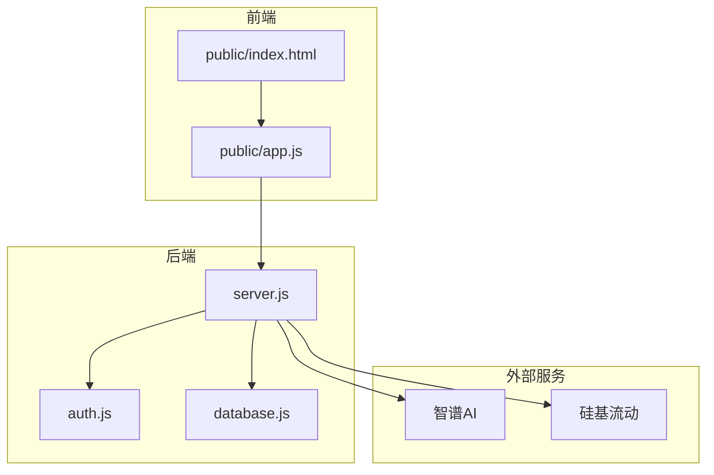
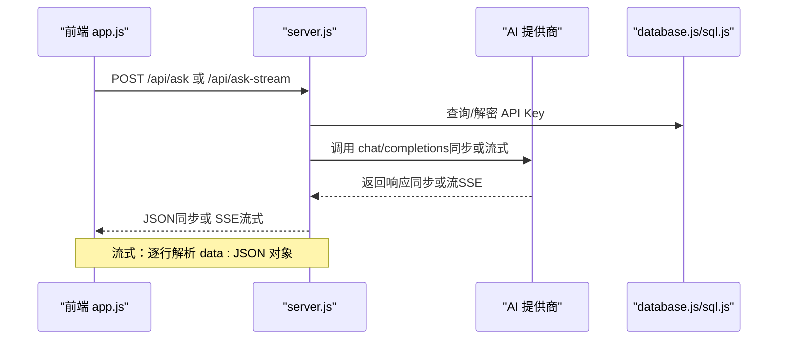
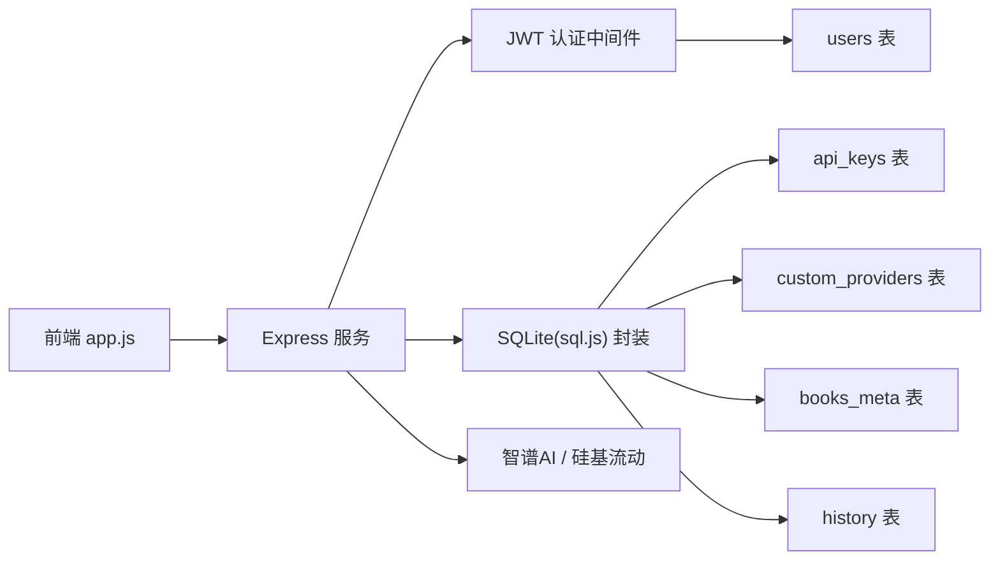

# AI 问答接口

<cite>
**本文引用的文件**
- [server.js](file://server.js)
- [public/app.js](file://public/app.js)
- [README.md](file://README.md)
- [database.js](file://database.js)
- [auth.js](file://auth.js)
- [package.json](file://package.json)
</cite>

## 目录
1. [简介](#简介)
2. [项目结构](#项目结构)
3. [核心组件](#核心组件)
4. [架构总览](#架构总览)
5. [详细组件分析](#详细组件分析)
6. [依赖关系分析](#依赖关系分析)
7. [性能考虑](#性能考虑)
8. [故障排查指南](#故障排查指南)
9. [结论](#结论)
10. [附录](#附录)

## 简介
本文件为 trae02airead 项目的 AI 问答接口 API 文档，聚焦于两个核心接口：
- 同步问答接口：/api/ask
- 流式问答接口：/api/ask-stream

文档覆盖请求参数、响应格式、上下文传递、文本选择分析、流式 Server-Sent Events（SSE）实现、AI 提供商与模型配置、以及前端 SSE 处理与错误重连实践建议。

## 项目结构
后端采用 Express 框架，前端为原生 JavaScript，通过静态资源提供阅读与问答界面。数据库使用 sql.js（SQLite 的纯 JS 实现），用户认证基于 JWT。

图表来源
- [server.js:1-899](file://server.js#L1-L899)
- [auth.js:1-80](file://auth.js#L1-L80)
- [database.js:1-146](file://database.js#L1-L146)

章节来源
- [README.md:210-232](file://README.md#L210-L232)
- [package.json:1-23](file://package.json#L1-L23)

## 核心组件
- 同步问答接口：/api/ask
  - 功能：接收选中文本与问题，调用 AI 提供商，返回一次性完整答案。
  - 请求体字段：text、question、bookName（可选）、provider（可选，默认 zhipu）、model（可选，客户端指定优先）。
  - 响应：answer、model、provider。
- 流式问答接口：/api/ask-stream
  - 功能：SSE 流式输出，逐字节推送增量内容，支持 start、chunk、end、error 事件。
  - 请求体字段：同上。
  - 响应：SSE 数据流，每行以 data: 开头，JSON 序列化对象。

章节来源
- [server.js:618-688](file://server.js#L618-L688)
- [server.js:690-827](file://server.js#L690-L827)
- [README.md:174-179](file://README.md#L174-L179)

## 架构总览
后端在收到 /api/ask 或 /api/ask-stream 请求后，解析请求体，选择合适的 AI 提供商与模型，构造系统与用户消息，调用第三方 AI 接口（OpenAI 兼容）。流式接口将上游响应体的流式数据透传为 SSE，前端通过 ReadableStream 逐行解析事件类型并渲染。

图表来源
- [server.js:618-827](file://server.js#L618-L827)
- [database.js:88-130](file://database.js#L88-L130)

## 详细组件分析

### 同步问答接口 /api/ask
- 请求方法与路径：POST /api/ask
- 请求头：Authorization: Bearer <token>（JWT）
- 请求体字段
  - text: string（必填，选中文本）
  - question: string（必填，问题）
  - bookName: string（可选，书籍名，用于上下文）
  - provider: string（可选，提供商 ID，默认 zhipu）
  - model: string（可选，客户端指定模型）
- 响应体
  - answer: string（完整回答）
  - model: string（实际使用的模型）
  - provider: string（提供商名称）

实现要点
- 从数据库或环境变量中获取 API Key，优先使用用户保存的密钥，否则回退到环境变量。
- 调用 callAI 函数，内部构造 system 与 user 消息，调用第三方 chat/completions。
- 错误处理：401 认证失败、403 未配置密钥、500 服务异常。

章节来源
- [server.js:618-688](file://server.js#L618-L688)
- [server.js:829-880](file://server.js#L829-L880)
- [auth.js:14-27](file://auth.js#L14-L27)

### 流式问答接口 /api/ask-stream
- 请求方法与路径：POST /api/ask-stream
- 请求头：Authorization: Bearer <token>（JWT）
- 请求体字段：同上
- 响应头
  - Content-Type: text/event-stream
  - Cache-Control: no-cache
  - Connection: keep-alive
  - X-Accel-Buffering: no（Nginx/反向代理兼容）
- 响应事件（SSE）
  - start：首次推送，包含 model 与 provider
  - chunk：增量内容，content 为字符串片段
  - end：结束事件，content 为完整回答
  - error：错误事件，error 为错误描述

实现要点
- 后端将上游第三方响应体的流式数据透传为 SSE，逐行解析 data: 行，解析 JSON 并按 type 分发。
- 前端使用 ReadableStream API 逐行读取，解析事件类型并拼接内容。
- 断开与超时：AbortController 控制 60 秒超时；SSE 连接关闭时清理定时器。

章节来源
- [server.js:690-827](file://server.js#L690-L827)
- [public/app.js:1423-1515](file://public/app.js#L1423-L1515)

### 上下文与消息构造
- 系统消息（system）：包含模型信息与回答原则，强调“基于原文回答”“注明来源”“条理清晰”等。
- 用户消息（user）：包含 bookName 上下文（可选）、选中文本与问题。
- 温度与最大 token：temperature=0.3，max_tokens=2000。

章节来源
- [server.js:742-762](file://server.js#L742-L762)
- [server.js:843-866](file://server.js#L843-L866)

### 文本选择分析与前端交互
- 前端通过原生 Selection API 捕获选中文本，展示浮动工具栏，支持解释、总结、翻译、扩展阅读等快捷操作。
- 用户可直接输入自定义问题，或点击快捷操作触发 /api/ask-stream。
- 前端将选中文本、问题、当前书籍名、提供商与模型一并发送至后端。

章节来源
- [public/app.js:1323-1421](file://public/app.js#L1323-L1421)
- [public/app.js:1423-1515](file://public/app.js#L1423-L1515)

### SSE 连接建立与事件解析（前端）
- 前端发起 POST /api/ask-stream，接收 response.body（ReadableStream）。
- 逐行读取，过滤 data: 行，解析 JSON 对象：
  - type=start：初始化回答区域，显示提供商与模型
  - type=chunk：追加增量内容，滚动到底部
  - type=end：保存到历史记录
  - type=error：显示错误信息
- 断开处理：读取完成或异常时清理 UI 状态。

章节来源
- [public/app.js:1461-1515](file://public/app.js#L1461-L1515)

### SSE 连接建立与事件解析（后端）
- 后端设置 SSE 响应头，向客户端发送 start 事件。
- 读取上游响应体流，按行解析，提取 data: JSON，解析 choices.delta.content，推送 chunk。
- 结束时发送 end 事件，随后 res.end() 关闭连接。
- 异常时发送 error 事件并关闭连接。

章节来源
- [server.js:774-827](file://server.js#L774-L827)

### 错误重连与健壮性
- 后端：AbortController 控制 60 秒超时；上游非 2xx 时返回 JSON 错误。
- 前端：捕获异常与 done 情况，清理 UI；可结合业务层进行指数退避重试（建议）。
- 建议：前端在 end 事件后记录完整回答，便于后续展示与重播。

章节来源
- [server.js:731-765](file://server.js#L731-L765)
- [server.js:818-826](file://server.js#L818-L826)
- [public/app.js:1468-1515](file://public/app.js#L1468-L1515)

### AI 提供商与模型配置
- 内置提供商
  - 智谱AI：默认模型 glm-4.5-air
  - 硅基流动：默认模型 deepseek-ai/DeepSeek-V4-Flash
- 自定义提供商
  - 支持添加任意 OpenAI 兼容 API，配置名称、API 地址、默认模型、可选模型列表与密钥。
  - 密钥加密存储，支持环境变量兜底。
- 模型选择优先级
  - 客户端 model > 环境变量 AI_MODEL > 提供商默认模型

章节来源
- [server.js:163-210](file://server.js#L163-L210)
- [server.js:366-423](file://server.js#L366-L423)
- [README.md:122-151](file://README.md#L122-L151)

### 数据模型与密钥存储
- 数据库表
  - users：用户信息
  - api_keys：用户 API 密钥（加密存储）
  - custom_providers：自定义提供商
  - books_meta：书籍元数据
  - history：问答历史
- 密钥加密
  - AES-256-CBC 加密存储，ENCRYPTION_KEY 可配置固定密钥。

章节来源
- [database.js:88-130](file://database.js#L88-L130)
- [server.js:44-67](file://server.js#L44-L67)

## 依赖关系分析

图表来源
- [server.js:1-899](file://server.js#L1-L899)
- [auth.js:14-27](file://auth.js#L14-L27)
- [database.js:88-130](file://database.js#L88-L130)

章节来源
- [package.json:10-22](file://package.json#L10-L22)

## 性能考虑
- 流式传输：SSE 降低首字延迟，提升用户体验。
- 超时控制：后端设置 60 秒超时，避免长时间占用连接。
- 模型温度与最大 token：temperature=0.3、max_tokens=2000，平衡准确性与响应速度。
- 前端增量渲染：逐字节拼接，避免大文本一次性渲染导致的卡顿。

[本节为通用指导，不涉及具体文件分析]

## 故障排查指南
- 401 未授权
  - 检查 Authorization 头是否携带有效 JWT。
  - 若 token 过期，后端会返回 needAuth 标记，前端应引导重新登录。
- 403 未配置 API 密钥
  - 前端收到 needApiKey=true 时，引导用户前往设置页配置提供商密钥。
- 400 参数缺失
  - 确保 text 与 question 均存在。
- 5xx 服务异常
  - 查看后端日志与上游提供商返回状态码。
- SSE 连接中断
  - 检查网络稳定性与代理配置（确保 X-Accel-Buffering: no）。
  - 前端可实现指数退避重试策略。

章节来源
- [server.js:618-688](file://server.js#L618-L688)
- [server.js:690-827](file://server.js#L690-L827)
- [auth.js:14-27](file://auth.js#L14-L27)
- [public/app.js:1440-1459](file://public/app.js#L1440-L1459)

## 结论
本项目提供了简洁高效的 AI 问答能力，支持同步与流式两种模式，具备良好的上下文传递与模型配置灵活性。通过 SSE 流式输出，前端可实现接近“打字机”的即时反馈体验。建议在生产环境中完善错误重连与监控告警机制，以进一步提升稳定性与可观测性。

[本节为总结性内容，不涉及具体文件分析]

## 附录

### API 规范摘要
- /api/ask
  - 方法：POST
  - 请求体：text、question、bookName（可选）、provider（可选）、model（可选）
  - 响应：answer、model、provider
- /api/ask-stream
  - 方法：POST
  - 请求体：同上
  - 响应：SSE，事件类型 start/chunk/end/error

章节来源
- [README.md:174-179](file://README.md#L174-L179)
- [server.js:618-688](file://server.js#L618-L688)
- [server.js:690-827](file://server.js#L690-L827)

### 前端 SSE 处理与错误重连建议
- 使用 ReadableStream API 逐行解析 data: 行。
- 在 end 事件后保存完整回答，便于历史展示。
- 在 error 事件或连接中断时，实现指数退避重试（例如 1s、2s、4s、8s）。
- 对于 start 事件，动态更新 UI 展示提供商与模型信息。

章节来源
- [public/app.js:1461-1515](file://public/app.js#L1461-L1515)