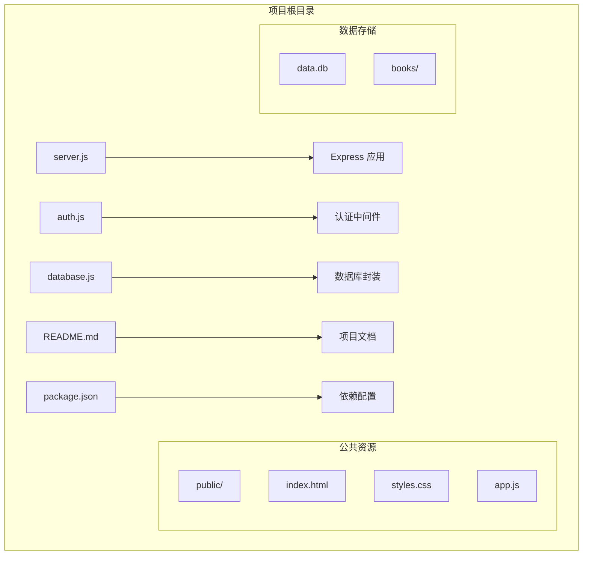
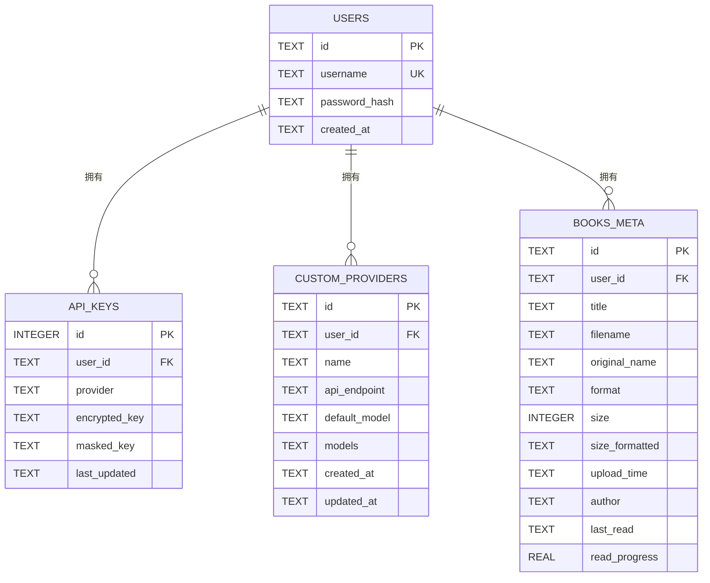
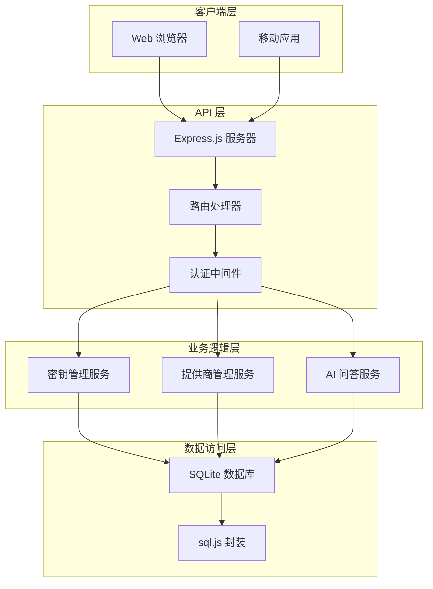
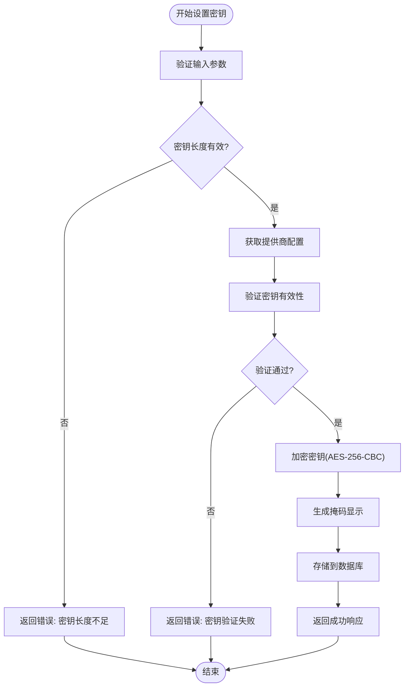
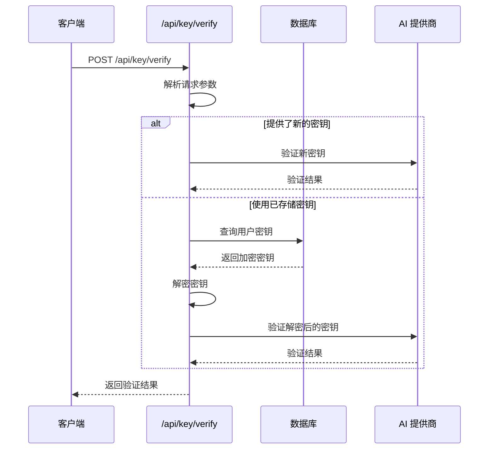
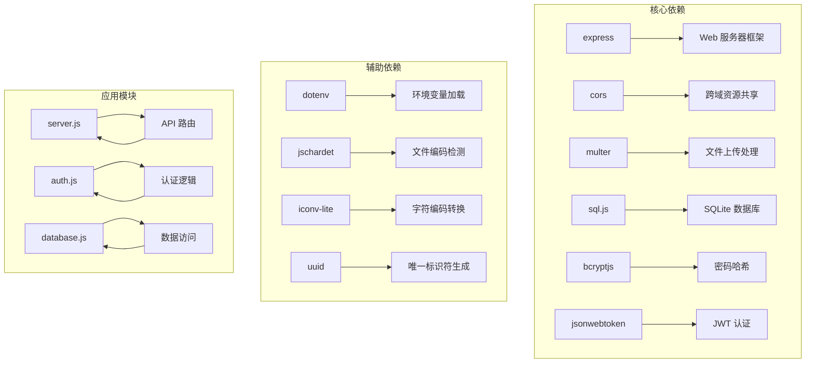

# API 密钥管理接口

<cite>
**本文档引用的文件**
- [server.js](file://server.js)
- [auth.js](file://auth.js)
- [database.js](file://database.js)
- [README.md](file://README.md)
- [package.json](file://package.json)
</cite>

## 目录
1. [简介](#简介)
2. [项目结构](#项目结构)
3. [核心组件](#核心组件)
4. [架构概览](#架构概览)
5. [详细组件分析](#详细组件分析)
6. [依赖关系分析](#依赖关系分析)
7. [性能考虑](#性能考虑)
8. [故障排除指南](#故障排除指南)
9. [结论](#结论)

## 简介

trae02airead 是一个现代化的智能阅读应用，集成了多 AI 服务提供商，帮助用户高效阅读和理解书籍内容。该项目提供了完整的 API 密钥管理接口，支持内置提供商和自定义提供商的密钥配置、验证和管理。

本项目采用 Express.js 构建，使用 SQLite 数据库存储用户数据和 API 密钥，通过 AES-256-CBC 加密算法对敏感信息进行加密存储。系统支持 JWT 认证，确保用户会话的安全性。

## 项目结构

项目采用模块化的文件组织方式，主要包含以下核心文件：



**图表来源**
- [server.js:1-50](file://server.js#L1-L50)
- [auth.js:1-80](file://auth.js#L1-L80)
- [database.js:1-146](file://database.js#L1-L146)

**章节来源**
- [server.js:1-50](file://server.js#L1-L50)
- [package.json:1-23](file://package.json#L1-L23)

## 核心组件

### 加密机制

系统使用 AES-256-CBC 对称加密算法对 API 密钥进行加密存储：

- **加密算法**: AES-256-CBC
- **密钥生成**: 使用 32 字节随机密钥或可配置的 ENCRYPTION_KEY 环境变量
- **初始化向量**: 每次加密生成随机 IV，存储格式为 "IV:密文"
- **密钥长度**: 64 字符十六进制字符串

### 数据库设计

使用 SQLite 数据库存储用户信息、API 密钥和自定义提供商配置：



**图表来源**
- [database.js:81-135](file://database.js#L81-L135)

**章节来源**
- [database.js:81-135](file://database.js#L81-L135)
- [server.js:44-67](file://server.js#L44-L67)

## 架构概览

系统采用分层架构设计，包含表示层、业务逻辑层和数据访问层：



**图表来源**
- [server.js:15-40](file://server.js#L15-L40)
- [auth.js:14-27](file://auth.js#L14-L27)

## 详细组件分析

### API 密钥管理接口

#### /api/key/status - 获取密钥状态

此接口用于查询用户账户下各个提供商的密钥配置状态：

**请求方法**: GET  
**路径**: `/api/key/status`  
**认证**: 需要 JWT 令牌

**响应结构**:
```javascript
{
  "providers": {
    "provider_id": {
      "hasKey": boolean,
      "maskedKey": string|null,
      "lastUpdated": string|null
    }
  }
}
```

**功能特性**:
- 返回所有可用提供商的状态信息
- 显示密钥是否存在和最后更新时间
- 支持内置和自定义提供商的统一展示

**章节来源**
- [server.js:239-258](file://server.js#L239-L258)

#### /api/key/set - 设置 API 密钥

此接口用于为指定提供商设置新的 API 密钥：

**请求方法**: POST  
**路径**: `/api/key/set`  
**认证**: 需要 JWT 令牌

**请求参数**:
```javascript
{
  "apiKey": string,      // API 密钥
  "provider": string     // 提供商标识符
}
```

**响应结构**:
```javascript
{
  "success": boolean,
  "message": string,
  "maskedKey": string
}
```

**处理流程**:



**图表来源**
- [server.js:260-295](file://server.js#L260-L295)

**章节来源**
- [server.js:260-295](file://server.js#L260-L295)

#### /api/key/verify - 验证 API 密钥

此接口用于验证 API 密钥的有效性：

**请求方法**: POST  
**路径**: `/api/key/verify`  
**认证**: 需要 JWT 令牌

**请求参数**:
```javascript
{
  "apiKey": string,      // 可选 - 如果不提供则使用已存储的密钥
  "provider": string     // 提供商标识符
}
```

**响应结构**:
```javascript
{
  "valid": boolean,
  "error": string       // 可选 - 错误信息
}
```

**验证流程**:



**图表来源**
- [server.js:297-316](file://server.js#L297-L316)

**章节来源**
- [server.js:297-316](file://server.js#L297-L316)

#### /api/key - 删除 API 密钥

此接口用于删除指定提供商的 API 密钥：

**请求方法**: DELETE  
**路径**: `/api/key`  
**认证**: 需要 JWT 令牌

**请求参数**:
```javascript
{
  "provider": string     // 可选 - 如果不提供则删除所有密钥
}
```

**响应结构**:
```javascript
{
  "success": boolean,
  "message": string
}
```

**章节来源**
- [server.js:318-332](file://server.js#L318-L332)

### 提供商管理接口

#### /api/providers - 获取提供商列表

此接口用于获取可用的 AI 提供商列表：

**请求方法**: GET  
**路径**: `/api/providers`  
**认证**: 需要 JWT 令牌

**响应结构**:
```javascript
{
  "providers": [
    {
      "id": string,
      "name": string,
      "defaultModel": string,
      "models": array|null,
      "isCustom": boolean
    }
  ]
}
```

**章节来源**
- [server.js:336-346](file://server.js#L336-L346)

#### /api/providers - 添加自定义提供商

此接口用于添加新的自定义 AI 提供商：

**请求方法**: POST  
**路径**: `/api/providers`  
**认证**: 需要 JWT 令牌

**请求参数**:
```javascript
{
  "id": string,                    // 可选 - 自动生成
  "name": string,                  // 提供商名称
  "apiEndpoint": string,           // API 端点
  "defaultModel": string,          // 默认模型
  "models": array|null,            // 可选模型列表
  "apiKey": string                 // API 密钥
}
```

**响应结构**:
```javascript
{
  "success": boolean,
  "message": string,
  "provider": {
    "id": string,
    "name": string,
    "api_endpoint": string,
    "default_model": string,
    "models": array|null,
    "isCustom": true
  }
}
```

**章节来源**
- [server.js:366-423](file://server.js#L366-L423)

#### /api/providers/:id - 更新自定义提供商

此接口用于更新现有自定义提供商的配置：

**请求方法**: PUT  
**路径**: `/api/providers/:id`  
**认证**: 需要 JWT 令牌

**请求参数**:
```javascript
{
  "name": string,                  // 可选
  "apiEndpoint": string,           // 可选
  "defaultModel": string,          // 可选
  "models": array|null             // 可选
}
```

**响应结构**:
```javascript
{
  "success": boolean,
  "message": string,
  "provider": {
    "id": string,
    "name": string,
    "api_endpoint": string,
    "default_model": string,
    "models": array|null,
    "isCustom": true
  }
}
```

**章节来源**
- [server.js:425-447](file://server.js#L425-L447)

#### /api/providers/:id - 删除自定义提供商

此接口用于删除自定义 AI 提供商及其关联的密钥：

**请求方法**: DELETE  
**路径**: `/api/providers/:id`  
**认证**: 需要 JWT 令牌

**响应结构**:
```javascript
{
  "success": boolean,
  "message": string
}
```

**章节来源**
- [server.js:449-461](file://server.js#L449-L461)

### 内置提供商与自定义提供商

#### 内置提供商

系统预置了两个主流 AI 提供商：

| 提供商 | API 端点 | 默认模型 | 特点 |
|--------|----------|----------|------|
| 智谱 AI | `https://open.bigmodel.cn/api/paas/v4/chat/completions` | `glm-4.5-air` | 国产优选 |
| 硅基流动 | `https://api.siliconflow.cn/v1/chat/completions` | `deepseek-ai/DeepSeek-V4-Flash` | 新用户送代金券 |

#### 自定义提供商

用户可以添加任意 OpenAI 兼容的 API 提供商，支持：
- 自定义提供商 ID（仅允许小写字母、数字、连字符和下划线）
- 可选模型列表配置
- 独立的 API 密钥存储
- 一键切换和管理

**章节来源**
- [server.js:163-188](file://server.js#L163-L188)
- [server.js:348-364](file://server.js#L348-L364)

## 依赖关系分析

系统的关键依赖关系如下：



**图表来源**
- [package.json:10-22](file://package.json#L10-L22)

**章节来源**
- [package.json:10-22](file://package.json#L10-L22)

## 性能考虑

### 加密性能

- **AES-256-CBC**: 提供强加密安全性，但会增加 CPU 开销
- **IV 生成**: 每次加密生成随机 IV，确保相同密钥的不同加密结果不同
- **内存使用**: 加密和解密操作在内存中完成，适合中小型应用

### 数据库优化

- **索引设计**: 为用户 ID 创建索引以加速查询
- **WAL 模式**: 使用写前日志模式提高并发性能
- **事务处理**: 使用原子性操作确保数据一致性

### API 性能

- **超时控制**: 所有外部 API 调用设置 15 秒超时
- **流式响应**: 支持 SSE 流式传输，提升用户体验
- **缓存策略**: 本地内存中缓存用户会话信息

## 故障排除指南

### 常见问题及解决方案

#### 密钥验证失败

**症状**: 设置密钥时返回 "API密钥验证失败"

**可能原因**:
1. API 密钥格式不正确
2. 网络连接问题
3. 提供商 API 端点不可达
4. 密钥权限不足

**解决方案**:
1. 检查 API 密钥格式和完整性
2. 确认网络连接正常
3. 验证提供商 API 端点可用性
4. 确认密钥具有相应权限

#### 加密密钥无法解密

**症状**: 启动后无法解密已存储的 API 密钥

**可能原因**:
1. ENCRYPTION_KEY 环境变量改变
2. 数据库文件损坏
3. 加密算法版本不兼容

**解决方案**:
1. 保持 ENCRYPTION_KEY 环境变量不变
2. 备份并恢复数据库文件
3. 检查加密算法兼容性

#### 数据库连接问题

**症状**: 应用启动时报数据库连接错误

**可能原因**:
1. data.db 文件权限问题
2. 磁盘空间不足
3. 文件被其他进程占用

**解决方案**:
1. 检查文件权限设置
2. 清理磁盘空间
3. 关闭占用文件的进程

### 安全最佳实践

#### 环境变量配置

建议在生产环境中配置以下环境变量：

```env
# 加密密钥（推荐固定值）
ENCRYPTION_KEY=your_64_char_hex_key_here

# AI 提供商密钥
ZHIPU_API_KEY=your_zhipu_key
SILICONFLOW_API_KEY=your_siliconflow_key

# 服务端口
PORT=3000
```

#### 密钥管理策略

1. **定期轮换**: 定期更换 API 密钥
2. **最小权限**: 为不同提供商分配最小必要的权限
3. **监控告警**: 监控 API 使用量和错误率
4. **备份策略**: 定期备份 data.db 文件

#### 数据保护措施

1. **文件权限**: 确保 .env 和 data.db 文件权限设置为 600
2. **网络加密**: 使用 HTTPS 保护数据传输
3. **日志脱敏**: 避免在日志中记录敏感信息
4. **访问控制**: 限制对服务器的物理和远程访问

**章节来源**
- [README.md:234-247](file://README.md#L234-L247)

## 结论

trae02airead 的 API 密钥管理接口提供了完整的密钥生命周期管理功能，包括密钥的设置、验证、存储和删除。系统采用 AES-256-CBC 加密算法确保密钥安全存储，支持内置和自定义提供商的灵活配置。

通过 JWT 认证和数据隔离机制，系统确保了用户数据的安全性和隐私性。完善的错误处理和性能优化使得该系统适合在生产环境中部署使用。

建议在生产环境中：
- 配置固定的 ENCRYPTION_KEY 环境变量
- 定期备份数据库文件
- 实施严格的访问控制和监控
- 定期轮换 API 密钥
- 监控系统性能和安全指标