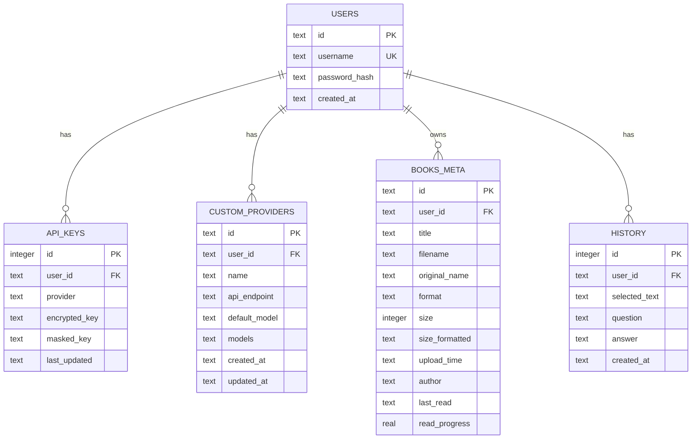
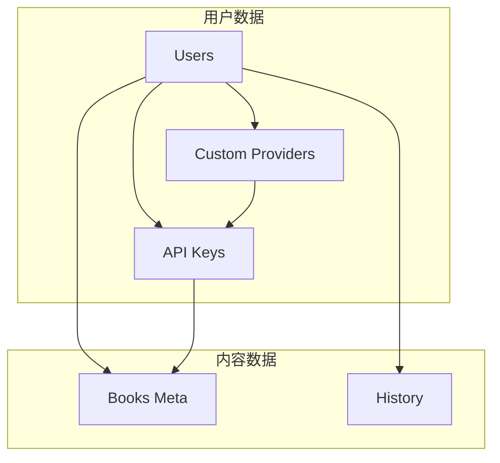

# API 接口文档

<cite>
**本文档引用的文件**
- [server.js](file://server.js)
- [auth.js](file://auth.js)
- [database.js](file://database.js)
- [package.json](file://package.json)
- [README.md](file://README.md)
</cite>

## 目录
1. [简介](#简介)
2. [认证机制](#认证机制)
3. [用户认证接口](#用户认证接口)
4. [AI 问答接口](#ai-问答接口)
5. [密钥管理接口](#密钥管理接口)
6. [提供商管理接口](#提供商管理接口)
7. [电子书管理接口](#电子书管理接口)
8. [流式 API 详解](#流式-api-详解)
9. [错误处理与状态码](#错误处理与状态码)
10. [最佳实践](#最佳实践)
11. [常见问题解答](#常见问题解答)
12. [数据模型](#数据模型)

## 简介

Trae02AiRead 是一个现代化的智能阅读应用，集成了多 AI 服务提供商，帮助用户高效阅读和理解书籍内容。该应用支持在线阅读、AI 智能问答、书架管理、自定义 AI 提供商等功能。

## 认证机制

### Bearer Token 认证

所有受保护的 API 接口都需要在请求头中携带 Bearer Token：

```
Authorization: Bearer <your-jwt-token>
```

### JWT 令牌特性

- **默认有效期**：7 天
- **记住我功能**：30 天有效期
- **令牌生成**：使用随机密钥签名
- **令牌验证**：服务端验证 JWT 令牌的有效性

### 认证中间件

所有 `/api` 路径下的接口都会经过认证中间件验证，确保请求的安全性。

**章节来源**
- [auth.js:14-27](file://auth.js#L14-L27)
- [auth.js:9-12](file://auth.js#L9-L12)

## 用户认证接口

### 注册接口

**HTTP 方法**: POST  
**URL 路径**: `/api/auth/register`  
**请求头**: `Content-Type: application/json`  
**请求体参数**:

| 参数名 | 类型 | 必填 | 描述 |
|--------|------|------|------|
| username | string | 是 | 用户名，不能为空 |
| password | string | 是 | 密码，至少6位 |

**响应格式**:

```json
{
  "token": "jwt_token_string",
  "user": {
    "id": "user_uuid",
    "username": "username"
  }
}
```

**错误码**:
- 400: 用户名或密码格式错误
- 400: 用户名已存在

**章节来源**
- [auth.js:29-55](file://auth.js#L29-L55)

### 登录接口

**HTTP 方法**: POST  
**URL 路径**: `/api/auth/login`  
**请求头**: `Content-Type: application/json`  
**请求体参数**:

| 参数名 | 类型 | 必填 | 描述 |
|--------|------|------|------|
| username | string | 是 | 用户名 |
| password | string | 是 | 密码 |
| rememberMe | boolean | 否 | 是否记住登录（30天有效期） |

**响应格式**:

```json
{
  "token": "jwt_token_string",
  "user": {
    "id": "user_uuid",
    "username": "username"
  }
}
```

**错误码**:
- 400: 用户名或密码格式错误
- 401: 用户名或密码错误

**章节来源**
- [auth.js:57-73](file://auth.js#L57-L73)

### 获取当前用户信息

**HTTP 方法**: GET  
**URL 路径**: `/api/auth/me`  
**请求头**: `Authorization: Bearer <token>`

**响应格式**:

```json
{
  "user": {
    "id": "user_uuid",
    "username": "username"
  }
}
```

**错误码**:
- 401: 未授权访问

**章节来源**
- [auth.js:75-77](file://auth.js#L75-L77)

## AI 问答接口

### 非流式 AI 问答

**HTTP 方法**: POST  
**URL 路径**: `/api/ask`  
**请求头**: `Authorization: Bearer <token>`, `Content-Type: application/json`

**请求体参数**:

| 参数名 | 类型 | 必填 | 描述 |
|--------|------|------|------|
| text | string | 是 | 选中的文本内容 |
| question | string | 是 | 用户的问题 |
| bookName | string | 否 | 书籍名称（用于上下文） |
| provider | string | 否 | AI 提供商标识（默认：zhipu） |
| model | string | 否 | 指定使用的模型 |

**响应格式**:

```json
{
  "answer": "AI的回答内容",
  "model": "使用的模型名称",
  "provider": "提供商名称"
}
```

**错误码**:
- 400: 缺少必需参数
- 403: 未配置 API 密钥
- 401: API 密钥无效
- 500: AI 服务请求失败

**章节来源**
- [server.js:618-688](file://server.js#L618-L688)

### 流式 AI 问答（SSE）

**HTTP 方法**: POST  
**URL 路径**: `/api/ask-stream`  
**请求头**: `Authorization: Bearer <token>`, `Content-Type: application/json`

**请求体参数**: 同上

**响应格式**（SSE 流式响应）:

```json
data: {"type":"start","model":"model_name","provider":"provider_name"}

data: {"type":"chunk","content":"部分回答内容"}

data: {"type":"end","content":"完整回答内容"}
```

**SSE 消息类型**:

1. **start**: 流开始，包含模型和提供商信息
2. **chunk**: 流式数据块，包含部分回答内容
3. **end**: 流结束，包含完整回答内容

**错误码**:
- 400: 缺少必需参数
- 403: 未配置 API 密钥
- 401: API 密钥无效
- 500: AI 服务请求失败

**章节来源**
- [server.js:689-827](file://server.js#L689-L827)

## 密钥管理接口

### 获取密钥状态

**HTTP 方法**: GET  
**URL 路径**: `/api/key/status`  
**请求头**: `Authorization: Bearer <token>`

**响应格式**:

```json
{
  "providers": {
    "zhipu": {
      "hasKey": true,
      "maskedKey": "sk-...1234",
      "lastUpdated": "2024-01-01T00:00:00Z"
    },
    "siliconflow": {
      "hasKey": false,
      "maskedKey": null,
      "lastUpdated": null
    }
  }
}
```

**错误码**:
- 401: 未授权访问

**章节来源**
- [server.js:239-258](file://server.js#L239-L258)

### 设置 API 密钥

**HTTP 方法**: POST  
**URL 路径**: `/api/key/set`  
**请求头**: `Authorization: Bearer <token>`, `Content-Type: application/json`

**请求体参数**:

| 参数名 | 类型 | 必填 | 描述 |
|--------|------|------|------|
| apiKey | string | 是 | API 密钥 |
| provider | string | 是 | 提供商标识 |

**响应格式**:

```json
{
  "success": true,
  "message": "提供商名称 API密钥设置成功",
  "maskedKey": "sk-...1234"
}
```

**错误码**:
- 400: API 密钥格式错误或验证失败
- 500: 设置密钥时发生错误

**章节来源**
- [server.js:260-295](file://server.js#L260-L295)

### 验证 API 密钥

**HTTP 方法**: POST  
**URL 路径**: `/api/key/verify`  
**请求头**: `Authorization: Bearer <token>`, `Content-Type: application/json`

**请求体参数**:

| 参数名 | 类型 | 必填 | 描述 |
|--------|------|------|------|
| apiKey | string | 否 | API 密钥（可选，留空则验证存储的密钥） |
| provider | string | 是 | 提供商标识 |

**响应格式**:

```json
{
  "valid": true
}
```

**错误码**:
- 400: API 密钥验证失败
- 500: 验证过程中发生错误

**章节来源**
- [server.js:297-316](file://server.js#L297-L316)

### 删除 API 密钥

**HTTP 方法**: DELETE  
**URL 路径**: `/api/key`  
**请求头**: `Authorization: Bearer <token>`, `Content-Type: application/json`

**请求体参数**:

| 参数名 | 类型 | 必填 | 描述 |
|--------|------|------|------|
| provider | string | 否 | 提供商标识（可选，不提供则删除所有密钥） |

**响应格式**:

```json
{
  "success": true,
  "message": "API密钥已删除"
}
```

**错误码**:
- 500: 删除密钥失败

**章节来源**
- [server.js:318-332](file://server.js#L318-L332)

## 提供商管理接口

### 获取提供商列表

**HTTP 方法**: GET  
**URL 路径**: `/api/providers`  
**请求头**: `Authorization: Bearer <token>`

**响应格式**:

```json
{
  "providers": [
    {
      "id": "zhipu",
      "name": "智谱AI",
      "defaultModel": "glm-4.5-air",
      "models": [
        {"id": "glm-4.5-air", "name": "GLM-4.5-Air"},
        {"id": "glm-4-flash", "name": "GLM-4-Flash"}
      ],
      "isCustom": false
    },
    {
      "id": "siliconflow",
      "name": "硅基流动",
      "defaultModel": "deepseek-ai/DeepSeek-V4-Flash",
      "models": [
        {"id": "deepseek-ai/DeepSeek-V4-Flash", "name": "DeepSeek V4 Flash"}
      ],
      "isCustom": false
    }
  ]
}
```

**错误码**:
- 401: 未授权访问

**章节来源**
- [server.js:336-346](file://server.js#L336-L346)

### 添加自定义提供商

**HTTP 方法**: POST  
**URL 路径**: `/api/providers`  
**请求头**: `Authorization: Bearer <token>`, `Content-Type: application/json`

**请求体参数**:

| 参数名 | 类型 | 必填 | 描述 |
|--------|------|------|------|
| id | string | 否 | 提供商ID（可选，自动生成） |
| name | string | 是 | 显示名称 |
| apiEndpoint | string | 是 | API 端点地址 |
| defaultModel | string | 是 | 默认模型 |
| models | array | 否 | 可选模型列表（JSON格式） |
| apiKey | string | 是 | API 密钥 |

**响应格式**:

```json
{
  "success": true,
  "message": "自定义提供商添加成功",
  "provider": {
    "id": "custom_provider_id",
    "name": "提供商名称",
    "api_endpoint": "https://api.example.com",
    "default_model": "model_name",
    "models": [],
    "isCustom": true
  }
}
```

**错误码**:
- 400: 提供商信息不完整或验证失败
- 500: 验证API密钥时发生错误

**章节来源**
- [server.js:366-423](file://server.js#L366-L423)

### 更新自定义提供商

**HTTP 方法**: PUT  
**URL 路径**: `/api/providers/:id`  
**请求头**: `Authorization: Bearer <token>`, `Content-Type: application/json`

**路径参数**:

| 参数名 | 类型 | 必填 | 描述 |
|--------|------|------|------|
| id | string | 是 | 提供商ID |

**请求体参数**:

| 参数名 | 类型 | 必填 | 描述 |
|--------|------|------|------|
| name | string | 否 | 显示名称 |
| apiEndpoint | string | 否 | API 端点地址 |
| defaultModel | string | 否 | 默认模型 |
| models | array | 否 | 可选模型列表（JSON格式） |

**响应格式**:

```json
{
  "success": true,
  "message": "自定义提供商更新成功",
  "provider": {
    "id": "provider_id",
    "name": "更新后的名称",
    "api_endpoint": "https://api.example.com",
    "default_model": "updated_model",
    "models": [],
    "isCustom": true
  }
}
```

**错误码**:
- 404: 自定义提供商不存在

**章节来源**
- [server.js:425-447](file://server.js#L425-L447)

### 删除自定义提供商

**HTTP 方法**: DELETE  
**URL 路径**: `/api/providers/:id`  
**请求头**: `Authorization: Bearer <token>`

**路径参数**:

| 参数名 | 类型 | 必填 | 描述 |
|--------|------|------|------|
| id | string | 是 | 提供商ID |

**响应格式**:

```json
{
  "success": true,
  "message": "自定义提供商已删除"
}
```

**错误码**:
- 404: 自定义提供商不存在

**章节来源**
- [server.js:449-461](file://server.js#L449-L461)

## 电子书管理接口

### 获取书籍列表

**HTTP 方法**: GET  
**URL 路径**: `/api/books`  
**请求头**: `Authorization: Bearer <token>`

**响应格式**:

```json
{
  "books": [
    {
      "id": "book_uuid",
      "title": "书籍标题",
      "filename": "文件名",
      "originalName": "原始文件名",
      "format": "TXT",
      "size": 1024,
      "sizeFormatted": "1 KB",
      "uploadTime": "2024-01-01T00:00:00Z",
      "author": "未知",
      "lastRead": null,
      "readProgress": 0,
      "userId": "user_uuid"
    }
  ]
}
```

**错误码**:
- 401: 未授权访问

**章节来源**
- [server.js:516-526](file://server.js#L516-L526)

### 上传书籍

**HTTP 方法**: POST  
**URL 路径**: `/api/books/upload`  
**请求头**: `Authorization: Bearer <token>`, `Content-Type: multipart/form-data`

**表单参数**:

| 参数名 | 类型 | 必填 | 描述 |
|--------|------|------|------|
| book | file | 是 | 书籍文件（支持 TXT、PDF、EPUB、MOBI） |

**响应格式**:

```json
{
  "success": true,
  "message": "书籍上传成功",
  "book": {
    "id": "book_uuid",
    "title": "书籍标题",
    "filename": "文件名",
    "originalName": "原始文件名",
    "format": "TXT",
    "size": 1024,
    "sizeFormatted": "1 KB",
    "uploadTime": "2024-01-01T00:00:00Z",
    "author": "未知",
    "lastRead": null,
    "readProgress": 0,
    "userId": "user_uuid"
  }
}
```

**错误码**:
- 400: 文件格式不支持或大小超限
- 500: 上传过程中发生错误

**章节来源**
- [server.js:465-514](file://server.js#L465-L514)

### 获取书籍详情

**HTTP 方法**: GET  
**URL 路径**: `/api/books/:id`  
**请求头**: `Authorization: Bearer <token>`

**路径参数**:

| 参数名 | 类型 | 必填 | 描述 |
|--------|------|------|------|
| id | string | 是 | 书籍ID |

**响应格式**:

```json
{
  "book": {
    "id": "book_uuid",
    "title": "书籍标题",
    "originalName": "原始文件名",
    "format": "TXT",
    "size": 1024,
    "sizeFormatted": "1 KB",
    "uploadTime": "2024-01-01T00:00:00Z",
    "author": "未知",
    "lastRead": "2024-01-01T00:00:00Z",
    "readProgress": 0
  },
  "content": "书籍内容（TXT文件）"
}
```

**错误码**:
- 404: 书籍不存在
- 500: 读取书籍内容失败

**章节来源**
- [server.js:528-560](file://server.js#L528-L560)

### 下载书籍

**HTTP 方法**: GET  
**URL 路径**: `/api/books/:id/download`  
**请求头**: `Authorization: Bearer <token>`

**路径参数**:

| 参数名 | 类型 | 必填 | 描述 |
|--------|------|------|------|
| id | string | 是 | 书籍ID |

**响应格式**:
- 文件下载响应

**错误码**:
- 404: 书籍不存在
- 500: 下载过程中发生错误

**章节来源**
- [server.js:562-576](file://server.js#L562-L576)

### 删除书籍

**HTTP 方法**: DELETE  
**URL 路径**: `/api/books/:id`  
**请求头**: `Authorization: Bearer <token>`

**路径参数**:

| 参数名 | 类型 | 必填 | 描述 |
|--------|------|------|------|
| id | string | 是 | 书籍ID |

**响应格式**:

```json
{
  "success": true,
  "message": "书籍已删除"
}
```

**错误码**:
- 404: 书籍不存在
- 500: 删除书籍失败

**章节来源**
- [server.js:578-597](file://server.js#L578-L597)

### 保存阅读进度

**HTTP 方法**: PUT  
**URL 路径**: `/api/books/:id/progress`  
**请求头**: `Authorization: Bearer <token>`, `Content-Type: application/json`

**路径参数**:

| 参数名 | 类型 | 必填 | 描述 |
|--------|------|------|------|
| id | string | 是 | 书籍ID |

**请求体参数**:

| 参数名 | 类型 | 必填 | 描述 |
|--------|------|------|------|
| progress | number | 是 | 阅读进度（0-100） |

**响应格式**:

```json
{
  "success": true
}
```

**错误码**:
- 404: 书籍不存在

**章节来源**
- [server.js:599-616](file://server.js#L599-L616)

## 流式 API 详解

### SSE 连接方式

流式 AI 问答使用 Server-Sent Events (SSE) 实现，客户端需要支持 EventSource API。

**连接建立**:
1. 发送 POST 请求到 `/api/ask-stream`
2. 服务器设置适当的响应头
3. 建立持久连接

**SSE 响应头设置**:

```javascript
res.setHeader('Content-Type', 'text/event-stream');
res.setHeader('Cache-Control', 'no-cache');
res.setHeader('Connection', 'keep-alive');
res.setHeader('X-Accel-Buffering', 'no');
```

### 消息格式

SSE 消息采用标准格式：
```
data: {"type":"start","model":"model_name","provider":"provider_name"}

data: {"type":"chunk","content":"部分回答内容"}

data: {"type":"end","content":"完整回答内容"}
```

### 错误处理

**客户端错误处理**:

```javascript
eventSource.onerror = function(event) {
  console.error('SSE 连接错误:', event);
  // 重新连接逻辑
};
```

**服务器端错误处理**:

```javascript
res.write(`data: ${JSON.stringify({ type: 'error', error: errorMessage })}\n\n`);
res.end();
```

**章节来源**
- [server.js:774-827](file://server.js#L774-L827)

## 错误处理与状态码

### 常见错误状态码

| 状态码 | 错误类型 | 描述 |
|--------|----------|------|
| 200 | 成功 | 请求成功执行 |
| 400 | 请求错误 | 参数错误或格式不正确 |
| 401 | 未授权 | 令牌无效或缺失 |
| 403 | 禁止访问 | 权限不足或密钥未配置 |
| 404 | 资源不存在 | 请求的资源不存在 |
| 500 | 服务器错误 | 服务器内部错误 |

### 错误响应格式

```json
{
  "error": "错误描述信息",
  "needAuth": true, // 仅限认证相关错误
  "needApiKey": true, // 仅限密钥相关错误
  "provider": "提供商标识" // 仅限密钥相关错误
}
```

### 错误处理策略

1. **认证错误**: 返回 `needAuth: true`，指示客户端需要重新登录
2. **密钥错误**: 返回 `needApiKey: true` 和 `provider` 字段
3. **业务错误**: 返回具体的错误描述信息
4. **服务器错误**: 返回通用的错误信息

**章节来源**
- [auth.js:16-26](file://auth.js#L16-L26)
- [server.js:659-666](file://server.js#L659-L666)

## 最佳实践

### 认证最佳实践

1. **令牌存储**: 将 JWT 令牌存储在内存中，避免持久化存储
2. **令牌刷新**: 使用 `rememberMe` 参数实现长有效期令牌
3. **令牌验证**: 定期验证令牌有效性，防止过期

### API 密钥管理

1. **加密存储**: 所有 API 密钥使用 AES-256-CBC 加密存储
2. **最小权限**: 为不同提供商配置独立的 API 密钥
3. **定期轮换**: 建议定期更换 API 密钥

### 流式 API 使用

1. **连接管理**: 实现自动重连机制
2. **缓冲处理**: 正确处理 SSE 数据流的缓冲
3. **错误恢复**: 实现优雅的错误恢复策略

### 性能优化

1. **文件上传**: 使用流式上传处理大文件
2. **数据库查询**: 合理使用索引和查询优化
3. **缓存策略**: 对频繁访问的数据实施缓存

## 常见问题解答

### 如何设置环境变量？

在项目根目录创建 `.env` 文件：

```env
# 固定加密密钥（可选）
ENCRYPTION_KEY=your_64_char_hex_key

# AI 提供商 API Key（可选）
ZHIPU_API_KEY=your_zhipu_key
SILICONFLOW_API_KEY=your_siliconflow_key
CUSTOM_API_KEY=your_custom_key

# 服务端口（默认 3000）
PORT=3000
```

### 为什么会出现 403 错误？

403 错误通常表示未配置 API 密钥。请检查：
1. 是否已设置提供商的 API 密钥
2. API 密钥是否有效
3. 是否选择了正确的提供商

### 流式 API 为什么不工作？

检查以下几点：
1. 浏览器是否支持 EventSource API
2. 网络连接是否稳定
3. 服务器是否正确设置了 SSE 响应头

### 如何添加自定义 AI 提供商？

1. 在设置页面选择"➕ 自定义"标签
2. 填写提供商配置信息
3. 验证 API 密钥有效性
4. 保存配置并开始使用

**章节来源**
- [README.md:105-120](file://README.md#L105-L120)
- [README.md:122-144](file://README.md#L122-L144)

## 数据模型

### 数据库表结构



**图表来源**
- [database.js:81-135](file://database.js#L81-L135)

### 数据库关系图



**图表来源**
- [database.js:88-130](file://database.js#L88-L130)

**章节来源**
- [database.js:81-135](file://database.js#L81-L135)