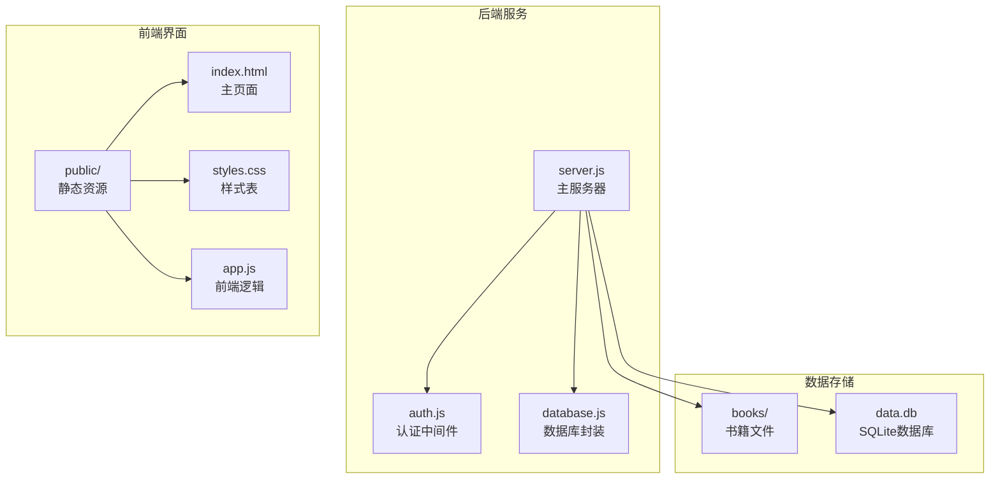
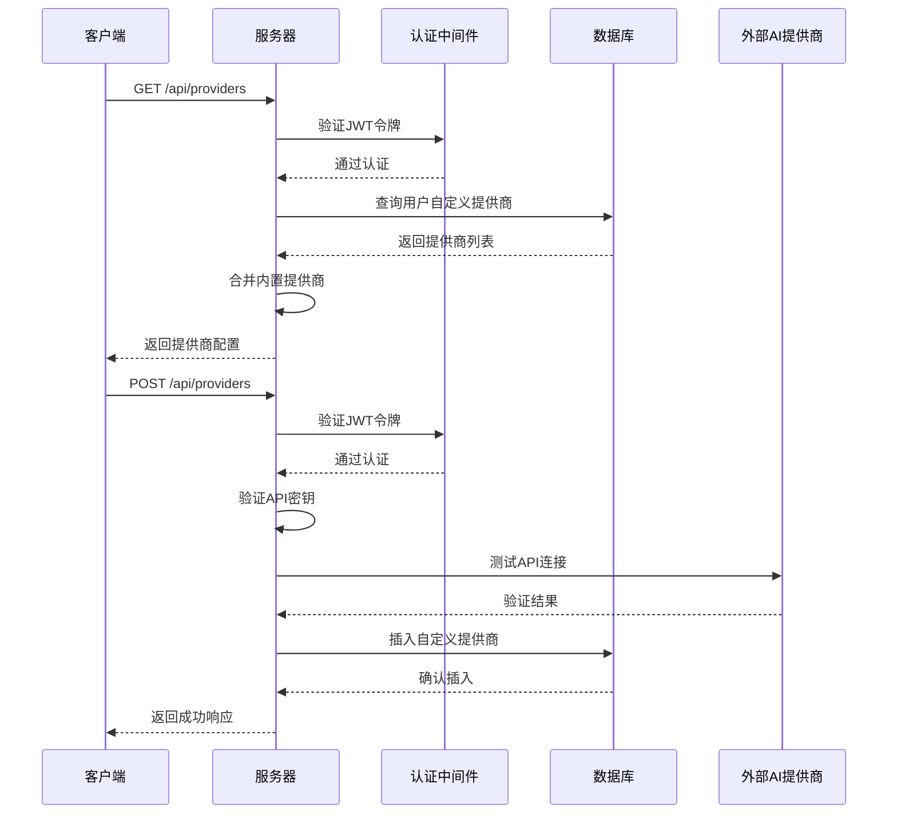
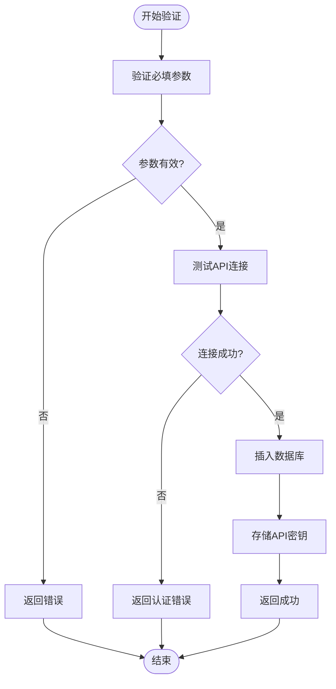
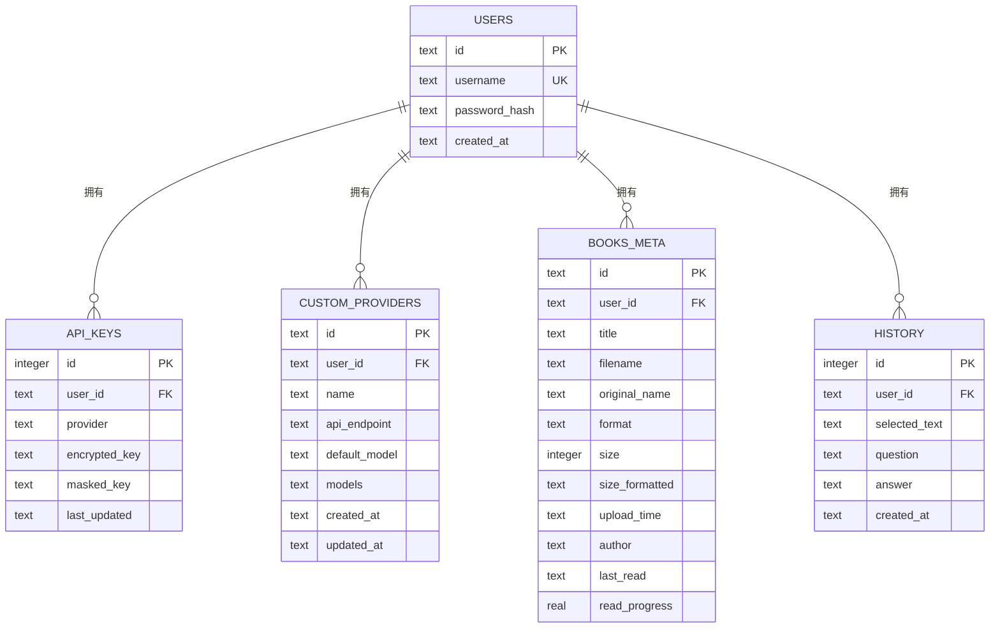
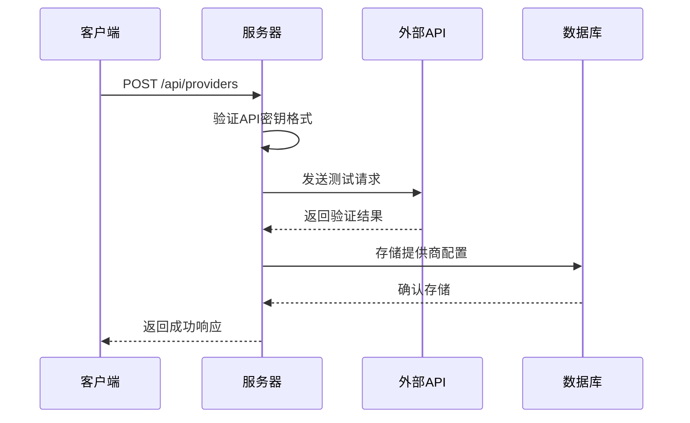
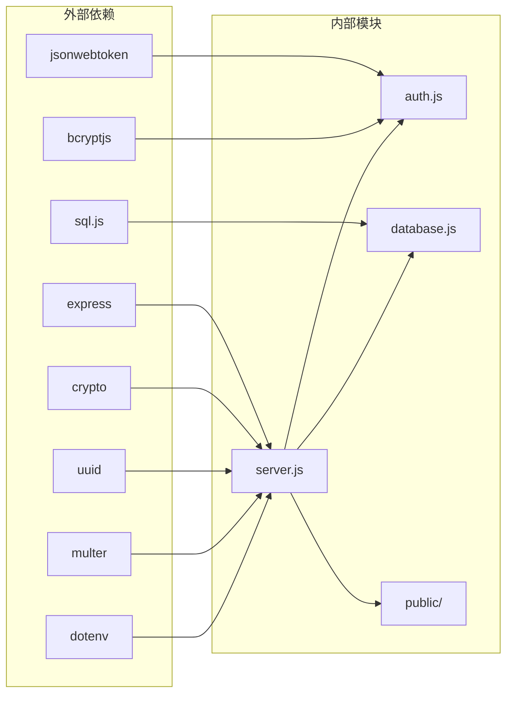

# 提供商管理接口

<cite>
**本文档引用的文件**
- [server.js](file://server.js)
- [database.js](file://database.js)
- [auth.js](file://auth.js)
- [package.json](file://package.json)
- [README.md](file://README.md)
</cite>

## 目录
1. [简介](#简介)
2. [项目结构](#项目结构)
3. [核心组件](#核心组件)
4. [架构概览](#架构概览)
5. [详细组件分析](#详细组件分析)
6. [依赖关系分析](#依赖关系分析)
7. [性能考虑](#性能考虑)
8. [故障排除指南](#故障排除指南)
9. [结论](#结论)

## 简介

trae02airead 是一个现代化的智能阅读应用，集成了多 AI 服务提供商，帮助用户高效阅读和理解书籍内容。本文档专注于提供商管理接口，详细说明 `/api/providers` 接口的完整功能规范，包括自定义 AI 提供商的添加流程、提供商 ID 生成规则、API 地址验证和密钥测试机制。

## 项目结构

该项目采用前后端分离的架构设计，主要由以下核心模块组成：



**图表来源**
- [server.js:1-50](file://server.js#L1-L50)
- [database.js:1-80](file://database.js#L1-L80)

**章节来源**
- [server.js:1-50](file://server.js#L1-L50)
- [database.js:1-80](file://database.js#L1-L80)
- [package.json:1-23](file://package.json#L1-L23)

## 核心组件

### 认证中间件
系统使用 JWT 进行用户认证，所有 API 接口都需要在请求头中携带 `Authorization: Bearer <token>`。

### 数据库层
采用 SQLite 数据库存储用户数据、API 密钥、自定义提供商配置和书籍元数据。

### 提供商配置
系统内置了两个 AI 提供商：
- 智谱AI：支持多个 GLM 系列模型
- 硅基流动：支持 DeepSeek 和 Qwen 系列模型

**章节来源**
- [auth.js:14-27](file://auth.js#L14-L27)
- [database.js:81-135](file://database.js#L81-L135)
- [server.js:163-188](file://server.js#L163-L188)

## 架构概览



**图表来源**
- [server.js:336-461](file://server.js#L336-L461)
- [auth.js:14-27](file://auth.js#L14-L27)

## 详细组件分析

### 提供商管理接口规范

#### GET /api/providers

**功能描述**
获取用户可用的 AI 提供商列表，包括内置提供商和用户自定义提供商。

**请求参数**
- 无

**响应数据结构**
```javascript
{
  "providers": [
    {
      "id": "字符串",
      "name": "字符串",
      "defaultModel": "字符串",
      "models": "数组或null",
      "isCustom": "布尔值"
    }
  ]
}
```

**响应示例**
```json
{
  "providers": [
    {
      "id": "zhipu",
      "name": "智谱AI",
      "defaultModel": "glm-4.5-air",
      "models": [
        {"id": "glm-4.5-air", "name": "GLM-4.5-Air"},
        {"id": "glm-4-flash", "name": "GLM-4-Flash"}
      ],
      "isCustom": false
    },
    {
      "id": "custom-provider-1",
      "name": "OpenAI",
      "defaultModel": "gpt-4",
      "models": null,
      "isCustom": true
    }
  ]
}
```

**状态码**
- 200: 成功
- 401: 未认证
- 500: 服务器内部错误

#### POST /api/providers

**功能描述**
添加新的自定义 AI 提供商。

**请求体参数**
| 参数名 | 类型 | 必需 | 说明 |
|--------|------|------|------|
| id | 字符串 | 可选 | 提供商ID，如果未提供则自动生成 |
| name | 字符串 | 是 | 提供商显示名称 |
| apiEndpoint | 字符串 | 是 | 完整的聊天补全API地址 |
| defaultModel | 字符串 | 是 | 默认使用的模型ID |
| models | 数组 | 可选 | 可选模型列表，JSON格式 |
| apiKey | 字符串 | 是 | 提供商API密钥 |

**提供商ID生成规则**
1. 基础ID生成：将名称转换为小写，移除非字母数字字符，用连字符替换连续字符
2. 唯一性检查：确保不与内置提供商ID冲突
3. 冲突处理：如果冲突，在基础ID后添加递增数字后缀
4. 最终验证：确保ID符合正则表达式 `/^[a-z0-9_-]+$/`

**API地址验证流程**


**图表来源**
- [server.js:366-423](file://server.js#L366-L423)

**响应数据结构**
```javascript
{
  "success": "布尔值",
  "message": "字符串",
  "provider": {
    "id": "字符串",
    "name": "字符串",
    "api_endpoint": "字符串",
    "default_model": "字符串",
    "models": "数组或null",
    "isCustom": "布尔值"
  }
}
```

**状态码**
- 200: 成功
- 400: 参数错误或验证失败
- 401: 未认证
- 500: 服务器内部错误

#### PUT /api/providers/:id

**功能描述**
更新现有的自定义提供商配置。

**路径参数**
- id: 自定义提供商ID

**请求体参数**
支持更新以下字段：
- name: 提供商名称
- apiEndpoint: API端点地址
- defaultModel: 默认模型
- models: 模型列表（可选）

**响应数据结构**
```javascript
{
  "success": "布尔值",
  "message": "字符串",
  "provider": {
    "id": "字符串",
    "name": "字符串",
    "api_endpoint": "字符串",
    "default_model": "字符串",
    "models": "数组或null",
    "isCustom": "布尔值"
  }
}
```

**状态码**
- 200: 成功
- 404: 提供商不存在
- 400: 参数错误

#### DELETE /api/providers/:id

**功能描述**
删除指定的自定义提供商及其关联的API密钥。

**路径参数**
- id: 自定义提供商ID

**响应数据结构**
```javascript
{
  "success": "布尔值",
  "message": "字符串"
}
```

**状态码**
- 200: 成功
- 404: 提供商不存在

**章节来源**
- [server.js:336-461](file://server.js#L336-L461)

### 数据库结构



**图表来源**
- [database.js:81-135](file://database.js#L81-L135)

**章节来源**
- [database.js:81-135](file://database.js#L81-L135)

### 提供商配置参数详解

#### 内置提供商配置
系统预置了两个主流 AI 提供商：

| 提供商 | ID | API端点 | 默认模型 | 可选模型 |
|--------|----|---------|----------|----------|
| 智谱AI | zhipu | https://open.bigmodel.cn/api/paas/v4/chat/completions | glm-4.5-air | glm-4.5-air, glm-4-flash, glm-4-plus, glm-4-long |
| 硅基流动 | siliconflow | https://api.siliconflow.cn/v1/chat/completions | deepseek-ai/DeepSeek-V4-Flash | deepseek-ai/DeepSeek-V4-Flash, Qwen/Qwen3.6-35B-A3B |

#### 自定义提供商配置
用户可以添加任意 OpenAI 兼容的 API 提供商，需要提供以下配置：

**必需参数**
- name: 显示名称（如 OpenAI、DeepSeek、Moonshot）
- apiEndpoint: 完整的聊天补全 API 地址
- defaultModel: 默认使用的模型ID
- apiKey: 提供商的 API Key

**可选参数**
- id: 自定义提供商ID（不提供则自动生成）
- models: 可选模型列表，格式为数组对象

**章节来源**
- [server.js:163-188](file://server.js#L163-L188)
- [README.md:122-151](file://README.md#L122-L151)

### API密钥验证机制

系统提供了完整的 API 密钥验证流程：



**图表来源**
- [server.js:212-235](file://server.js#L212-L235)
- [server.js:396-400](file://server.js#L396-L400)

**验证规则**
- API密钥长度必须至少20个字符
- 使用提供的密钥向API端点发送测试请求
- 支持401（未认证）和403（权限不足）作为有效响应
- 其他4xx状态码视为验证失败

**章节来源**
- [server.js:212-235](file://server.js#L212-L235)
- [server.js:396-400](file://server.js#L396-L400)

## 依赖关系分析



**图表来源**
- [package.json:10-22](file://package.json#L10-L22)
- [server.js:1-15](file://server.js#L1-L15)

**章节来源**
- [package.json:10-22](file://package.json#L10-L22)
- [server.js:1-15](file://server.js#L1-L15)

## 性能考虑

### 数据库优化
- 使用 WAL 模式提高并发性能
- 为常用查询建立索引（api_keys、custom_providers、books_meta）
- 采用连接池和事务处理减少锁竞争

### API响应优化
- 提供商列表缓存避免重复查询
- 异步处理文件上传和API调用
- 合理的超时设置防止长时间阻塞

### 安全考虑
- 所有API密钥使用AES-256-CBC加密存储
- JWT令牌设置合理的过期时间
- 输入参数严格验证和过滤

## 故障排除指南

### 常见问题及解决方案

**1. 提供商ID冲突**
- 症状：添加自定义提供商时报错"该提供商ID与内置提供商冲突"
- 解决方案：修改提供商名称或手动指定ID

**2. API密钥验证失败**
- 症状：添加提供商时返回"API密钥验证失败"
- 可能原因：
  - API密钥格式不正确
  - API端点地址错误
  - 网络连接问题
- 解决方案：检查密钥格式、确认API端点可用性

**3. 权限认证问题**
- 症状：所有API请求返回"请先登录"
- 解决方案：确保在请求头中正确设置Authorization头

**4. 数据库连接问题**
- 症状：应用启动时数据库初始化失败
- 解决方案：检查data.db文件权限和磁盘空间

**章节来源**
- [server.js:369-389](file://server.js#L369-L389)
- [server.js:263-268](file://server.js#L263-L268)

## 结论

trae02airead 的提供商管理接口提供了完整的自定义AI提供商集成能力。通过标准化的API接口、严格的参数验证和安全的数据存储机制，用户可以轻松地添加和管理各种AI服务提供商。系统的设计充分考虑了易用性、安全性和可扩展性，为构建智能化阅读应用提供了坚实的基础。

建议开发者在集成第三方AI服务时：
1. 仔细验证API端点的兼容性
2. 确保API密钥的安全存储
3. 合理配置模型参数以获得最佳效果
4. 定期备份数据库文件确保数据安全