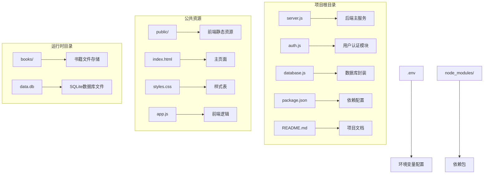
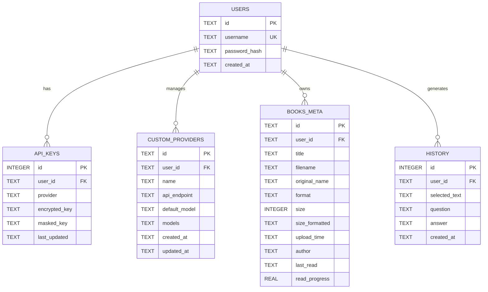
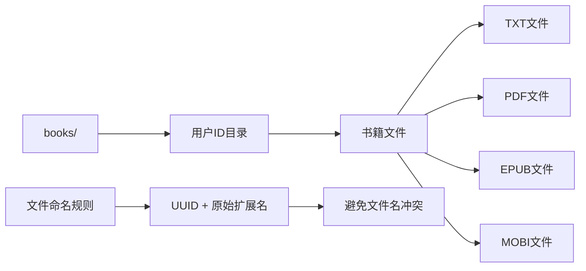
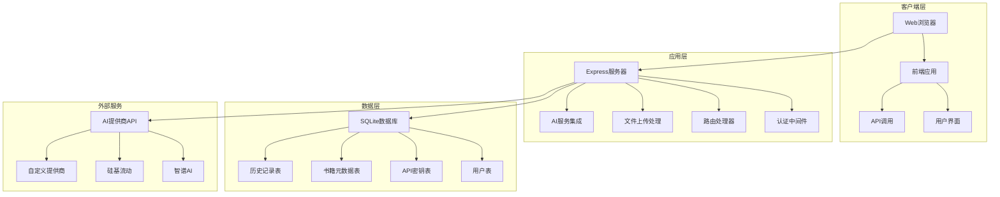
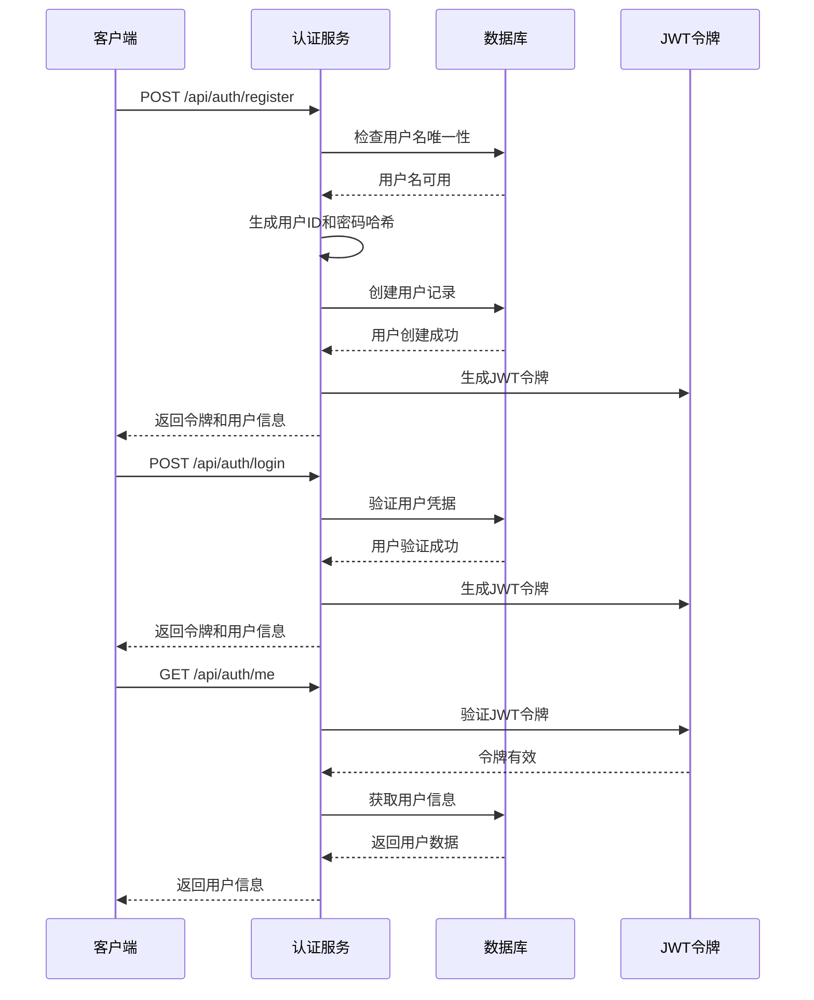
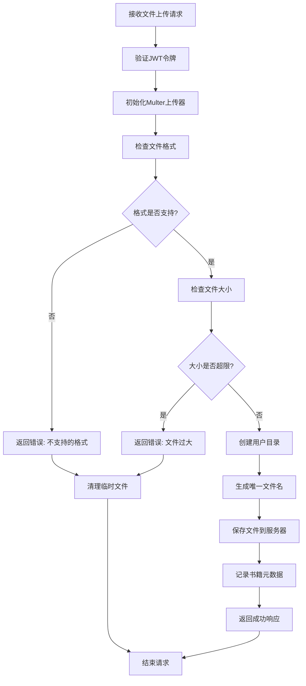
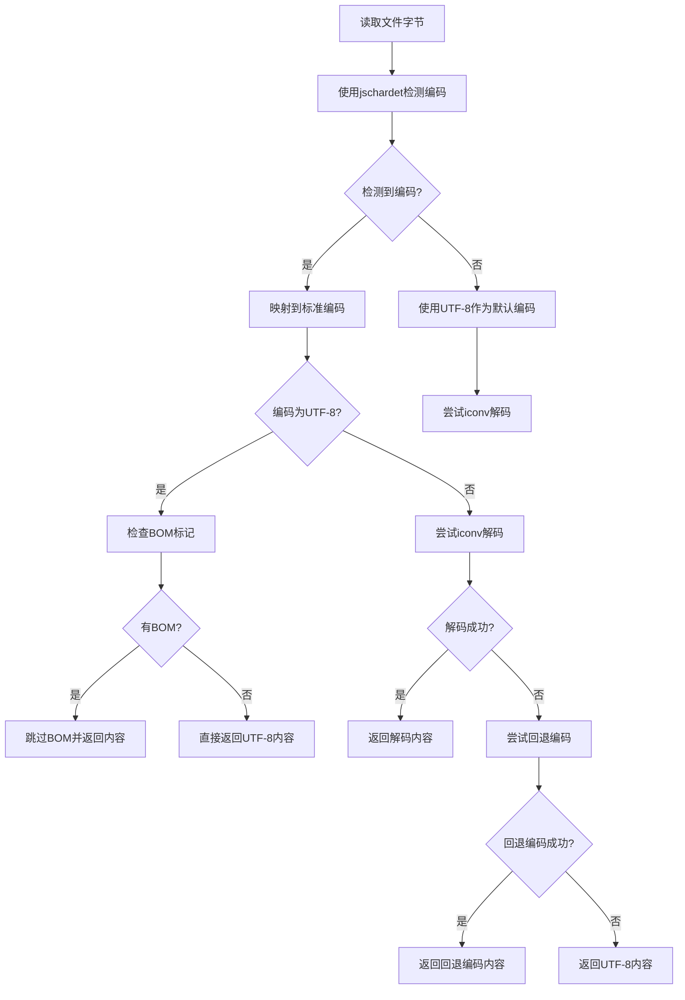
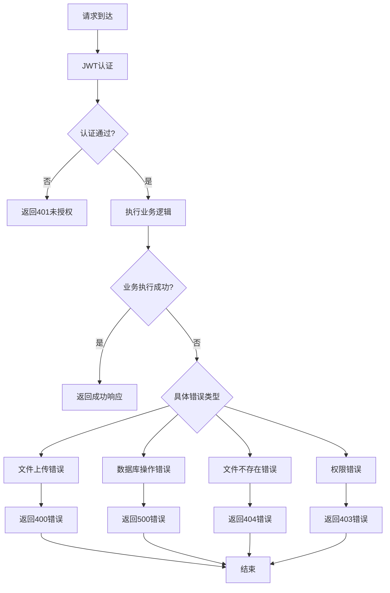
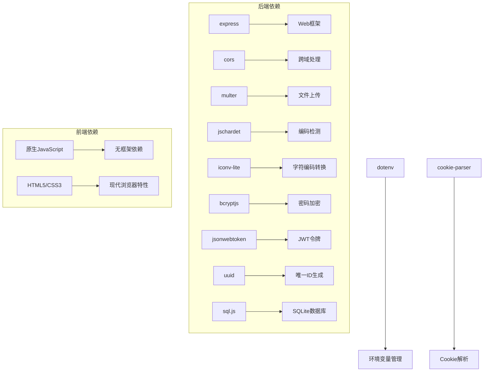

# 电子书管理接口

<cite>
**本文档引用的文件**
- [server.js](file://server.js)
- [auth.js](file://auth.js)
- [database.js](file://database.js)
- [package.json](file://package.json)
- [README.md](file://README.md)
- [public/app.js](file://public/app.js)
- [public/index.html](file://public/index.html)
</cite>

## 目录
1. [简介](#简介)
2. [项目结构](#项目结构)
3. [核心组件](#核心组件)
4. [架构概览](#架构概览)
5. [详细组件分析](#详细组件分析)
6. [依赖关系分析](#依赖关系分析)
7. [性能考虑](#性能考虑)
8. [故障排除指南](#故障排除指南)
9. [结论](#结论)

## 简介

AI阅读助手是一个现代化的智能阅读应用，集成了多AI服务提供商，帮助用户高效阅读和理解书籍内容。该项目提供了完整的电子书管理接口，支持书籍上传、列表查询、详情获取、下载和删除等核心功能。

该系统采用前后端分离架构，后端使用Express.js提供RESTful API，前端使用原生JavaScript实现用户界面。系统支持多种电子书格式（TXT、PDF、EPUB、MOBI），具备智能文件上传处理、格式验证和编码转换机制。

## 项目结构



**图表来源**
- [server.js:1-899](file://server.js#L1-L899)
- [package.json:1-23](file://package.json#L1-L23)

**章节来源**
- [server.js:1-899](file://server.js#L1-L899)
- [package.json:1-23](file://package.json#L1-L23)

## 核心组件

### 1. 服务器架构组件

系统采用Express.js框架构建，主要组件包括：

- **认证中间件**：JWT令牌验证和用户身份认证
- **数据库层**：基于sql.js的SQLite数据库封装
- **文件上传处理**：Multer中间件处理多格式文件上传
- **AI集成**：支持多个AI服务提供商的API集成
- **静态资源服务**：提供前端页面和资源文件

### 2. 数据库设计

系统使用SQLite数据库存储用户信息、API密钥、书籍元数据等：



**图表来源**
- [database.js:81-135](file://database.js#L81-L135)

### 3. 文件存储架构

系统采用用户隔离的文件存储策略：



**图表来源**
- [server.js:134-148](file://server.js#L134-L148)

**章节来源**
- [database.js:81-135](file://database.js#L81-L135)
- [server.js:134-148](file://server.js#L134-L148)

## 架构概览



**图表来源**
- [server.js:15-40](file://server.js#L15-L40)
- [auth.js:14-27](file://auth.js#L14-L27)
- [database.js:69-138](file://database.js#L69-L138)

## 详细组件分析

### 1. 用户认证系统

#### JWT认证流程



**图表来源**
- [auth.js:29-77](file://auth.js#L29-L77)

#### 认证中间件实现

认证中间件负责验证每个API请求的JWT令牌：

- **令牌格式验证**：检查Authorization头部格式
- **JWT解码**：使用JWT_SECRET解码令牌
- **用户身份注入**：将用户信息注入到请求对象
- **错误处理**：处理过期令牌和无效令牌

**章节来源**
- [auth.js:14-27](file://auth.js#L14-L27)
- [auth.js:29-77](file://auth.js#L29-L77)

### 2. 电子书管理API

#### 文件上传处理

系统实现了完整的文件上传处理机制：



**图表来源**
- [server.js:465-514](file://server.js#L465-L514)
- [server.js:150-161](file://server.js#L150-L161)

#### 支持的文件格式和限制

系统支持以下电子书格式：
- **TXT**：纯文本文件，支持自动编码检测
- **PDF**：便携式文档格式
- **EPUB**：电子出版物格式
- **MOBI**：Mobipocket电子书格式

**文件大小限制**：50MB

**章节来源**
- [server.js:21-22](file://server.js#L21-L22)
- [server.js:465-514](file://server.js#L465-L514)

### 3. API接口规范

#### 书籍管理接口

| 接口 | 方法 | 路径 | 描述 |
|------|------|------|------|
| 上传书籍 | POST | `/api/books/upload` | 上传电子书文件 |
| 获取书籍列表 | GET | `/api/books` | 获取用户所有书籍 |
| 获取书籍详情 | GET | `/api/books/:id` | 获取指定书籍详情 |
| 下载书籍 | GET | `/api/books/:id/download` | 下载指定书籍 |
| 删除书籍 | DELETE | `/api/books/:id` | 删除指定书籍 |
| 保存阅读进度 | PUT | `/api/books/:id/progress` | 保存书籍阅读进度 |

#### 详细接口说明

##### 上传书籍接口 (`/api/books/upload`)

**请求参数**：
- **Content-Type**: `multipart/form-data`
- **字段**: `book` (文件类型)
- **文件限制**: 最大50MB，支持TXT、PDF、EPUB、MOBI格式

**响应格式**：
```json
{
  "success": true,
  "message": "书籍上传成功",
  "book": {
    "id": "string",
    "title": "string",
    "filename": "string",
    "originalName": "string",
    "format": "string",
    "size": "number",
    "sizeFormatted": "string",
    "uploadTime": "string",
    "author": "string",
    "lastRead": "string|null",
    "readProgress": "number",
    "userId": "string"
  }
}
```

**错误响应**：
- 400: 文件格式不支持
- 400: 文件大小超过限制
- 400: 未选择文件
- 401: 未授权访问

##### 书籍列表接口 (`/api/books`)

**请求参数**：无

**响应格式**：
```json
{
  "books": [
    {
      "id": "string",
      "title": "string",
      "filename": "string",
      "originalName": "string",
      "format": "string",
      "size": "number",
      "sizeFormatted": "string",
      "uploadTime": "string",
      "author": "string",
      "lastRead": "string|null",
      "readProgress": "number",
      "userId": "string"
    }
  ]
}
```

##### 书籍详情接口 (`/api/books/:id`)

**路径参数**：
- `:id` - 书籍ID

**响应格式**：
对于TXT文件：
```json
{
  "book": {
    "id": "string",
    "title": "string",
    "filename": "string",
    "originalName": "string",
    "format": "string",
    "size": "number",
    "sizeFormatted": "string",
    "uploadTime": "string",
    "author": "string",
    "lastRead": "string|null",
    "readProgress": "number"
  },
  "content": "string"
}
```

对于非TXT文件：
```json
{
  "book": {
    "id": "string",
    "title": "string",
    "filename": "string",
    "originalName": "string",
    "format": "string",
    "size": "number",
    "sizeFormatted": "string",
    "uploadTime": "string",
    "author": "string",
    "lastRead": "string|null",
    "readProgress": "number"
  },
  "downloadUrl": "string"
}
```

##### 下载接口 (`/api/books/:id/download`)

**路径参数**：
- `:id` - 书籍ID

**响应**：直接返回文件下载流

##### 删除接口 (`/api/books/:id`)

**路径参数**：
- `:id` - 书籍ID

**响应格式**：
```json
{
  "success": true,
  "message": "书籍已删除"
}
```

**章节来源**
- [server.js:465-597](file://server.js#L465-L597)

### 4. 文件编码处理机制

#### TXT文件编码检测

系统实现了智能的TXT文件编码检测机制：



**图表来源**
- [server.js:81-121](file://server.js#L81-L121)

#### 支持的编码格式

系统支持以下编码格式：
- **UTF-8**（含BOM）
- **GBK / GB2312 / GB18030**
- **BIG5**
- **UTF-16LE / UTF-16BE**
- **ASCII**

**章节来源**
- [server.js:81-121](file://server.js#L81-L121)

### 5. 错误处理机制

系统实现了完善的错误处理机制：



**图表来源**
- [server.js:465-597](file://server.js#L465-L597)

**章节来源**
- [server.js:465-597](file://server.js#L465-L597)

## 依赖关系分析

### 1. 核心依赖关系



**图表来源**
- [package.json:10-22](file://package.json#L10-L22)

### 2. 外部API集成

系统集成了多个AI服务提供商：

| 提供商 | API端点 | 默认模型 | 特点 |
|--------|---------|----------|------|
| 智谱AI | `https://open.bigmodel.cn/api/paas/v4/chat/completions` | `glm-4.5-air` | 国产优选 |
| 硅基流动 | `https://api.siliconflow.cn/v1/chat/completions` | `deepseek-ai/DeepSeek-V4-Flash` | 新用户送代金券 |

**章节来源**
- [package.json:10-22](file://package.json#L10-L22)
- [server.js:163-188](file://server.js#L163-L188)

## 性能考虑

### 1. 文件上传优化

- **流式上传**：使用Multer中间件处理大文件上传
- **内存管理**：及时清理上传过程中的临时文件
- **并发控制**：限制同时进行的上传任务数量
- **进度跟踪**：提供实时上传进度反馈

### 2. 数据库性能

- **索引优化**：为常用查询字段建立索引
- **事务处理**：使用事务确保数据一致性
- **WAL模式**：启用Write-Ahead Logging提高并发性能
- **连接池**：复用数据库连接减少开销

### 3. 缓存策略

- **API密钥缓存**：避免重复的API密钥验证
- **用户会话缓存**：减少JWT验证频率
- **静态资源缓存**：浏览器端缓存静态文件

## 故障排除指南

### 1. 常见问题及解决方案

#### 文件上传失败

**症状**：上传过程中断或返回错误

**可能原因**：
- 文件格式不支持
- 文件大小超过限制
- 磁盘空间不足
- 权限问题

**解决方案**：
1. 检查文件格式是否在支持列表中
2. 确认文件大小不超过50MB限制
3. 验证服务器磁盘空间
4. 检查文件写入权限

#### 书籍无法下载

**症状**：下载链接无效或下载失败

**可能原因**：
- 书籍文件已被删除
- 文件路径错误
- 权限不足

**解决方案**：
1. 确认书籍仍然存在于数据库中
2. 检查文件存储路径
3. 验证用户权限

#### 编码问题

**症状**：TXT文件显示乱码

**可能原因**：
- 文件编码检测失败
- 字符集转换错误

**解决方案**：
1. 系统会自动尝试多种编码格式
2. 如仍失败，可手动指定编码格式
3. 重新保存文件为UTF-8格式

### 2. 日志和调试

系统提供了详细的日志记录：

- **服务器启动日志**：显示配置信息和启动状态
- **API调用日志**：记录请求和响应信息
- **错误日志**：记录异常和错误信息
- **文件操作日志**：记录文件上传和下载操作

**章节来源**
- [server.js:882-899](file://server.js#L882-L899)

## 结论

AI阅读助手的电子书管理接口提供了完整、可靠的电子书管理解决方案。系统具有以下特点：

### 优势

1. **完整的功能覆盖**：支持电子书的上传、管理、阅读和下载
2. **多格式支持**：兼容主流电子书格式
3. **智能编码处理**：自动检测和转换文件编码
4. **安全可靠**：JWT认证、API密钥加密存储
5. **易于使用**：简洁的API设计和错误处理

### 技术亮点

1. **前后端分离**：清晰的职责划分和独立开发
2. **数据库设计**：合理的表结构和索引优化
3. **文件管理**：用户隔离的文件存储策略
4. **错误处理**：完善的异常处理和用户反馈

### 改进建议

1. **性能优化**：可考虑添加CDN支持大文件下载
2. **监控增强**：添加API使用统计和性能监控
3. **扩展性**：支持更多电子书格式和元数据
4. **安全性**：可添加文件病毒扫描功能

该系统为电子书管理提供了一个坚实的技术基础，适合进一步的功能扩展和性能优化。