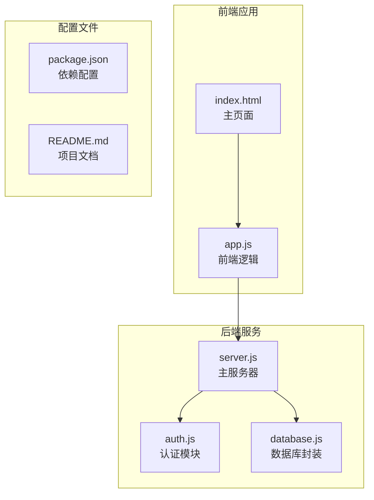
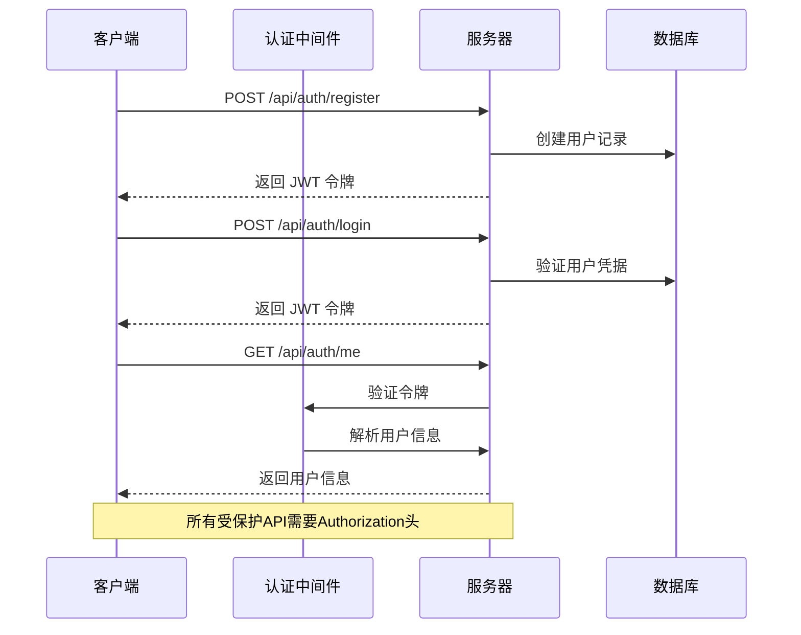
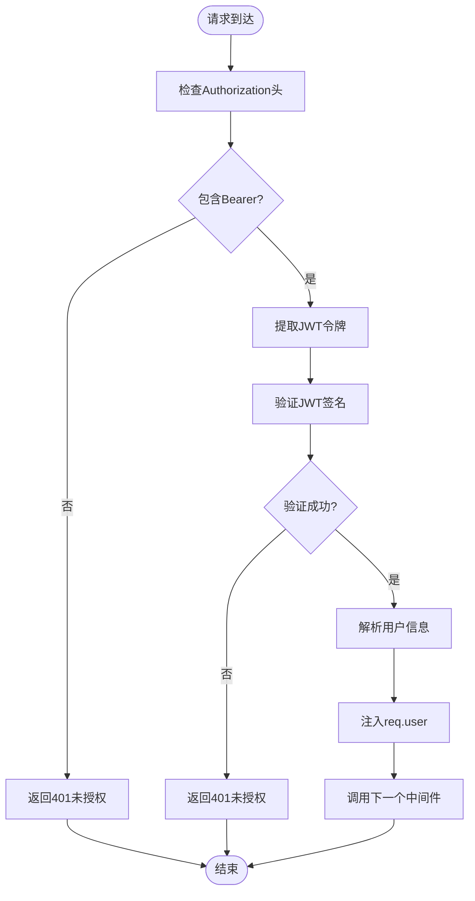
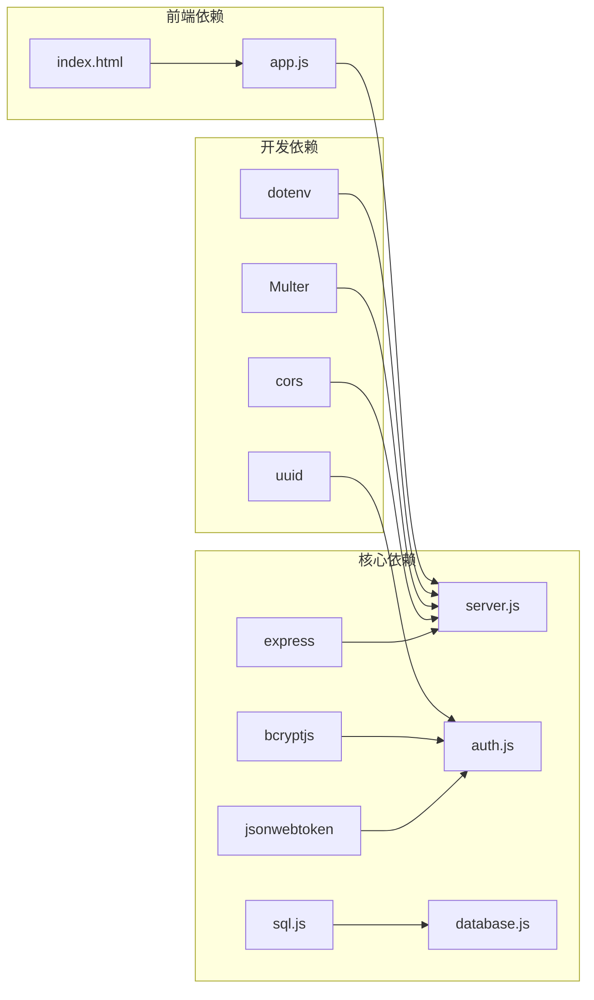

# 认证接口

<cite>
**本文档引用的文件**
- [server.js](file://server.js)
- [auth.js](file://auth.js)
- [database.js](file://database.js)
- [package.json](file://package.json)
- [README.md](file://README.md)
- [public/app.js](file://public/app.js)
- [public/index.html](file://public/index.html)
</cite>

## 目录
1. [简介](#简介)
2. [项目结构](#项目结构)
3. [核心组件](#核心组件)
4. [架构概览](#架构概览)
5. [详细组件分析](#详细组件分析)
6. [依赖关系分析](#依赖关系分析)
7. [性能考虑](#性能考虑)
8. [故障排除指南](#故障排除指南)
9. [结论](#结论)

## 简介

trae02airead 是一个基于 Node.js 的 AI 阅读助手应用，提供了完整的用户认证系统。本文档详细介绍了认证相关的 API 接口，包括用户注册、登录和信息查询功能，以及 JWT 令牌的生成、验证和刷新机制。

该应用采用 Express.js 构建，使用 JWT 进行身份验证，bcryptjs 进行密码哈希，支持"记住我"功能（30天有效期）和标准登录（7天有效期）。认证中间件确保所有受保护的 API 调用都需要有效的 Bearer Token。

## 项目结构

项目采用模块化设计，主要文件结构如下：



**图表来源**
- [server.js:1-50](file://server.js#L1-L50)
- [auth.js:1-80](file://auth.js#L1-L80)
- [database.js:1-146](file://database.js#L1-L146)

**章节来源**
- [server.js:1-50](file://server.js#L1-L50)
- [package.json:1-23](file://package.json#L1-L23)
- [README.md:210-232](file://README.md#L210-L232)

## 核心组件

### 认证中间件
认证中间件负责拦截所有受保护的 API 请求，验证 JWT 令牌的有效性。

### 用户认证处理器
提供注册、登录和用户信息查询的处理函数。

### 数据库封装
使用 sql.js 实现 SQLite 数据库的封装，支持用户、API 密钥、自定义提供商等数据表。

**章节来源**
- [auth.js:14-77](file://auth.js#L14-L77)
- [database.js:69-138](file://database.js#L69-L138)

## 架构概览

应用采用前后端分离的架构，认证流程如下：



**图表来源**
- [server.js:37-42](file://server.js#L37-L42)
- [auth.js:14-27](file://auth.js#L14-L27)

## 详细组件分析

### JWT 令牌机制

#### 令牌生成
JWT 令牌使用用户 ID、用户名和过期时间生成，支持两种有效期：
- 标准登录：7天有效期
- 记住我：30天有效期

#### 令牌验证
认证中间件验证 Bearer Token 的格式和有效性，解析用户信息并注入到请求对象中。

#### 令牌刷新
应用实现了自动令牌验证机制，通过 `/api/auth/me` 接口验证令牌有效性。

**章节来源**
- [auth.js:9-12](file://auth.js#L9-L12)
- [auth.js:14-27](file://auth.js#L14-L27)
- [auth.js:75-77](file://auth.js#L75-L77)

### 认证中间件工作原理



**图表来源**
- [auth.js:14-27](file://auth.js#L14-L27)

**章节来源**
- [auth.js:14-27](file://auth.js#L14-L27)

### Bearer Token 使用方法

前端应用通过以下方式使用 Bearer Token：

1. **注册和登录后**：将返回的 JWT 令牌存储在本地存储中
2. **API 请求时**：在 Authorization 头中添加 `Bearer <token>`
3. **自动验证**：应用启动时自动验证令牌有效性

**章节来源**
- [public/app.js:15-28](file://public/app.js#L15-L28)
- [public/app.js:85-109](file://public/app.js#L85-L109)
- [public/app.js:166-184](file://public/app.js#L166-L184)

### 用户注册接口

#### 接口规范
- **方法**：POST
- **路径**：`/api/auth/register`
- **请求头**：`Content-Type: application/json`
- **请求体**：包含用户名和密码

#### 请求参数
| 参数名 | 类型 | 必填 | 说明 |
|--------|------|------|------|
| username | string | 是 | 用户名，不能为空 |
| password | string | 是 | 密码，至少6位 |

#### 响应格式
成功响应包含：
```json
{
  "token": "jwt_token_string",
  "user": {
    "id": "user_uuid",
    "username": "username"
  }
}
```

#### 错误码
- 400：用户名或密码格式无效
- 400：用户名已存在

**章节来源**
- [auth.js:29-55](file://auth.js#L29-L55)

### 用户登录接口

#### 接口规范
- **方法**：POST
- **路径**：`/api/auth/login`
- **请求头**：`Content-Type: application/json`
- **请求体**：包含用户名、密码和可选的 rememberMe 标志

#### 请求参数
| 参数名 | 类型 | 必填 | 说明 |
|--------|------|------|------|
| username | string | 是 | 用户名 |
| password | string | 是 | 密码 |
| rememberMe | boolean | 否 | 是否记住登录（30天） |

#### 响应格式
成功响应包含：
```json
{
  "token": "jwt_token_string",
  "user": {
    "id": "user_uuid",
    "username": "username"
  }
}
```

#### 错误码
- 400：缺少用户名或密码
- 401：用户名或密码错误

**章节来源**
- [auth.js:57-73](file://auth.js#L57-L73)

### 个人信息查询接口

#### 接口规范
- **方法**：GET
- **路径**：`/api/auth/me`
- **请求头**：`Authorization: Bearer <token>`

#### 响应格式
```json
{
  "user": {
    "id": "user_uuid",
    "username": "username"
  }
}
```

#### 错误码
- 401：需要认证（令牌缺失或无效）

**章节来源**
- [auth.js:75-77](file://auth.js#L75-L77)

### 前端集成示例

#### 基本认证流程
```javascript
// 注册用户
async function register(username, password) {
  const response = await fetch('/api/auth/register', {
    method: 'POST',
    headers: {'Content-Type': 'application/json'},
    body: JSON.stringify({username, password})
  });
  
  if (response.ok) {
    const data = await response.json();
    localStorage.setItem('authToken', data.token);
    return data;
  }
}

// 登录用户
async function login(username, password, rememberMe = false) {
  const response = await fetch('/api/auth/login', {
    method: 'POST',
    headers: {'Content-Type': 'application/json'},
    body: JSON.stringify({username, password, rememberMe})
  });
  
  if (response.ok) {
    const data = await response.json();
    localStorage.setItem('authToken', data.token);
    return data;
  }
}

// 验证令牌
async function validateToken() {
  const token = localStorage.getItem('authToken');
  if (!token) return false;
  
  const response = await fetch('/api/auth/me', {
    headers: {'Authorization': `Bearer ${token}`}
  });
  
  return response.ok;
}
```

#### API 请求封装
```javascript
// 统一的 API 请求方法
async function apiFetch(url, options = {}) {
  const token = localStorage.getItem('authToken');
  
  if (!options.headers) options.headers = {};
  options.headers['Authorization'] = `Bearer ${token}`;
  
  const response = await fetch(url, options);
  
  if (response.status === 401) {
    // 令牌过期，执行登出
    logout();
    throw new Error('登录已过期');
  }
  
  return response;
}
```

**章节来源**
- [public/app.js:59-109](file://public/app.js#L59-L109)
- [public/app.js:166-184](file://public/app.js#L166-L184)

## 依赖关系分析

应用的核心依赖关系如下：



**图表来源**
- [package.json:10-22](file://package.json#L10-L22)

**章节来源**
- [package.json:10-22](file://package.json#L10-L22)

## 性能考虑

### 认证性能优化
1. **令牌缓存**：前端应用在内存中缓存用户令牌，减少重复验证
2. **数据库索引**：用户表使用用户名唯一索引，提高查询效率
3. **令牌有效期**：合理设置令牌有效期，平衡安全性与用户体验

### 安全性考虑
1. **密码哈希**：使用 bcryptjs 进行密码哈希，成本因子为10
2. **令牌签名**：JWT 使用随机生成的密钥进行签名
3. **数据隔离**：每个用户的 API 密钥独立存储和加密

## 故障排除指南

### 常见认证问题

#### 401 未授权错误
**症状**：API 请求返回 401 状态码
**原因**：
- 缺少 Authorization 头
- Bearer Token 格式错误
- 令牌已过期
- 令牌签名无效

**解决方案**：
1. 确保请求头格式正确：`Authorization: Bearer <token>`
2. 检查令牌是否过期
3. 重新登录获取新令牌

#### 令牌过期处理
应用自动处理令牌过期：
```javascript
// 前端自动处理401错误
if (response.status === 401) {
  this.logout(); // 清除本地存储的令牌
  throw new Error('登录已过期');
}
```

#### 数据库初始化问题
如果遇到数据库相关错误，检查：
1. `data.db` 文件是否存在且可读写
2. 数据库权限设置
3. SQLite 驱动是否正确安装

**章节来源**
- [public/app.js:178-181](file://public/app.js#L178-L181)
- [database.js:69-80](file://database.js#L69-L80)

## 结论

trae02airead 的认证系统提供了完整的用户身份验证功能，具有以下特点：

1. **安全性**：使用 JWT 令牌、bcrypt 密码哈希和数据加密
2. **易用性**：支持"记住我"功能，自动令牌验证
3. **可靠性**：完善的错误处理和故障恢复机制
4. **可扩展性**：模块化的架构设计，便于功能扩展

该认证系统为整个应用提供了坚实的安全基础，确保用户数据和 API 密钥的安全存储与传输。前端应用通过简单的 API 调用即可实现完整的认证流程，开发者可以轻松集成到现有的 Web 应用中。