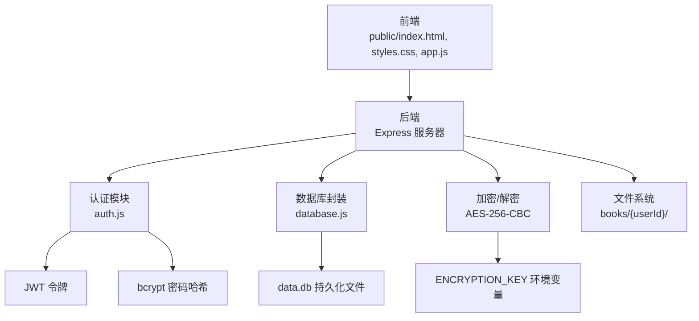
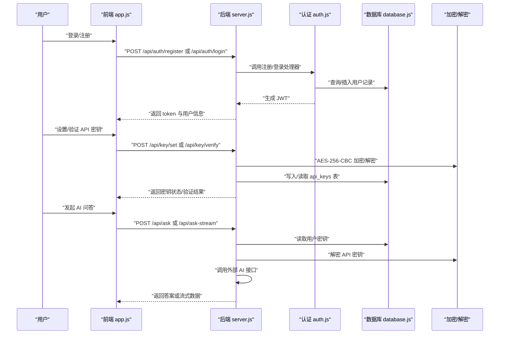
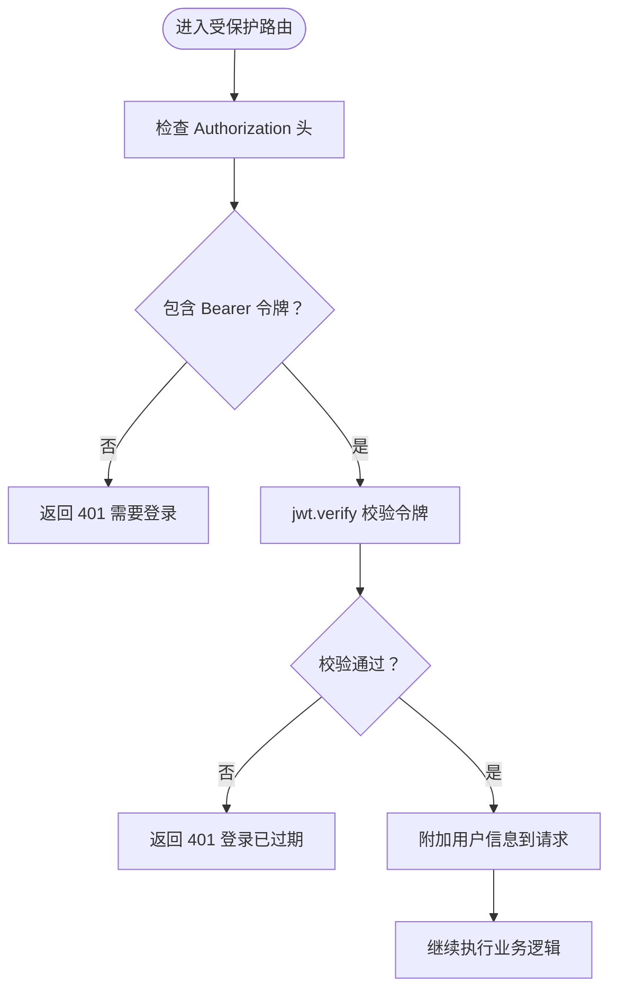
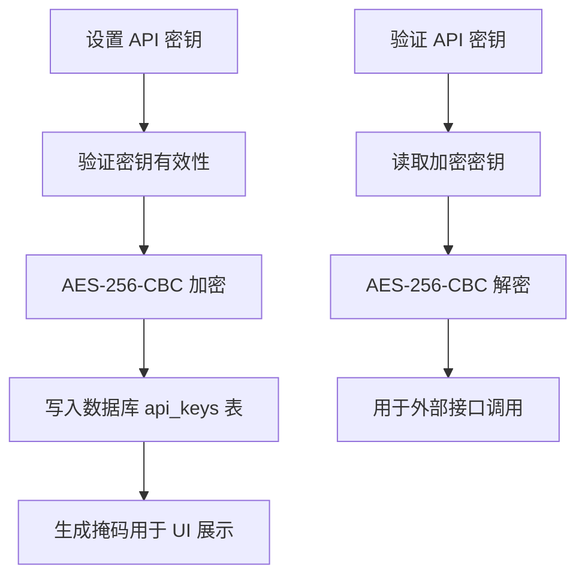
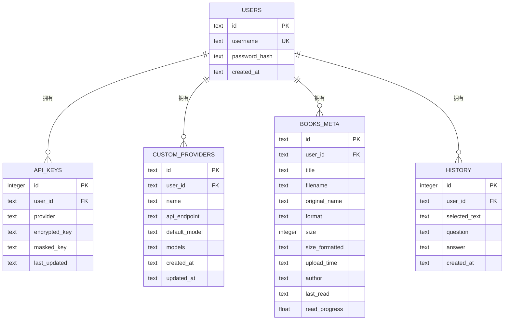
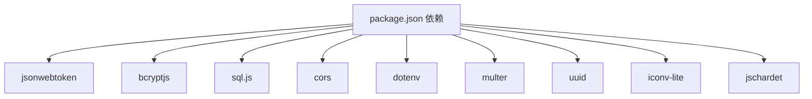

# 安全考虑

<cite>
**本文引用的文件**
- [server.js](file://server.js)
- [auth.js](file://auth.js)
- [database.js](file://database.js)
- [package.json](file://package.json)
- [README.md](file://README.md)
- [public/app.js](file://public/app.js)
</cite>

## 目录
1. [简介](#简介)
2. [项目结构](#项目结构)
3. [核心组件](#核心组件)
4. [架构总览](#架构总览)
5. [详细组件分析](#详细组件分析)
6. [依赖关系分析](#依赖关系分析)
7. [性能考量](#性能考量)
8. [故障排查指南](#故障排查指南)
9. [结论](#结论)
10. [附录](#附录)

## 简介
本文件面向 trae02airead 项目，提供全面的安全考虑与最佳实践说明，覆盖用户认证与授权（JWT）、密码与密钥存储（bcrypt/AES-256-CBC）、数据隔离、敏感数据保护、会话管理与安全传输、常见攻击防护（XSS、CSRF、SQL 注入）、安全配置建议、漏洞扫描与安全审计流程，以及数据备份与恢复的安全要点。文档同时结合源码实现进行分析，确保建议与实际实现一致。

## 项目结构
项目采用前后端分离的单页应用架构：前端静态资源位于 public 目录，后端由 Express 服务提供 REST API；SQLite 使用 sql.js 在内存中运行并通过磁盘文件持久化；用户、API 密钥、书籍元数据等均存储在本地数据库中；密钥采用对称加密存储，且支持通过环境变量配置固定加密密钥以实现重启后密钥可恢复。

图表来源
- [server.js:30-899](file://server.js#L30-L899)
- [auth.js:1-80](file://auth.js#L1-L80)
- [database.js:1-146](file://database.js#L1-L146)
- [README.md:210-232](file://README.md#L210-L232)

章节来源
- [server.js:15-35](file://server.js#L15-L35)
- [database.js:5-146](file://database.js#L5-L146)
- [README.md:210-232](file://README.md#L210-L232)

## 核心组件
- 认证与授权（JWT）
  - 登录与注册使用 bcrypt 存储密码哈希；JWT 用于无状态会话，支持“记住我”延长有效期。
  - 所有受保护路由通过 authMiddleware 校验 Bearer Token。
- 密钥与数据加密
  - API 密钥使用 AES-256-CBC 对称加密存储；加密密钥来自 ENCRYPTION_KEY 环境变量，可固定以实现重启后可解密。
- 数据隔离
  - 用户数据按用户 ID 分离；书籍文件按用户目录存放；数据库表通过外键约束保证级联删除与完整性。
- 敏感数据保护
  - 密钥仅在内存中解密用于验证；UI 展示掩码形式；日志避免输出敏感信息。
- 会话与传输
  - 会话通过 JWT 维护；建议在生产环境启用 HTTPS 与安全 Cookie 标志（当前实现未使用 cookie，但建议在部署时考虑）。
- 常见攻击防护
  - XSS：前端渲染严格校验与转义；CSRF：当前未使用 Cookie 会话，减少 CSRF 风险；SQL 注入：使用参数化查询与 sql.js 封装。
- 安全配置与审计
  - 建议固定 ENCRYPTION_KEY 并妥善保管；定期备份 data.db；对第三方 AI 提供商接口进行超时与错误处理。

章节来源
- [auth.js:9-27](file://auth.js#L9-L27)
- [auth.js:29-77](file://auth.js#L29-L77)
- [server.js:44-67](file://server.js#L44-L67)
- [server.js:237-332](file://server.js#L237-L332)
- [database.js:81-135](file://database.js#L81-L135)
- [README.md:234-244](file://README.md#L234-L244)

## 架构总览
下图展示用户认证、密钥管理与 AI 问答的关键交互路径，体现安全控制点与数据流向。

图表来源
- [server.js:37-42](file://server.js#L37-L42)
- [server.js:260-332](file://server.js#L260-L332)
- [server.js:618-688](file://server.js#L618-L688)
- [auth.js:14-27](file://auth.js#L14-L27)
- [database.js:88-96](file://database.js#L88-L96)

## 详细组件分析

### 认证与授权（JWT）
- 令牌签发
  - 支持短期（7 天）与长期（30 天，“记住我”）两种有效期；密钥来自 JWT_SECRET 环境变量或随机生成。
- 中间件校验
  - 从 Authorization 头解析 Bearer 令牌；验证失败返回 401 并提示需要重新登录。
- 注册与登录
  - 注册时使用 bcrypt 生成密码哈希；登录时比对哈希；成功后签发 JWT 返回给客户端。

图表来源
- [auth.js:14-27](file://auth.js#L14-L27)
- [auth.js:9-12](file://auth.js#L9-L12)

章节来源
- [auth.js:9-27](file://auth.js#L9-L27)
- [auth.js:29-77](file://auth.js#L29-L77)
- [README.md:32-38](file://README.md#L32-L38)

### 密码加密存储（bcrypt）
- 存储策略
  - 用户密码以 bcrypt 哈希形式存储，不保存明文；注册时计算哈希并入库；登录时比对哈希。
- 安全建议
  - 使用足够高的成本因子；定期轮换密钥与环境变量；避免在日志中输出哈希或明文。

章节来源
- [auth.js:49-69](file://auth.js#L49-L69)
- [database.js:82-87](file://database.js#L82-L87)

### API 密钥加密存储（AES-256-CBC）
- 存储与解密
  - 设置密钥时使用 AES-256-CBC 加密并存储；验证时解密用于第三方接口调用；UI 展示掩码形式。
- 密钥管理
  - 加密密钥来自 ENCRYPTION_KEY 环境变量；可固定以实现重启后可解密；密钥变更会导致旧密钥不可解密。
- 安全建议
  - 严格控制 ENCRYPTION_KEY 的访问权限；定期轮换；避免在日志中输出密钥片段。

图表来源
- [server.js:260-332](file://server.js#L260-L332)
- [server.js:44-67](file://server.js#L44-L67)
- [database.js:88-96](file://database.js#L88-L96)

章节来源
- [server.js:260-332](file://server.js#L260-L332)
- [server.js:44-67](file://server.js#L44-L67)
- [database.js:88-96](file://database.js#L88-L96)
- [README.md:236-238](file://README.md#L236-L238)

### 数据隔离机制
- 用户隔离
  - 书籍文件按用户目录存放；数据库表通过外键约束与唯一索引保障隔离；查询均绑定用户 ID。
- 数据库设计
  - users、api_keys、custom_providers、books_meta、history 等表均与用户 ID 关联；WAL 模式与外键开启增强一致性与并发能力。

图表来源
- [database.js:81-135](file://database.js#L81-L135)

章节来源
- [server.js:134-161](file://server.js#L134-L161)
- [database.js:81-135](file://database.js#L81-L135)
- [README.md:30-38](file://README.md#L30-L38)

### 敏感数据保护与会话管理
- 敏感数据
  - 密钥仅在内存中解密；UI 展示掩码；日志避免输出敏感字段。
- 会话管理
  - 使用 JWT 无状态会话；建议在生产环境启用 HTTPS、安全标志与 SameSite 策略（当前未使用 Cookie，部署时应评估）。
- 传输安全
  - 建议强制 HTTPS；对第三方 AI 接口使用 TLS；设置合理的超时与重试策略。

章节来源
- [server.js:297-316](file://server.js#L297-L316)
- [server.js:618-688](file://server.js#L618-L688)
- [README.md:236-238](file://README.md#L236-L238)

### 常见攻击防护
- XSS（跨站脚本）
  - 前端渲染严格校验与转义；避免 innerHTML 直接注入；对用户输入进行白名单过滤。
- CSRF（跨站请求伪造）
  - 当前未使用 Cookie 会话，降低 CSRF 风险；若引入 Cookie 会话，需配合 SameSite、CSP 与双重提交 Cookie。
- SQL 注入
  - 使用参数化查询与 sql.js 封装；所有用户输入均通过预编译语句绑定；数据库层启用外键与索引优化。

章节来源
- [server.js:134-161](file://server.js#L134-L161)
- [database.js:16-51](file://database.js#L16-L51)

### 安全配置建议
- 环境变量
  - 固定 ENCRYPTION_KEY 并妥善保管；可选配置 JWT_SECRET、AI 提供商密钥与模型；设置安全端口。
- 日志与监控
  - 过滤敏感字段；记录异常与安全事件；设置告警阈值。
- 第三方接口
  - 设置超时与重试；对响应进行严格校验；限制速率与并发。

章节来源
- [README.md:105-120](file://README.md#L105-L120)
- [server.js:212-235](file://server.js#L212-L235)

### 漏洞扫描与安全审计
- 工具与流程
  - 使用 npm audit 或 Snyk 扫描依赖漏洞；对数据库文件与密钥目录进行权限审计；定期轮换密钥与环境变量。
- 审计清单
  - 环境变量权限；文件系统权限；数据库备份与恢复测试；日志保留与脱敏。

章节来源
- [README.md:102-104](file://README.md#L102-L104)
- [database.js:10-14](file://database.js#L10-L14)

### 数据备份与恢复
- 备份策略
  - 定期复制 data.db；对 books/{userId}/ 目录进行增量备份；记录备份时间戳与校验和。
- 恢复流程
  - 停止服务；替换 data.db；重建用户目录结构；启动服务并验证 API 密钥解密与文件访问。

章节来源
- [README.md:102-104](file://README.md#L102-L104)
- [server.js:24-26](file://server.js#L24-L26)

## 依赖关系分析
后端依赖包括 JWT、bcryptjs、sql.js、cors、dotenv、multer、uuid、iconv-lite、jschardet 等；这些依赖分别支撑认证、密码哈希、数据库封装、文件上传、编码检测等功能。

图表来源
- [package.json:10-22](file://package.json#L10-L22)

章节来源
- [package.json:10-22](file://package.json#L10-L22)

## 性能考量
- 数据库性能
  - WAL 模式提升并发写入；外键开启保证一致性；合理索引（用户维度）提升查询效率。
- 加密性能
  - AES-256-CBC 为对称加密，开销较小；建议在批量操作时合并数据库事务。
- 文件上传
  - 限制文件大小与类型；使用流式处理减少内存占用；按用户目录隔离避免竞争。

章节来源
- [database.js:78-79](file://database.js#L78-L79)
- [server.js:21-22](file://server.js#L21-L22)
- [server.js:134-161](file://server.js#L134-L161)

## 故障排查指南
- 认证失败
  - 检查 Authorization 头格式；确认 JWT_SECRET 是否正确；核对用户是否存在与密码哈希是否匹配。
- 密钥解密失败
  - 确认 ENCRYPTION_KEY 是否与设置时一致；检查数据库中加密字段是否完整；查看解密异常日志。
- 文件上传失败
  - 检查文件大小与格式限制；确认用户目录权限；查看 multer 错误码与磁盘空间。
- 第三方接口错误
  - 检查 API 密钥与提供商配置；确认网络连通性与超时设置；查看响应状态与错误信息。

章节来源
- [auth.js:14-27](file://auth.js#L14-L27)
- [server.js:44-67](file://server.js#L44-L67)
- [server.js:134-161](file://server.js#L134-L161)
- [server.js:212-235](file://server.js#L212-L235)

## 结论
trae02airead 在认证、密钥存储与数据隔离方面具备良好基础：JWT 无状态会话、bcrypt 密码哈希、AES-256-CBC 对称加密、用户级数据隔离与参数化查询。建议在生产环境中进一步强化传输安全（HTTPS）、Cookie 安全策略、日志脱敏与权限控制，并建立完善的备份与审计流程，以满足更严格的安全合规要求。

## 附录
- 前端安全要点
  - 令牌存储于本地存储；建议在生产环境考虑 HttpOnly/Secure Cookie；对用户输入进行严格校验与转义。
- API 路由与安全
  - 受保护路由均需 Bearer 令牌；注册/登录接口返回令牌；密钥管理接口支持设置、验证与删除。

章节来源
- [public/app.js:111-128](file://public/app.js#L111-L128)
- [server.js:37-42](file://server.js#L37-L42)
- [server.js:237-332](file://server.js#L237-L332)