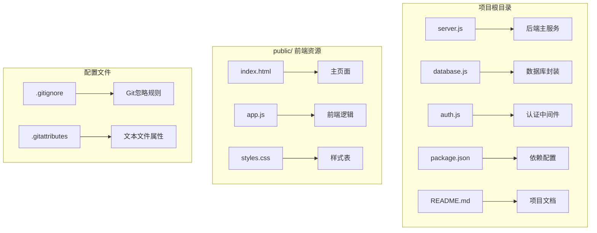
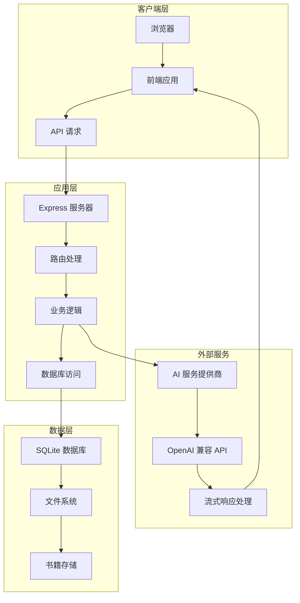
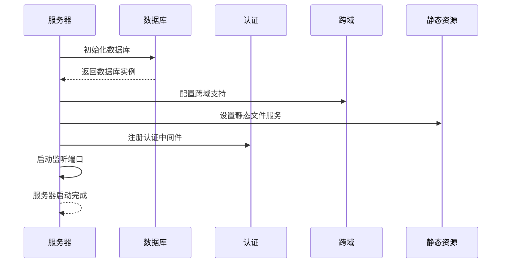
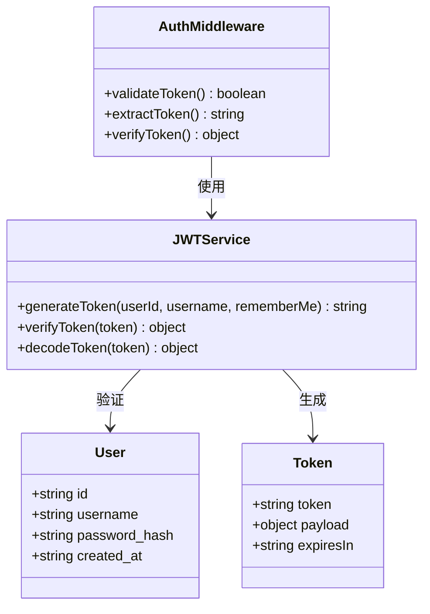
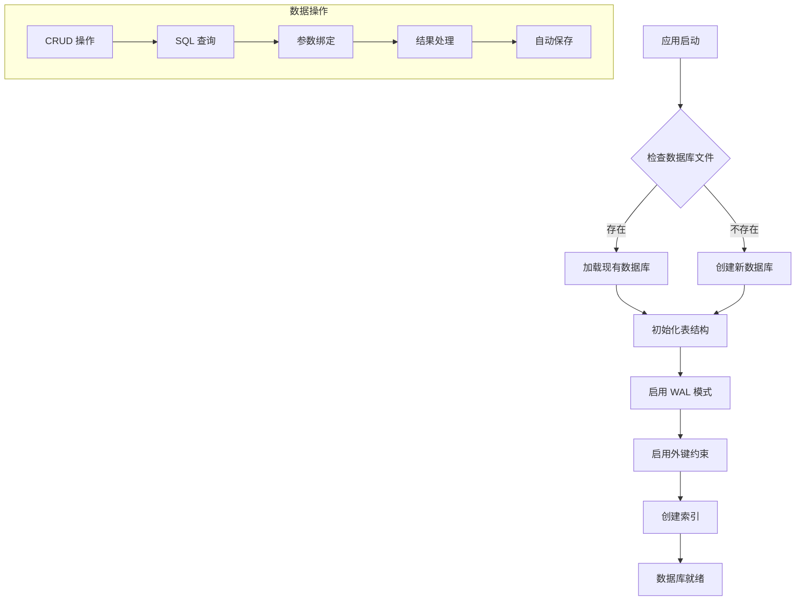
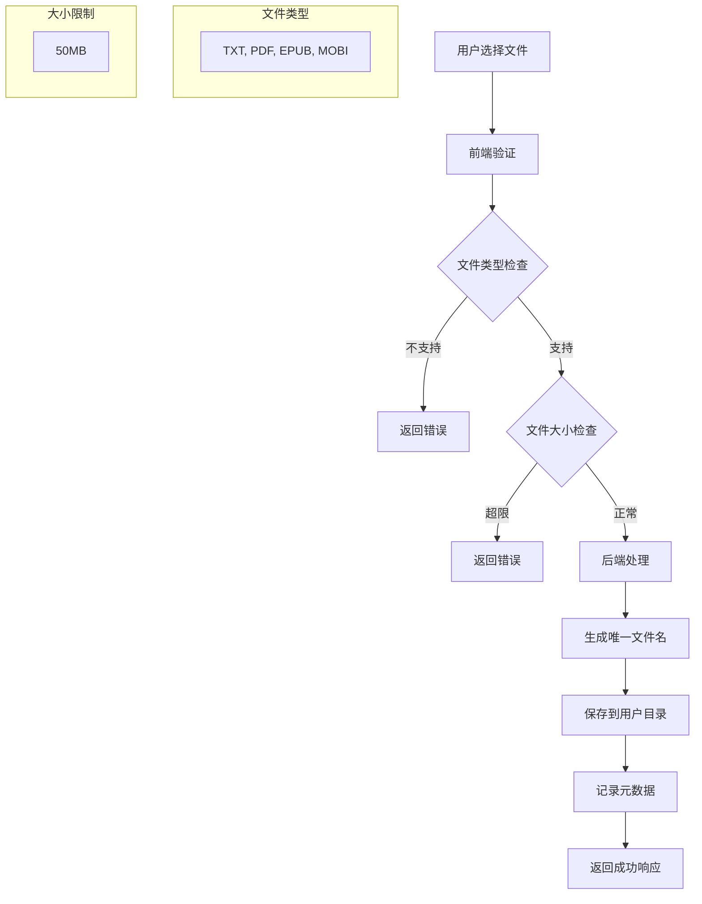
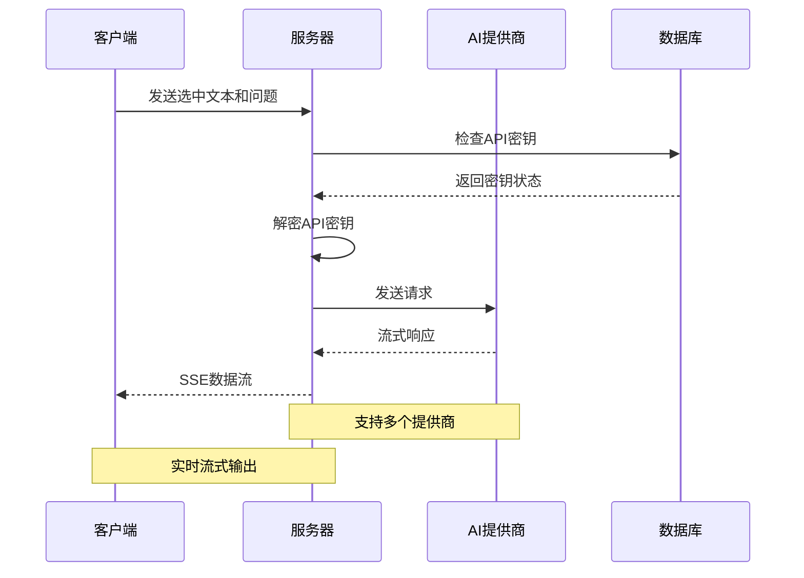
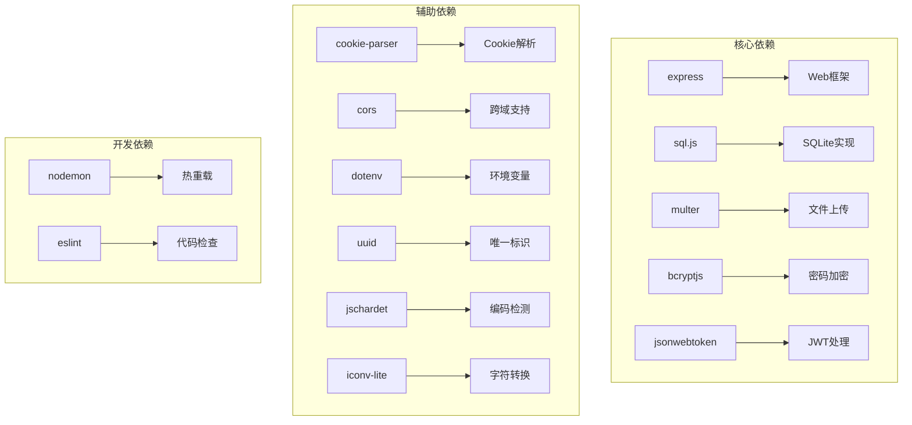

# 开发环境配置

<cite>
**本文档引用的文件**
- [package.json](file://package.json)
- [README.md](file://README.md)
- [server.js](file://server.js)
- [auth.js](file://auth.js)
- [database.js](file://database.js)
- [public/index.html](file://public/index.html)
- [public/app.js](file://public/app.js)
- [public/styles.css](file://public/styles.css)
- [.gitignore](file://.gitignore)
- [.gitattributes](file://.gitattributes)
</cite>

## 目录
1. [简介](#简介)
2. [项目结构](#项目结构)
3. [核心组件](#核心组件)
4. [架构概览](#架构概览)
5. [详细组件分析](#详细组件分析)
6. [依赖关系分析](#依赖关系分析)
7. [性能考虑](#性能考虑)
8. [故障排除指南](#故障排除指南)
9. [结论](#结论)
10. [附录](#附录)

## 简介

trae02airead 是一个基于 Node.js 的 AI 阅读助手应用，集成了多 AI 服务提供商，帮助用户高效阅读和理解书籍内容。该项目采用前后端分离架构，后端使用 Express.js 提供 RESTful API，前端使用原生 JavaScript 构建现代化的用户界面。

## 项目结构

项目采用模块化的文件组织方式，主要包含以下核心目录和文件：



**图表来源**
- [server.js:1-50](file://server.js#L1-L50)
- [package.json:1-23](file://package.json#L1-L23)
- [public/index.html:1-50](file://public/index.html#L1-L50)

**章节来源**
- [README.md:210-232](file://README.md#L210-L232)
- [package.json:1-23](file://package.json#L1-L23)

## 核心组件

### 后端核心组件

项目的核心后端组件包括：

1. **Express 应用服务器** - 提供 RESTful API 和静态文件服务
2. **数据库管理系统** - 基于 sql.js 的 SQLite 数据库存储
3. **认证系统** - 基于 JWT 的用户认证机制
4. **文件上传处理** - 支持多种格式的书籍文件上传
5. **AI 服务集成** - 多提供商的 AI 接口调用

### 前端核心组件

前端采用现代化的单页应用架构：

1. **用户界面组件** - 包含阅读器、书架、历史记录等功能视图
2. **API 通信层** - 封装所有 HTTP 请求和响应处理
3. **状态管理** - 使用 localStorage 进行客户端状态持久化
4. **主题系统** - 支持明亮、暗黑、护眼三种主题模式

**章节来源**
- [server.js:15-40](file://server.js#L15-L40)
- [auth.js:1-80](file://auth.js#L1-L80)
- [database.js:1-146](file://database.js#L1-L146)

## 架构概览

项目采用经典的三层架构设计：



**图表来源**
- [server.js:30-899](file://server.js#L30-L899)
- [auth.js:14-27](file://auth.js#L14-L27)
- [database.js:69-138](file://database.js#L69-L138)

## 详细组件分析

### 服务器配置组件

服务器初始化和配置流程如下：



**图表来源**
- [server.js:30-40](file://server.js#L30-L40)
- [server.js:886-892](file://server.js#L886-L892)

### 认证系统组件

认证系统采用 JWT 令牌机制：



**图表来源**
- [auth.js:9-27](file://auth.js#L9-L27)
- [auth.js:29-77](file://auth.js#L29-L77)

### 数据库管理系统

数据库采用 sql.js 实现纯 JavaScript 的 SQLite：



**图表来源**
- [database.js:69-138](file://database.js#L69-L138)
- [database.js:9-67](file://database.js#L9-L67)

**章节来源**
- [server.js:10-16](file://server.js#L10-L16)
- [auth.js:7-12](file://auth.js#L7-L12)
- [database.js:1-8](file://database.js#L1-L8)

### 文件上传处理组件

文件上传系统支持多种格式和大小限制：



**图表来源**
- [server.js:123-161](file://server.js#L123-L161)
- [server.js:465-514](file://server.js#L465-L514)

**章节来源**
- [server.js:21-26](file://server.js#L21-L26)
- [server.js:134-161](file://server.js#L134-L161)

### AI 服务集成组件

AI 服务支持多个提供商和流式响应：



**图表来源**
- [server.js:618-688](file://server.js#L618-L688)
- [server.js:690-827](file://server.js#L690-L827)

**章节来源**
- [server.js:163-188](file://server.js#L163-L188)
- [server.js:212-235](file://server.js#L212-L235)

## 依赖关系分析

项目的主要依赖关系如下：



**图表来源**
- [package.json:10-22](file://package.json#L10-L22)

**章节来源**
- [package.json:1-23](file://package.json#L1-23)

## 性能考虑

### 数据库性能优化

1. **WAL 模式** - 提高并发读取性能
2. **外键约束** - 确保数据完整性
3. **索引优化** - 为常用查询字段建立索引
4. **批量操作** - 减少数据库往返次数

### 文件处理优化

1. **流式上传** - 支持大文件分块上传
2. **内存管理** - 及时清理临时文件
3. **缓存策略** - 减少重复计算
4. **压缩传输** - 优化网络带宽使用

### API 性能优化

1. **连接池** - 复用数据库连接
2. **请求限制** - 防止滥用
3. **响应缓存** - 缓存静态资源
4. **异步处理** - 非阻塞操作

## 故障排除指南

### 常见启动问题

**问题：端口被占用**
- 检查端口使用情况：`netstat -ano | findstr :3000`
- 修改端口配置：`PORT=3001 npm start`
- 或者终止占用进程：`taskkill /PID <进程ID> /F`

**问题：数据库初始化失败**
- 检查文件权限：确保对项目目录有读写权限
- 清理损坏的数据库文件：删除 `data.db` 文件
- 重新启动应用

**问题：依赖安装失败**
- 清理 npm 缓存：`npm cache clean --force`
- 删除 node_modules：`rm -rf node_modules`
- 重新安装：`npm install`

### 认证相关问题

**问题：登录失败**
- 检查用户名和密码长度
- 确认用户是否已注册
- 查看浏览器控制台错误信息

**问题：JWT 令牌过期**
- 检查 `JWT_SECRET` 环境变量
- 确认令牌有效期设置
- 重新登录获取新令牌

### 文件上传问题

**问题：上传失败**
- 检查文件大小限制（50MB）
- 验证文件格式支持（TXT, PDF, EPUB, MOBI）
- 确认用户目录权限

**问题：编码识别错误**
- 检查文件实际编码格式
- 确认 jschardet 和 iconv-lite 正常工作
- 尝试手动指定编码格式

### AI 服务问题

**问题：API 密钥验证失败**
- 检查密钥格式和长度
- 确认提供商 API 端点正确
- 验证网络连接和防火墙设置

**问题：流式响应中断**
- 检查客户端浏览器支持
- 确认服务器网络稳定性
- 查看服务器日志错误信息

**章节来源**
- [README.md:98-104](file://README.md#L98-L104)
- [server.js:896-899](file://server.js#L896-L899)

## 结论

trae02airead 项目提供了一个功能完整、架构清晰的 AI 阅读助手应用。项目采用现代化的技术栈，具有良好的可扩展性和维护性。通过合理的架构设计和性能优化，能够为用户提供流畅的阅读体验。

开发环境搭建相对简单，主要需要关注 Node.js 版本要求、依赖安装和环境变量配置。项目提供了完善的错误处理和故障排除指南，有助于开发者快速定位和解决问题。

## 附录

### 开发环境要求

- **Node.js**: >= 18.0.0
- **npm**: >= 9.0.0
- **操作系统**: Windows, macOS, Linux

### 环境变量配置

| 变量名 | 描述 | 默认值 |
|--------|------|--------|
| PORT | 服务器端口 | 3000 |
| JWT_SECRET | JWT 密钥 | 自动生成 |
| ENCRYPTION_KEY | 加密密钥 | 自动生成 |
| ZHIPU_API_KEY | 智谱AI密钥 | 可选 |
| SILICONFLOW_API_KEY | 硅基流动密钥 | 可选 |
| CUSTOM_API_KEY | 自定义提供商密钥 | 可选 |

### 项目启动命令

```bash
# 安装依赖
npm install

# 开发模式启动
npm run dev

# 生产模式启动
npm start

# 开发模式（热重载）
nodemon server.js
```

### 目录结构说明

- `public/`: 前端静态资源（HTML, CSS, JavaScript）
- `books/`: 用户上传的书籍文件存储
- `data.db`: SQLite 数据库文件
- `.env`: 环境变量配置文件