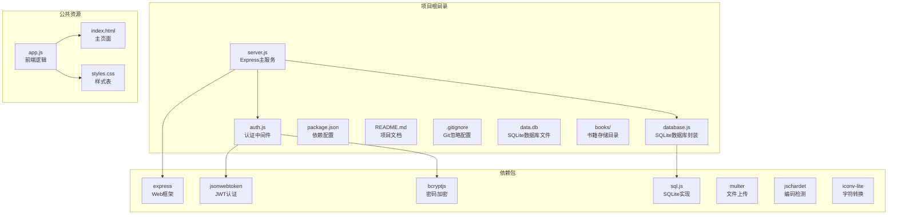
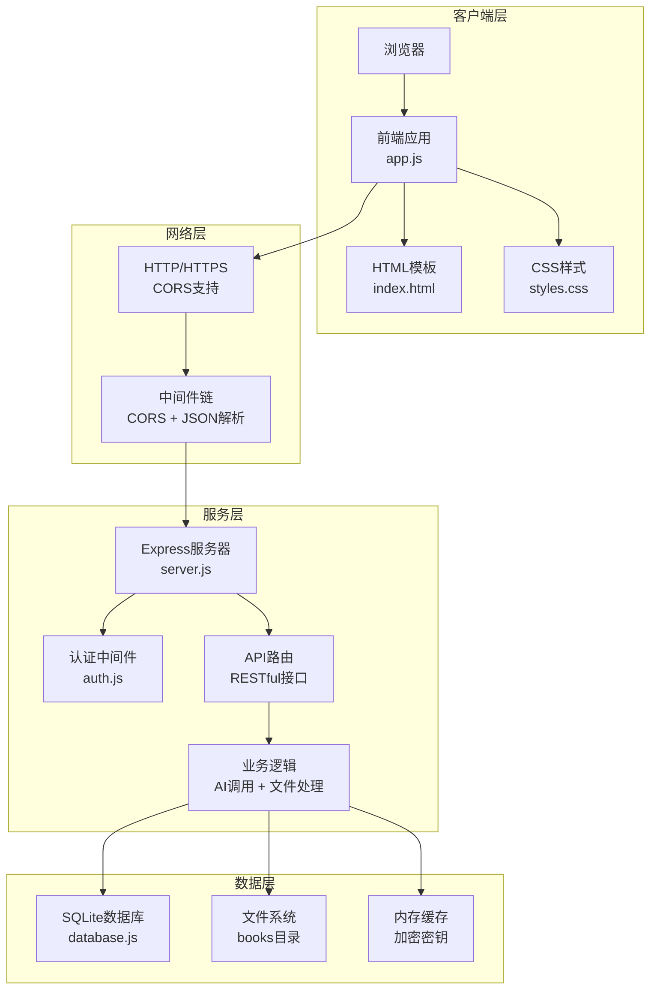
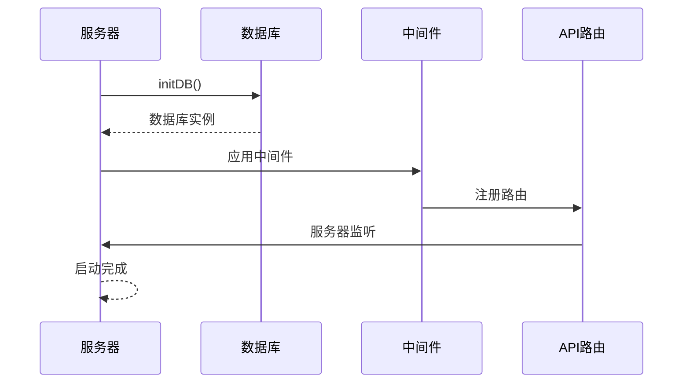
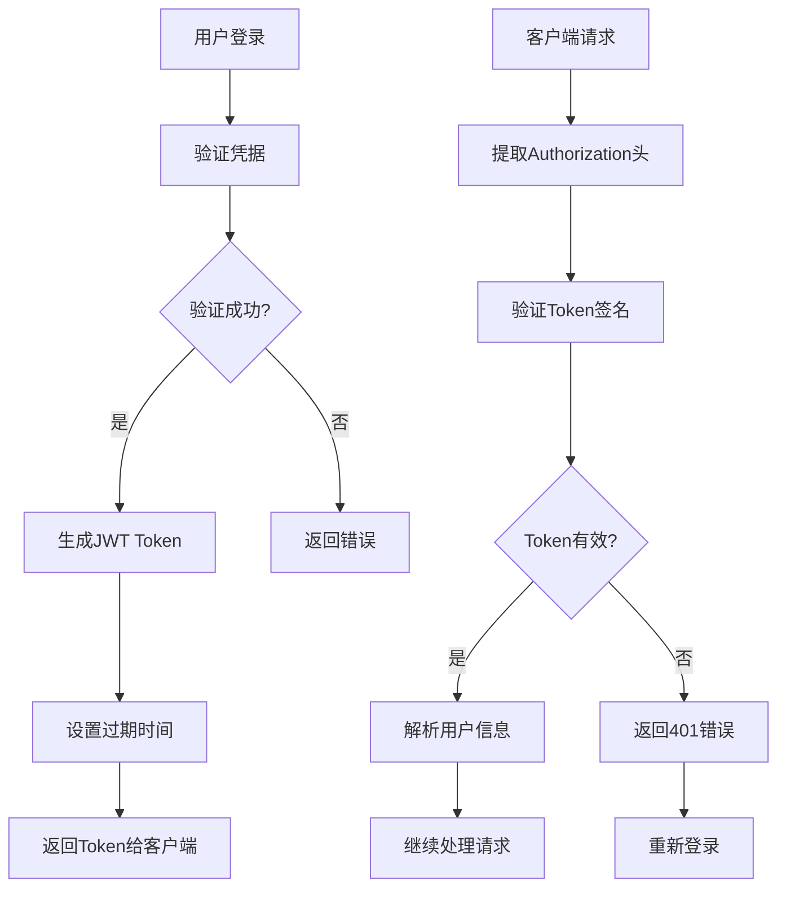
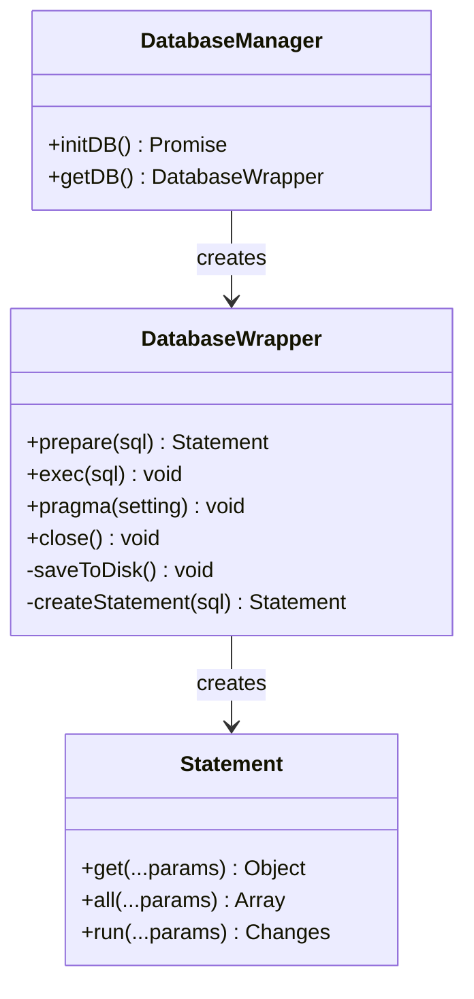
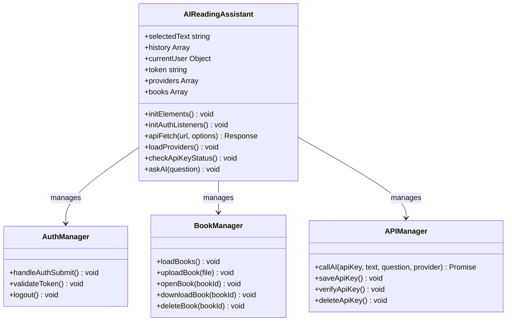
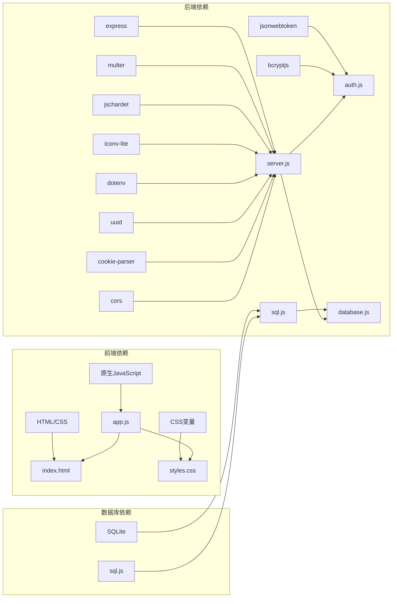

# 开发者指南

<cite>
**本文档引用的文件**
- [README.md](file://README.md)
- [package.json](file://package.json)
- [server.js](file://server.js)
- [auth.js](file://auth.js)
- [database.js](file://database.js)
- [public/app.js](file://public/app.js)
- [public/index.html](file://public/index.html)
- [public/styles.css](file://public/styles.css)
- [test.txt](file://test.txt)
</cite>

## 目录
1. [简介](#简介)
2. [项目结构](#项目结构)
3. [核心组件](#核心组件)
4. [架构概览](#架构概览)
5. [详细组件分析](#详细组件分析)
6. [依赖关系分析](#依赖关系分析)
7. [性能考虑](#性能考虑)
8. [故障排除指南](#故障排除指南)
9. [结论](#结论)
10. [附录](#附录)

## 简介

AI阅读助手是一个现代化的智能阅读应用，集成了多个AI服务提供商，帮助用户高效阅读和理解书籍内容。该项目采用前后端分离架构，后端使用Express.js提供RESTful API服务，前端使用原生JavaScript构建响应式用户界面。

### 主要特性

- **智能阅读**：支持TXT文件在线阅读，自动检测文件编码，生成文章目录
- **AI智能问答**：支持快捷操作和自定义问题，流式输出SSE技术
- **书架管理**：多格式支持（TXT、PDF、EPUB、MOBI），实时上传进度
- **用户系统**：JWT认证，密码安全存储，数据隔离
- **自定义AI提供商**：灵活添加OpenAI兼容API，模型管理

## 项目结构

项目采用模块化的文件组织结构，清晰分离了后端服务、前端资源和数据库文件。



**图表来源**
- [server.js:1-50](file://server.js#L1-L50)
- [package.json:10-22](file://package.json#L10-L22)

**章节来源**
- [README.md:210-232](file://README.md#L210-L232)
- [package.json:1-23](file://package.json#L1-L23)

## 核心组件

### 后端服务架构

后端采用Express.js框架，实现了RESTful API设计，支持JWT认证、文件上传、数据库操作等功能。

### 前端应用架构

前端使用原生JavaScript构建，实现了响应式UI设计，支持多视图切换、实时通信、状态管理等功能。

### 数据存储架构

使用SQLite数据库（通过sql.js实现纯JavaScript版本），支持用户数据、API密钥、书籍元数据等的持久化存储。

**章节来源**
- [server.js:15-40](file://server.js#L15-L40)
- [auth.js:1-80](file://auth.js#L1-L80)
- [database.js:1-146](file://database.js#L1-L146)

## 架构概览

系统采用客户端-服务器架构，前后端通过HTTP协议进行通信。



**图表来源**
- [server.js:30-80](file://server.js#L30-L80)
- [auth.js:14-27](file://auth.js#L14-L27)
- [database.js:69-138](file://database.js#L69-L138)

## 详细组件分析

### Express.js 后端服务

#### 服务器初始化与配置

服务器采用异步初始化模式，确保数据库连接建立后再启动服务。



**图表来源**
- [server.js:30-40](file://server.js#L30-L40)
- [server.js:882-892](file://server.js#L882-L892)

#### 中间件体系

系统实现了完整的中间件链，包括CORS支持、JSON解析、JWT认证等。

**章节来源**
- [server.js:33-40](file://server.js#L33-L40)
- [auth.js:14-27](file://auth.js#L14-L27)

### JWT 认证机制

#### Token生成与验证

JWT认证使用随机生成的密钥，支持7天短期登录和30天长期登录两种模式。



**图表来源**
- [auth.js:9-12](file://auth.js#L9-L12)
- [auth.js:19-26](file://auth.js#L19-L26)

**章节来源**
- [auth.js:9-27](file://auth.js#L9-L27)

### SQL.js 数据库集成

#### 数据库初始化与封装

使用sql.js实现纯JavaScript的SQLite数据库，支持WAL模式和外键约束。



**图表来源**
- [database.js:9-67](file://database.js#L9-L67)
- [database.js:140-143](file://database.js#L140-L143)

#### 数据库表结构设计

系统设计了完整的数据模型，支持用户、API密钥、自定义提供商、书籍元数据等。

**章节来源**
- [database.js:81-135](file://database.js#L81-L135)

### 前端应用架构

#### 应用状态管理

前端使用类封装的方式管理应用状态，实现了完整的单页应用架构。



**图表来源**
- [public/app.js:1-28](file://public/app.js#L1-L28)
- [public/app.js:166-184](file://public/app.js#L166-L184)

#### 流式AI响应处理

前端实现了完整的SSE（Server-Sent Events）流式响应处理机制。

**章节来源**
- [public/app.js:1423-1515](file://public/app.js#L1423-L1515)

### API 接口设计

#### 用户认证接口

| 方法 | 路径 | 说明 |
|------|------|------|
| POST | `/api/auth/register` | 注册新用户（username + password） |
| POST | `/api/auth/login` | 用户登录，返回 JWT token |
| GET | `/api/auth/me` | 获取当前登录用户信息 |

#### AI问答接口

| 方法 | 路径 | 说明 |
|------|------|------|
| POST | `/api/ask` | 非流式 AI 问答 |
| POST | `/api/ask-stream` | 流式 AI 问答（SSE） |

#### 密钥管理接口

| 方法 | 路径 | 说明 |
|------|------|------|
| GET | `/api/key/status` | 获取各提供商密钥状态 |
| POST | `/api/key/set` | 设置指定提供商的 API 密钥 |
| POST | `/api/key/verify` | 验证 API 密钥 |
| DELETE | `/api/key` | 删除指定提供商的 API 密钥 |

**章节来源**
- [README.md:164-209](file://README.md#L164-L209)

## 依赖关系分析

### 核心依赖关系



**图表来源**
- [package.json:10-22](file://package.json#L10-L22)
- [server.js:1-15](file://server.js#L1-L15)

### 模块耦合度分析

系统采用了良好的模块化设计，各模块之间耦合度较低：

- **server.js** 作为主入口，主要负责路由注册和中间件配置
- **auth.js** 独立处理认证逻辑，与业务逻辑解耦
- **database.js** 封装数据库操作，提供统一的数据访问接口
- **public/** 目录下的前端资源完全独立，通过API与后端通信

**章节来源**
- [package.json:10-22](file://package.json#L10-L22)

## 性能考虑

### 前端性能优化

1. **懒加载策略**：图片和大文件采用按需加载
2. **虚拟滚动**：大量书籍列表使用虚拟滚动减少DOM节点
3. **缓存机制**：本地存储用户偏好设置和API密钥状态
4. **事件委托**：使用事件委托减少事件处理器数量

### 后端性能优化

1. **数据库索引**：为常用查询字段建立索引
2. **连接池管理**：合理管理数据库连接
3. **文件上传优化**：支持断点续传和进度显示
4. **内存管理**：及时释放不再使用的资源

### 缓存策略

系统实现了多层次的缓存机制：
- **浏览器缓存**：静态资源使用适当的缓存头
- **API缓存**：热点数据缓存到内存中
- **数据库缓存**：使用WAL模式提高并发性能

## 故障排除指南

### 常见问题诊断

#### 认证相关问题

1. **Token过期**：检查JWT_SECRET配置和过期时间设置
2. **登录失败**：验证用户名密码是否正确，检查数据库连接
3. **权限不足**：确认Authorization头格式是否正确

#### 数据库相关问题

1. **数据库连接失败**：检查data.db文件权限和路径
2. **数据损坏**：尝试备份和重建数据库文件
3. **性能问题**：检查索引是否正确创建

#### 文件上传问题

1. **上传失败**：检查文件大小限制和格式支持
2. **编码问题**：验证文件编码检测逻辑
3. **存储空间不足**：监控books目录磁盘空间

**章节来源**
- [server.js:44-67](file://server.js#L44-L67)
- [database.js:69-80](file://database.js#L69-L80)

### 调试技巧

1. **启用详细日志**：在开发环境中增加console.log输出
2. **使用浏览器开发者工具**：监控网络请求和响应
3. **数据库调试**：使用SQLite命令行工具检查数据状态
4. **API测试**：使用curl或Postman测试API接口

## 结论

AI阅读助手项目展现了现代Web应用开发的最佳实践，采用了前后端分离架构、模块化设计和响应式UI设计。项目在技术选型上注重实用性，使用成熟的开源技术和库，确保了系统的稳定性和可维护性。

### 项目优势

1. **技术栈成熟**：Express.js、React、SQLite等都是经过验证的技术
2. **架构清晰**：模块化设计便于维护和扩展
3. **用户体验优秀**：响应式设计和流畅的交互体验
4. **安全性考虑**：JWT认证、密码加密、数据隔离等安全措施

### 改进建议

1. **增加单元测试**：为关键业务逻辑添加自动化测试
2. **API文档完善**：使用Swagger等工具生成API文档
3. **错误处理增强**：增加更详细的错误分类和处理机制
4. **性能监控**：集成性能监控和日志分析工具

## 附录

### 开发环境搭建

#### 系统要求

- Node.js >= 18.0.0
- npm >= 9.0.0

#### 安装步骤

```bash
# 克隆项目
git clone <your-repo-url>
cd trae02airead

# 安装依赖
npm install

# 启动开发服务器
npm run dev

# 或启动生产服务器
npm start
```

#### 环境变量配置

```env
# 固定加密密钥（可选）
ENCRYPTION_KEY=your_64_char_hex_key

# AI提供商API Key（可选）
ZHIPU_API_KEY=your_zhipu_key
SILICONFLOW_API_KEY=your_siliconflow_key
CUSTOM_API_KEY=your_custom_key

# 服务端口（默认 3000）
PORT=3000
```

### API 使用示例

#### 用户认证流程

```javascript
// 注册用户
fetch('/api/auth/register', {
    method: 'POST',
    headers: {'Content-Type': 'application/json'},
    body: JSON.stringify({username: 'test', password: 'password'})
})

// 用户登录
fetch('/api/auth/login', {
    method: 'POST',
    headers: {'Content-Type': 'application/json'},
    body: JSON.stringify({username: 'test', password: 'password', rememberMe: false})
})

// 获取用户信息
fetch('/api/auth/me', {
    headers: {'Authorization': 'Bearer YOUR_TOKEN'}
})
```

### 贡献指南

#### 代码规范

1. **JavaScript规范**：使用ES6+语法，遵循Airbnb代码风格
2. **注释规范**：为复杂逻辑添加详细注释
3. **错误处理**：每个异步操作都要有错误处理
4. **安全性**：所有用户输入都要进行验证和清理

#### 提交规范

1. **分支命名**：feature/功能名称、bugfix/问题描述
2. **提交信息**：使用动词开头的简洁描述
3. **代码审查**：所有变更都需要代码审查
4. **测试覆盖**：新增功能必须包含测试用例

#### 开发流程

1. Fork项目
2. 创建功能分支
3. 编写代码和测试
4. 提交Pull Request
5. 代码审查和合并