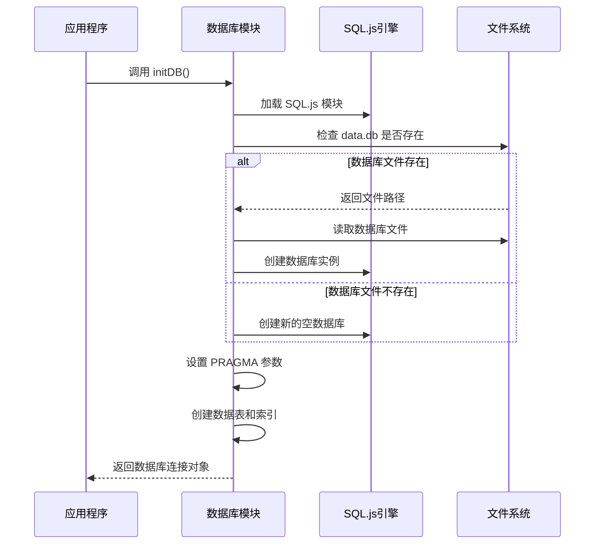
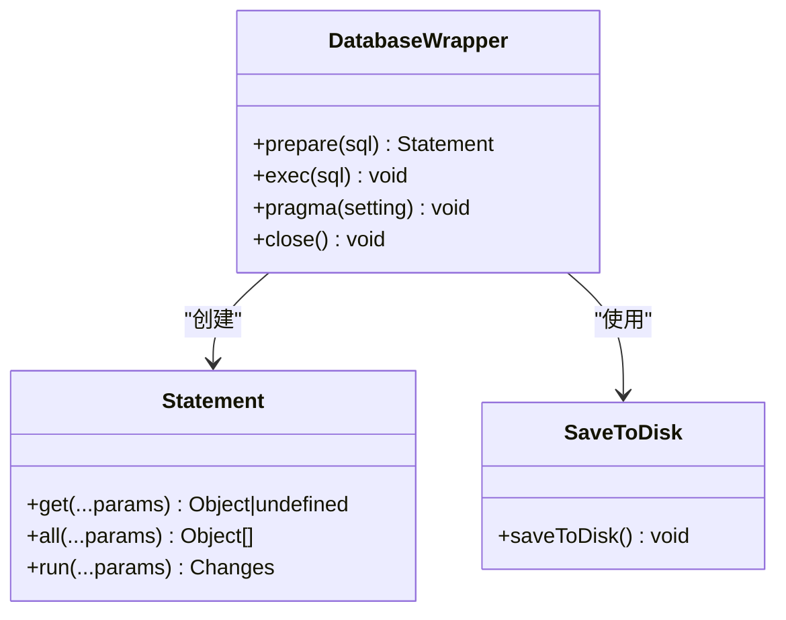
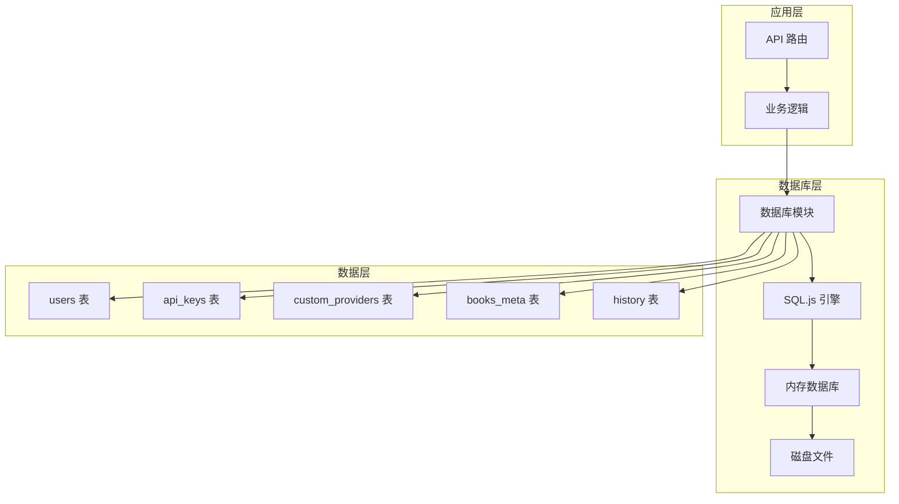
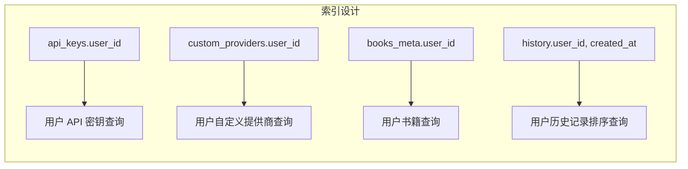
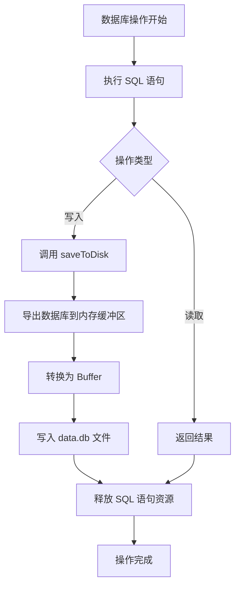
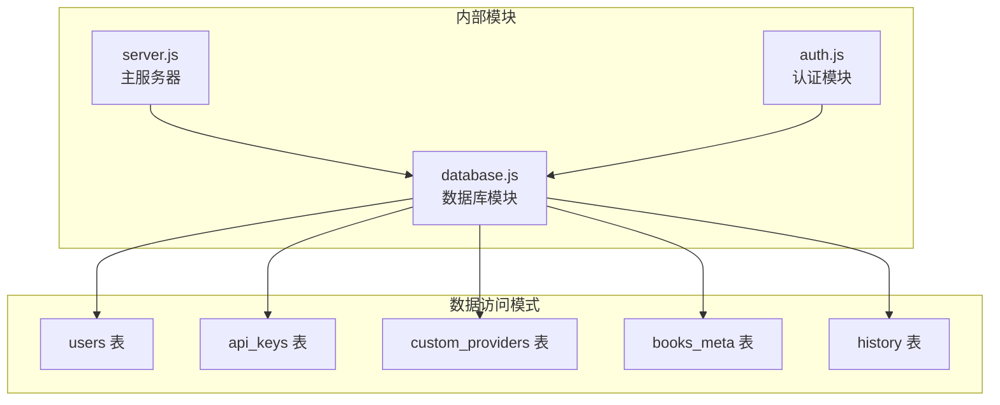

# 数据库模块 (database.js) 技术文档

<cite>
**本文档引用的文件**
- [database.js](file://database.js)
- [package.json](file://package.json)
- [README.md](file://README.md)
- [server.js](file://server.js)
- [auth.js](file://auth.js)
</cite>

## 目录
1. [简介](#简介)
2. [项目结构](#项目结构)
3. [核心组件](#核心组件)
4. [架构概览](#架构概览)
5. [详细组件分析](#详细组件分析)
6. [依赖关系分析](#依赖关系分析)
7. [性能考虑](#性能考虑)
8. [故障排除指南](#故障排除指南)
9. [结论](#结论)

## 简介

trae02airead 项目采用 SQL.js 作为纯 JavaScript 实现的 SQLite 数据库解决方案，实现了完整的用户认证、API 密钥管理、书籍元数据存储和对话历史记录功能。该数据库模块提供了轻量级、无依赖的本地数据库存储方案，特别适合小型到中型的应用程序。

## 项目结构

该项目采用简洁的单页应用程序架构，数据库模块位于根目录下的 database.js 文件中，与主要的服务器逻辑分离。

```mermaid
graph TB
subgraph "项目结构"
A[database.js<br/>数据库模块] --> B[SQL.js<br/>SQLite 引擎]
C[server.js<br/>主服务器] --> D[auth.js<br/>认证模块]
E[package.json<br/>依赖配置] --> F[sql.js@1.12.0]
G[README.md<br/>项目文档] --> H[数据库设计说明]
end
subgraph "数据库文件"
I[data.db<br/>SQLite 数据库文件]
J[books/<br/>书籍存储目录]
end
A --> I
C --> A
```

**图表来源**
- [database.js:1-146](file://database.js#L1-L146)
- [package.json:10-22](file://package.json#L10-L22)

**章节来源**
- [database.js:1-146](file://database.js#L1-L146)
- [package.json:1-23](file://package.json#L1-L23)

## 核心组件

### 数据库初始化流程

数据库模块的核心是 `initDB()` 函数，它负责初始化 SQL.js 引擎并建立数据库连接：



**图表来源**
- [database.js:69-138](file://database.js#L69-L138)

### 数据库连接管理

数据库连接通过包装器模式实现，提供统一的接口来管理数据库操作：



**图表来源**
- [database.js:9-67](file://database.js#L9-L67)

**章节来源**
- [database.js:69-138](file://database.js#L69-L138)
- [database.js:9-67](file://database.js#L9-L67)

## 架构概览

数据库模块采用三层架构设计：

1. **初始化层**：负责数据库引擎加载和连接建立
2. **封装层**：提供统一的数据库操作接口
3. **持久化层**：确保数据变更及时保存到磁盘文件



**图表来源**
- [database.js:81-135](file://database.js#L81-L135)
- [server.js:12-13](file://server.js#L12-L13)

## 详细组件分析

### 数据模型设计

#### Users 表 (用户表)

Users 表存储用户基本信息，采用 UUID 作为主键，确保全局唯一性：

| 字段名 | 数据类型 | 约束条件 | 描述 |
|--------|----------|----------|------|
| id | TEXT | PRIMARY KEY | 用户唯一标识符 (UUID) |
| username | TEXT | NOT NULL, UNIQUE | 用户名，唯一约束 |
| password_hash | TEXT | NOT NULL | bcrypt 加密后的密码 |
| created_at | TEXT | DEFAULT (datetime('now')) | 创建时间戳 |

#### API Keys 表 (API 密钥表)

API Keys 表存储用户配置的各种 AI 提供商的 API 密钥：

| 字段名 | 数据类型 | 约束条件 | 描述 |
|--------|----------|----------|------|
| id | INTEGER | PRIMARY KEY AUTOINCREMENT | 自增主键 |
| user_id | TEXT | NOT NULL, REFERENCES users(id) | 外键关联用户 |
| provider | TEXT | NOT NULL | AI 提供商标识符 |
| encrypted_key | TEXT | NOT NULL | 加密存储的 API 密钥 |
| masked_key | TEXT | - | 部分隐藏的密钥显示 |
| last_updated | TEXT | DEFAULT (datetime('now')) | 最后更新时间 |
| UNIQUE(user_id, provider) | - | - | 用户和提供商组合唯一 |

#### Custom Providers 表 (自定义提供商表)

Custom Providers 表存储用户自定义的 AI 提供商配置：

| 字段名 | 数据类型 | 约束条件 | 描述 |
|--------|----------|----------|------|
| id | TEXT | NOT NULL, PRIMARY KEY | 提供商唯一标识符 |
| user_id | TEXT | NOT NULL, REFERENCES users(id) | 外键关联用户 |
| name | TEXT | NOT NULL | 提供商显示名称 |
| api_endpoint | TEXT | NOT NULL | API 端点地址 |
| default_model | TEXT | NOT NULL | 默认模型名称 |
| models | TEXT | - | 可选模型列表 (JSON) |
| created_at | TEXT | DEFAULT (datetime('now')) | 创建时间 |
| updated_at | TEXT | - | 更新时间 |
| PRIMARY KEY (id, user_id) | - | - | 复合主键 |

#### Books Meta 表 (书籍元数据表)

Books Meta 表存储用户上传书籍的元数据信息：

| 字段名 | 数据类型 | 约束条件 | 描述 |
|--------|----------|----------|------|
| id | TEXT | NOT NULL, PRIMARY KEY | 书籍唯一标识符 (UUID) |
| user_id | TEXT | NOT NULL, REFERENCES users(id) | 外键关联用户 |
| title | TEXT | NOT NULL | 书籍标题 |
| filename | TEXT | NOT NULL | 文件在服务器上的存储名 |
| original_name | TEXT | NOT NULL | 原始文件名 |
| format | TEXT | NOT NULL | 文件格式 (TXT/PDF/EPUB/MOBI) |
| size | INTEGER | NOT NULL | 文件大小 (字节) |
| size_formatted | TEXT | NOT NULL | 格式化的文件大小 |
| upload_time | TEXT | DEFAULT (datetime('now')) | 上传时间 |
| author | TEXT | DEFAULT '未知' | 作者信息 |
| last_read | TEXT | - | 最后阅读时间 |
| read_progress | REAL | DEFAULT 0 | 阅读进度 (0-100) |
| PRIMARY KEY (id, user_id) | - | - | 复合主键 |

#### History 表 (历史记录表)

History 表存储用户的 AI 问答历史记录：

| 字段名 | 数据类型 | 约束条件 | 描述 |
|--------|----------|----------|------|
| id | INTEGER | PRIMARY KEY AUTOINCREMENT | 自增主键 |
| user_id | TEXT | NOT NULL, REFERENCES users(id) | 外键关联用户 |
| selected_text | TEXT | - | 用户选中的文本内容 |
| question | TEXT | NOT NULL | 用户的问题 |
| answer | TEXT | NOT NULL | AI 的回答 |
| created_at | TEXT | DEFAULT (datetime('now')) | 创建时间 |

**章节来源**
- [database.js:82-130](file://database.js#L82-L130)

### 查询执行机制

数据库模块提供了三种主要的查询执行方法：

#### 单行查询 (get)
用于获取单个结果对象，适用于 `SELECT` 查询：

```javascript
// 使用示例
const user = db.prepare('SELECT * FROM users WHERE id = ?').get(userId);
```

#### 多行查询 (all)
用于获取所有匹配的结果数组：

```javascript
// 使用示例
const books = db.prepare('SELECT * FROM books_meta WHERE user_id = ?').all(userId);
```

#### 写入操作 (run)
用于执行插入、更新、删除等写入操作：

```javascript
// 使用示例
db.prepare('INSERT INTO users (id, username, password_hash) VALUES (?, ?, ?)').run(userId, username, hash);
```

**章节来源**
- [database.js:16-51](file://database.js#L16-L51)

### 索引设计

为了优化查询性能，数据库模块创建了以下索引：



**图表来源**
- [database.js:131-134](file://database.js#L131-L134)

**章节来源**
- [database.js:131-134](file://database.js#L131-L134)

### 事务处理机制

数据库模块通过 `saveToDisk()` 方法实现自动事务持久化：



**图表来源**
- [database.js:10-14](file://database.js#L10-L14)

**章节来源**
- [database.js:10-14](file://database.js#L10-L14)

## 依赖关系分析

### 外部依赖

项目的主要外部依赖包括：

```mermaid
graph TB
subgraph "核心依赖"
A[sql.js@1.12.0<br/>SQLite 纯 JavaScript 实现]
B[bcryptjs@3.0.3<br/>密码哈希]
C[jsonwebtoken@9.0.3<br/>JWT 认证]
end
subgraph "开发依赖"
D[express@4.18.2<br/>Web 服务器框架]
E[multer@1.4.5<br/>文件上传]
F[jschardet@3.0.0<br/>编码检测]
end
subgraph "数据库模块"
G[database.js<br/>数据库封装]
H[auth.js<br/>认证模块]
I[server.js<br/>主服务器]
end
G --> A
H --> B
H --> C
I --> D
I --> E
I --> F
```

**图表来源**
- [package.json:10-22](file://package.json#L10-L22)

**章节来源**
- [package.json:10-22](file://package.json#L10-L22)

### 内部模块依赖



**图表来源**
- [server.js:12-13](file://server.js#L12-L13)
- [auth.js:5](file://auth.js#L5)

**章节来源**
- [server.js:12-13](file://server.js#L12-L13)
- [auth.js:5](file://auth.js#L5)

## 性能考虑

### 内存管理

SQL.js 将整个数据库加载到内存中，这提供了快速的查询性能，但也意味着：

- **内存占用**：数据库大小直接影响内存使用量
- **启动时间**：需要从磁盘加载整个数据库到内存
- **并发限制**：单实例模式限制了并发访问能力

### 查询优化策略

1. **索引使用**：为常用查询字段创建索引
2. **参数绑定**：使用参数化查询防止 SQL 注入
3. **批量操作**：合并多个相关操作减少磁盘 I/O
4. **结果集限制**：对大数据集查询使用 LIMIT 子句

### 缓存策略

虽然数据库模块本身没有实现额外的缓存层，但可以通过以下方式优化：

- **连接复用**：避免重复初始化数据库连接
- **查询结果缓存**：对频繁访问的只读数据进行内存缓存
- **文件系统缓存**：利用操作系统文件系统缓存机制

## 故障排除指南

### 常见问题及解决方案

#### 数据库初始化失败

**症状**：应用启动时报错，提示数据库未初始化

**原因**：
- SQL.js 模块加载失败
- data.db 文件损坏
- 文件权限问题

**解决方案**：
1. 检查 sql.js 依赖是否正确安装
2. 验证 data.db 文件是否存在且可读
3. 确认应用程序具有文件读写权限

#### 数据持久化问题

**症状**：应用重启后数据丢失

**原因**：
- 磁盘空间不足
- 文件写入权限问题
- 程序异常退出导致未保存

**解决方案**：
1. 检查磁盘空间和权限
2. 确保应用程序正常关闭
3. 定期备份 data.db 文件

#### 查询性能问题

**症状**：查询响应缓慢

**原因**：
- 缺少必要的索引
- 查询语句效率低下
- 数据库过大

**解决方案**：
1. 分析慢查询并添加适当索引
2. 优化复杂的 JOIN 查询
3. 考虑数据归档策略

**章节来源**
- [database.js:140-143](file://database.js#L140-L143)
- [README.md:102](file://README.md#L102)

## 结论

trae02airead 项目的数据库模块展现了优秀的架构设计，通过 SQL.js 实现了轻量级、无依赖的本地数据库解决方案。该模块具有以下特点：

### 优势
- **简单易用**：API 设计简洁直观
- **零配置**：自动初始化和管理数据库
- **安全性**：内置 SQL 注入防护
- **可靠性**：自动数据持久化机制

### 局限性
- **内存限制**：受系统内存容量限制
- **并发限制**：单实例模式不适合高并发场景
- **备份复杂**：需要定期手动备份 data.db 文件

### 改进建议
1. **监控指标**：添加数据库使用情况监控
2. **自动备份**：实现定时自动备份功能
3. **连接池**：考虑实现连接池管理
4. **性能监控**：添加查询性能分析工具

该数据库模块为小型到中型应用程序提供了可靠的本地数据存储解决方案，特别适合需要快速部署和简单维护的场景。