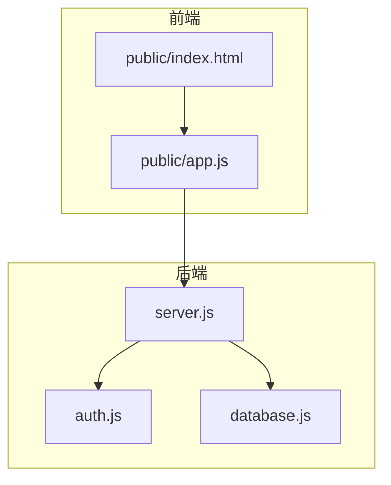
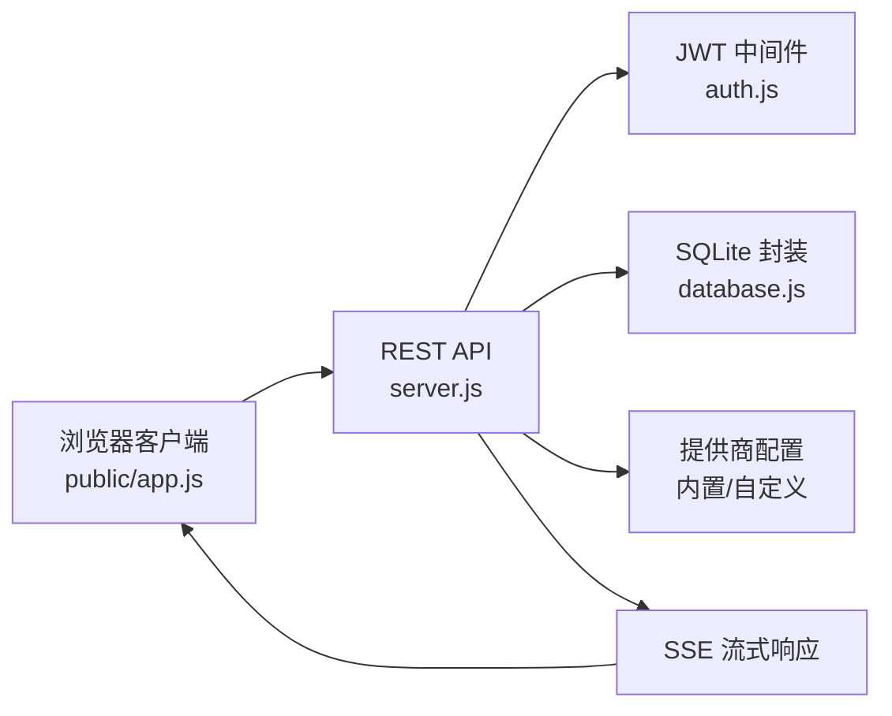
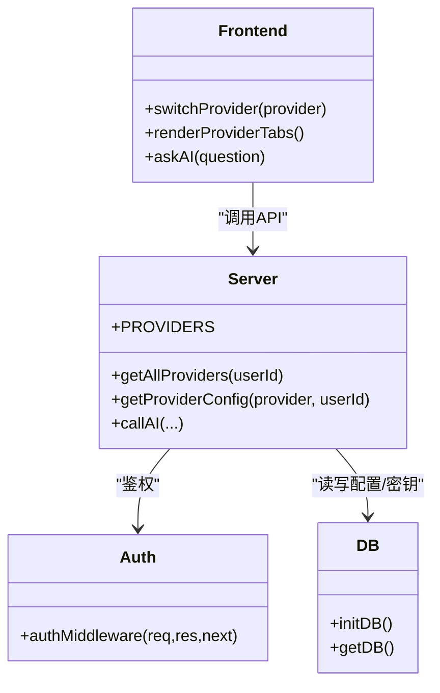
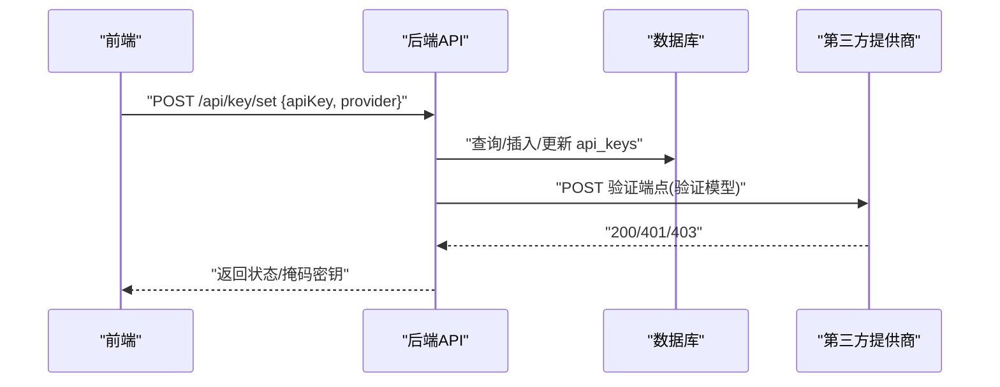
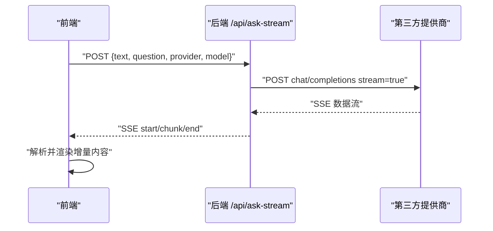
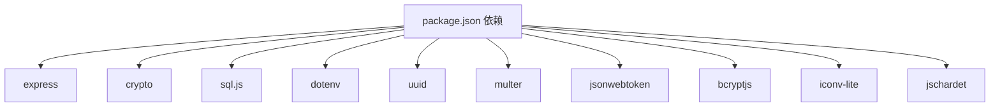

# AI 问答集成

<cite>
**本文引用的文件**
- [server.js](file://server.js)
- [auth.js](file://auth.js)
- [database.js](file://database.js)
- [package.json](file://package.json)
- [README.md](file://README.md)
- [public/app.js](file://public/app.js)
- [public/index.html](file://public/index.html)
</cite>

## 目录
1. [简介](#简介)
2. [项目结构](#项目结构)
3. [核心组件](#核心组件)
4. [架构总览](#架构总览)
5. [详细组件分析](#详细组件分析)
6. [依赖关系分析](#依赖关系分析)
7. [性能考量](#性能考量)
8. [故障排查指南](#故障排查指南)
9. [结论](#结论)
10. [附录](#附录)

## 简介
本项目为“AI阅读助手”，提供多提供商 AI 问答能力，支持内置提供商（智谱AI、硅基流动）以及自定义提供商。后端采用 Node.js + Express，前端为原生 JavaScript，后端负责：
- 多提供商配置与切换
- API 密钥的加密存储、验证与环境变量回退
- 流式响应（SSE）与非流式响应
- 用户认证与数据隔离
- 书籍上传与阅读

前端负责：
- 用户界面与交互
- 与后端 API 的对接（含 SSE）
- 提供商与模型选择
- 历史记录展示与保存

## 项目结构
- 后端入口：server.js
- 认证模块：auth.js
- 数据库封装：database.js（SQLite + sql.js）
- 前端静态资源：public/
- 依赖与脚本：package.json
- 说明文档：README.md

图表来源
- [server.js:1-899](file://server.js#L1-L899)
- [auth.js:1-80](file://auth.js#L1-L80)
- [database.js:1-146](file://database.js#L1-L146)
- [public/index.html:1-436](file://public/index.html#L1-L436)
- [public/app.js:1-1659](file://public/app.js#L1-L1659)

章节来源
- [server.js:1-899](file://server.js#L1-L899)
- [auth.js:1-80](file://auth.js#L1-L80)
- [database.js:1-146](file://database.js#L1-L146)
- [README.md:210-232](file://README.md#L210-L232)

## 核心组件
- 多提供商配置与路由
  - 内置提供商：智谱AI、硅基流动
  - 自定义提供商：支持动态添加、更新、删除
- API 密钥管理
  - 加密存储（AES-256-CBC）
  - 验证流程（调用提供商验证端点）
  - 环境变量回退（ZHIPU_API_KEY、SILICONFLOW_API_KEY、AI_API_KEY、CUSTOM_API_KEY）
- 流式响应（SSE）
  - 后端：Server-Sent Events 输出
  - 前端：ReadableStream 逐块解析
- 用户认证与数据隔离
  - JWT 中间件
  - 用户维度的数据隔离（用户表、API 密钥表、自定义提供商表、书籍元数据表）

章节来源
- [server.js:163-205](file://server.js#L163-L205)
- [server.js:237-332](file://server.js#L237-L332)
- [server.js:618-688](file://server.js#L618-L688)
- [server.js:690-827](file://server.js#L690-L827)
- [auth.js:14-27](file://auth.js#L14-L27)
- [database.js:81-135](file://database.js#L81-L135)

## 架构总览
后端通过 Express 提供 REST API，前端通过 fetch 与 SSE 与后端交互。认证采用 JWT，API 密钥采用本地加密存储，支持内置与自定义提供商。

图表来源
- [server.js:1-899](file://server.js#L1-L899)
- [auth.js:1-80](file://auth.js#L1-L80)
- [database.js:1-146](file://database.js#L1-L146)
- [public/app.js:1423-1515](file://public/app.js#L1423-L1515)

## 详细组件分析

### 多提供商与自定义提供商支持
- 内置提供商配置
  - 智谱AI：默认模型、端点、模型列表
  - 硅基流动：默认模型、端点、模型列表
- 自定义提供商
  - 动态添加：POST /api/providers
  - 更新：PUT /api/providers/:id
  - 删除：DELETE /api/providers/:id
  - 列表：GET /api/providers
- 提供商选择与模型切换
  - 前端提供提供商标签页与模型下拉
  - 本地存储当前选择（localStorage）

图表来源
- [server.js:163-205](file://server.js#L163-L205)
- [server.js:334-461](file://server.js#L334-L461)
- [auth.js:14-27](file://auth.js#L14-L27)
- [database.js:69-138](file://database.js#L69-L138)
- [public/app.js:217-341](file://public/app.js#L217-L341)

章节来源
- [server.js:163-205](file://server.js#L163-L205)
- [server.js:334-461](file://server.js#L334-L461)
- [public/app.js:217-341](file://public/app.js#L217-L341)

### API 密钥管理（加密存储、验证、环境变量回退）
- 加密存储
  - AES-256-CBC，IV + 密文拼接
  - 存储字段：provider、encrypted_key、masked_key、last_updated
- 验证流程
  - 调用提供商验证端点（validateEndpoint/validateModel）
  - 401/403 视为无效，400 或其他 OK 视为有效
- 环境变量回退
  - ZHIPU_API_KEY、SILICONFLOW_API_KEY、AI_API_KEY、CUSTOM_API_KEY
- 前端交互
  - 设置：POST /api/key/set
  - 验证：POST /api/key/verify
  - 删除：DELETE /api/key
  - 状态查询：GET /api/key/status

图表来源
- [server.js:260-295](file://server.js#L260-L295)
- [server.js:297-316](file://server.js#L297-L316)
- [server.js:237-332](file://server.js#L237-L332)
- [server.js:212-235](file://server.js#L212-L235)

章节来源
- [server.js:44-67](file://server.js#L44-L67)
- [server.js:212-235](file://server.js#L212-L235)
- [server.js:237-332](file://server.js#L237-L332)
- [README.md:105-120](file://README.md#L105-L120)

### 流式响应处理（SSE）
- 后端
  - 设置响应头：Content-Type: text/event-stream，Cache-Control: no-cache，Connection: keep-alive
  - 发送 start/end/chunk 事件
  - 读取 fetch 响应体的 ReadableStream，按行解析
- 前端
  - 使用 fetch(response.body.getReader()) 逐块读取
  - 解析 data: 行，渲染增量内容
  - 连接超时控制：AbortController + setTimeout(60000)

图表来源
- [server.js:690-827](file://server.js#L690-L827)
- [public/app.js:1423-1515](file://public/app.js#L1423-L1515)

章节来源
- [server.js:690-827](file://server.js#L690-L827)
- [public/app.js:1423-1515](file://public/app.js#L1423-L1515)

### 非流式问答
- 后端
  - 调用提供商接口，等待完整响应
  - 返回 answer、model、provider
- 前端
  - POST /api/ask
  - 渲染完整答案

章节来源
- [server.js:829-880](file://server.js#L829-L880)
- [public/app.js:1423-1515](file://public/app.js#L1423-L1515)

### 用户认证与数据隔离
- JWT 中间件
  - Authorization: Bearer <token>
  - 登录/注册返回 token
- 数据隔离
  - 用户表、API 密钥表、自定义提供商表、书籍元数据表均按 user_id 关联
  - 历史记录表按 user_id 关联

章节来源
- [auth.js:14-27](file://auth.js#L14-L27)
- [auth.js:29-77](file://auth.js#L29-L77)
- [database.js:81-135](file://database.js#L81-L135)

## 依赖关系分析
- 后端依赖
  - Express、CORS、Multer、UUID、crypto、jschardet/iconv-lite、dotenv、sql.js
- 前端交互
  - fetch、ReadableStream、AbortController
- 数据库
  - SQLite（sql.js），WAL 模式，外键约束

图表来源
- [package.json:10-22](file://package.json#L10-L22)

章节来源
- [package.json:10-22](file://package.json#L10-L22)
- [database.js:69-80](file://database.js#L69-L80)

## 性能考量
- 连接超时
  - 后端/前端均设置 60 秒超时（AbortController + setTimeout）
- 流式传输
  - SSE 逐块传输，前端增量渲染，降低首屏延迟
- 数据库
  - WAL 模式提升并发写入性能
  - 索引：api_keys(user_id)、custom_providers(user_id)、books_meta(user_id)、history(user_id, created_at DESC)
- 编码处理
  - jschardet + iconv-lite 自动检测与转换，避免乱码与二次解码失败
- 并发控制
  - 当前实现未显式引入连接池或并发队列，建议在生产环境考虑：
    - 对第三方提供商调用增加速率限制与重试
    - 对数据库写入使用事务批量提交
    - 对 SSE 连接进行超时与断线重连策略

章节来源
- [server.js:731-732](file://server.js#L731-L732)
- [server.js:834-835](file://server.js#L834-L835)
- [public/app.js:1461-1475](file://public/app.js#L1461-L1475)
- [database.js:78-80](file://database.js#L78-L80)
- [database.js:131-134](file://database.js#L131-L134)

## 故障排查指南
- API 密钥相关
  - 未配置密钥：后端返回 needApiKey，前端引导配置
  - 密钥无效：401 错误，提示重新配置
  - 验证失败：后端调用验证端点返回 401/403 或非 200，前端提示
- 流式响应异常
  - 连接中断：前端捕获异常并显示错误
  - 超时：60 秒超时后终止
- 数据库问题
  - 初始化失败：检查 data.db 是否可写
  - 查询异常：确认索引与表结构是否存在
- 前端交互
  - 401：自动登出并提示重新登录
  - 网络错误：提示检查服务器状态

章节来源
- [server.js:659-687](file://server.js#L659-L687)
- [server.js:767-772](file://server.js#L767-L772)
- [server.js:818-826](file://server.js#L818-L826)
- [auth.js:14-27](file://auth.js#L14-L27)
- [database.js:69-80](file://database.js#L69-L80)

## 结论
本项目提供了完整的多提供商 AI 问答集成方案，具备以下特点：
- 内置与自定义提供商灵活切换
- 本地加密存储 API 密钥，支持环境变量回退
- SSE 流式响应，提供良好的用户体验
- 前后端分离，JWT 认证与数据隔离
建议在生产环境中进一步完善：
- 引入连接池与重试机制
- 增强错误监控与日志
- 对第三方接口调用增加限流与熔断

## 附录

### API 接口概览
- 用户认证
  - POST /api/auth/register
  - POST /api/auth/login
  - GET /api/auth/me
- 密钥管理
  - GET /api/key/status
  - POST /api/key/set
  - POST /api/key/verify
  - DELETE /api/key
- 提供商管理
  - GET /api/providers
  - POST /api/providers
  - PUT /api/providers/:id
  - DELETE /api/providers/:id
- 问答接口
  - POST /api/ask（非流式）
  - POST /api/ask-stream（SSE 流式）

章节来源
- [README.md:162-198](file://README.md#L162-L198)