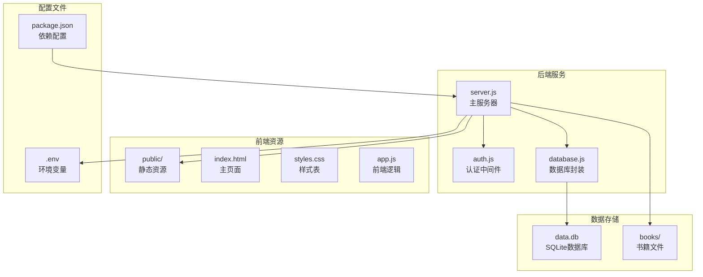
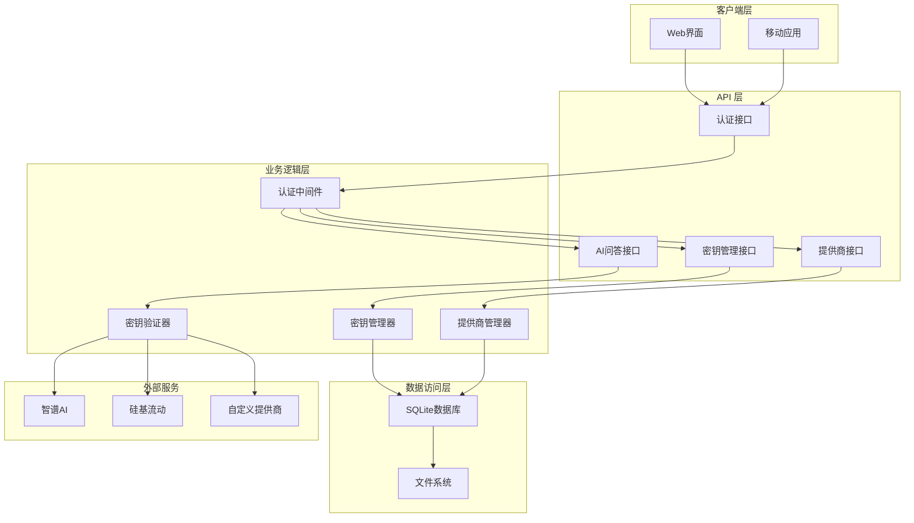
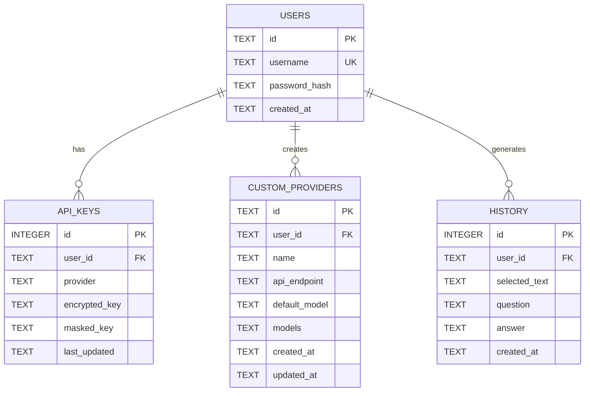
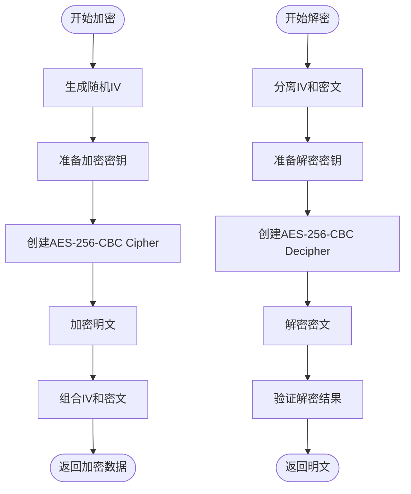
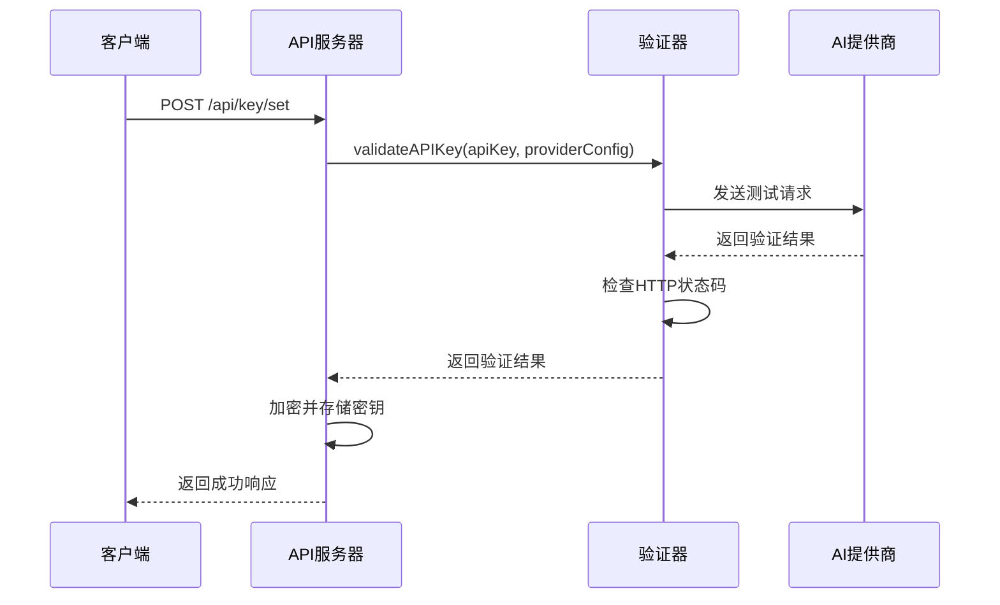
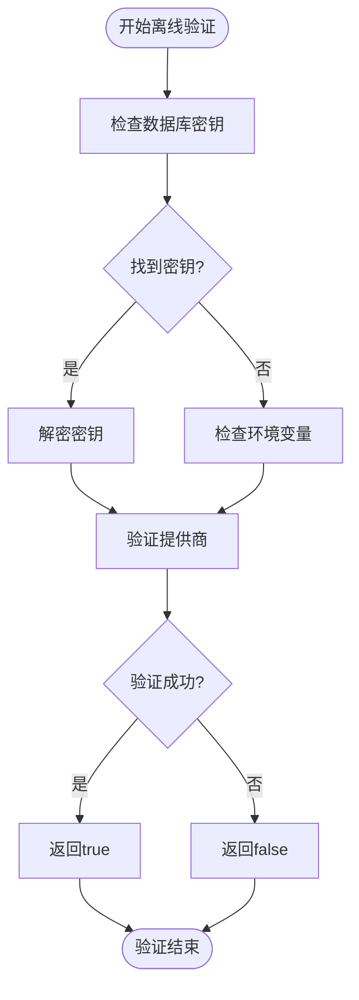
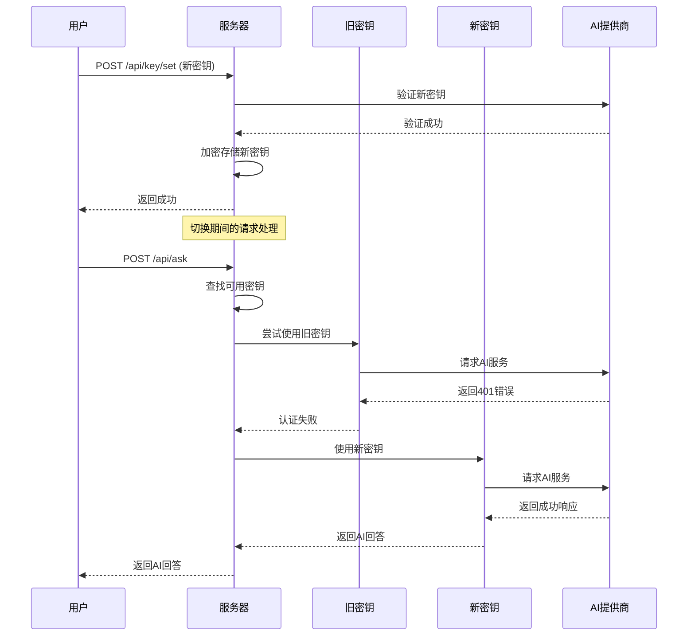
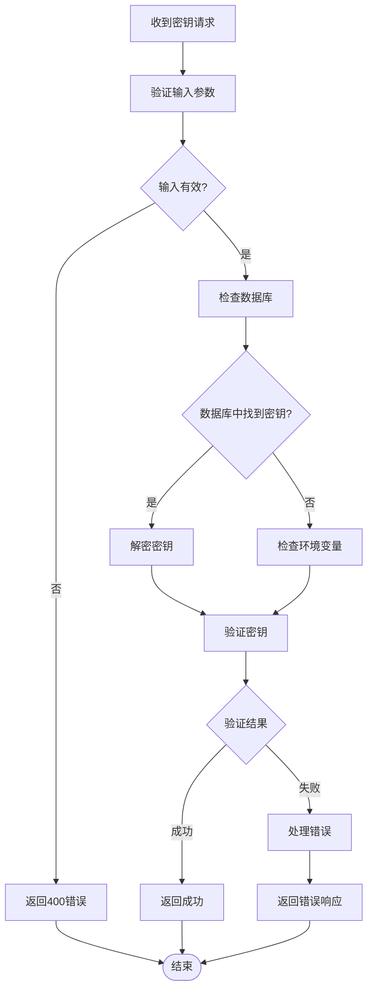
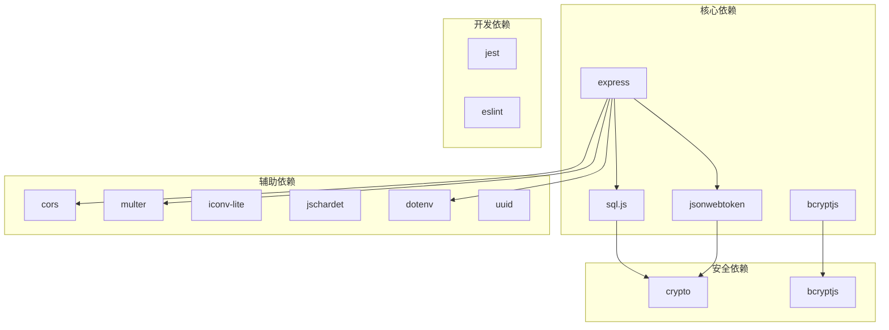

# API 密钥管理

<cite>
**本文档引用的文件**
- [server.js](file://server.js)
- [auth.js](file://auth.js)
- [database.js](file://database.js)
- [package.json](file://package.json)
- [README.md](file://README.md)
</cite>

## 目录
1. [简介](#简介)
2. [项目结构](#项目结构)
3. [核心组件](#核心组件)
4. [架构概览](#架构概览)
5. [详细组件分析](#详细组件分析)
6. [依赖关系分析](#依赖关系分析)
7. [性能考虑](#性能考虑)
8. [故障排除指南](#故障排除指南)
9. [结论](#结论)

## 简介

trae02airead 是一个集成了多 AI 服务提供商的智能阅读应用，其 API 密钥管理系统是整个系统的核心安全组件。该系统实现了完整的 API 密钥生命周期管理，包括存储加密、验证流程和密钥轮换机制。

系统支持两种主要的密钥存储方式：
- **用户专属密钥存储**：每个用户独立的 API 密钥，存储在本地 SQLite 数据库中
- **全局密钥配置**：通过环境变量配置的全局 API 密钥，适用于所有用户

## 项目结构

该项目采用模块化的 Node.js 架构，主要文件组织如下：



**图表来源**
- [server.js:1-15](file://server.js#L1-L15)
- [database.js:1-10](file://database.js#L1-L10)
- [package.json:1-23](file://package.json#L1-L23)

**章节来源**
- [server.js:1-15](file://server.js#L1-L15)
- [database.js:1-10](file://database.js#L1-L10)
- [package.json:1-23](file://package.json#L1-L23)

## 核心组件

### 加密引擎

系统使用 AES-256-CBC 对称加密算法来保护 API 密钥的安全存储。加密密钥由 `ENCRYPTION_KEY` 环境变量提供，默认情况下每次启动时会生成新的随机密钥。

### 认证中间件

基于 JWT 的认证系统确保只有经过身份验证的用户才能访问 API 密钥管理功能。认证中间件检查请求头中的 Authorization 头部并验证 JWT 令牌的有效性。

### 数据库层

使用 sql.js 库实现的 SQLite 数据库存储所有用户数据，包括 API 密钥、用户信息和书籍元数据。数据库采用 WAL 模式以提高并发性能。

**章节来源**
- [server.js:44-67](file://server.js#L44-L67)
- [auth.js:14-27](file://auth.js#L14-L27)
- [database.js:69-138](file://database.js#L69-L138)

## 架构概览

API 密钥管理系统采用分层架构设计，确保了安全性、可扩展性和易维护性：



**图表来源**
- [server.js:37-42](file://server.js#L37-L42)
- [server.js:163-188](file://server.js#L163-L188)
- [server.js:239-332](file://server.js#L239-L332)

## 详细组件分析

### 密钥存储架构

系统实现了双重密钥存储机制，确保灵活性和安全性：



**图表来源**
- [database.js:81-135](file://database.js#L81-L135)

#### 加密算法实现

系统使用 AES-256-CBC 对称加密算法，具有以下特点：

- **密钥长度**：256 位（32 字节）
- **初始化向量**：每次加密生成随机 IV
- **填充模式**：PKCS#7 填充
- **输出格式**：IV:密文（十六进制）

加密流程图：



**图表来源**
- [server.js:44-67](file://server.js#L44-L67)

**章节来源**
- [server.js:44-67](file://server.js#L44-L67)
- [database.js:88-96](file://database.js#L88-L96)

### 密钥验证算法

系统实现了多层次的密钥验证机制：

#### 在线验证流程



**图表来源**
- [server.js:212-235](file://server.js#L212-L235)
- [server.js:260-295](file://server.js#L260-L295)

#### 离线解密验证

离线验证主要用于密钥轮换和恢复场景：



**图表来源**
- [server.js:297-316](file://server.js#L297-L316)
- [server.js:618-688](file://server.js#L618-L688)

**章节来源**
- [server.js:212-235](file://server.js#L212-L235)
- [server.js:297-316](file://server.js#L297-L316)
- [server.js:618-688](file://server.js#L618-L688)

### 多提供商密钥管理

系统支持多种 AI 提供商，每种提供商都有独立的密钥存储：

#### 内置提供商配置

```mermaid
classDiagram
class ProviderConfig {
+string id
+string name
+string apiEndpoint
+string defaultModel
+array models
+string validateEndpoint
+string validateModel
+boolean isCustom
}
class ZhipuProvider {
+string id = "zhipu"
+string name = "智谱AI"
+string apiEndpoint = "https : //open.bigmodel.cn/api/paas/v4/chat/completions"
+string defaultModel = "glm-4.5-air"
+array models = [
{id : "glm-4.5-air", name : "GLM-4.5-Air"},
{id : "glm-4-flash", name : "GLM-4-Flash"}
]
+string validateEndpoint = "https : //open.bigmodel.cn/api/paas/v4/chat/completions"
+string validateModel = "glm-4-flash"
}
class SiliconFlowProvider {
+string id = "siliconflow"
+string name = "硅基流动"
+string apiEndpoint = "https : //api.siliconflow.cn/v1/chat/completions"
+string defaultModel = "deepseek-ai/DeepSeek-V4-Flash"
+array models = [
{id : "deepseek-ai/DeepSeek-V4-Flash", name : "DeepSeek V4 Flash"},
{id : "Qwen/Qwen3.6-35B-A3B", name : "Qwen 3.6 (35B-A3B)"}
]
+string validateEndpoint = "https : //api.siliconflow.cn/v1/chat/completions"
+string validateModel = "Qwen/Qwen2.5-7B-Instruct"
}
ProviderConfig <|-- ZhipuProvider
ProviderConfig <|-- SiliconFlowProvider
```

**图表来源**
- [server.js:163-188](file://server.js#L163-L188)

#### 用户专属密钥存储

每个用户可以为不同的提供商设置独立的 API 密钥：

| API 端点 | 功能描述 | 请求参数 | 响应格式 |
|---------|----------|----------|----------|
| `GET /api/key/status` | 获取密钥状态 | 无 | `{ providers: { [provider]: { hasKey: boolean, maskedKey: string, lastUpdated: string } } }` |
| `POST /api/key/set` | 设置 API 密钥 | `{ apiKey: string, provider: string }` | `{ success: boolean, message: string, maskedKey: string }` |
| `POST /api/key/verify` | 验证 API 密钥 | `{ apiKey?: string, provider: string }` | `{ valid: boolean, error?: string }` |
| `DELETE /api/key` | 删除 API 密钥 | `{ provider?: string }` | `{ success: boolean, message: string }` |

**章节来源**
- [server.js:239-332](file://server.js#L239-L332)

### 密钥轮换机制

系统支持无缝的密钥轮换，确保服务连续性：



**图表来源**
- [server.js:618-688](file://server.js#L618-L688)
- [server.js:260-295](file://server.js#L260-L295)

**章节来源**
- [server.js:618-688](file://server.js#L618-L688)
- [server.js:260-295](file://server.js#L260-L295)

### 错误处理策略

系统实现了全面的错误处理机制：

#### 验证错误处理



**图表来源**
- [server.js:297-316](file://server.js#L297-L316)
- [server.js:260-295](file://server.js#L260-L295)

#### 安全错误处理

系统对不同类型的错误进行分类处理：

| 错误类型 | HTTP状态码 | 错误原因 | 处理策略 |
|----------|------------|----------|----------|
| 认证失败 | 401 | JWT令牌无效或过期 | 返回需要认证标志 |
| 权限不足 | 403 | 未配置API密钥 | 返回需要密钥标志 |
| 参数错误 | 400 | 输入参数无效 | 返回具体错误信息 |
| 服务器错误 | 500 | 服务器内部错误 | 返回通用错误信息 |

**章节来源**
- [server.js:297-316](file://server.js#L297-L316)
- [server.js:675-687](file://server.js#L675-L687)

## 依赖关系分析

系统的关键依赖关系如下：



**图表来源**
- [package.json:10-22](file://package.json#L10-L22)

**章节来源**
- [package.json:10-22](file://package.json#L10-L22)

## 性能考虑

### 加密性能优化

- **异步加密**：使用 Node.js 的异步加密 API，避免阻塞主线程
- **内存管理**：及时释放加密缓冲区，防止内存泄漏
- **缓存策略**：对频繁使用的密钥进行短期缓存

### 数据库性能优化

- **索引优化**：为常用查询字段建立索引
- **事务处理**：使用事务确保数据一致性
- **连接池**：合理管理数据库连接

### 网络性能优化

- **超时控制**：设置合理的请求超时时间
- **重试机制**：对临时性网络错误进行重试
- **连接复用**：复用 HTTP 连接减少开销

## 故障排除指南

### 常见问题诊断

#### 密钥存储问题

**症状**：用户报告无法保存或读取 API 密钥

**可能原因**：
1. 加密密钥 (`ENCRYPTION_KEY`) 发生变化
2. 数据库文件损坏
3. 权限问题导致无法写入

**解决方案**：
1. 检查 `ENCRYPTION_KEY` 环境变量是否一致
2. 备份并重新创建数据库文件
3. 检查文件权限设置

#### 验证失败问题

**症状**：API 密钥验证总是失败

**可能原因**：
1. 网络连接问题
2. 提供商API端点变更
3. 密钥格式不正确

**解决方案**：
1. 检查网络连接和防火墙设置
2. 验证提供商API端点的正确性
3. 确认密钥格式符合提供商要求

#### 性能问题

**症状**：API 密钥操作响应缓慢

**可能原因**：
1. 数据库查询性能问题
2. 加密操作过于频繁
3. 网络延迟过高

**解决方案**：
1. 优化数据库查询和索引
2. 实施密钥缓存机制
3. 使用CDN加速网络请求

**章节来源**
- [README.md:98-120](file://README.md#L98-L120)
- [server.js:212-235](file://server.js#L212-L235)

## 结论

trae02airead 的 API 密钥管理系统展现了现代 Web 应用的安全最佳实践。通过实现双重密钥存储机制、多层次验证流程和完善的错误处理策略，系统在保证安全性的同时提供了良好的用户体验。

### 主要优势

1. **安全性**：采用 AES-256-CBC 加密和 JWT 认证
2. **灵活性**：支持多提供商和用户专属密钥
3. **可靠性**：完善的错误处理和故障恢复机制
4. **可扩展性**：模块化设计便于功能扩展

### 改进建议

1. **审计日志**：增加密钥操作的详细审计日志
2. **密钥轮换通知**：在密钥即将过期时发送提醒
3. **多因素认证**：为密钥管理增加额外的安全层
4. **密钥备份**：提供密钥备份和恢复功能

该系统为类似的 AI 阅读应用提供了优秀的参考实现，展示了如何在实际生产环境中平衡安全性、性能和用户体验。