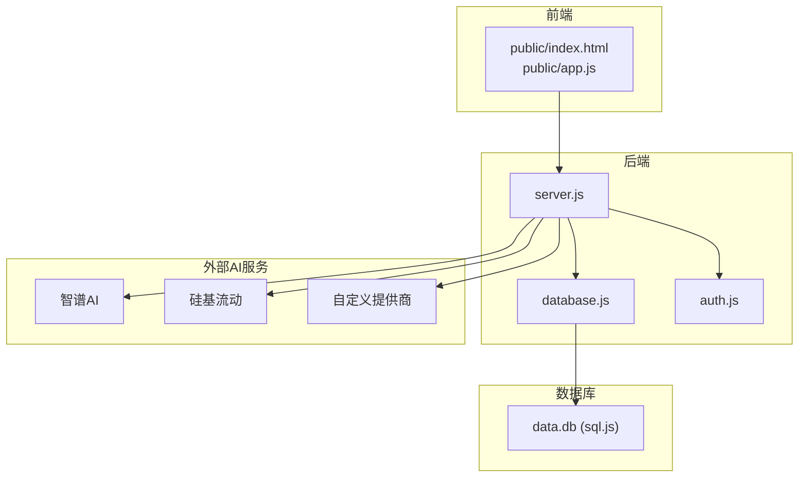
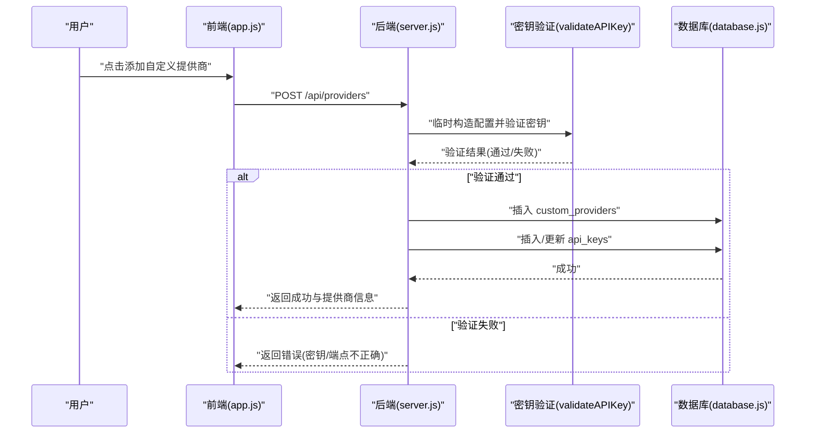
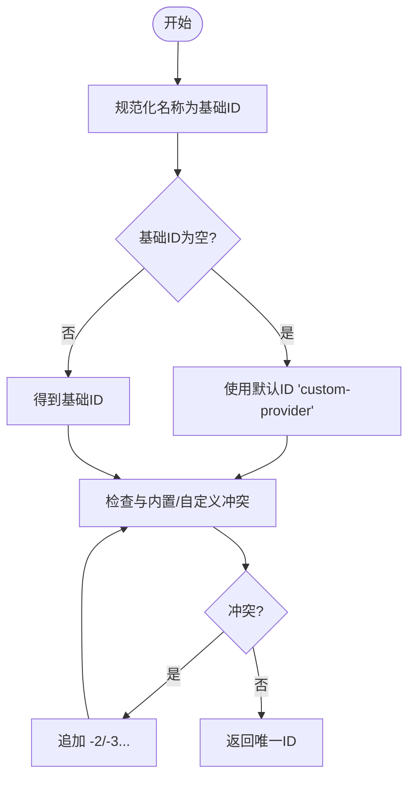
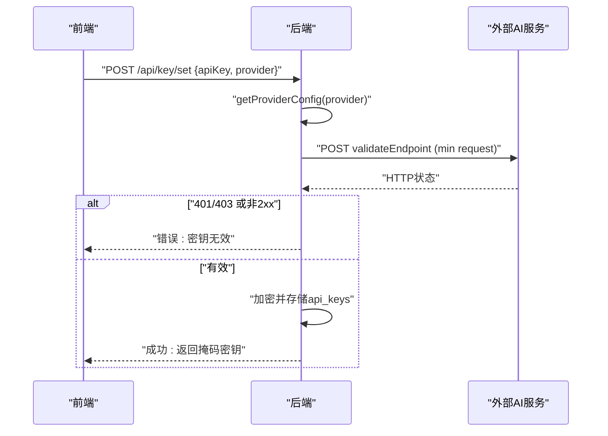
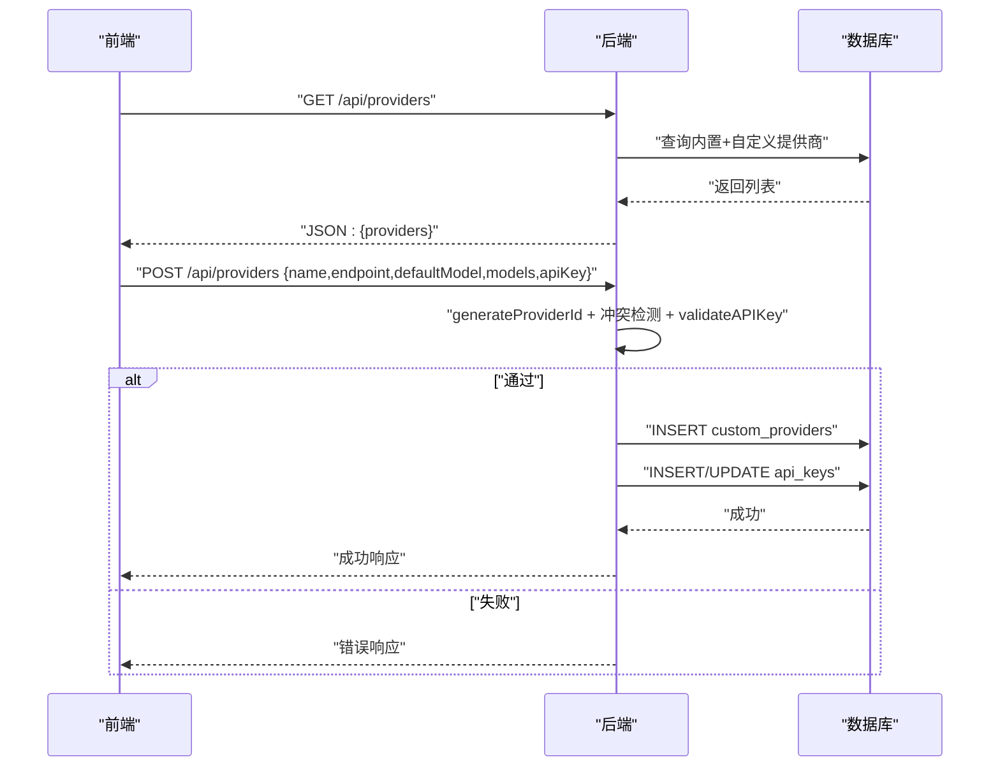
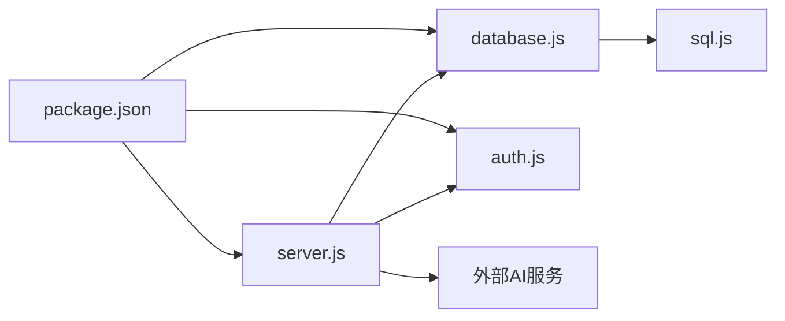

# 提供商管理

<cite>
**本文引用的文件**
- [server.js](file://server.js)
- [database.js](file://database.js)
- [auth.js](file://auth.js)
- [package.json](file://package.json)
- [README.md](file://README.md)
- [public/app.js](file://public/app.js)
- [public/index.html](file://public/index.html)
</cite>

## 目录
1. [简介](#简介)
2. [项目结构](#项目结构)
3. [核心组件](#核心组件)
4. [架构总览](#架构总览)
5. [详细组件分析](#详细组件分析)
6. [依赖关系分析](#依赖关系分析)
7. [性能考量](#性能考量)
8. [故障排查指南](#故障排查指南)
9. [结论](#结论)
10. [附录](#附录)

## 简介
本文件面向 trae02airead 的“提供商管理”模块，系统性阐述内置与自定义 AI 提供商的管理架构，涵盖提供商配置、模型列表与验证机制；详解自定义提供商的创建流程（ID 生成规则、冲突检测、数据库存储策略）；说明提供商配置的数据结构（API 端点、默认模型、可用模型列表）；并提供添加、更新、删除、查询提供商配置的接口与前端交互方式。最后给出扩展性设计建议，指导如何新增 AI 提供商与自定义配置选项。

## 项目结构
后端采用 Express 服务，结合 sql.js 内存数据库与本地文件系统存储；前端为单页应用，通过 AJAX 与后端交互，完成提供商与密钥的增删改查。

图表来源
- [server.js:1-899](file://server.js#L1-L899)
- [database.js:1-146](file://database.js#L1-L146)
- [auth.js:1-80](file://auth.js#L1-L80)

章节来源
- [server.js:1-899](file://server.js#L1-L899)
- [database.js:1-146](file://database.js#L1-L146)
- [auth.js:1-80](file://auth.js#L1-L80)
- [package.json:1-23](file://package.json#L1-L23)

## 核心组件
- 内置提供商常量 PROVIDERS：定义智谱AI与硅基流动的基础配置（名称、API 端点、默认模型、可用模型列表、验证端点与模型）。
- 自定义提供商表 custom_providers：存储用户自定义提供商的标识、名称、API 端点、默认模型、可选模型列表及时间戳。
- API 密钥表 api_keys：按用户与提供商维度存储加密后的密钥、掩码密钥与更新时间。
- 提供商聚合函数 getAllProviders：合并内置与用户自定义提供商，形成最终可用列表。
- 提供商路由：GET /api/providers、POST /api/providers、PUT /api/providers/:id、DELETE /api/providers/:id。
- 密钥路由：GET /api/key/status、POST /api/key/set、POST /api/key/verify、DELETE /api/key。
- 验证函数 validateAPIKey：对密钥与端点进行连通性与鉴权验证。
- ID 生成与冲突检测：generateProviderId 与唯一性约束。

章节来源
- [server.js:163-188](file://server.js#L163-L188)
- [server.js:190-205](file://server.js#L190-L205)
- [server.js:336-461](file://server.js#L336-L461)
- [server.js:239-332](file://server.js#L239-L332)
- [server.js:212-235](file://server.js#L212-L235)
- [server.js:348-364](file://server.js#L348-L364)
- [database.js:97-107](file://database.js#L97-L107)
- [database.js:88-96](file://database.js#L88-L96)

## 架构总览
提供商管理由“前端 UI + 后端路由 + 数据库 + 外部 AI 服务”四层构成。前端负责展示与交互，后端负责业务编排与数据持久化，数据库负责结构化存储，外部服务负责实际推理调用。

图表来源
- [server.js:366-423](file://server.js#L366-L423)
- [server.js:212-235](file://server.js#L212-L235)
- [database.js:97-107](file://database.js#L97-L107)
- [database.js:88-96](file://database.js#L88-L96)

## 详细组件分析

### 内置提供商 PROVIDERS
- 结构要点
  - name：提供商显示名称
  - apiEndpoint：聊天补全 API 端点
  - defaultModel：默认模型
  - models：可用模型列表（数组）
  - validateEndpoint/validateModel：用于密钥验证的端点与模型
- 作用
  - 作为用户可用提供商列表的基线
  - 作为密钥验证的默认配置来源

章节来源
- [server.js:163-188](file://server.js#L163-L188)

### 自定义提供商存储策略
- 表结构
  - custom_providers：id、user_id、name、api_endpoint、default_model、models(JSON)、created_at、updated_at
  - api_keys：按 user_id+provider 唯一，存储加密密钥与掩码密钥
- 存储流程
  - 添加：写入 custom_providers，同时写入/更新 api_keys
  - 更新：仅更新 custom_providers 的字段
  - 删除：删除 custom_providers 并级联删除对应 api_keys

章节来源
- [database.js:97-107](file://database.js#L97-L107)
- [database.js:88-96](file://database.js#L88-L96)
- [server.js:402-412](file://server.js#L402-L412)
- [server.js:434-441](file://server.js#L434-L441)
- [server.js:457-458](file://server.js#L457-L458)

### ID 生成规则与冲突检测
- 规则
  - 基础 ID：由名称转小写、去除非字母数字连字符、压缩连续连字符、去首尾连字符，截断至 30 字符
  - 若为空，回退为 “custom-provider”
  - 通过循环追加 -2、-3…，确保与内置 PROVIDERS 与用户自定义提供商均不冲突
- 冲突检测
  - 检测内置 PROVIDERS 是否同名
  - 检测数据库中是否存在相同 id 且属于当前用户

图表来源
- [server.js:348-364](file://server.js#L348-L364)
- [server.js:376-389](file://server.js#L376-L389)

章节来源
- [server.js:348-364](file://server.js#L348-L364)
- [server.js:376-389](file://server.js#L376-L389)

### 配置数据结构与模型列表
- 提供商配置对象
  - id：字符串，唯一标识
  - name：字符串，显示名称
  - apiEndpoint：字符串，API 端点
  - defaultModel：字符串，模型标识
  - models：数组或 null，可选模型列表
  - isCustom：布尔，是否为自定义
- 模型列表合并策略
  - 默认模型优先
  - 内置 models 去重后拼接
  - 自定义模型列表（localStorage）去重后拼接
  - 最终渲染给前端选择器

章节来源
- [server.js:336-346](file://server.js#L336-L346)
- [public/app.js:406-429](file://public/app.js#L406-L429)
- [public/app.js:343-351](file://public/app.js#L343-L351)

### 密钥验证机制
- 验证流程
  - 从 PROVIDERS 或自定义配置中提取 validateEndpoint/validateModel
  - 发送最小化请求（极短 max_tokens），等待 15 秒超时
  - 401/403 视为无效；2xx 或 400 视为有效
- 前端交互
  - “保存密钥”：后端验证并通过后，加密存储并返回掩码密钥
  - “验证密钥”：可传入新密钥或使用已存密钥进行验证

图表来源
- [server.js:260-295](file://server.js#L260-L295)
- [server.js:297-316](file://server.js#L297-L316)
- [server.js:212-235](file://server.js#L212-L235)

章节来源
- [server.js:212-235](file://server.js#L212-L235)
- [server.js:260-295](file://server.js#L260-L295)
- [server.js:297-316](file://server.js#L297-L316)

### 提供商 CRUD 接口与前端交互
- 查询提供商列表
  - GET /api/providers：返回 id、name、defaultModel、models、isCustom
- 添加自定义提供商
  - POST /api/providers：校验必填字段、密钥长度、ID 合法性与冲突、密钥有效性；成功后写入 custom_providers 与 api_keys
- 更新自定义提供商
  - PUT /api/providers/:id：按 id 与 user_id 更新名称、端点、默认模型、可选模型列表
- 删除自定义提供商
  - DELETE /api/providers/:id：删除 custom_providers 与对应 api_keys

图表来源
- [server.js:336-346](file://server.js#L336-L346)
- [server.js:366-423](file://server.js#L366-L423)
- [server.js:425-447](file://server.js#L425-L447)
- [server.js:449-461](file://server.js#L449-L461)

章节来源
- [server.js:336-346](file://server.js#L336-L346)
- [server.js:366-423](file://server.js#L366-L423)
- [server.js:425-447](file://server.js#L425-L447)
- [server.js:449-461](file://server.js#L449-L461)

### 前端交互与模型选择
- 提供商标签页渲染：内置提供商与“自定义”标签
- 切换提供商：根据 isCustom 控制显示“API密钥设置”或“自定义提供商设置”
- 模型选择：合并默认模型、内置可选模型与自定义模型（localStorage），去重后渲染下拉框
- 自定义模型：支持添加/删除自定义模型 ID，变更后即时生效

章节来源
- [public/app.js:217-279](file://public/app.js#L217-L279)
- [public/app.js:292-310](file://public/app.js#L292-L310)
- [public/app.js:406-429](file://public/app.js#L406-L429)
- [public/app.js:343-404](file://public/app.js#L343-L404)

## 依赖关系分析
- server.js 依赖
  - database.js：初始化与封装数据库操作
  - auth.js：JWT 中间件与用户认证
  - 外部 AI 服务：fetch 调用
- database.js 依赖
  - sql.js：纯 JS SQLite 实现
- package.json 依赖
  - express、cors、bcryptjs、jsonwebtoken、multer、uuid、sql.js、iconv-lite、jschardet、dotenv

图表来源
- [server.js:1-14](file://server.js#L1-L14)
- [database.js:1-4](file://database.js#L1-L4)
- [package.json:10-22](file://package.json#L10-L22)

章节来源
- [server.js:1-14](file://server.js#L1-L14)
- [database.js:1-4](file://database.js#L1-L4)
- [package.json:10-22](file://package.json#L10-L22)

## 性能考量
- 数据库
  - 使用 WAL 模式与外键约束，保证一致性与并发安全
  - 索引覆盖 api_keys、custom_providers、books_meta、history 的常用查询字段
- 网络调用
  - 密钥验证请求极短，超时 15 秒，避免阻塞
  - 流式回答使用 SSE，前端按块接收，降低内存占用
- 前端
  - 模型列表合并与去重在客户端完成，减少后端负担
  - 自定义模型列表使用 localStorage，避免频繁网络往返

章节来源
- [database.js:78-135](file://database.js#L78-L135)
- [server.js:212-235](file://server.js#L212-L235)
- [server.js:734-765](file://server.js#L734-L765)
- [public/app.js:406-429](file://public/app.js#L406-L429)

## 故障排查指南
- 密钥验证失败
  - 检查 API 密钥长度与完整性
  - 确认 API 端点与默认模型是否匹配
  - 查看后端日志与 401/403 错误
- 自定义提供商添加失败
  - ID 含非法字符或与内置/自定义冲突
  - 数据库唯一性约束导致插入失败
- 删除自定义提供商后仍提示密钥存在
  - 确认是否同时删除了 api_keys 中的对应记录
- 流式回答异常
  - 检查外部服务是否支持 SSE
  - 关注超时与中断处理

章节来源
- [server.js:260-295](file://server.js#L260-L295)
- [server.js:366-423](file://server.js#L366-L423)
- [server.js:449-461](file://server.js#L449-L461)
- [server.js:767-772](file://server.js#L767-L772)

## 结论
trae02airead 的提供商管理以“内置基线 + 用户自定义 + 统一验证 + 加密存储”为核心设计，既保证了开箱即用，又提供了灵活扩展能力。通过严格的 ID 生成与冲突检测、完善的密钥验证与存储策略，以及前后端协同的模型列表合并机制，系统实现了良好的可用性与安全性。后续扩展新提供商时，只需遵循现有数据结构与验证流程，即可快速接入。

## 附录

### API 接口清单（提供商与密钥）
- 提供商
  - GET /api/providers：获取可用提供商列表
  - POST /api/providers：添加自定义提供商
  - PUT /api/providers/:id：更新自定义提供商
  - DELETE /api/providers/:id：删除自定义提供商
- 密钥
  - GET /api/key/status：获取各提供商密钥状态
  - POST /api/key/set：设置指定提供商的 API 密钥
  - POST /api/key/verify：验证 API 密钥
  - DELETE /api/key：删除指定提供商的 API 密钥

章节来源
- [server.js:336-461](file://server.js#L336-L461)
- [server.js:239-332](file://server.js#L239-L332)

### 扩展性设计建议
- 新增 AI 提供商
  - 在 PROVIDERS 中增加一项，定义 name、apiEndpoint、defaultModel、models、validateEndpoint、validateModel
  - 前端 providerTabs 与提示文案会自动识别
- 自定义配置选项
  - 可在 custom_providers 表中扩展字段（需迁移与兼容处理）
  - 在前端 settings 页面增加对应表单项，并在提交时一并写入
- 安全加固
  - 引入密钥轮换与审计日志
  - 对敏感字段进行更细粒度的权限控制

章节来源
- [server.js:163-188](file://server.js#L163-L188)
- [server.js:336-346](file://server.js#L336-L346)
- [public/index.html:227-358](file://public/index.html#L227-L358)