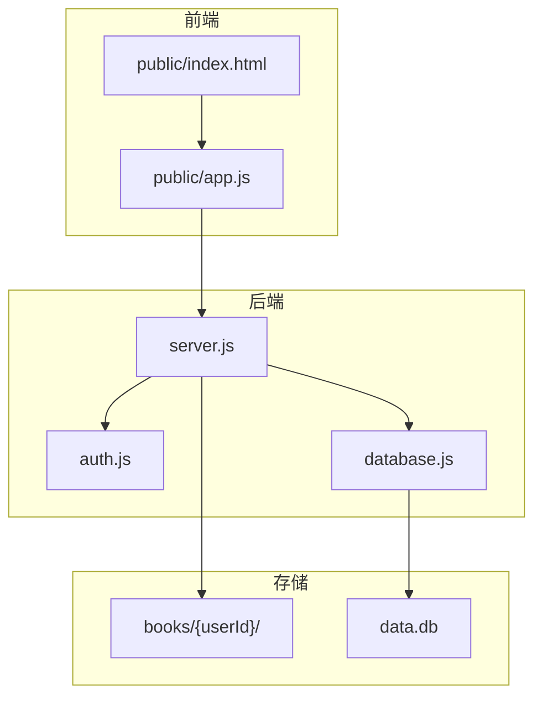
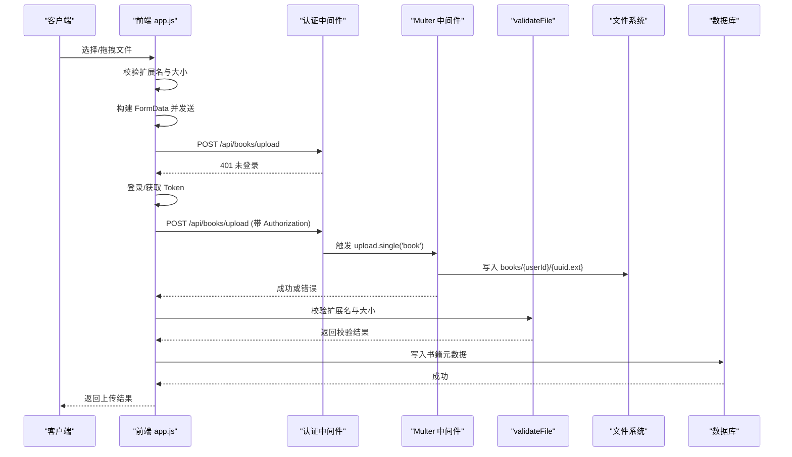
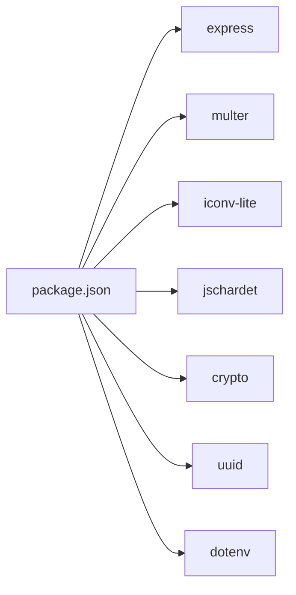

# 文件上传与处理

<cite>
**本文引用的文件**
- [server.js](file://server.js)
- [package.json](file://package.json)
- [auth.js](file://auth.js)
- [database.js](file://database.js)
- [public/index.html](file://public/index.html)
- [public/app.js](file://public/app.js)
- [test.txt](file://test.txt)
</cite>

## 目录
1. [简介](#简介)
2. [项目结构](#项目结构)
3. [核心组件](#核心组件)
4. [架构总览](#架构总览)
5. [详细组件分析](#详细组件分析)
6. [依赖关系分析](#依赖关系分析)
7. [性能考虑](#性能考虑)
8. [故障排查指南](#故障排查指南)
9. [结论](#结论)
10. [附录](#附录)

## 简介
本文件聚焦 trae02airead 的“文件上传与处理”子系统，围绕后端 Multer 配置与中间件、文件验证与过滤、存储策略、以及 TXT 文件的编码检测与转换机制进行深入解析。同时提供前端上传交互、错误处理与存储实现的参考路径，以及性能优化建议与常见问题排查方法，帮助开发者快速理解并扩展该模块。

## 项目结构
后端采用 Express + sql.js 的纯前端数据库方案，上传处理集中在 server.js 中，前端通过 public/app.js 发起上传请求，后端将文件按用户隔离存储至 books/{userId} 目录。

图表来源
- [server.js:30-899](file://server.js#L30-L899)
- [database.js:69-146](file://database.js#L69-L146)

章节来源
- [server.js:15-30](file://server.js#L15-L30)
- [database.js:1-146](file://database.js#L1-146)

## 核心组件
- Multer 中间件与存储策略：定义 destination 和 filename，按用户目录隔离存储，限制文件大小。
- 文件过滤规则：仅允许 txt/pdf/epub/mobi，超出大小限制将被拒绝。
- 文件验证函数：统一校验扩展名与大小。
- TXT 编码检测与转换：使用 jschardet 检测编码，iconv-lite 进行解码，兼容多种中文编码与 UTF-8 BOM。
- 上传路由与错误处理：捕获大小超限、格式不支持等错误，返回标准化错误信息。
- 前端上传交互：支持拖拽、点击选择、进度反馈与错误提示。

章节来源
- [server.js:134-161](file://server.js#L134-L161)
- [server.js:123-132](file://server.js#L123-L132)
- [server.js:81-121](file://server.js#L81-L121)
- [server.js:465-514](file://server.js#L465-L514)
- [public/app.js:729-796](file://public/app.js#L729-L796)

## 架构总览
后端通过中间件链路完成认证、文件上传、验证与存储，前端负责构建表单数据并展示上传进度。

图表来源
- [server.js:40-41](file://server.js#L40-L41)
- [server.js:150-161](file://server.js#L150-L161)
- [server.js:465-514](file://server.js#L465-L514)
- [server.js:123-132](file://server.js#L123-L132)
- [database.js:108-122](file://database.js#L108-L122)

## 详细组件分析

### Multer 配置与中间件
- 存储策略
  - destination：按用户 ID 创建目录 books/{userId}，确保存在性。
  - filename：使用 UUID 生成唯一文件名，保留原扩展名。
- 上传限制
  - limits.fileSize：统一限制为 50MB。
- 文件过滤
  - fileFilter：仅允许 .txt/.pdf/.epub/.mobi，否则抛出错误。
- 错误处理
  - LIMIT_FILE_SIZE：捕获并返回人类可读的大小超限错误。
  - 其他错误：返回错误消息。

章节来源
- [server.js:134-161](file://server.js#L134-L161)
- [server.js:465-472](file://server.js#L465-L472)

### 文件验证机制
- validateFile
  - 扩展名校验：仅允许白名单扩展名。
  - 大小校验：不超过 50MB。
  - 返回 { valid, error? }，失败时删除临时文件。

章节来源
- [server.js:123-132](file://server.js#L123-L132)
- [server.js:478-482](file://server.js#L478-L482)

### TXT 文件编码检测与转换
- 检测流程
  - 读取二进制缓冲区，使用 jschardet 检测编码。
  - 将检测结果映射到 iconv-lite 支持的编码名。
  - 若为 UTF-8 或 utf8，检测 BOM 并跳过。
  - 尝试 iconv.decode，若仍失败则尝试多种回退编码。
  - 最终回退到 UTF-8，避免乱码。
- 适用场景
  - 本地 TXT 文件上传阅读。
  - 与后端 /api/books/:id 接口配合，返回解析后的内容。

章节来源
- [server.js:81-121](file://server.js#L81-L121)

### 上传路由与业务流程
- 路由：POST /api/books/upload
- 步骤
  - 调用 upload.single('book')，内部触发 Multer 存储。
  - 捕获错误：LIMIT_FILE_SIZE 或格式错误。
  - 校验 validateFile。
  - 解析原始文件名（Latin1 -> UTF-8）。
  - 生成书籍元数据并写入 books_meta 表。
  - 返回成功响应。

章节来源
- [server.js:465-514](file://server.js#L465-L514)
- [database.js:108-122](file://database.js#L108-L122)

### 前端上传交互
- 支持格式与大小限制：与后端一致。
- 上传方式：FormData，支持拖拽与点击选择。
- 进度反馈：XMLHttpRequest 事件监听，动态更新进度条。
- 错误处理：401（未登录）、400（格式/大小/业务错误）等。

章节来源
- [public/app.js:729-796](file://public/app.js#L729-L796)
- [public/index.html:207-216](file://public/index.html#L207-L216)

### 代码示例路径
- 配置上传中间件
  - [server.js:134-161](file://server.js#L134-L161)
- 处理上传错误
  - [server.js:465-472](file://server.js#L465-L472)
- 实现文件存储
  - [server.js:134-148](file://server.js#L134-L148)
- 验证文件格式与大小
  - [server.js:123-132](file://server.js#L123-L132)
- TXT 编码检测与转换
  - [server.js:81-121](file://server.js#L81-L121)

## 依赖关系分析
- 依赖模块
  - express、cors、path、crypto、fs、multer、uuid、iconv-lite、jschardet、dotenv。
- 关键导入与使用
  - server.js 引入并初始化数据库、认证中间件、Multer、编码检测与转换工具。
  - package.json 明确列出依赖版本。

图表来源
- [package.json:10-22](file://package.json#L10-L22)

章节来源
- [package.json:10-22](file://package.json#L10-L22)
- [server.js:1-13](file://server.js#L1-L13)

## 性能考虑
- 并发上传处理
  - Multer 默认单文件上传，适合顺序处理。若需并发，可考虑引入队列或限制并发数，避免磁盘与 CPU 抖动。
- 内存管理
  - jschardet 与 iconv-lite 在大文件检测/解码时可能占用较多内存。建议对超大文件（>50MB）进行预检或拆分处理。
- 磁盘空间监控
  - 建议在生产环境增加磁盘配额与清理策略（如按用户/时间阈值清理），并在 server.js 中增加空间检查与错误上报。
- I/O 优化
  - 目录按用户隔离，减少跨用户竞争；确保 books 目录权限与磁盘缓存策略合理。
- 前端进度与用户体验
  - 使用 XHR 事件监听上传进度，避免阻塞主线程；对大文件建议分片上传（需后端配合）。

[本节为通用性能建议，不直接分析具体文件]

## 故障排查指南
- 常见错误与定位
  - 400 格式不支持：确认扩展名在白名单内。
  - 400 文件过大：确认不超过 50MB。
  - 401 未登录：确认 Authorization 头与登录状态。
  - 500 读取内容失败：检查 TXT 编码检测与转换逻辑，确认文件未损坏。
- 日志与调试
  - server.js 中对解密失败、API 密钥验证失败等有日志输出，便于定位问题。
- 前端提示
  - app.js 对上传失败、格式错误、大小超限等场景提供 toast 提示，便于用户感知。

章节来源
- [server.js:465-472](file://server.js#L465-L472)
- [server.js:553-556](file://server.js#L553-L556)
- [public/app.js:766-781](file://public/app.js#L766-L781)

## 结论
该上传与处理模块以 Multer 为核心，结合严格的文件过滤与大小限制、完善的错误处理与用户隔离存储策略，实现了稳定可靠的多格式书籍上传能力。TXT 文件的编码检测与转换进一步提升了中文内容的兼容性。建议在生产环境中完善并发控制、磁盘配额与清理策略，并持续优化大文件处理与前端交互体验。

[本节为总结性内容，不直接分析具体文件]

## 附录

### API 定义（与上传相关）
- POST /api/books/upload
  - 请求体：multipart/form-data，字段名为 book。
  - 成功：返回 { success, message, book }。
  - 失败：返回 { error }，包含格式/大小/业务错误信息。

章节来源
- [server.js:465-514](file://server.js#L465-L514)

### 数据模型（书籍元数据）
- 表：books_meta
  - 字段：id、user_id、title、filename、original_name、format、size、size_formatted、upload_time、author、last_read、read_progress。
  - 主键：(id, user_id)，外键：user_id 引用 users。

章节来源
- [database.js:108-122](file://database.js#L108-L122)

### 示例文件
- test.txt：用于验证编码检测与转换逻辑。

章节来源
- [test.txt:1-2](file://test.txt#L1-L2)