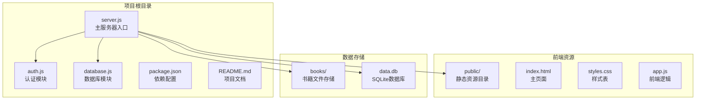
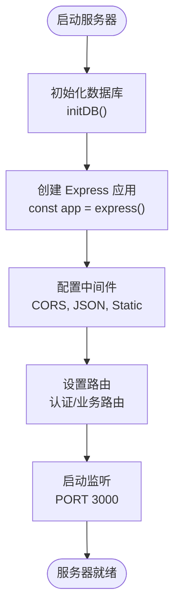
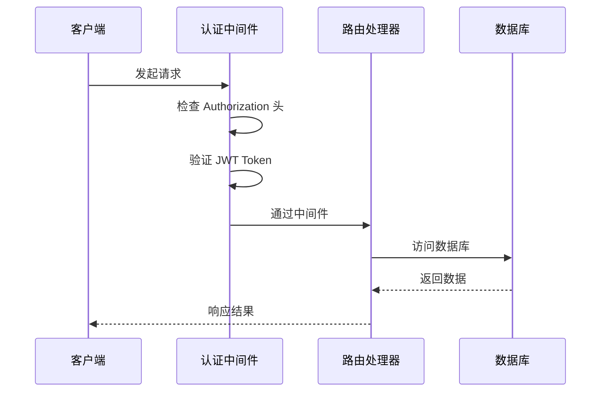
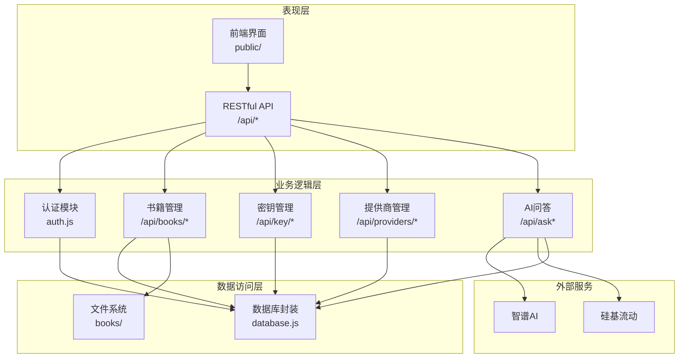
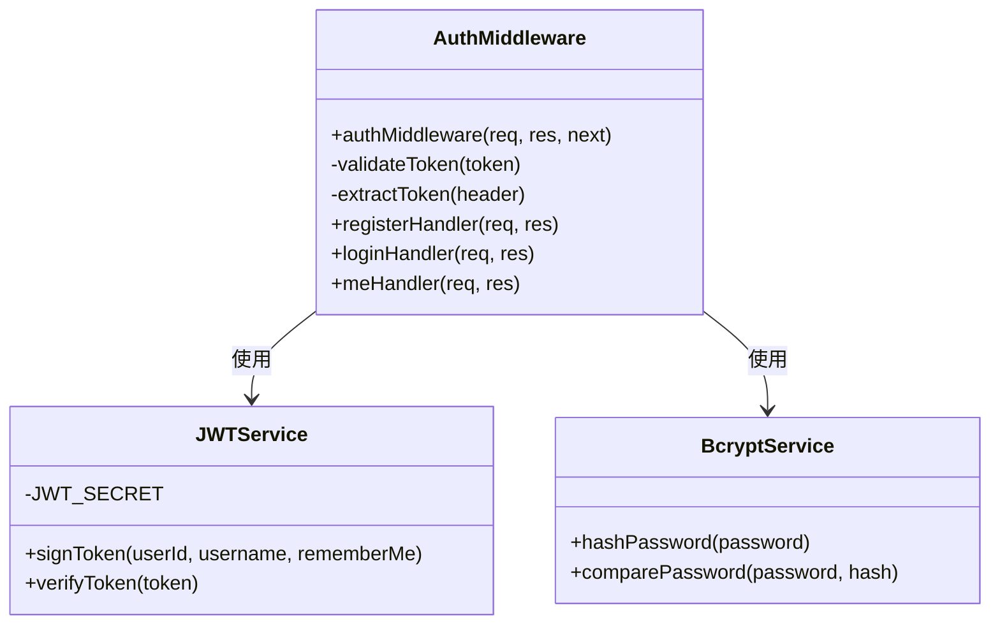
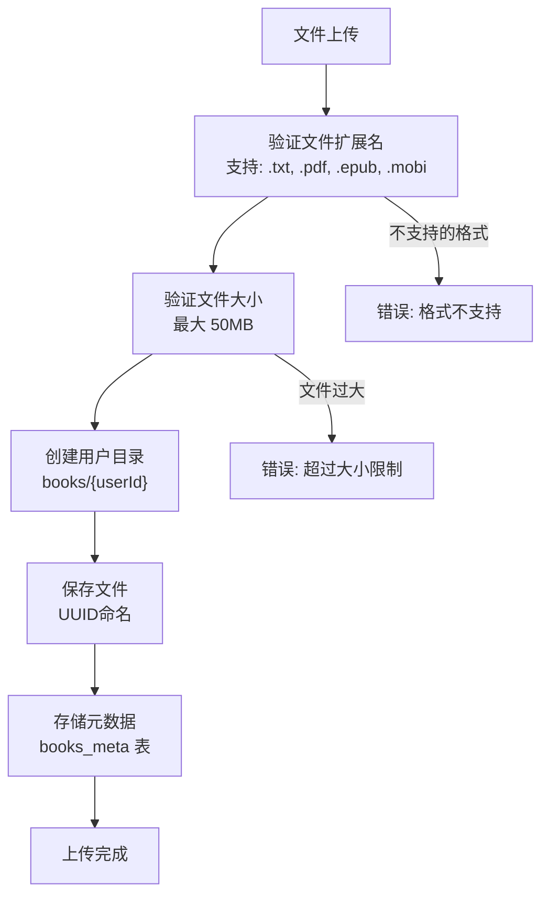
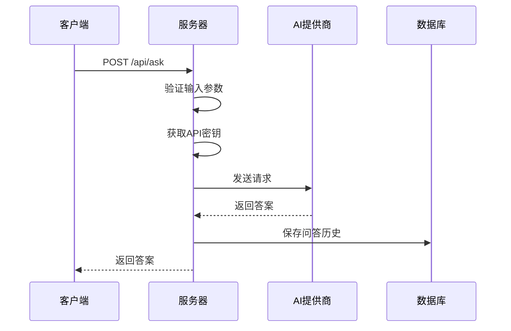
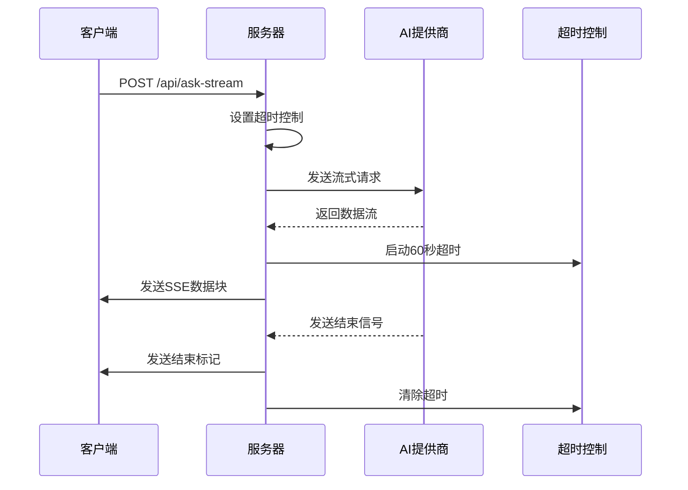
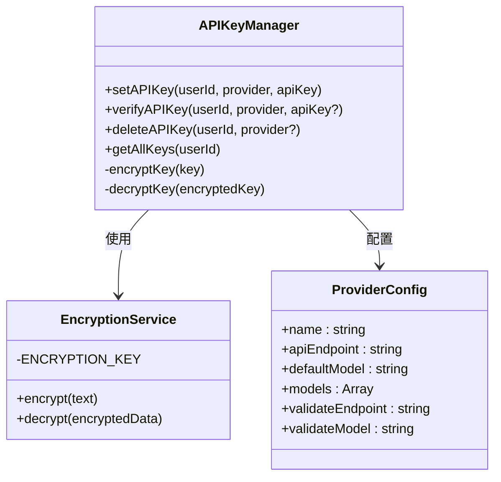
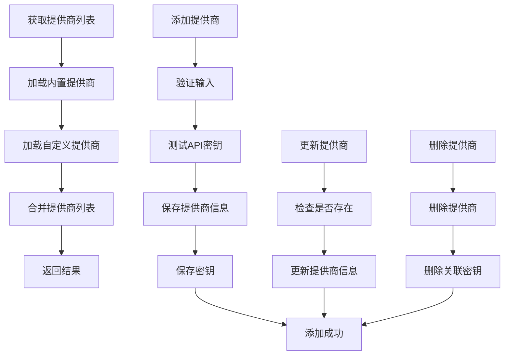

# 服务器主模块 (server.js)

<cite>
**本文档引用的文件**
- [server.js](file://server.js)
- [auth.js](file://auth.js)
- [database.js](file://database.js)
- [package.json](file://package.json)
- [README.md](file://README.md)
</cite>

## 目录
1. [简介](#简介)
2. [项目结构](#项目结构)
3. [核心组件](#核心组件)
4. [架构概览](#架构概览)
5. [详细组件分析](#详细组件分析)
6. [依赖关系分析](#依赖关系分析)
7. [性能考虑](#性能考虑)
8. [故障排除指南](#故障排除指南)
9. [结论](#结论)

## 简介

trae02airead 是一个现代化的智能阅读应用，集成了多 AI 服务提供商，帮助用户高效阅读和理解书籍内容。该项目采用 Node.js + Express 构建，支持在线阅读、AI 智能问答、书架管理、自定义 AI 提供商等功能。

该服务器主模块 (server.js) 是整个应用的核心，负责：
- Express 应用初始化和基础配置
- CORS 跨域资源共享配置
- 静态资源服务
- 中间件系统实现（特别是认证中间件）
- 路由设计模式（认证、电子书管理、API 密钥管理、提供商管理、AI 问答）
- 文件上传处理机制
- AI 问答功能实现（包括流式响应处理）

## 项目结构

项目采用简洁的单文件架构，主要文件包括：



**图表来源**
- [server.js:1-15](file://server.js#L1-L15)
- [package.json:1-23](file://package.json#L1-L23)

**章节来源**
- [server.js:1-15](file://server.js#L1-L15)
- [package.json:1-23](file://package.json#L1-L23)
- [README.md:210-232](file://README.md#L210-L232)

## 核心组件

### Express 应用初始化

服务器使用 Express 4.18.2 构建，采用异步启动模式：



**图表来源**
- [server.js:30-35](file://server.js#L30-L35)
- [server.js:886-892](file://server.js#L886-L892)

### 中间件系统

系统实现了完整的中间件链路，包括认证中间件和全局中间件：



**图表来源**
- [auth.js:14-27](file://auth.js#L14-L27)
- [server.js:40](file://server.js#L40)

**章节来源**
- [server.js:30-40](file://server.js#L30-L40)
- [auth.js:14-27](file://auth.js#L14-L27)

## 架构概览

系统采用分层架构设计，清晰分离关注点：



**图表来源**
- [server.js:37-42](file://server.js#L37-L42)
- [server.js:237-461](file://server.js#L237-L461)
- [server.js:618-827](file://server.js#L618-L827)

## 详细组件分析

### 认证中间件实现

认证中间件是整个系统安全的基础，采用 JWT 令牌验证机制：



**图表来源**
- [auth.js:9-12](file://auth.js#L9-L12)
- [auth.js:29-77](file://auth.js#L29-L77)

认证流程包括三个阶段：

1. **注册流程**：用户名唯一性检查 → 密码哈希 → 创建用户 → 生成 JWT
2. **登录流程**：查找用户 → 密码验证 → 生成 JWT
3. **中间件验证**：提取 Bearer Token → JWT 验证 → 注入用户信息

**章节来源**
- [auth.js:14-27](file://auth.js#L14-L27)
- [auth.js:29-77](file://auth.js#L29-L77)

### 文件上传处理机制

系统支持多种电子书格式，采用 Multer 进行文件处理：



**图表来源**
- [server.js:123-132](file://server.js#L123-L132)
- [server.js:134-148](file://server.js#L134-L148)
- [server.js:465-514](file://server.js#L465-L514)

文件处理特性：
- **格式验证**：严格限制支持的电子书格式
- **大小限制**：50MB 最大文件大小
- **存储策略**：按用户隔离的目录结构
- **元数据管理**：自动提取文件信息并存储

**章节来源**
- [server.js:123-161](file://server.js#L123-L161)
- [server.js:465-514](file://server.js#L465-L514)

### AI 问答功能实现

AI 问答功能是系统的核心特色，支持两种交互模式：

#### 非流式问答流程



**图表来源**
- [server.js:618-688](file://server.js#L618-L688)

#### 流式问答 (SSE) 流程



**图表来源**
- [server.js:690-827](file://server.js#L690-L827)

AI 功能特性：
- **多提供商支持**：内置智谱AI和硅基流动
- **自定义提供商**：支持添加任意 OpenAI 兼容 API
- **流式响应**：SSE 实现实时打字机效果
- **超时控制**：60秒超时保护
- **模型管理**：支持默认模型和可选模型

**章节来源**
- [server.js:163-188](file://server.js#L163-L188)
- [server.js:618-827](file://server.js#L618-L827)

### API 密钥管理系统

系统实现了安全的 API 密钥管理机制：



**图表来源**
- [server.js:239-332](file://server.js#L239-L332)
- [server.js:163-210](file://server.js#L163-L210)

密钥管理特性：
- **加密存储**：AES-256-CBC 加密算法
- **多提供商支持**：支持多个 AI 服务提供商
- **环境变量支持**：可配置环境变量作为备用密钥
- **密钥验证**：自动验证密钥有效性

**章节来源**
- [server.js:239-332](file://server.js#L239-L332)
- [server.js:40-67](file://server.js#L40-L67)

### 提供商管理功能

系统支持动态管理 AI 提供商：



**图表来源**
- [server.js:336-461](file://server.js#L336-L461)

**章节来源**
- [server.js:336-461](file://server.js#L336-L461)

## 依赖关系分析

系统依赖关系清晰，模块职责明确：

```mermaid
graph LR
subgraph "核心依赖"
Express[express@4.18.2]
Cors[cors@2.8.5]
Multer[multer@1.4.5]
Dotenv[dotenv@16.3.1]
end
subgraph "数据库相关"
SqlJS[sql.js@1.12.0]
Bcrypt[bcryptjs@3.0.3]
Jsonwebtoken[jsonwebtoken@9.0.3]
end
subgraph "编码处理"
Iconv[iconv-lite@0.6.3]
Jschardet[jschardet@3.0.0]
end
subgraph "工具库"
Uuid[uuid@9.0.0]
Crypto[crypto]
end
Server[server.js] --> Express
Server --> Cors
Server --> Multer
Server --> Dotenv
Server --> SqlJS
Server --> Bcrypt
Server --> Jsonwebtoken
Server --> Iconv
Server --> Jschardet
Server --> Uuid
Server --> Crypto
```

**图表来源**
- [package.json:10-22](file://package.json#L10-L22)

**章节来源**
- [package.json:10-22](file://package.json#L10-L22)

## 性能考虑

### 数据库优化

系统采用 SQLite (sql.js) 作为数据存储，具有以下优化特性：

- **WAL 模式**：提高并发读写性能
- **索引优化**：为常用查询字段建立索引
- **事务处理**：批量操作使用事务确保一致性
- **内存映射**：使用内存数据库减少磁盘 I/O

### 缓存策略

虽然系统没有实现传统缓存，但在以下方面进行了优化：

- **文件编码检测缓存**：避免重复的编码检测
- **API 密钥缓存**：在内存中缓存已解密的密钥
- **路由缓存**：静态资源通过 CDN 缓存

### 并发处理

系统采用异步非阻塞 I/O 模型：

- **事件驱动**：基于 Node.js 事件循环
- **流式处理**：文件上传和 AI 响应使用流式处理
- **超时控制**：防止长时间占用连接

## 故障排除指南

### 常见问题及解决方案

#### 1. 认证相关问题

**问题**：登录后无法访问受保护的 API
**原因**：Authorization 头格式不正确
**解决方案**：确保使用 `Bearer <token>` 格式

#### 2. 文件上传失败

**问题**：上传文件时报错
**可能原因**：
- 文件格式不受支持
- 文件大小超过限制
- 用户目录权限问题

**解决方案**：
- 检查文件扩展名是否在支持列表中
- 确认文件大小不超过 50MB
- 验证用户目录可写权限

#### 3. AI 问答无响应

**问题**：AI 问答请求超时
**可能原因**：
- API 密钥无效
- 网络连接问题
- AI 服务提供商限流

**解决方案**：
- 验证 API 密钥有效性
- 检查网络连接状态
- 尝试其他 AI 提供商

#### 4. 数据库连接问题

**问题**：应用启动时报数据库错误
**原因**：data.db 文件损坏或权限问题
**解决方案**：
- 备份现有数据文件
- 删除损坏的 data.db 文件
- 重启应用让系统重新创建

**章节来源**
- [server.js:465-514](file://server.js#L465-L514)
- [server.js:618-688](file://server.js#L618-L688)

## 结论

trae02airead 服务器主模块展现了现代 Node.js 应用的最佳实践：

### 技术亮点

1. **模块化设计**：清晰的模块分离和职责划分
2. **安全性考虑**：JWT 认证、API 密钥加密、文件验证
3. **用户体验**：流式 AI 响应、多格式支持、编码自动检测
4. **可扩展性**：自定义提供商支持、插件化架构

### 架构优势

- **简洁性**：单文件架构便于维护和部署
- **可靠性**：完善的错误处理和超时控制
- **性能**：异步非阻塞 I/O 和流式处理
- **安全性**：多层次的安全防护机制

### 改进建议

1. **监控系统**：添加应用性能监控和日志分析
2. **缓存层**：实现 Redis 缓存提升性能
3. **负载均衡**：支持多实例部署
4. **API 文档**：生成 OpenAPI 规范文档

该服务器模块为构建现代化的 AI 驱动应用提供了优秀的参考实现，其设计思路和架构模式值得在类似项目中借鉴和学习。