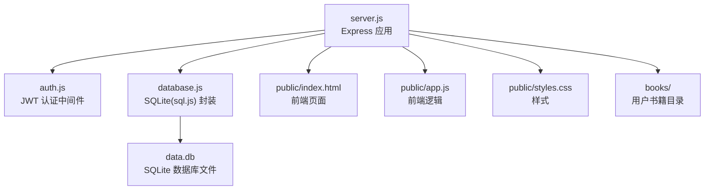
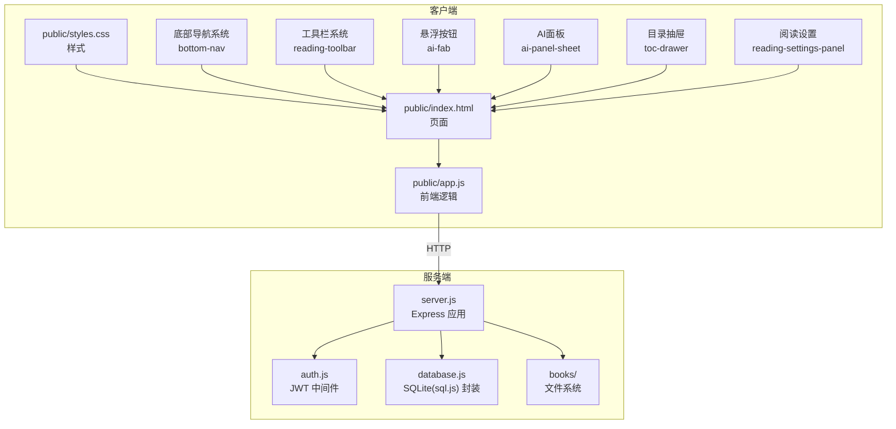
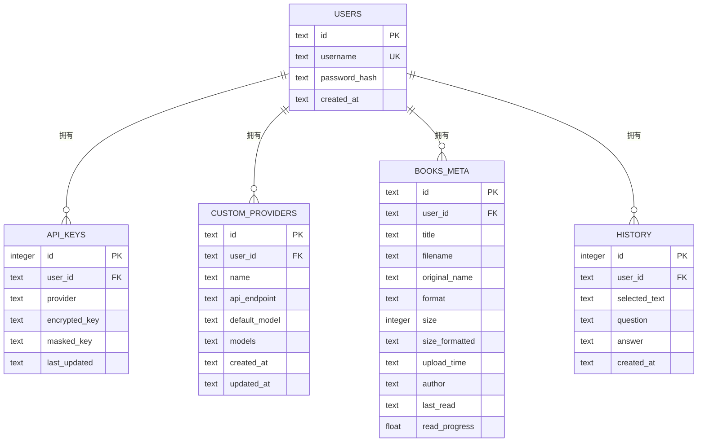
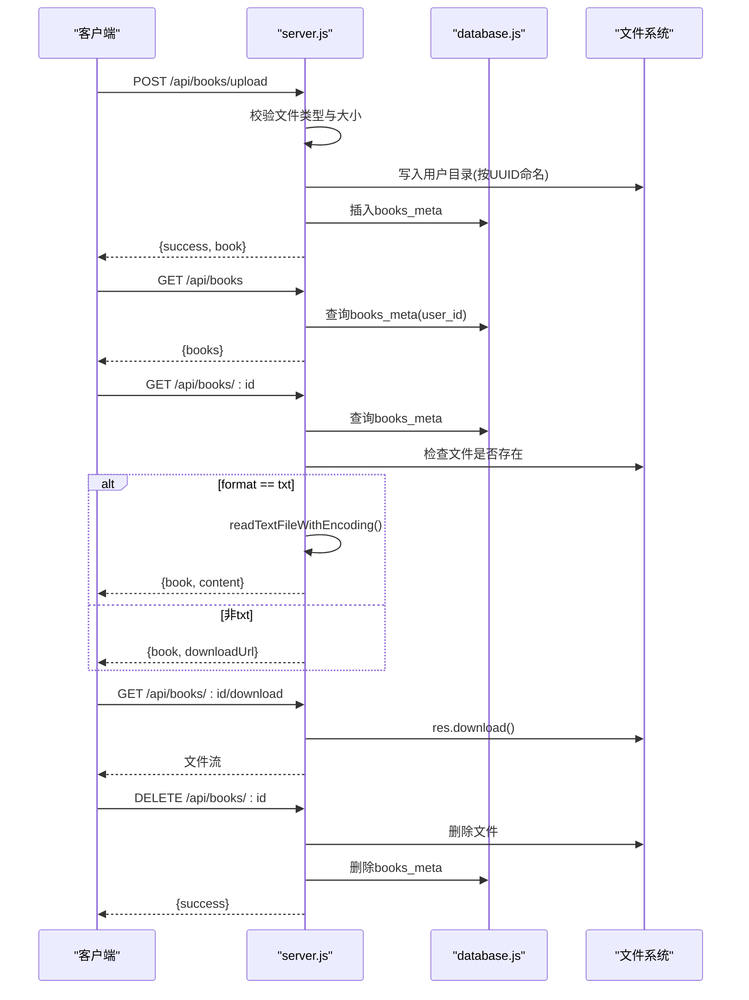
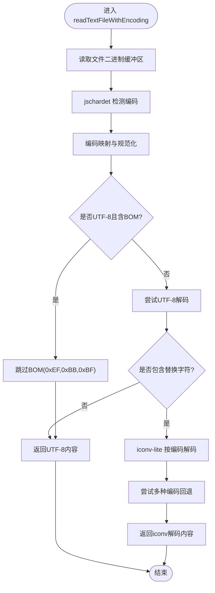
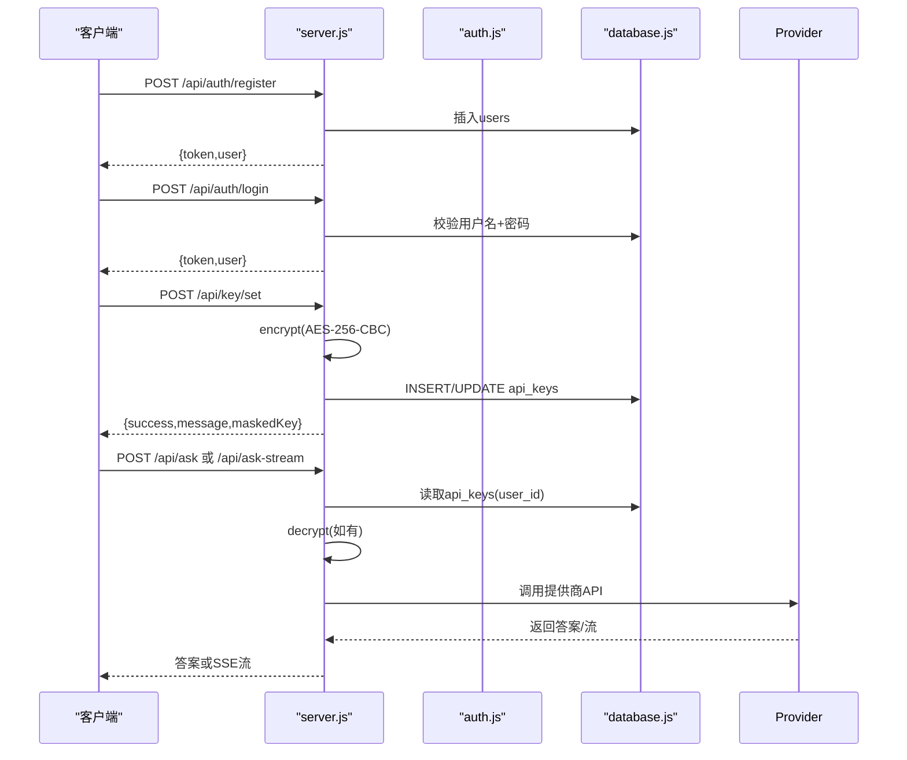
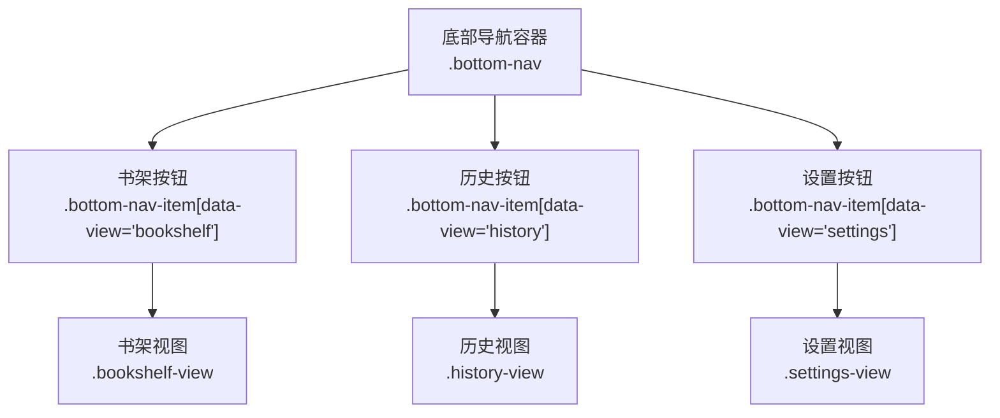
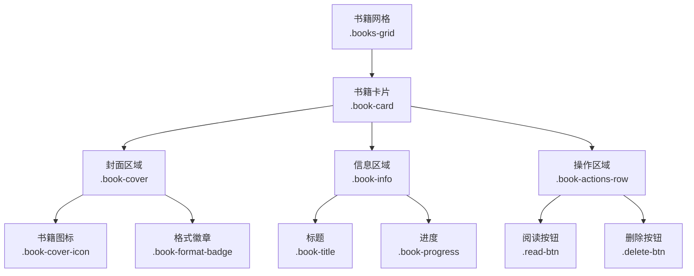
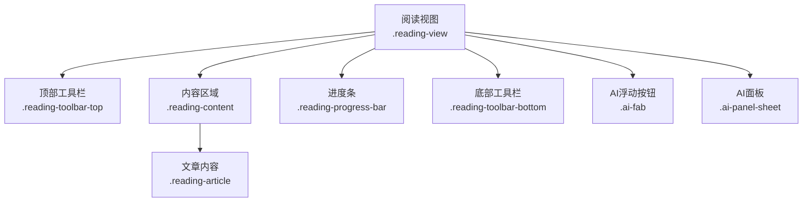
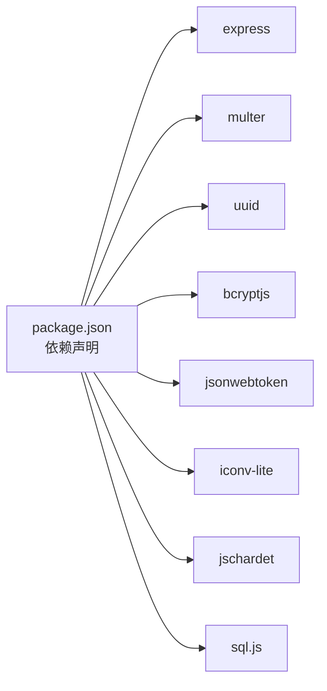

# 电子书管理

<cite>
**本文引用的文件**
- [server.js](file://server.js)
- [database.js](file://database.js)
- [auth.js](file://auth.js)
- [package.json](file://package.json)
- [README.md](file://README.md)
- [public/index.html](file://public/index.html)
- [public/app.js](file://public/app.js)
- [public/styles.css](file://public/styles.css)
- [test.txt](file://test.txt)
</cite>

## 目录
1. [简介](#简介)
2. [项目结构](#项目结构)
3. [核心组件](#核心组件)
4. [架构总览](#架构总览)
5. [详细组件分析](#详细组件分析)
6. [UI架构与导航系统](#ui架构与导航系统)
7. [依赖关系分析](#依赖关系分析)
8. [性能考量](#性能考量)
9. [故障排查指南](#故障排查指南)
10. [结论](#结论)
11. [附录](#附录)

## 简介
本项目是一个基于 Node.js + Express 的电子书管理系统，提供用户认证、电子书上传与存储、元数据管理、内容读取（TXT 自动编码检测）、非 TXT 文件下载链接生成、AI 问答（SSE 流式输出）等功能。系统采用 SQLite（sql.js）嵌入式数据库，结合 AES-256-CBC 对敏感数据进行加密存储，支持多格式电子书（TXT、PDF、EPUB、MOBI），并提供自定义 AI 提供商配置能力。

**更新** 项目现已采用现代化的单页应用架构，包含底部导航系统、响应式设计和增强的用户体验。

## 项目结构
- 后端入口：server.js
- 数据库封装：database.js（基于 sql.js）
- 用户认证：auth.js（JWT + bcrypt）
- 前端静态资源：public/（index.html、app.js、styles.css）
- 依赖声明：package.json
- 项目说明：README.md
- 测试样例：test.txt

图表来源
- [server.js:1-936](file://server.js#L1-L936)
- [database.js:1-146](file://database.js#L1-L146)
- [auth.js:1-80](file://auth.js#L1-L80)
- [public/index.html:1-445](file://public/index.html#L1-L445)
- [public/app.js:1-1253](file://public/app.js#L1-L1253)
- [public/styles.css:1-1418](file://public/styles.css#L1-L1418)

章节来源
- [server.js:1-936](file://server.js#L1-L936)
- [database.js:1-146](file://database.js#L1-L146)
- [auth.js:1-80](file://auth.js#L1-L80)
- [README.md:210-232](file://README.md#L210-L232)

## 核心组件
- 用户认证与授权
  - JWT 令牌签发与校验，支持"记住我"7天/30天有效期
  - bcrypt 密码哈希存储
  - 所有业务接口均需 Authorization: Bearer <token> 头
- 电子书管理
  - 上传：multer + diskStorage，按用户隔离目录
  - 元数据：books_meta 表，包含标题、原始名、格式、大小、上传时间、作者、最后阅读时间、阅读进度
  - 内容读取：TXT 自动编码检测（UTF-8、GBK、GB18030、BIG5、UTF-16LE/BE 等），非 TXT 返回下载链接
  - 删除：删除文件与元数据
- 数据库与索引
  - users、api_keys、custom_providers、books_meta、history
  - 关键索引：idx_api_keys_user、idx_custom_prov_user、idx_books_meta_user、idx_history_user_date
- AI 问答
  - 支持非流式与 SSE 流式两种模式
  - 内置智谱AI与硅基流动，支持自定义提供商
  - API 密钥 AES-256-CBC 加密存储，支持环境变量兜底

章节来源
- [auth.js:14-77](file://auth.js#L14-L77)
- [server.js:465-597](file://server.js#L465-L597)
- [database.js:81-135](file://database.js#L81-L135)
- [server.js:618-827](file://server.js#L618-L827)

## 架构总览
系统采用前后端分离的单页应用架构：
- 前端：原生 HTML/CSS/JS，通过 fetch 调用后端 API
- 后端：Express 提供 RESTful 接口，中间件实现鉴权
- 数据层：SQLite（sql.js）嵌入式数据库，文件系统存储电子书

图表来源
- [server.js:1-936](file://server.js#L1-L936)
- [auth.js:1-80](file://auth.js#L1-L80)
- [database.js:1-146](file://database.js#L1-L146)
- [public/index.html:1-445](file://public/index.html#L1-L445)
- [public/app.js:1-1253](file://public/app.js#L1-L1253)
- [public/styles.css:1-1418](file://public/styles.css#L1-L1418)

## 详细组件分析

### 数据库与表结构设计
- users
  - 字段：id（PK）、username（UNIQUE）、password_hash、created_at
  - 用途：用户注册与登录
- api_keys
  - 字段：id（PK）、user_id（FK）、provider、encrypted_key、masked_key、last_updated、UNIQUE(user_id, provider)
  - 用途：存储各提供商的加密 API 密钥，支持按用户隔离
- custom_providers
  - 字段：id（PK）、user_id（FK）、name、api_endpoint、default_model、models、created_at、updated_at
  - 用途：自定义提供商配置，支持模型列表
- books_meta
  - 字段：id（PK）、user_id（FK）、title、filename、original_name、format、size、size_formatted、upload_time、author、last_read、read_progress
  - 用途：电子书元数据，支持按用户隔离
- history
  - 字段：id（PK）、user_id（FK）、selected_text、question、answer、created_at
  - 用途：AI 问答历史记录
- 索引
  - idx_api_keys_user、idx_custom_prov_user、idx_books_meta_user、idx_history_user_date

图表来源
- [database.js:81-135](file://database.js#L81-L135)

章节来源
- [database.js:81-135](file://database.js#L81-L135)

### 电子书生命周期管理
- 上传
  - 接口：POST /api/books/upload
  - 限制：仅允许 .txt/.pdf/.epub/.mobi，最大 50MB
  - 存储：按用户 ID 创建目录，文件名使用 UUID，原始名保留
  - 元数据：插入 books_meta，初始作者未知、阅读进度 0
- 列表查询
  - 接口：GET /api/books
  - 结果：按上传时间倒序返回书籍列表
- 详情与内容读取
  - 接口：GET /api/books/:id
  - TXT：自动检测编码（UTF-8、GBK、BIG5、UTF-16LE/BE 等），返回内容
  - 非 TXT：返回 downloadUrl
- 下载
  - 接口：GET /api/books/:id/download
  - 直接下载原始文件
- 删除
  - 接口：DELETE /api/books/:id
  - 删除文件与元数据
- 进度保存
  - 接口：PUT /api/books/:id/progress
  - 更新 last_read 与 read_progress

图表来源
- [server.js:465-597](file://server.js#L465-L597)
- [database.js:81-135](file://database.js#L81-L135)

章节来源
- [server.js:465-597](file://server.js#L465-L597)
- [database.js:81-135](file://database.js#L81-L135)

### TXT 文件编码处理流程
- 读取二进制缓冲区
- 使用 jschardet 检测编码
- 映射常见编码（GB2312→gbk、BIG5、UTF-8、UTF-16LE/BE 等）
- 若为 UTF-8 且含 BOM，跳过前三个字节
- iconv-lite 解码，若仍含替换字符则尝试多种编码回退
- 最终回退到 UTF-8

图表来源
- [server.js:81-121](file://server.js#L81-L121)

章节来源
- [server.js:81-121](file://server.js#L81-L121)

### 用户认证与密钥管理
- 注册/登录
  - 注册：用户名去空白、bcrypt 哈希、JWT 签发
  - 登录：用户名+密码校验、JWT 签发
- API 密钥
  - 加密存储：AES-256-CBC，支持环境变量兜底
  - 验证：调用提供商验证端点，超时 15 秒
  - 自定义提供商：支持添加、更新、删除
- AI 问答
  - 非流式：一次性返回答案
  - 流式：SSE，分片增量推送，支持超时与错误处理

图表来源
- [auth.js:29-77](file://auth.js#L29-L77)
- [server.js:239-332](file://server.js#L239-L332)
- [server.js:618-827](file://server.js#L618-L827)
- [database.js:81-135](file://database.js#L81-L135)

章节来源
- [auth.js:29-77](file://auth.js#L29-L77)
- [server.js:239-332](file://server.js#L239-L332)
- [server.js:618-827](file://server.js#L618-L827)
- [database.js:81-135](file://database.js#L81-L135)

### 前端交互与视图
- 视图切换：阅读模式、书架、历史记录、设置
- 书架：上传卡片、拖拽上传、进度条、书籍网格
- AI 面板：选中文本后浮动工具栏，快捷动作与自定义问题
- 设置：提供商切换、模型选择、API 密钥配置与验证

**更新** 新增底部导航系统，提供更直观的页面切换体验，支持书架、历史记录、个人设置三大核心功能区域。

章节来源
- [public/index.html:1-445](file://public/index.html#L1-L445)
- [public/app.js:150-1253](file://public/app.js#L150-L1253)
- [public/styles.css:1-1418](file://public/styles.css#L1-L1418)

## UI架构与导航系统

### 底部导航系统
项目采用现代化的底部导航设计，提供三个主要功能区域：

- **书架导航** (`data-view="bookshelf"`)
  - 图标：书籍图标
  - 功能：主书架页面，展示用户的所有电子书
  - 交互：点击进入书架视图，显示书籍网格布局

- **历史导航** (`data-view="history"`)
  - 图标：时钟图标
  - 功能：AI问答历史记录查看
  - 交互：点击进入历史记录视图

- **设置导航** (`data-view="settings"`)
  - 图标：用户头像图标
  - 功能：个人设置、API密钥配置、主题设置
  - 交互：点击进入设置视图

图表来源
- [public/index.html:356-370](file://public/index.html#L356-L370)
- [public/app.js:258-273](file://public/app.js#L258-L273)

### 书架管理界面
书架界面采用卡片式布局，每个书籍卡片包含：

- **封面区域**：随机颜色渐变背景，显示书籍图标和格式徽章
- **信息区域**：书籍标题（支持两行截断）、阅读进度显示
- **操作区域**：阅读按钮、删除按钮

图表来源
- [public/index.html:248-332](file://public/index.html#L248-L332)
- [public/app.js:356-393](file://public/app.js#L356-L393)

### 阅读模式界面
阅读模式采用全屏设计，包含：

- **顶部工具栏**：返回按钮、书籍标题、占位符
- **内容区域**：格式化后的文本内容，支持段落缩进和标题样式
- **进度条**：固定在底部的阅读进度指示器
- **底部工具栏**：目录、字体、主题、AI助手四个功能按钮
- **AI浮动按钮**：右下角的AI助手入口
- **AI面板**：底部弹出式对话框，支持快捷操作和自定义问题

图表来源
- [public/index.html:236-353](file://public/index.html#L236-L353)
- [public/styles.css:753-801](file://public/styles.css#L753-L801)

### 响应式设计
系统支持多种屏幕尺寸：

- **桌面端**：1200px最大宽度，书籍网格自动调整列数
- **平板端**：150px最小宽度，适中的书籍卡片尺寸
- **移动端**：3列网格布局，紧凑的设计，底部导航适配安全区域

章节来源
- [public/index.html:356-370](file://public/index.html#L356-L370)
- [public/app.js:258-273](file://public/app.js#L258-L273)
- [public/styles.css:1401-1418](file://public/styles.css#L1401-L1418)

## 依赖关系分析
- 后端依赖
  - express、cors、multer、uuid、bcryptjs、jsonwebtoken、iconv-lite、jschardet、sql.js
- 前端依赖
  - 原生 ES6+，无打包器
- 外部集成
  - 智谱AI、硅基流动 OpenAI 兼容 API
  - 环境变量：ENCRYPTION_KEY、ZHIPU_API_KEY、SILICONFLOW_API_KEY、CUSTOM_API_KEY、AI_API_KEY、AI_MODEL、PORT

图表来源
- [package.json:10-22](file://package.json#L10-L22)

章节来源
- [package.json:10-22](file://package.json#L10-L22)
- [README.md:105-120](file://README.md#L105-L120)

## 性能考量
- 数据库
  - WAL 模式与外键开启，减少锁竞争
  - 为高频查询建立索引（用户维度）
- 文件系统
  - 按用户目录隔离，避免跨用户扫描
  - 非 TXT 直接下载，避免内存读取大文件
- 编码检测
  - 仅对 TXT 做编码检测，减少不必要的 CPU 开销
- 网络
  - SSE 流式输出，降低首字延迟
  - 超时控制与 AbortController，防止长时间阻塞
- 前端性能
  - 单页应用架构，减少页面刷新开销
  - 底部导航系统，避免重复加载头部资源
  - 本地存储字体大小和主题设置，提升用户体验
- 建议
  - 对大文件可考虑分块读取或缓存热点内容
  - 定期清理历史记录与临时文件
  - 生产环境建议使用反向代理与 HTTPS

[本节为通用指导，无需具体文件分析]

## 故障排查指南
- 上传失败
  - 检查文件类型与大小限制
  - 查看服务器日志与返回错误
- 读取 TXT 乱码
  - 确认文件编码是否在支持列表
  - 检查是否有 BOM
- API 密钥错误
  - 使用 /api/key/verify 验证
  - 确认提供商端点与模型配置
- SSE 无法接收流
  - 检查浏览器兼容性与网络状况
  - 查看服务端超时与异常处理日志
- 数据库异常
  - 确认 data.db 文件权限与磁盘空间
  - 检查 WAL 日志与 PRAGMA 设置
- UI 导航问题
  - 检查底部导航按钮的 data-view 属性
  - 确认对应视图元素的 active 类名
  - 验证 CSS 样式是否正确加载

章节来源
- [server.js:465-597](file://server.js#L465-L597)
- [server.js:239-332](file://server.js#L239-L332)
- [server.js:618-827](file://server.js#L618-L827)
- [database.js:78-80](file://database.js#L78-L80)
- [public/app.js:258-273](file://public/app.js#L258-L273)

## 结论
本系统以简洁的架构实现了电子书全生命周期管理，结合 SQLite 嵌入式数据库与文件系统，满足中小规模部署需求。通过 JWT 认证、API 密钥加密存储与多提供商支持，兼顾安全性与灵活性。新增的底部导航系统和现代化UI设计显著提升了用户体验，响应式布局确保了多设备兼容性。建议在生产环境中完善监控、备份与扩容策略，并持续优化编码检测与流式传输体验。

[本节为总结性内容，无需具体文件分析]

## 附录

### API 接口一览
- 用户认证
  - POST /api/auth/register：注册
  - POST /api/auth/login：登录
  - GET /api/auth/me：获取当前用户
- AI 问答
  - POST /api/ask：非流式问答
  - POST /api/ask-stream：流式问答（SSE）
- 密钥管理
  - GET /api/key/status：获取密钥状态
  - POST /api/key/set：设置密钥
  - POST /api/key/verify：验证密钥
  - DELETE /api/key：删除密钥
- 提供商管理
  - GET /api/providers：获取提供商列表
  - POST /api/providers：添加自定义提供商
  - PUT /api/providers/:id：更新自定义提供商
  - DELETE /api/providers/:id：删除自定义提供商
- 书籍管理
  - GET /api/books：获取书籍列表
  - POST /api/books/upload：上传书籍
  - GET /api/books/:id：获取书籍详情与内容
  - GET /api/books/:id/download：下载书籍
  - DELETE /api/books/:id：删除书籍
  - PUT /api/books/:id/progress：保存阅读进度
- 历史记录
  - GET /api/history：获取历史记录
  - POST /api/history：保存历史记录
  - DELETE /api/history：清空历史记录

章节来源
- [README.md:162-209](file://README.md#L162-L209)

### 环境变量
- ENCRYPTION_KEY：固定密钥，用于 API 密钥加密
- ZHIPU_API_KEY / SILICONFLOW_API_KEY / CUSTOM_API_KEY / AI_API_KEY：提供商密钥
- AI_MODEL：默认模型
- PORT：服务端口

章节来源
- [README.md:105-120](file://README.md#L105-L120)

### 数据迁移与备份策略
- 备份
  - 定期复制 data.db 文件
  - 备份 books/<userId> 目录
- 迁移
  - 新版本部署时保留 data.db 与 books/
  - 若需升级表结构，使用 database.js 中的建表语句并确保索引存在
- 恢复
  - 停止服务，恢复 data.db 与 books/
  - 启动服务，验证用户与书籍元数据完整性

章节来源
- [README.md:102-103](file://README.md#L102-L103)
- [database.js:81-135](file://database.js#L81-L135)

### UI 组件参考
- **底部导航**：`.bottom-nav`、`.bottom-nav-item`
- **书架视图**：`.bookshelf-view`、`.books-grid`、`.book-card`
- **阅读视图**：`.reading-view`、`.reading-toolbar`、`.reading-article`
- **AI面板**：`.ai-panel-sheet`、`.ai-fab`、`.quick-actions`
- **工具栏**：`.floating-toolbar`、`.reading-toolbar-top`、`.reading-toolbar-bottom`
- **设置面板**：`.settings-view`、`.theme-selector`、`.api-key-form`

章节来源
- [public/index.html:356-370](file://public/index.html#L356-L370)
- [public/styles.css:713-801](file://public/styles.css#L713-L801)
- [public/app.js:258-273](file://public/app.js#L258-L273)