# 认证系统

<cite>
**本文档引用的文件**
- [auth.js](file://auth.js)
- [server.js](file://server.js)
- [database.js](file://database.js)
- [package.json](file://package.json)
- [README.md](file://README.md)
</cite>

## 目录
1. [简介](#简介)
2. [项目结构](#项目结构)
3. [核心组件](#核心组件)
4. [架构概览](#架构概览)
5. [详细组件分析](#详细组件分析)
6. [JWT 认证机制](#jwt-认证机制)
7. [用户注册流程](#用户注册流程)
8. [用户登录流程](#用户登录流程)
9. [认证中间件工作原理](#认证中间件工作原理)
10. [路由使用示例](#路由使用示例)
11. [安全最佳实践](#安全最佳实践)
12. [故障排除指南](#故障排除指南)
13. [结论](#结论)

## 简介

trae02airead 是一个基于 Node.js 和 Express.js 构建的 AI 阅读助手应用。该应用实现了完整的用户认证系统，采用 JWT（JSON Web Token）进行身份验证，支持用户注册、登录、用户信息查询等功能。认证系统确保了用户数据的安全性和隐私性，同时提供了良好的用户体验。

## 项目结构

该项目采用模块化架构设计，主要文件包括：

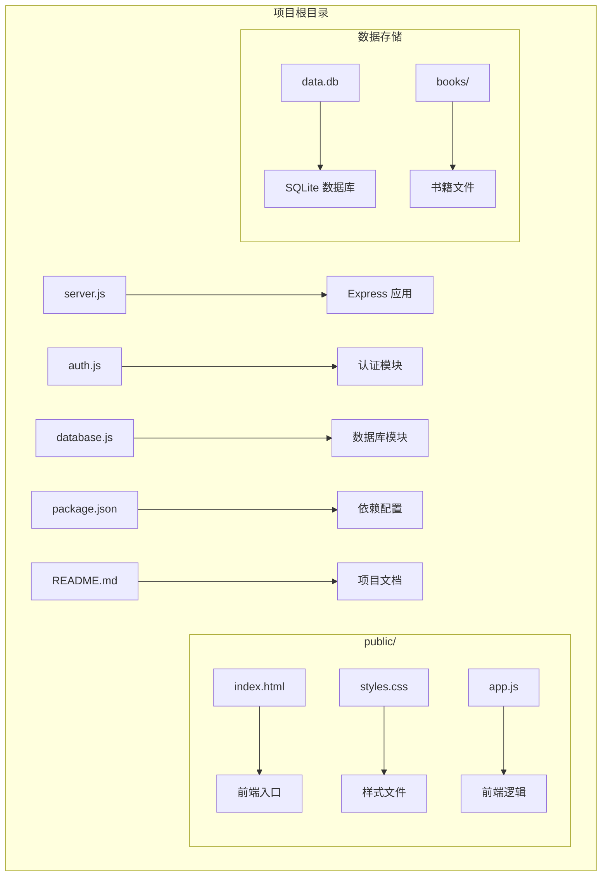

**图表来源**
- [server.js:1-50](file://server.js#L1-L50)
- [auth.js:1-20](file://auth.js#L1-L20)
- [database.js:1-20](file://database.js#L1-L20)

**章节来源**
- [server.js:1-50](file://server.js#L1-L50)
- [package.json:1-23](file://package.json#L1-L23)

## 核心组件

认证系统由三个核心组件构成：

### 1. 认证模块 (auth.js)
负责处理用户认证相关的所有功能：
- JWT 令牌生成和验证
- 用户注册和登录处理
- 认证中间件实现
- 用户信息查询

### 2. 数据库模块 (database.js)
提供数据库连接和操作封装：
- SQLite 数据库初始化
- 用户表结构定义
- API 密钥存储
- 数据库查询方法

### 3. Express 应用 (server.js)
主服务器应用，集成认证功能：
- 路由定义和管理
- 中间件配置
- API 端点实现

**章节来源**
- [auth.js:1-80](file://auth.js#L1-L80)
- [database.js:1-146](file://database.js#L1-L146)
- [server.js:1-50](file://server.js#L1-L50)

## 架构概览

认证系统的整体架构采用分层设计：

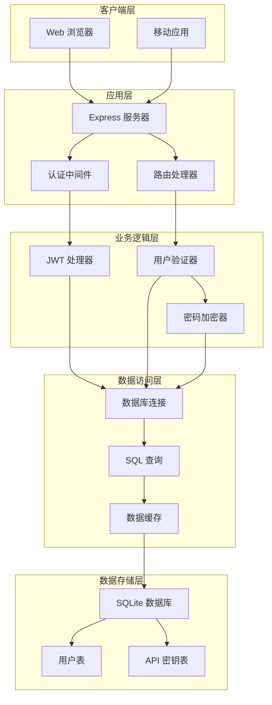

**图表来源**
- [server.js:30-45](file://server.js#L30-L45)
- [auth.js:9-27](file://auth.js#L9-L27)
- [database.js:69-80](file://database.js#L69-L80)

## 详细组件分析

### 认证模块架构

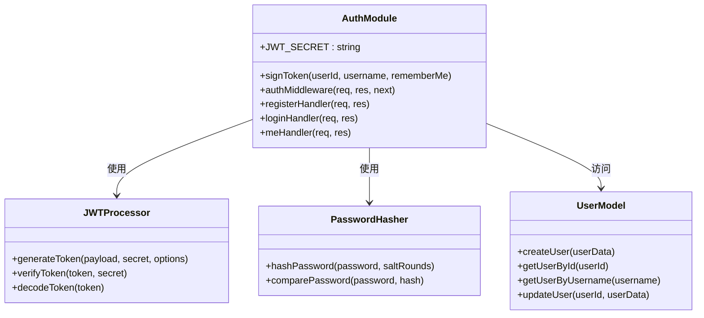

**图表来源**
- [auth.js:1-80](file://auth.js#L1-L80)

### 数据库设计

认证系统使用 SQLite 数据库存储用户信息和相关数据：

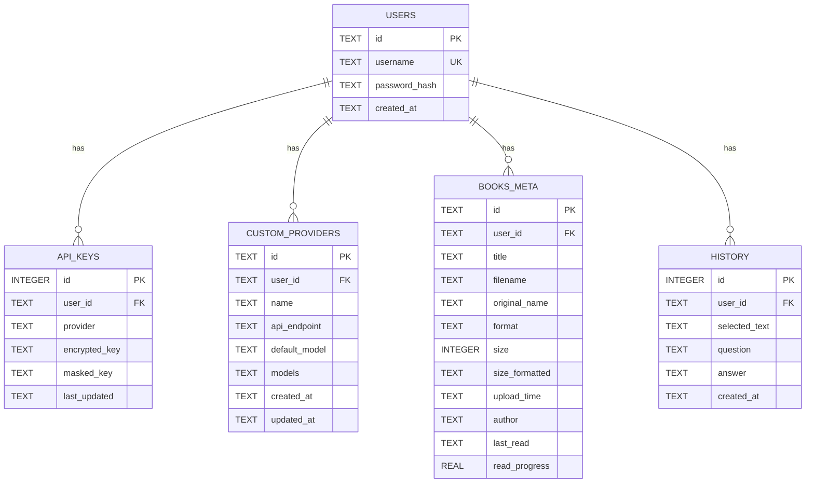

**图表来源**
- [database.js:81-135](file://database.js#L81-L135)

**章节来源**
- [auth.js:1-80](file://auth.js#L1-L80)
- [database.js:81-135](file://database.js#L81-L135)

## JWT 认证机制

### 令牌生成流程

JWT 令牌的生成过程包含以下步骤：

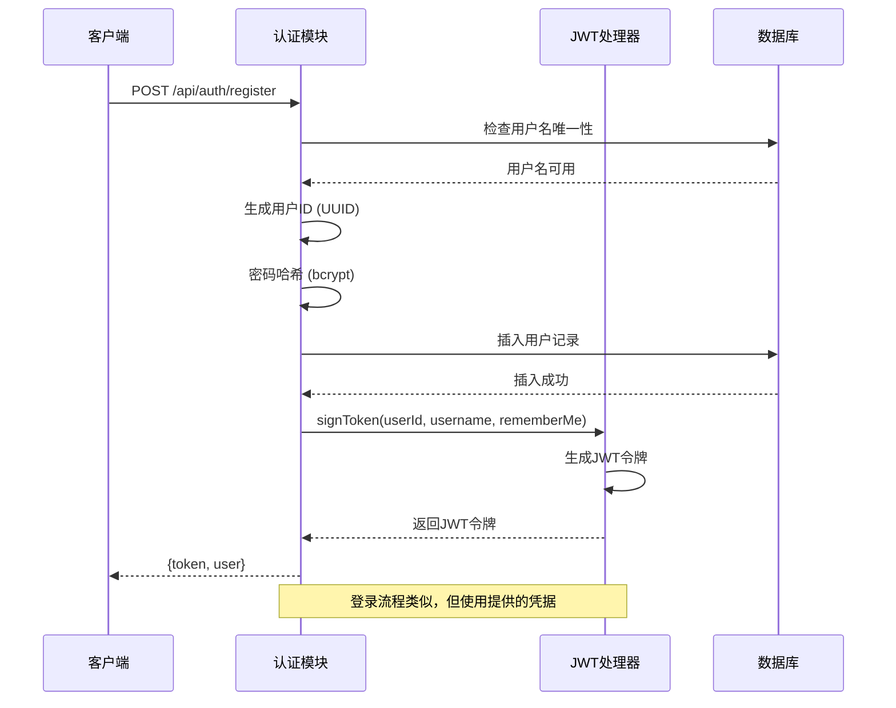

**图表来源**
- [auth.js:29-55](file://auth.js#L29-L55)
- [auth.js:9-12](file://auth.js#L9-L12)

### 令牌验证流程

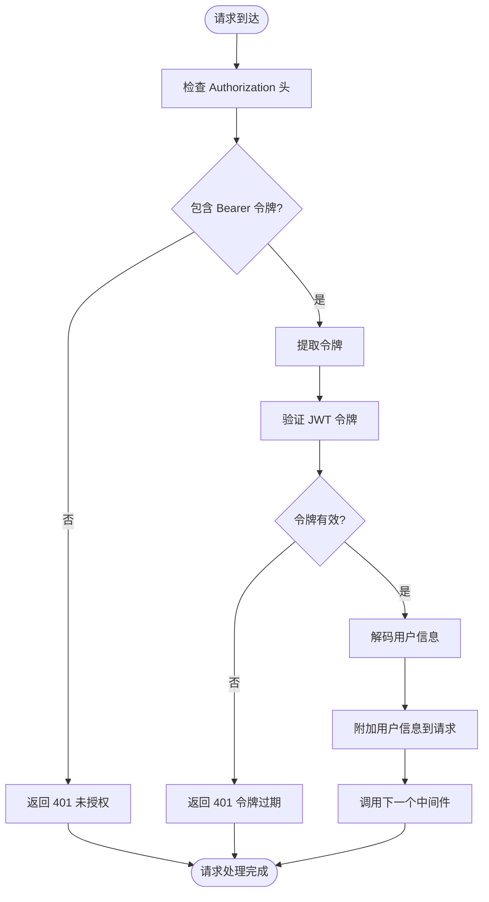

**图表来源**
- [auth.js:14-27](file://auth.js#L14-L27)

**章节来源**
- [auth.js:9-27](file://auth.js#L9-L27)

## 用户注册流程

用户注册流程确保新用户能够安全地创建账户：

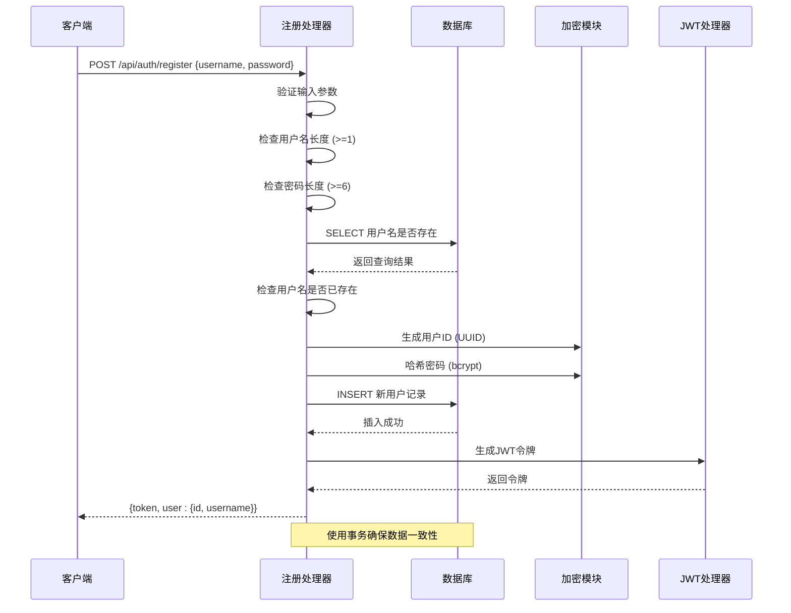

**图表来源**
- [auth.js:29-55](file://auth.js#L29-L55)

### 注册验证规则

注册流程包含严格的输入验证：

| 验证类型 | 规则 | 错误消息 |
|---------|------|----------|
| 用户名 | 必填且为字符串 | 请输入用户名 |
| 用户名长度 | 至少1个字符 | 用户名长度不足 |
| 密码 | 必填且为字符串 | 密码至少6位 |
| 密码长度 | 至少6个字符 | 密码长度不足 |
| 用户名唯一性 | 数据库查询确认 | 用户名已存在 |

**章节来源**
- [auth.js:29-55](file://auth.js#L29-L55)

## 用户登录流程

用户登录流程验证用户凭据并颁发访问令牌：

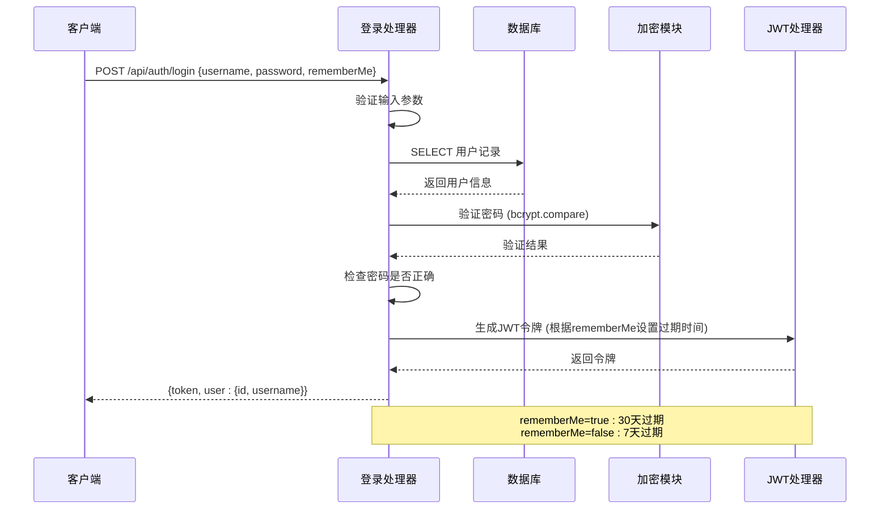

**图表来源**
- [auth.js:57-73](file://auth.js#L57-L73)
- [auth.js:9-12](file://auth.js#L9-L12)

### 登录验证流程

登录验证包含多层安全检查：

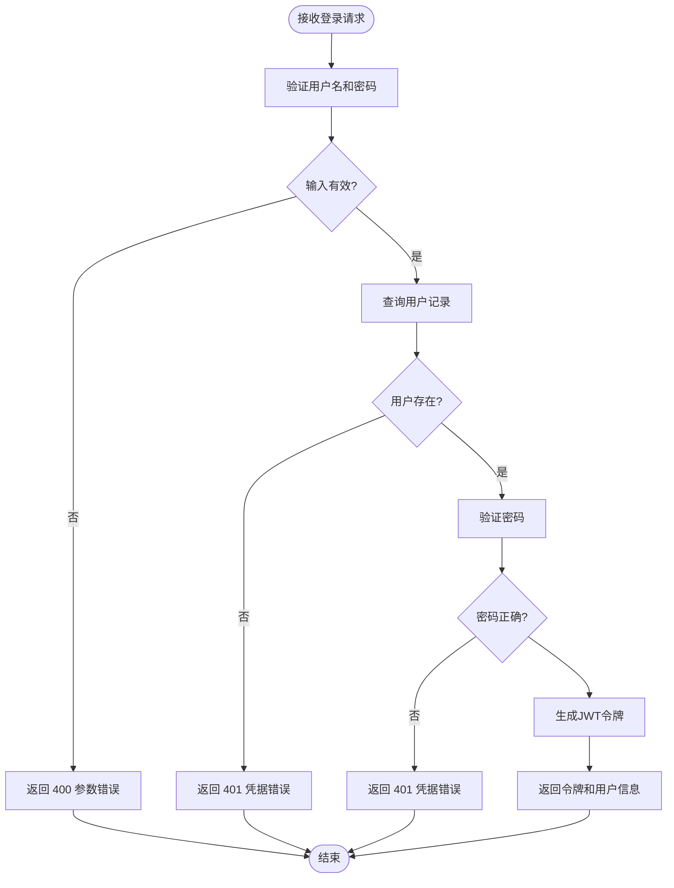

**图表来源**
- [auth.js:57-73](file://auth.js#L57-L73)

**章节来源**
- [auth.js:57-73](file://auth.js#L57-L73)

## 认证中间件工作原理

认证中间件是整个认证系统的核心组件，负责拦截所有受保护的请求：

### 中间件执行流程

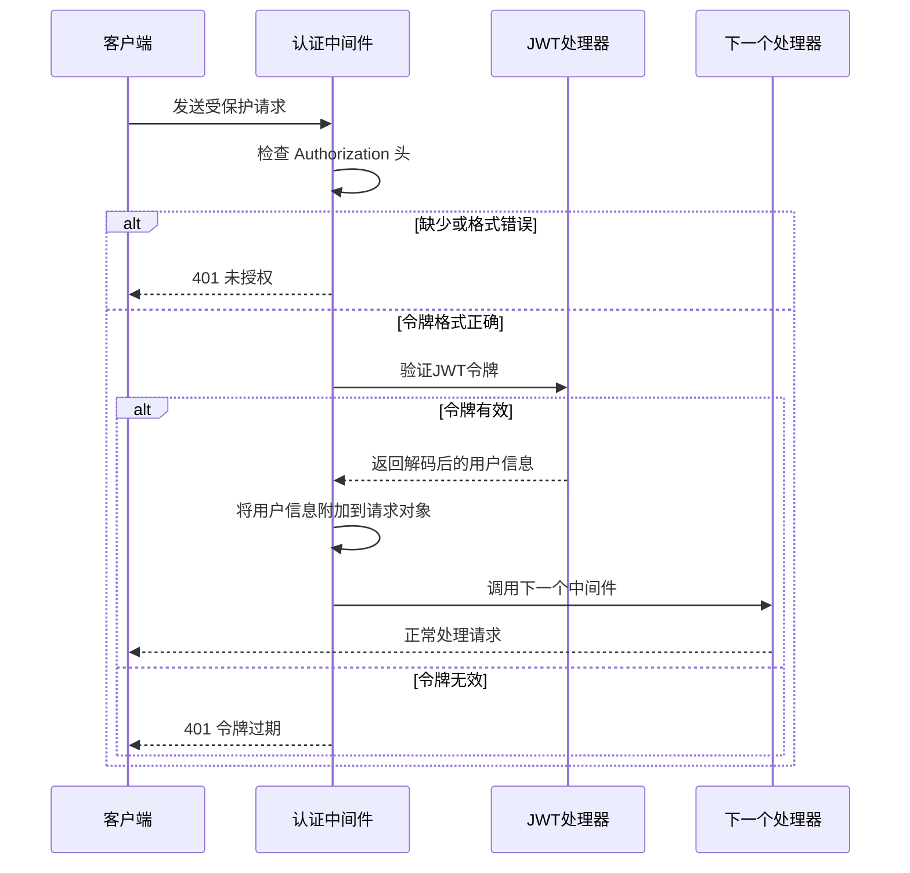

**图表来源**
- [auth.js:14-27](file://auth.js#L14-L27)

### 中间件配置策略

认证中间件采用全局应用策略：

```mermaid
graph LR
subgraph "路由配置"
A[/api/auth/register] --> B[无认证]
C[/api/auth/login] --> B
D[/api/auth/me] --> E[需要认证]
F[/api/books/*] --> E
G[/api/key/*] --> E
H[/api/providers/*] --> E
I[/api/ask*] --> E
end
subgraph "中间件应用"
J[authMiddleware] --> K[全局应用到 /api 路由]
end
K --> E
B -.-> A
B -.-> C
E -.-> D
E -.-> F
E -.-> G
E -.-> H
E -.-> I
```

**图表来源**
- [server.js:37-42](file://server.js#L37-L42)

**章节来源**
- [auth.js:14-27](file://auth.js#L14-L27)
- [server.js:37-42](file://server.js#L37-L42)

## 路由使用示例

### 基本认证路由

所有受保护的 API 路由都需要在请求头中包含有效的 JWT 令牌：

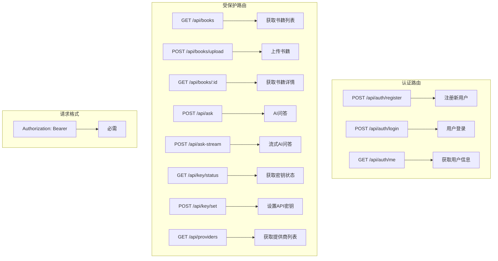

**图表来源**
- [server.js:37-42](file://server.js#L37-L42)
- [README.md:164-173](file://README.md#L164-L173)

### 认证失败处理

当认证失败时，系统返回标准化的错误响应：

| 状态码 | 错误类型 | 错误消息 | 处理建议 |
|--------|----------|----------|----------|
| 400 | 参数错误 | 请输入用户名和密码 | 检查请求参数格式 |
| 400 | 参数错误 | 用户名或密码错误 | 确认用户名和密码 |
| 401 | 未授权 | 请先登录 | 发送有效的认证令牌 |
| 401 | 未授权 | 登录已过期，请重新登录 | 重新登录获取新令牌 |
| 400 | 参数错误 | 请输入用户名 | 检查用户名格式 |
| 400 | 参数错误 | 密码至少6位 | 确保密码长度符合要求 |
| 400 | 参数错误 | 用户名已存在 | 选择其他用户名 |

**章节来源**
- [auth.js:29-73](file://auth.js#L29-L73)

## 安全最佳实践

### 密码安全

系统采用 bcrypt 进行密码哈希存储：

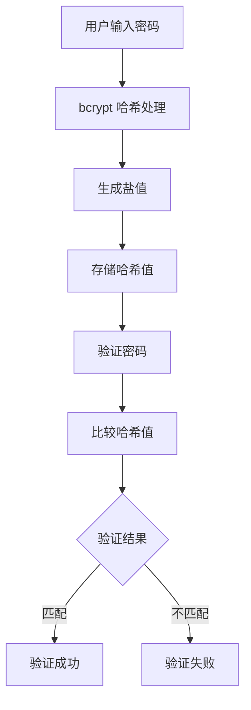

**图表来源**
- [auth.js:49](file://auth.js#L49)

### 令牌安全管理

JWT 令牌的安全配置：

| 配置项 | 值 | 说明 |
|--------|----|------|
| JWT_SECRET | 环境变量或随机生成 | 用于签名和验证令牌 |
| 过期时间 | 7天或30天 | 根据 rememberMe 参数决定 |
| 签名算法 | HS256 | 使用对称密钥签名 |
| 令牌格式 | Bearer Token | 标准化的认证头格式 |

### 数据库安全

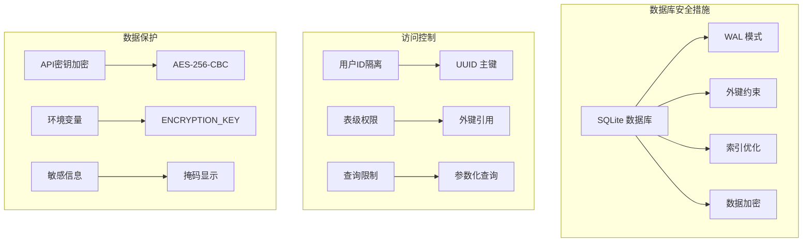

**图表来源**
- [database.js:78-79](file://database.js#L78-L79)
- [server.js:44-67](file://server.js#L44-L67)

**章节来源**
- [auth.js:49](file://auth.js#L49)
- [database.js:78-79](file://database.js#L78-L79)
- [server.js:44-67](file://server.js#L44-L67)

## 故障排除指南

### 常见认证问题

| 问题描述 | 可能原因 | 解决方案 |
|----------|----------|----------|
| 401 未授权错误 | 缺少认证头 | 在请求头添加 `Authorization: Bearer <token>` |
| 401 令牌过期 | 令牌超时 | 重新登录获取新令牌 |
| 400 参数错误 | 请求格式不正确 | 检查用户名和密码格式 |
| 用户名已存在 | 用户名被占用 | 选择其他用户名 |
| 密码验证失败 | 密码错误 | 确认密码是否正确 |

### 调试技巧

1. **检查网络请求**：使用浏览器开发者工具查看请求头和响应
2. **验证令牌格式**：确保令牌以 `Bearer ` 前缀开头
3. **检查环境变量**：确认 `JWT_SECRET` 和 `ENCRYPTION_KEY` 已正确设置
4. **查看服务器日志**：关注认证相关的错误信息

### 性能优化建议

1. **令牌缓存**：在客户端缓存有效的认证令牌
2. **批量请求**：合并多个 API 请求减少认证开销
3. **令牌刷新**：实现令牌自动刷新机制
4. **错误重试**：实现智能的错误重试策略

**章节来源**
- [auth.js:14-27](file://auth.js#L14-L27)
- [auth.js:29-73](file://auth.js#L29-L73)

## 结论

trae02airead 的认证系统实现了现代 Web 应用所需的核心安全功能。通过采用 JWT 令牌、bcrypt 密码哈希、SQLite 数据库等技术，系统提供了安全、可靠的身份验证机制。

### 主要优势

1. **安全性**：采用行业标准的安全实践，包括密码哈希、令牌验证、数据隔离
2. **易用性**：简洁的 API 接口，易于集成和使用
3. **可扩展性**：模块化设计，便于功能扩展和维护
4. **可靠性**：完善的错误处理和故障恢复机制

### 技术亮点

- **JWT 令牌管理**：支持短期和长期会话
- **密码安全存储**：使用 bcrypt 进行密码哈希
- **数据库设计**：合理的表结构和索引优化
- **中间件架构**：统一的认证处理机制

该认证系统为 trae02airead 提供了坚实的安全基础，确保用户数据的安全性和隐私性，同时为用户提供流畅的使用体验。