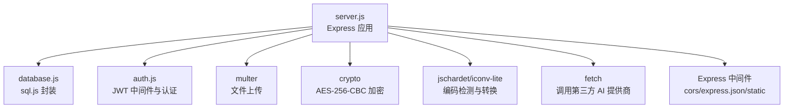
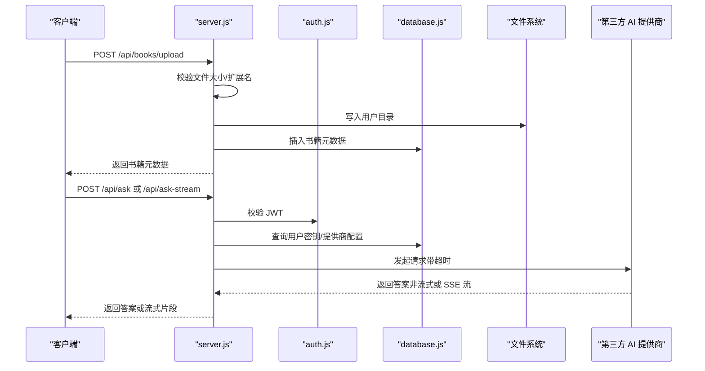
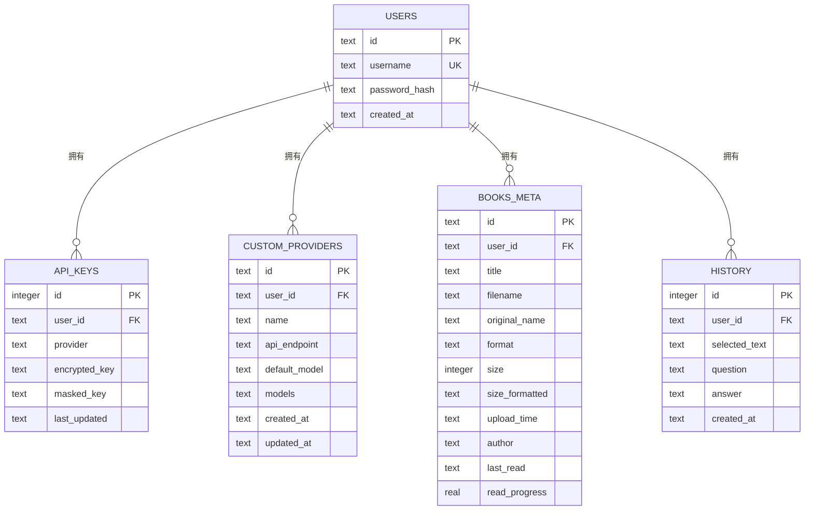
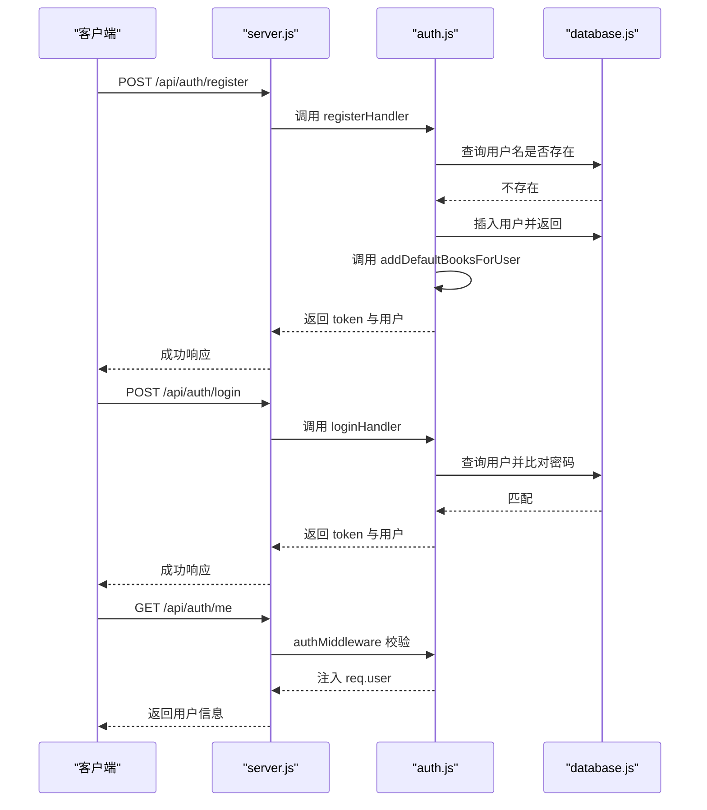
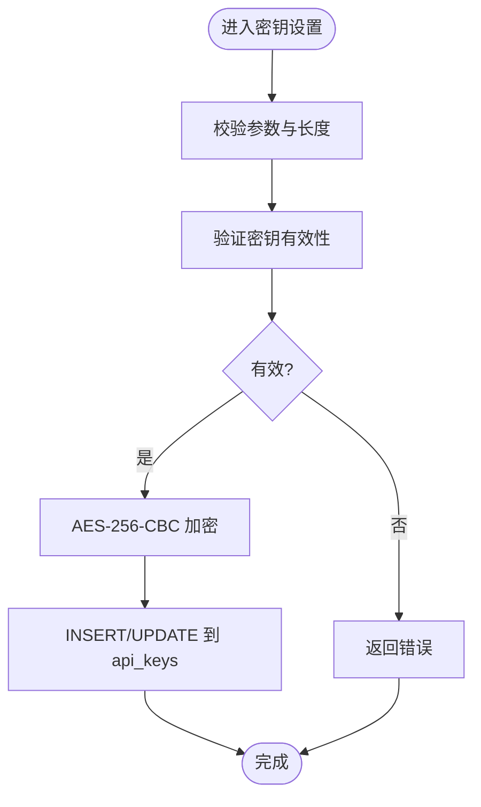
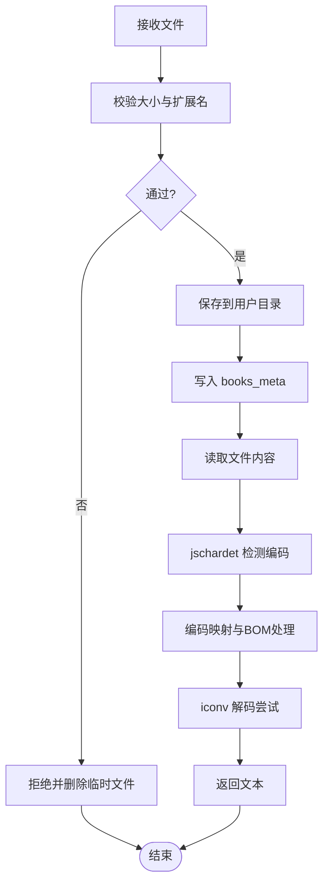
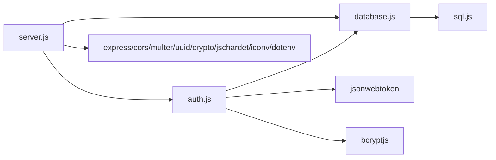

# 核心模块详解

<cite>
**本文引用的文件**
- [server.js](file://server.js)
- [database.js](file://database.js)
- [auth.js](file://auth.js)
- [package.json](file://package.json)
- [README.md](file://README.md)
</cite>

## 目录
1. [简介](#简介)
2. [项目结构](#项目结构)
3. [核心组件](#核心组件)
4. [架构总览](#架构总览)
5. [详细组件分析](#详细组件分析)
6. [依赖关系分析](#依赖关系分析)
7. [性能考量](#性能考量)
8. [故障排查指南](#故障排查指南)
9. [结论](#结论)
10. [附录](#附录)

## 简介
本项目是一个"AI 阅读助手"后端服务，采用 Node.js + Express 构建，结合 sql.js 将 SQLite 数据持久化到内存数据库并在磁盘上持久化文件，提供用户认证、API 密钥管理、自定义 AI 提供商、书籍上传与阅读、以及基于第三方大模型的问答能力（支持非流式与 SSE 流式）。本文档聚焦于 server.js、database.js、auth.js 三大核心模块，深入解析其路由设计、中间件配置、请求处理流程、SQL.js 集成、数据模型、认证与权限控制、错误处理与异常情况，并给出调用流程图与最佳实践建议。

## 项目结构
- server.js：Express 应用入口，负责路由注册、中间件装配、业务逻辑处理（含文件上传、编码检测、AI 调用、SSE 流式输出等）。
- database.js：封装 sql.js，提供数据库初始化、表结构创建、索引、事务与磁盘持久化。
- auth.js：提供 JWT 登录态校验中间件与注册/登录/个人信息接口，包含默认书籍初始化功能。
- package.json：声明依赖与脚本。
- README.md：功能特性、API 文档、部署与注意事项。



图表来源
- [server.js:1-16](file://server.js#L1-L16)
- [database.js:1-67](file://database.js#L1-L67)
- [auth.js:1-79](file://auth.js#L1-L79)

章节来源
- [server.js:1-16](file://server.js#L1-L16)
- [database.js:1-67](file://database.js#L1-L67)
- [auth.js:1-79](file://auth.js#L1-L79)
- [package.json:1-23](file://package.json#L1-L23)

## 核心组件
- server.js：路由与业务中枢，包含认证中间件挂载、API 密钥管理、提供商管理、书籍上传与阅读、AI 问答（非流式与 SSE 流式）。
- database.js：基于 sql.js 的数据库封装，提供 prepare/all/run/exec/pragma/close 等方法，并在每次写操作后持久化到 data.db。
- auth.js：JWT 中间件与注册/登录/个人信息接口，支持"记住我"7天与30天有效期，包含默认书籍初始化功能。

章节来源
- [server.js:30-899](file://server.js#L30-L899)
- [database.js:69-146](file://database.js#L69-L146)
- [auth.js:9-79](file://auth.js#L9-L79)

## 架构总览
整体架构围绕"Express + sql.js + JWT + 第三方 AI 提供商"的组合展开：
- Express 提供 HTTP 服务与路由分发；
- sql.js 将 SQLite 数据库映射到内存对象并通过文件系统持久化；
- JWT 用于用户会话与权限控制；
- 多个 AI 提供商（内置与自定义）通过统一配置与密钥管理；
- 文件上传采用 Multer，文本文件通过编码检测与转换保障阅读体验。

```mermaid
graph TB
subgraph "客户端"
FE["前端应用<br/>public/app.js"]
end
subgraph "服务端"
S["Express 服务<br/>server.js"]
DB["sql.js 数据库<br/>database.js"]
AUTH["JWT 中间件<br/>auth.js"]
FS["文件系统<br/>books/{userId}"]
end
FE --> |"HTTP 请求"| S
S --> |"鉴权"| AUTH
S --> |"数据库访问"| DB
S --> |"文件读写"| FS
S --> |"AI 调用"||"第三方提供商"
```

图表来源
- [server.js:30-899](file://server.js#L30-L899)
- [database.js:69-146](file://database.js#L69-L146)
- [auth.js:14-27](file://auth.js#L14-L27)

## 详细组件分析

### server.js：路由与请求处理
- 中间件装配
  - CORS、JSON 解析、静态资源托管 public 目录。
  - 认证中间件挂载在 /api 前缀下，除注册/登录外均需携带 Bearer Token。
- 路由分层
  - 认证：/api/auth/register、/api/auth/login、/api/auth/me
  - API 密钥：/api/key/status、/api/key/set、/api/key/verify、/api/key
  - 提供商：/api/providers、/api/providers/:id（增删改）
  - 书籍：/api/books、/api/books/upload、/api/books/:id、/api/books/:id/download、/api/books/:id/progress
  - AI 问答：/api/ask（非流式）、/api/ask-stream（SSE 流式）
- 关键处理流程
  - 文件上传：使用 Multer，按用户 ID 创建独立目录；对文件大小与扩展名进行校验；TXT 文件进行编码检测与转换。
  - API 密钥：支持 UI 设置与环境变量两种来源；密钥使用 AES-256-CBC 加密存储；支持验证与删除。
  - 提供商：内置智谱 AI 与硅基流动；支持自定义提供商，独立存储密钥与模型配置。
  - AI 调用：非流式与流式两种模式，均支持超时控制与错误处理；流式输出使用 SSE。
  - 书籍阅读：TXT 在线阅读时自动检测编码；其他格式提供下载链接；维护阅读进度与最后阅读时间。
- 错误处理
  - 统一返回 400/401/404/500 状态码与错误信息；SSE 流式场景在异常时发送 error 事件并结束连接。



图表来源
- [server.js:465-514](file://server.js#L465-L514)
- [server.js:618-688](file://server.js#L618-L688)
- [server.js:690-827](file://server.js#L690-L827)
- [auth.js:14-27](file://auth.js#L14-L27)
- [database.js:69-146](file://database.js#L69-L146)

章节来源
- [server.js:30-899](file://server.js#L30-L899)

### database.js：SQL.js 集成与数据模型
- 初始化与持久化
  - 使用 initSqlJs 加载 sql.js；若 data.db 存在则从磁盘加载，否则新建内存数据库。
  - 每次执行 run/exec 后调用 export 并写回磁盘，确保数据持久化。
  - 设置 PRAGMA：journal_mode=WAL、foreign_keys=ON。
- 表结构与索引
  - users：用户基本信息（id、username、password_hash、created_at）
  - api_keys：用户密钥（user_id 引用 users，唯一约束 user_id+provider）
  - custom_providers：自定义提供商（复合主键 id+user_id）
  - books_meta：书籍元数据（复合主键 id+user_id）
  - history：问答历史（user_id 引用 users）
  - 索引：api_keys(user_id)、custom_providers(user_id)、books_meta(user_id)、history(user_id, created_at DESC)
- 访问器
  - prepare：get/all/run；run 后自动保存到磁盘
  - exec：执行 DDL/DML 并保存
  - pragma：设置 PRAGMA
  - close：保存并关闭数据库



图表来源
- [database.js:81-135](file://database.js#L81-L135)

章节来源
- [database.js:69-146](file://database.js#L69-L146)

### auth.js：JWT 实现与权限控制
- 中间件
  - 从 Authorization 头提取 Bearer Token，校验失败返回 401 并标记 needAuth=true。
- 注册
  - 校验用户名与密码长度；去空白；查重；使用 bcrypt 生成哈希；插入 users；签发 JWT（默认7天，记住我30天）。
- 登录
  - 校验用户名与密码；bcrypt 校验；签发 JWT。
- 个人信息
  - 返回当前用户信息。
- 默认书籍初始化
  - 用户首次注册时自动创建默认书籍目录并添加《百年孤独》等预设书籍。



图表来源
- [auth.js:29-77](file://auth.js#L29-L77)
- [database.js:69-146](file://database.js#L69-L146)

章节来源
- [auth.js:9-79](file://auth.js#L9-L79)

### API/服务组件：密钥与提供商管理
- 密钥管理
  - /api/key/status：列出用户各提供商密钥状态与遮罩密钥。
  - /api/key/set：设置指定提供商密钥；先验证再加密存储；支持覆盖更新。
  - /api/key/verify：验证密钥有效性；支持传入新密钥或使用已存密钥解密验证。
  - /api/key：删除指定提供商或全部密钥。
- 提供商管理
  - /api/providers：获取可用提供商列表（内置+自定义）。
  - /api/providers：新增自定义提供商；先验证密钥，再插入 custom_providers 与 api_keys。
  - /api/providers/:id：更新/删除自定义提供商；删除时级联清理对应密钥。



图表来源
- [server.js:239-295](file://server.js#L239-L295)

章节来源
- [server.js:239-461](file://server.js#L239-L461)

### 复杂逻辑组件：文件上传与编码检测
- 文件上传
  - 使用 Multer，destination 按用户 ID 创建目录；filename 使用 UUID；限制大小与扩展名。
  - 上传成功后写入 books_meta 元数据。
- 编码检测与转换
  - 通过 jschardet 检测编码；映射常见编码；UTF-8 BOM 处理；fallback 到 gbk/big5/utf-16le 等；最终返回文本内容。



图表来源
- [server.js:123-132](file://server.js#L123-L132)
- [server.js:81-121](file://server.js#L81-L121)
- [server.js:465-514](file://server.js#L465-L514)

章节来源
- [server.js:123-132](file://server.js#L123-L132)
- [server.js:81-121](file://server.js#L81-L121)
- [server.js:465-514](file://server.js#L465-L514)

## 依赖关系分析
- server.js 依赖
  - database.js：initDB/getDB、prepare/all/run/exec/pragma/close
  - auth.js：authMiddleware/registerHandler/loginHandler/meHandler
  - 外部库：express、cors、multer、uuid、crypto、jschardet、iconv、dotenv
- database.js 依赖
  - sql.js：initSqlJs、Database、export、run、getRowsModified
- auth.js 依赖
  - jsonwebtoken、bcryptjs、uuid、database.js



图表来源
- [server.js:12-13](file://server.js#L12-L13)
- [database.js:1](file://database.js#L1)
- [auth.js:1-5](file://auth.js#L1-L5)
- [package.json:10-22](file://package.json#L10-L22)

章节来源
- [server.js:12-13](file://server.js#L12-L13)
- [database.js:1](file://database.js#L1)
- [auth.js:1-5](file://auth.js#L1-L5)
- [package.json:10-22](file://package.json#L10-L22)

## 性能考量
- 数据库
  - WAL 模式提升并发写入性能；foreign_keys=ON 保证参照完整性。
  - 索引覆盖常用查询路径：api_keys(user_id)、custom_providers(user_id)、books_meta(user_id)、history(user_id, created_at DESC)。
- 文件读写
  - 上传前严格校验大小与扩展名，避免无效 IO。
  - 编码检测仅在 TXT 阅读时触发，减少不必要的 CPU 开销。
- AI 调用
  - 统一超时控制（60 秒），防止阻塞；流式输出使用 SSE，降低单次响应体积。
- 加密
  - AES-256-CBC 加密密钥存储，注意 ENCRYPTION_KEY 变更会导致旧密钥不可解密。

章节来源
- [database.js:78-135](file://database.js#L78-L135)
- [server.js:734-765](file://server.js#L734-L765)
- [server.js:834-867](file://server.js#L834-L867)

## 故障排查指南
- 认证失败
  - 确认 Authorization 头格式为 Bearer Token；检查 JWT_SECRET 是否一致；确认 token 未过期。
- API 密钥无效
  - 使用 /api/key/verify 验证；检查 PROVIDER 配置与密钥长度；确认环境变量是否正确设置。
- 文件上传失败
  - 检查文件大小与扩展名；确认用户目录可写；查看日志中的错误码。
- AI 调用错误
  - 查看 401/403/400 等状态码；检查提供商端点与模型；确认网络可达与超时设置。
- 数据库异常
  - 确认 data.db 可读写；检查 PRAGMA 设置；必要时重建表结构。

章节来源
- [auth.js:14-27](file://auth.js#L14-L27)
- [server.js:297-316](file://server.js#L297-L316)
- [server.js:465-514](file://server.js#L465-L514)
- [server.js:675-687](file://server.js#L675-L687)
- [database.js:69-146](file://database.js#L69-L146)

## 结论
本项目通过 Express + sql.js + JWT + 第三方 AI 提供商构建了轻量、可扩展且具备良好用户体验的阅读辅助系统。server.js 作为中枢，整合了认证、密钥管理、提供商管理、书籍上传与阅读、以及 AI 问答（含流式输出）。database.js 提供了可靠的本地数据库封装与持久化策略，auth.js 则确保了用户会话的安全与可控。整体架构清晰、模块职责分明，适合进一步扩展更多 AI 提供商与功能。

## 附录
- 环境变量建议
  - ENCRYPTION_KEY：固定 64 字符十六进制密钥，用于 AES-256-CBC 加密；变更后旧密钥不可解密。
  - ZHIPU_API_KEY、SILICONFLOW_API_KEY、CUSTOM_API_KEY：分别对应内置与自定义提供商密钥。
  - AI_API_KEY、AI_MODEL：作为通用兜底密钥与默认模型。
- 最佳实践
  - 始终通过 /api/key/set 设置密钥并使用 /api/key/verify 验证；
  - 使用 /api/providers 管理提供商，避免硬编码端点与模型；
  - 上传前严格校验文件大小与扩展名，避免无效 IO；
  - 对外暴露的 API 均需携带 Bearer Token；
  - 定期备份 data.db 与 books/ 目录。

章节来源
- [README.md:105-120](file://README.md#L105-L120)
- [server.js:260-295](file://server.js#L260-L295)
- [server.js:366-423](file://server.js#L366-L423)