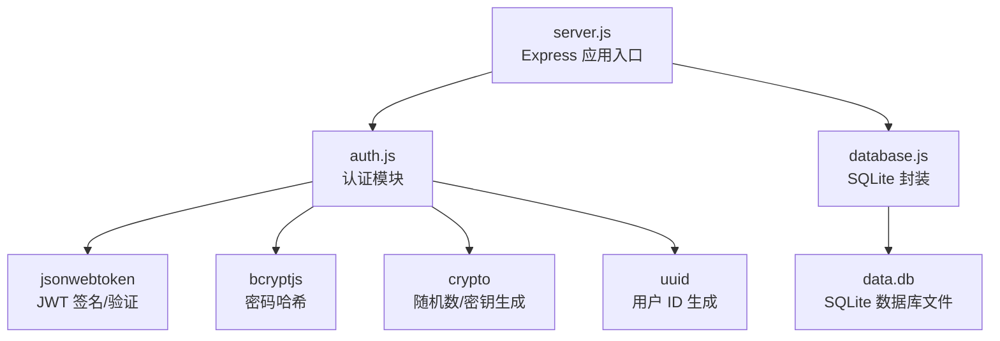
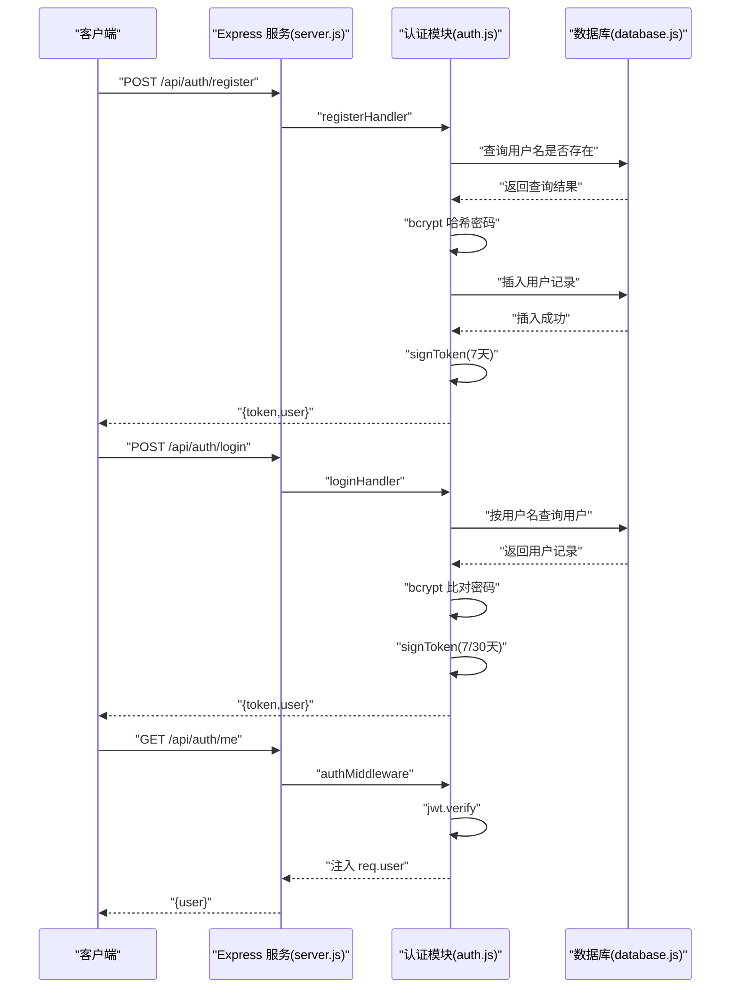
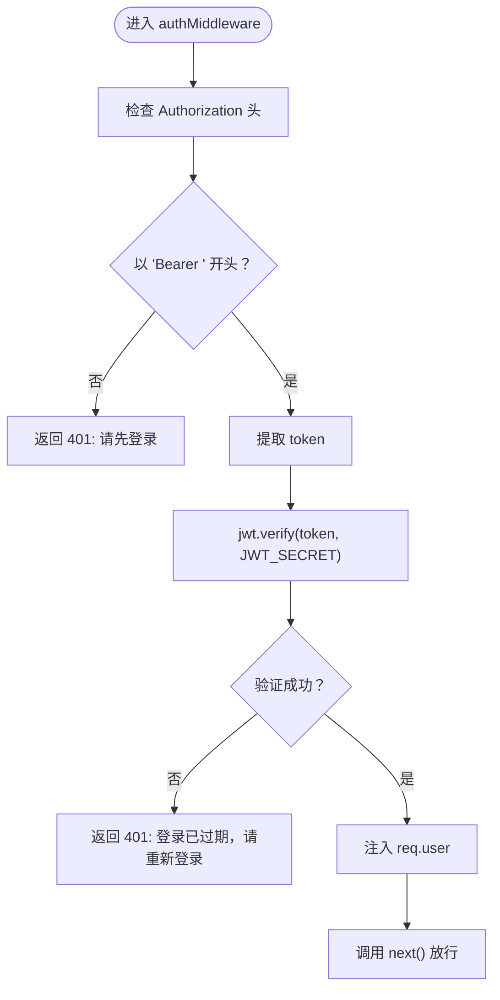
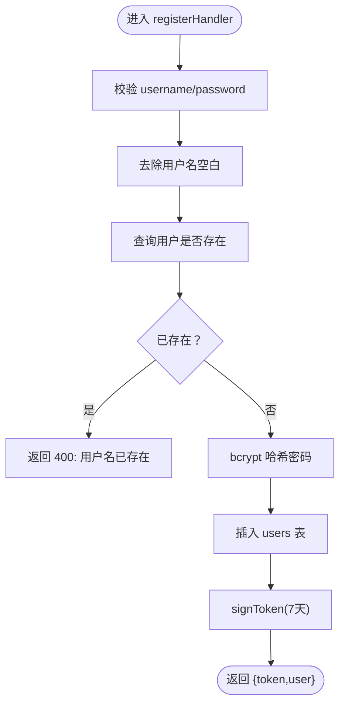
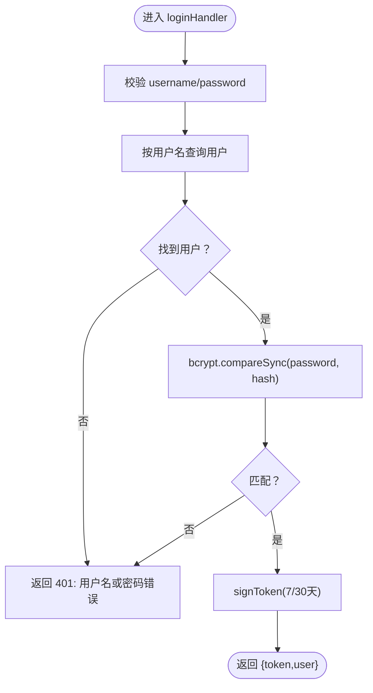
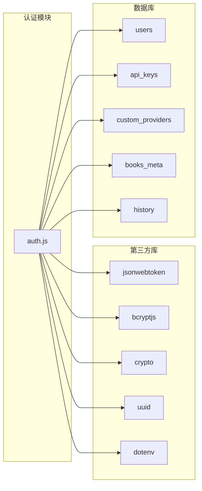
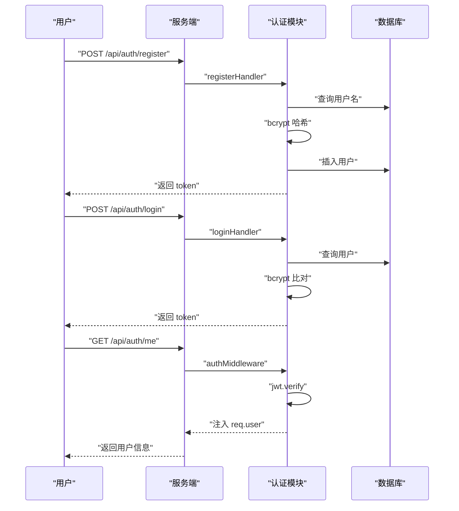

# 认证模块 (auth.js)

<cite>
**本文引用的文件**
- [auth.js](file://auth.js)
- [server.js](file://server.js)
- [database.js](file://database.js)
- [package.json](file://package.json)
- [README.md](file://README.md)
</cite>

## 目录
1. [简介](#简介)
2. [项目结构](#项目结构)
3. [核心组件](#核心组件)
4. [架构总览](#架构总览)
5. [详细组件分析](#详细组件分析)
6. [依赖关系分析](#依赖关系分析)
7. [性能考量](#性能考量)
8. [故障排查指南](#故障排查指南)
9. [结论](#结论)
10. [附录](#附录)

## 简介
本文件为 trae02airead 项目的认证模块（auth.js）技术文档，聚焦于 JWT 认证机制的实现细节，包括：
- 令牌生成算法与签名验证流程
- 过期时间管理与“记住我”刷新策略
- 用户注册流程：密码加密、信息校验、重复账户检查、数据库存储
- 用户登录机制：凭据验证、密码哈希比对、令牌发放与会话管理
- 认证中间件：请求拦截、令牌解析、身份验证与权限检查
- 安全最佳实践、常见问题与攻击防护建议

## 项目结构
认证模块位于根目录下的 auth.js，配合 server.js 的路由挂载与 database.js 的 SQLite 数据库封装共同完成用户认证与授权。

图表来源
- [server.js:30-42](file://server.js#L30-L42)
- [auth.js:1-80](file://auth.js#L1-L80)
- [database.js:69-138](file://database.js#L69-L138)

章节来源
- [server.js:30-42](file://server.js#L30-L42)
- [auth.js:1-80](file://auth.js#L1-L80)
- [database.js:69-138](file://database.js#L69-L138)

## 核心组件
- JWT 中间件：拦截受保护路由，解析 Authorization 头，验证令牌并注入用户上下文
- 注册处理器：校验用户名与密码、去空白、查重、生成 UUID、bcrypt 哈希、入库、签发 JWT
- 登录处理器：校验必填字段、按用户名查询用户、bcrypt 比对、签发 JWT
- me 处理器：返回当前用户信息（由中间件注入）
- 工具函数：signToken（根据 rememberMe 决定过期时间）

章节来源
- [auth.js:9-27](file://auth.js#L9-L27)
- [auth.js:29-77](file://auth.js#L29-L77)

## 架构总览
认证模块在服务启动时初始化数据库并挂载路由，随后通过全局中间件对后续 API 请求进行统一鉴权。

图表来源
- [server.js:37-42](file://server.js#L37-L42)
- [auth.js:9-27](file://auth.js#L9-L27)
- [auth.js:29-77](file://auth.js#L29-L77)
- [database.js:81-87](file://database.js#L81-L87)

## 详细组件分析

### JWT 中间件（authMiddleware）
职责与流程：
- 从请求头提取 Authorization: Bearer <token>
- 若缺少或格式不正确，返回 401 并提示需要登录
- 使用 JWT_SECRET 验证令牌签名与有效性
- 成功后将用户信息注入 req.user，放行；失败返回 401 并提示登录已过期

图表来源
- [auth.js:14-27](file://auth.js#L14-L27)

章节来源
- [auth.js:14-27](file://auth.js#L14-L27)

### 令牌签发（signToken）
- 根据 rememberMe 参数决定过期时间：false 为 7 天，true 为 30 天
- 使用 JWT_SECRET 对 {id, username} 进行签名，返回 JWT 字符串

章节来源
- [auth.js:9-12](file://auth.js#L9-L12)

### 注册流程（registerHandler）
- 输入校验：用户名非空且长度≥1；密码非空且长度≥6
- 去除用户名首尾空白，查询是否存在同名用户
- 不存在则生成 UUID 作为用户 ID，使用 bcrypt 以默认成本（10）生成哈希
- 插入 users 表（id, username, password_hash）
- 调用 signToken(rememberMe=false)，返回 token 与用户信息

图表来源
- [auth.js:29-55](file://auth.js#L29-L55)
- [database.js:81-87](file://database.js#L81-L87)

章节来源
- [auth.js:29-55](file://auth.js#L29-L55)
- [database.js:81-87](file://database.js#L81-L87)

### 登录流程（loginHandler）
- 输入校验：用户名与密码均需存在
- 查询用户并进行 bcrypt 比对
- 比对成功后调用 signToken（rememberMe 由请求体传入）
- 返回 token 与用户信息

图表来源
- [auth.js:57-73](file://auth.js#L57-L73)

章节来源
- [auth.js:57-73](file://auth.js#L57-L73)

### me 处理器（meHandler）
- 直接返回 req.user（由 authMiddleware 注入）

章节来源
- [auth.js:75-77](file://auth.js#L75-L77)

### 服务器路由挂载（server.js）
- 初始化数据库并启用 CORS、JSON 解析、静态资源
- 挂载注册与登录接口
- 在 /api 前缀下启用 authMiddleware，使后续所有 /api 路由均受保护
- 挂载 me 接口

章节来源
- [server.js:30-42](file://server.js#L30-L42)

## 依赖关系分析
- 依赖库
  - jsonwebtoken：JWT 签名与验证
  - bcryptjs：密码哈希与比对
  - crypto：随机数生成与密钥派生
  - uuid：用户 ID 生成
  - dotenv：环境变量加载
- 数据库
  - users 表：存储用户凭证与创建时间
  - api_keys/custom_providers/books_meta/history：与认证相关的其他业务表（用于理解整体数据模型）

图表来源
- [auth.js:1-80](file://auth.js#L1-L80)
- [database.js:81-135](file://database.js#L81-L135)
- [package.json:10-22](file://package.json#L10-L22)

章节来源
- [auth.js:1-80](file://auth.js#L1-L80)
- [database.js:81-135](file://database.js#L81-L135)
- [package.json:10-22](file://package.json#L10-L22)

## 性能考量
- bcrypt 成本因子：默认 10，平衡安全性与性能；若服务器负载较高，可适当提高成本，但需权衡登录延迟
- JWT 验证：每次受保护请求均需验证签名，开销较小；建议避免在高频路径中重复解析
- 数据库访问：注册/登录均涉及一次查询与一次写入，索引已在 users 上建立（UNIQUE username），可减少重复检查的开销
- 令牌有效期：短期令牌（7 天）降低长期暴露风险；“记住我”（30 天）适合长周期会话场景

[本节为通用指导，不直接分析具体文件]

## 故障排查指南
- 401 未授权
  - Authorization 头缺失或格式错误：确认请求头为 "Bearer <token>"
  - 令牌过期：提示“登录已过期，请重新登录”，需重新登录获取新令牌
- 注册失败
  - 用户名已存在：检查是否重复注册
  - 密码长度不足：确保密码长度≥6
- 登录失败
  - 用户名或密码错误：确认凭据正确
- 中间件未生效
  - 确认 /api 前缀已挂载 authMiddleware
  - 确认后续请求携带正确的 Authorization 头

章节来源
- [auth.js:14-27](file://auth.js#L14-L27)
- [auth.js:29-73](file://auth.js#L29-L73)
- [server.js:37-42](file://server.js#L37-L42)

## 结论
本认证模块采用标准 JWT + bcrypt 的组合方案，实现了简洁可靠的用户认证与授权控制。通过中间件统一拦截、严格的输入校验与密码哈希存储，满足基本的安全需求。结合“记住我”机制与短期令牌策略，在用户体验与安全之间取得平衡。建议在生产环境中进一步强化密钥管理、引入速率限制与审计日志，并考虑支持令牌刷新与登出机制。

[本节为总结性内容，不直接分析具体文件]

## 附录

### 安全最佳实践
- 密钥与令牌
  - JWT_SECRET 必须保密且足够随机；建议使用强随机源生成并妥善保管
  - 令牌应仅通过 HTTPS 传输，避免明文泄露
- 密码安全
  - 使用 bcrypt 存储密码哈希，成本因子可根据硬件能力调整
  - 避免在日志中打印敏感信息（如密码、令牌）
- 令牌安全
  - 合理设置过期时间；对高风险操作可要求二次验证
  - 考虑引入刷新令牌与登出机制，支持撤销单个会话
- 攻击防护
  - 防暴力破解：限制登录尝试次数与频率
  - CSRF 防护：在前端与后端配合下，确保跨站请求可信
  - 输入验证：严格校验用户名与密码长度与格式

[本节为通用指导，不直接分析具体文件]

### 认证流程图（注册/登录/受保护请求）

图表来源
- [server.js:37-42](file://server.js#L37-L42)
- [auth.js:29-77](file://auth.js#L29-L77)