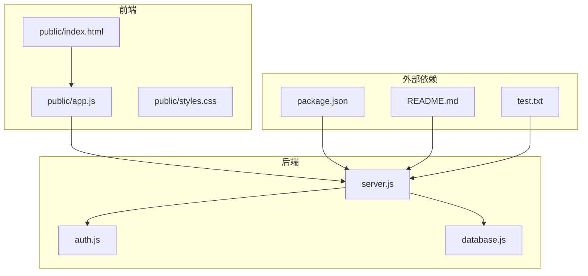
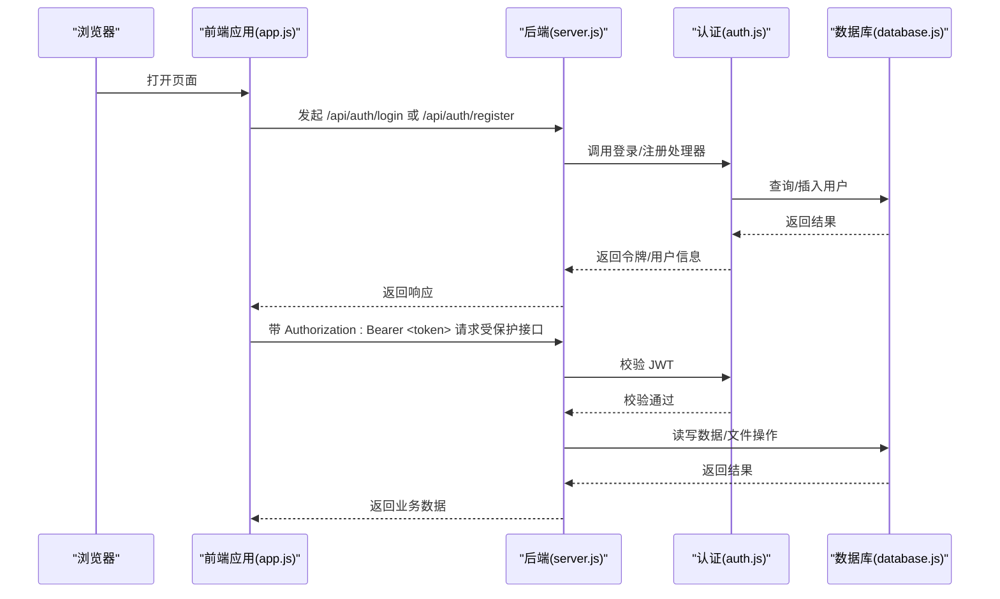
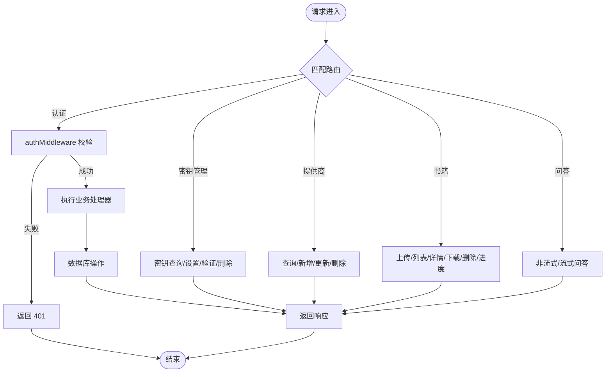
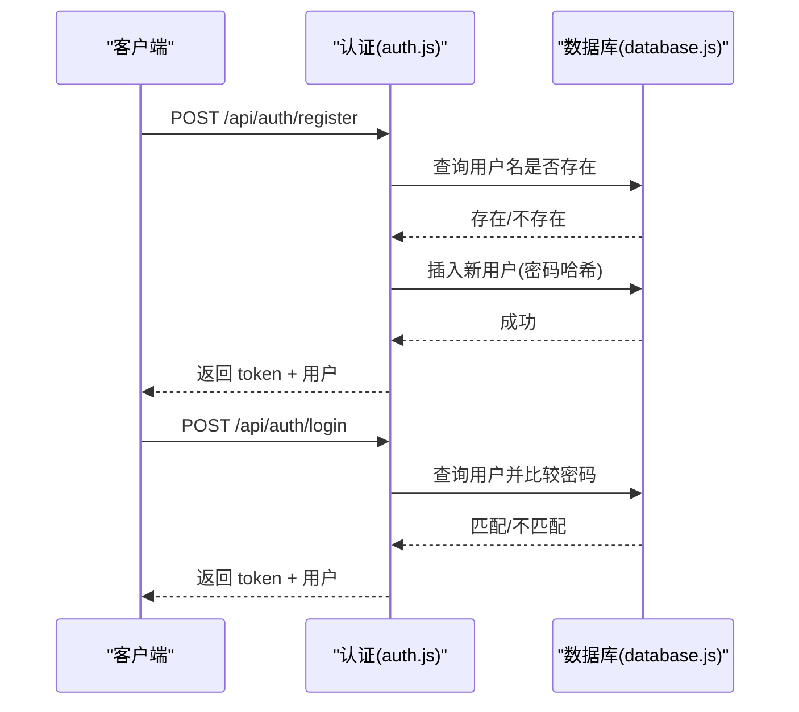
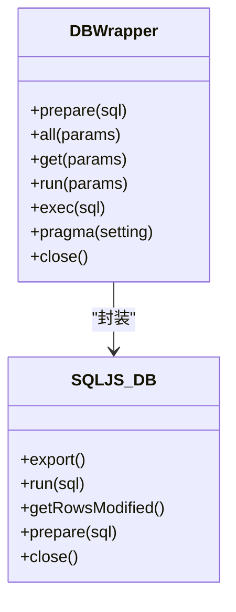
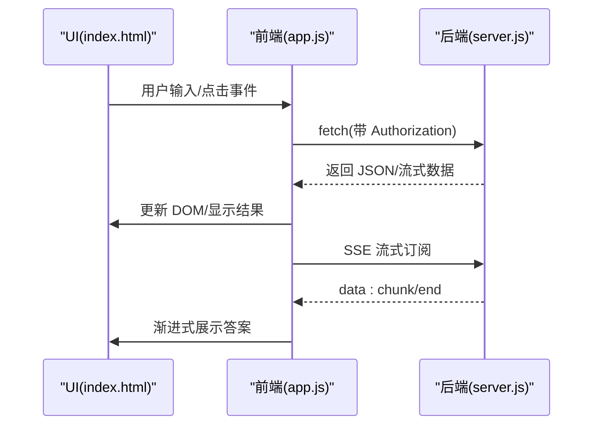
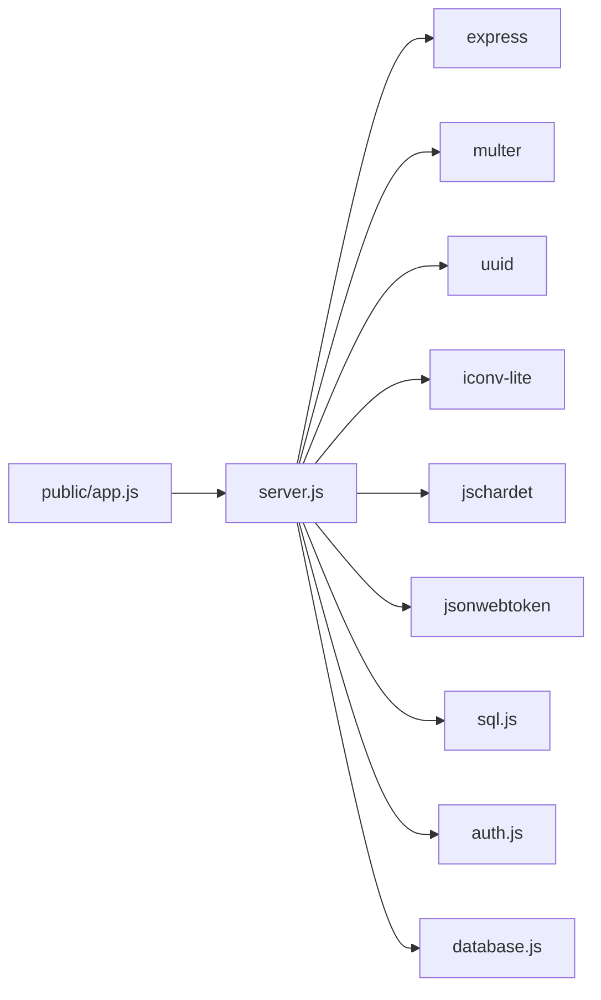

# 调试与测试

<cite>
**本文引用的文件**   
- [server.js](file://server.js)
- [auth.js](file://auth.js)
- [database.js](file://database.js)
- [package.json](file://package.json)
- [public/index.html](file://public/index.html)
- [public/app.js](file://public/app.js)
- [public/styles.css](file://public/styles.css)
- [README.md](file://README.md)
- [test.txt](file://test.txt)
</cite>

## 目录
1. [简介](#简介)
2. [项目结构](#项目结构)
3. [核心组件](#核心组件)
4. [架构总览](#架构总览)
5. [详细组件分析](#详细组件分析)
6. [依赖关系分析](#依赖关系分析)
7. [性能考虑](#性能考虑)
8. [故障排查指南](#故障排查指南)
9. [结论](#结论)
10. [附录](#附录)

## 简介
本指南面向 trae02airead 的开发者与维护者，聚焦于开发过程中的调试与测试实践。内容涵盖：
- 调试技巧与日志策略：后端 Node.js、前端浏览器调试要点与最佳实践
- 错误追踪与异常处理：常见错误类型、定位路径与修复建议
- 单元测试与集成测试：测试框架选择、用例设计与覆盖率建议
- API 接口测试、数据库操作测试、文件上传测试：流程与断言要点
- 性能监控、内存泄漏检测、并发处理测试：工具与方法推荐

## 项目结构
该项目采用“Express 后端 + 原生前端（HTML/CSS/JS）”的单页应用架构，核心模块包括：
- 后端入口与路由：server.js
- 认证中间件与处理器：auth.js
- 数据库封装（SQLite/sql.js）：database.js
- 前端静态资源：public/index.html、public/app.js、public/styles.css
- 依赖与脚本：package.json
- 文档与示例：README.md、test.txt

图表来源
- [server.js:1-100](file://server.js#L1-L100)
- [auth.js:1-80](file://auth.js#L1-L80)
- [database.js:1-146](file://database.js#L1-L146)
- [public/index.html:1-100](file://public/index.html#L1-L100)
- [public/app.js:1-100](file://public/app.js#L1-L100)
- [public/styles.css:1-100](file://public/styles.css#L1-L100)
- [package.json:1-23](file://package.json#L1-L23)
- [README.md:1-100](file://README.md#L1-L100)
- [test.txt:1-1](file://test.txt#L1-L1)

章节来源
- [server.js:1-120](file://server.js#L1-L120)
- [auth.js:1-80](file://auth.js#L1-L80)
- [database.js:1-146](file://database.js#L1-L146)
- [public/index.html:1-120](file://public/index.html#L1-L120)
- [public/app.js:1-120](file://public/app.js#L1-L120)
- [public/styles.css:1-120](file://public/styles.css#L1-L120)
- [package.json:1-23](file://package.json#L1-L23)
- [README.md:1-120](file://README.md#L1-L120)
- [test.txt:1-1](file://test.txt#L1-L1)

## 核心组件
- 后端服务与路由
  - 初始化 Express、CORS、静态资源、JSON 解析
  - 身份认证中间件与注册/登录/个人信息接口
  - API 密钥管理、提供商管理、书籍上传/下载/删除、问答接口（非流式与流式）
- 认证模块
  - JWT 签发与校验、用户注册/登录、当前用户信息
- 数据库模块
  - 基于 sql.js 的 SQLite 封装，提供 prepare/all/run/exec/pragma/close
  - 初始化建表与索引，保证事务与 WAL 模式
- 前端应用
  - 登录/注册、API 密钥配置、提供商切换、书籍上传与列表、问答面板、历史记录

章节来源
- [server.js:1-200](file://server.js#L1-L200)
- [auth.js:1-80](file://auth.js#L1-L80)
- [database.js:1-146](file://database.js#L1-L146)
- [public/app.js:1-200](file://public/app.js#L1-L200)

## 架构总览
后端通过中间件链路处理请求，认证中间件在受保护路由前拦截并校验 JWT；数据库封装负责数据持久化；前端通过 fetch 与后端交互，使用 SSE 处理流式问答。

图表来源
- [server.js:14-42](file://server.js#L14-L42)
- [auth.js:14-77](file://auth.js#L14-L77)
- [database.js:69-138](file://database.js#L69-L138)
- [public/app.js:59-128](file://public/app.js#L59-L128)

## 详细组件分析

### 后端服务与路由（server.js）
- 关键职责
  - 初始化数据库、创建 books 目录、设置 CORS/JSON/静态资源
  - 定义认证路由（注册/登录）、受保护路由（me）
  - 实现 API 密钥管理（查询/设置/验证/删除）
  - 提供商管理（查询/新增/更新/删除）
  - 书籍管理（上传/列表/详情/下载/删除/进度）
  - 问答接口（非流式与流式，含超时与 SSE）
- 调试要点
  - 在关键分支打印请求参数与上下文（例如密钥解析、文件校验、AI 调用）
  - 使用 AbortController 控制长连接，避免僵尸请求
  - 统一错误处理与状态码映射，便于前端识别
- 日志策略
  - 重要事件与错误使用 console.error/console.log
  - 区分业务日志与调试日志，避免生产环境泄露敏感信息

图表来源
- [server.js:37-827](file://server.js#L37-L827)

章节来源
- [server.js:1-899](file://server.js#L1-L899)

### 认证模块（auth.js）
- 关键职责
  - JWT 签发（支持“记住我”7天/30天）
  - 认证中间件：校验 Bearer Token
  - 注册：用户名去空白、密码哈希、唯一性校验
  - 登录：用户名+密码校验、签发令牌
  - 当前用户信息
- 调试与测试建议
  - 注册/登录：构造边界用户名（空/极短）、重复用户名、错误密码
  - JWT：伪造/过期/篡改令牌，验证 401 与 needAuth 字段
  - 中间件：缺失/错误 Authorization 头的场景

图表来源
- [auth.js:29-77](file://auth.js#L29-L77)
- [database.js:69-138](file://database.js#L69-L138)

章节来源
- [auth.js:1-80](file://auth.js#L1-L80)
- [database.js:1-146](file://database.js#L1-L146)

### 数据库模块（database.js）
- 关键职责
  - 基于 sql.js 的数据库包装器，提供 prepare/all/run/exec/pragma/close
  - 初始化建表与索引，开启 WAL 与外键约束
  - 数据变更后持久化到 data.db
- 调试与测试建议
  - 初始化失败：检查 data.db 是否损坏、权限是否足够
  - SQL 异常：捕获并记录错误，确保 finally 释放语句
  - 并发写入：依赖 WAL 模式，避免竞态；测试多线程/多进程写入

图表来源
- [database.js:9-67](file://database.js#L9-L67)

章节来源
- [database.js:1-146](file://database.js#L1-L146)

### 前端应用（public/app.js）
- 关键职责
  - 用户认证：登录/注册/登出、Token 校验与持久化
  - API 密钥配置：查询状态、设置/验证/删除
  - 提供商管理：内置与自定义提供商切换、模型选择
  - 书籍上传：XHR 进度、文件校验、列表渲染
  - 问答面板：非流式/流式调用、SSE 处理、历史记录
- 调试与测试建议
  - 网络层：统一 apiFetch 添加 Authorization，处理 401 自动登出
  - 事件监听：确保移除监听器，避免内存泄漏
  - UI 交互：断言 DOM 状态变化、模态框显示/隐藏、Toast 提示

图表来源
- [public/index.html:1-200](file://public/index.html#L1-L200)
- [public/app.js:166-184](file://public/app.js#L166-L184)
- [server.js:690-827](file://server.js#L690-L827)

章节来源
- [public/index.html:1-436](file://public/index.html#L1-L436)
- [public/app.js:1-800](file://public/app.js#L1-L800)

## 依赖关系分析
- 后端依赖
  - Express、CORS、Multer、UUID、iconv-lite、jschardet、bcryptjs、jsonwebtoken、sql.js
- 前端交互
  - fetch、XMLHttpRequest、SSE（EventSource）

图表来源
- [server.js:1-15](file://server.js#L1-L15)
- [package.json:10-22](file://package.json#L10-L22)

章节来源
- [package.json:1-23](file://package.json#L1-L23)
- [server.js:1-20](file://server.js#L1-L20)

## 性能考虑
- 服务器端
  - 合理设置超时（如 60 秒），避免长时间占用连接
  - 使用 AbortController 及时中断请求，释放资源
  - 数据库写入后统一持久化，减少频繁 IO
- 前端
  - 上传进度使用 XHR，避免阻塞主线程
  - SSE 流式渲染，按块增量展示，降低首屏等待
  - DOM 更新批量化，避免频繁重排重绘
- 监控与诊断
  - 使用 Node.js Profiler 分析 CPU/Heap
  - 浏览器开发者工具 Network/Performance/Timeline
  - 建议引入 APM（如 New Relic/AppDynamics）进行生产监控

## 故障排查指南
- 常见错误与定位
  - 401 未授权：检查 Authorization 头、JWT 过期、签名密钥变更
  - 400 参数错误：用户名/密码长度、文件格式/大小、必填字段
  - 500 服务器错误：数据库初始化失败、文件读写异常、AI 接口异常
- 日志与追踪
  - 后端：在关键函数入口/出口与异常 catch 中打印上下文
  - 前端：统一 apiFetch 捕获错误并上报，区分网络错误与业务错误
- 修复建议
  - 认证：确保 JWT_SECRET 一致，刷新令牌流程完善
  - 数据库：初始化失败时回退到空库，保留错误日志
  - 文件：严格校验扩展名与大小，失败时清理临时文件
  - AI：区分 401/403/4xx/5xx，提供重试与降级策略

章节来源
- [auth.js:14-27](file://auth.js#L14-L27)
- [server.js:466-482](file://server.js#L466-L482)
- [server.js:675-687](file://server.js#L675-L687)

## 结论
本项目在前后端分离、数据库封装与前端交互方面具备清晰结构。建议在开发与测试阶段：
- 建立统一的日志规范与错误分类
- 补充单元与集成测试，覆盖认证、数据库、文件与 API
- 使用调试工具与性能分析工具持续优化
- 在生产环境启用监控与告警，保障稳定性

## 附录

### 调试与测试最佳实践清单
- 后端调试
  - 使用 Node.js Inspector（--inspect）附加调试器
  - 在关键路由与处理器中打印请求参数、用户 ID、SQL 语句
  - 使用 curl/wrest 或 Postman 进行接口测试
- 前端调试
  - 浏览器开发者工具 Console/Network/Elements/Performance
  - 断点调试 fetch 与 SSE 事件流
  - 使用 Mock 数据模拟后端接口，隔离网络因素
- 单元测试与集成测试
  - 后端：使用 Mocha/Chai 或 Jest，测试认证、数据库 CRUD、文件校验
  - 前端：使用 Vitest/Jest DOM，测试 UI 交互、API 调用、SSE 流
  - 覆盖率：关键路径与异常分支
- API 接口测试
  - 鉴权：401/403、Token 刷新、跨域
  - 业务：参数校验、幂等性、并发一致性
- 数据库操作测试
  - 初始化/迁移、事务、并发写入、索引命中
- 文件上传测试
  - 格式/大小/编码检测、断点续传（可选）、清理临时文件
- 性能与并发
  - 压测：ab/JMeter，关注 P95/P99 延迟与错误率
  - 并发：多用户同时上传/问答，观察数据库锁与内存占用
- 工具推荐
  - 后端：Node.js Profiler、PM2（生产部署与监控）
  - 前端：Lighthouse、WebPageTest、Chrome DevTools
  - 测试：Playwright/Cypress（端到端）、Jest/Mocha（单元）