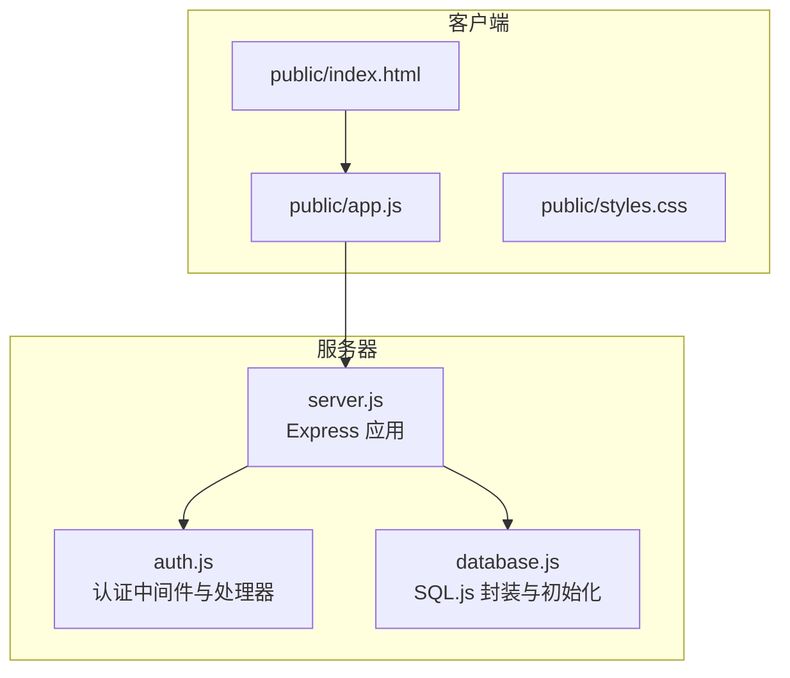
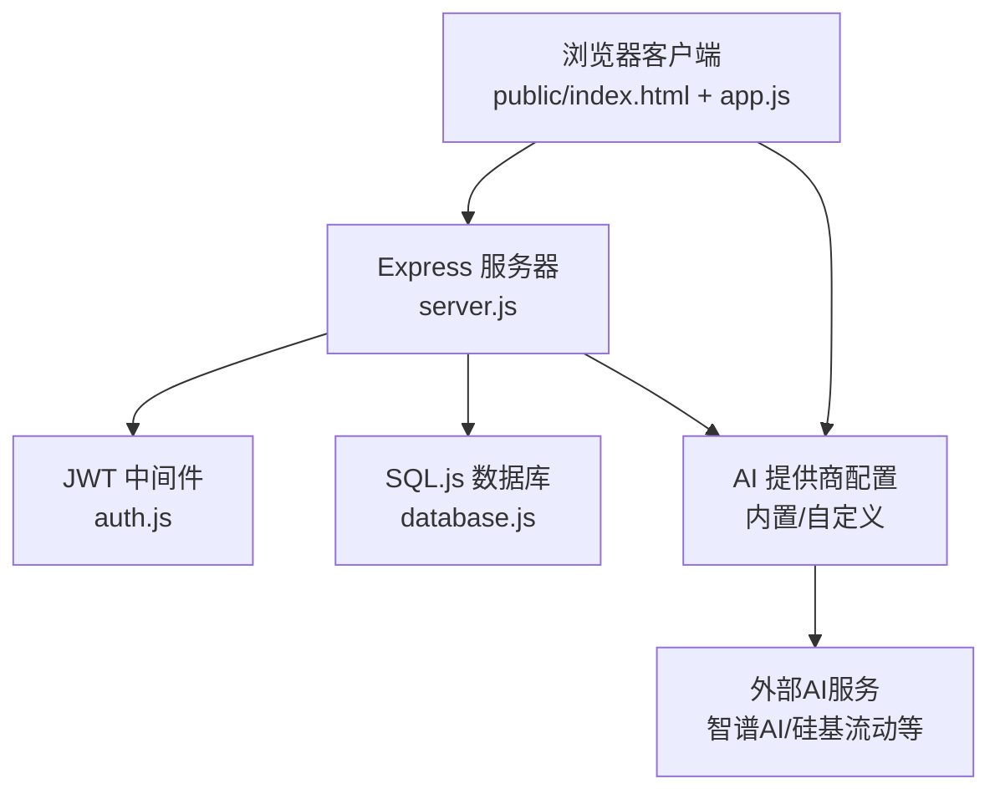
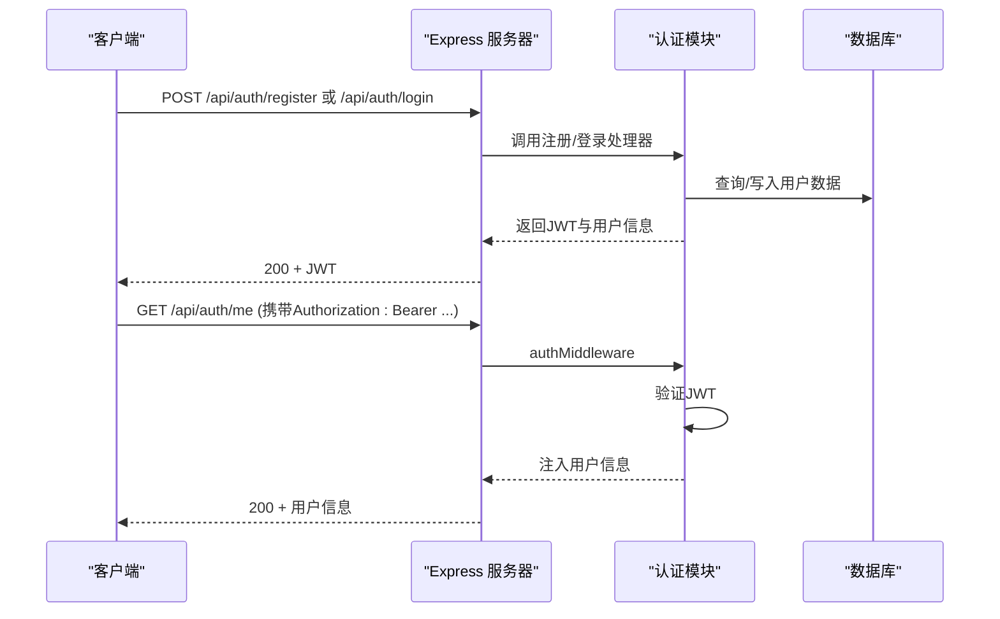
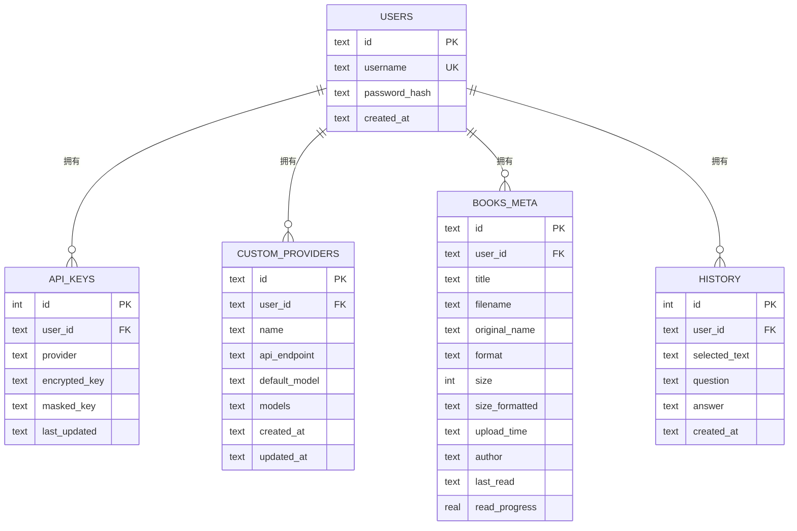
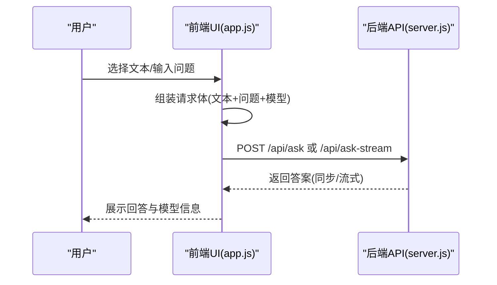
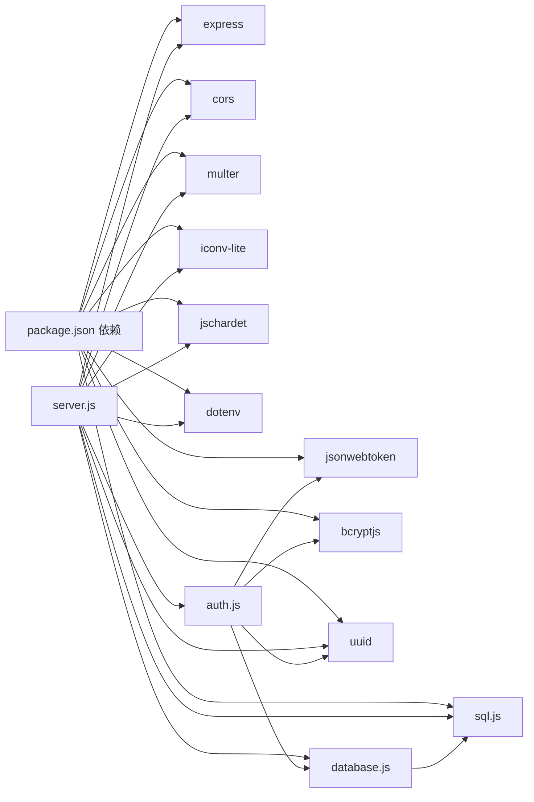

# 项目架构

<cite>
**本文引用的文件**
- [server.js](file://server.js)
- [auth.js](file://auth.js)
- [database.js](file://database.js)
- [package.json](file://package.json)
- [public/app.js](file://public/app.js)
- [public/index.html](file://public/index.html)
- [public/styles.css](file://public/styles.css)
- [test.txt](file://test.txt)
</cite>

## 目录
1. [简介](#简介)
2. [项目结构](#项目结构)
3. [核心组件](#核心组件)
4. [架构总览](#架构总览)
5. [详细组件分析](#详细组件分析)
6. [依赖关系分析](#依赖关系分析)
7. [性能考虑](#性能考虑)
8. [故障排查指南](#故障排查指南)
9. [结论](#结论)
10. [附录](#附录)

## 简介
本项目是一个“AI阅读助手”网站，提供基于文本选择的智能问答能力，支持多提供商（智谱AI、硅基流动等）与自定义提供商，具备用户认证、书籍上传与管理、API密钥安全存储与验证、流式响应等功能。前端采用纯静态页面与原生JavaScript，后端基于Express.js，数据存储采用嵌入式SQL.js数据库，JWT实现认证与授权。

## 项目结构
项目采用前后端分离的单页应用（SPA）架构：
- 后端：Express.js 提供REST API与静态资源服务
- 前端：HTML/CSS/JS 构建的单页应用，通过AJAX与后端交互
- 数据层：嵌入式SQL.js数据库，持久化用户、API密钥、书籍元数据等

图表来源
- [server.js:33-42](file://server.js#L33-L42)
- [auth.js:14-27](file://auth.js#L14-L27)
- [database.js:69-80](file://database.js#L69-L80)

章节来源
- [server.js:33-42](file://server.js#L33-L42)
- [package.json:1-23](file://package.json#L1-L23)

## 核心组件
- Express.js Web服务器：负责路由、中间件、静态资源托管与API响应
- JWT认证中间件：统一鉴权，保护受保护路由
- SQL.js数据库封装：提供嵌入式数据库的CRUD与持久化
- 前端应用（app.js）：SPA逻辑、API调用、UI交互与状态管理
- 多提供商AI集成：内置与自定义提供商，支持密钥验证与模型选择

章节来源
- [server.js:12-13](file://server.js#L12-L13)
- [auth.js:14-27](file://auth.js#L14-L27)
- [database.js:9-67](file://database.js#L9-L67)
- [public/app.js:1-28](file://public/app.js#L1-L28)

## 架构总览
系统采用“前端SPA + 后端REST API + 嵌入式数据库”的轻量级架构。Express.js作为核心Web服务器，提供认证、API密钥管理、提供商配置、书籍上传与检索、AI问答（含流式）等接口。前端通过AJAX与后端通信，使用JWT进行身份验证，API密钥采用对称加密存储于本地数据库。

图表来源
- [server.js:33-42](file://server.js#L33-L42)
- [auth.js:14-27](file://auth.js#L14-L27)
- [database.js:69-80](file://database.js#L69-L80)

## 详细组件分析

### Express.js 服务器
- 初始化与中间件
  - 跨域支持、JSON解析、静态资源托管
  - 全局认证中间件应用于 /api 前缀
- 路由分层
  - 认证路由：注册、登录、当前用户
  - API密钥路由：查询状态、设置、验证、删除
  - 提供商路由：查询、新增、更新、删除
  - 书籍路由：上传、列表、详情、下载、删除、进度更新
  - AI问答路由：同步与流式响应
- 安全与容错
  - 统一401处理与错误返回
  - 超时控制与异常捕获
  - 文件上传限制与编码检测

章节来源
- [server.js:33-42](file://server.js#L33-L42)
- [server.js:237-332](file://server.js#L237-L332)
- [server.js:334-461](file://server.js#L334-L461)
- [server.js:463-597](file://server.js#L463-L597)
- [server.js:618-688](file://server.js#L618-L688)
- [server.js:689-827](file://server.js#L689-L827)

### JWT 认证系统
- 登录与注册
  - 注册：用户名唯一性校验、密码哈希、签发JWT
  - 登录：密码校验、签发JWT（支持“记住我”）
- 中间件
  - Bearer Token 校验，注入用户信息到请求对象
  - 未携带或过期返回401
- 当前用户
  - 校验通过后返回用户信息

图表来源
- [auth.js:29-77](file://auth.js#L29-L77)
- [auth.js:14-27](file://auth.js#L14-L27)

章节来源
- [auth.js:9-12](file://auth.js#L9-L12)
- [auth.js:14-27](file://auth.js#L14-L27)
- [auth.js:29-77](file://auth.js#L29-L77)

### SQL.js 嵌入式数据库
- 初始化
  - 动态加载SQL.js，按需创建或恢复数据库文件
  - 开启WAL模式与外键约束
- 表结构
  - users：用户表
  - api_keys：用户API密钥（加密存储）
  - custom_providers：自定义提供商
  - books_meta：书籍元数据
  - history：问答历史
- 封装
  - prepare/exec/pragma/close方法，自动持久化到文件

图表来源
- [database.js:81-135](file://database.js#L81-L135)

章节来源
- [database.js:69-80](file://database.js#L69-L80)
- [database.js:81-135](file://database.js#L81-L135)
- [database.js:9-67](file://database.js#L9-L67)

### 前端应用（SPA）
- 初始化与认证
  - 本地存储JWT，自动登录与登出
  - 切换视图（阅读器、书架、历史、设置）
- API封装
  - 统一添加Authorization头，401自动登出
- 主要功能
  - 文本选择与AI问答（同步/流式）
  - 书籍上传（TXT/PDF/EPUB/MOBI）
  - API提供商与密钥管理（内置/自定义）
  - 阅读设置（字体大小、主题、目录）

图表来源
- [public/app.js:628-672](file://public/app.js#L628-L672)
- [server.js:618-688](file://server.js#L618-L688)
- [server.js:689-827](file://server.js#L689-L827)

章节来源
- [public/app.js:150-162](file://public/app.js#L150-L162)
- [public/app.js:166-184](file://public/app.js#L166-L184)
- [public/app.js:628-672](file://public/app.js#L628-L672)

### API 设计原则
- REST风格：路径语义化，动词使用HTTP方法表达
- 统一错误格式：错误字段与状态码一致
- 安全性：敏感数据（API密钥）加密存储，仅在内存中解密
- 可扩展性：提供商抽象，支持自定义与多模型

章节来源
- [server.js:237-332](file://server.js#L237-L332)
- [server.js:334-461](file://server.js#L334-L461)
- [server.js:463-597](file://server.js#L463-L597)

### 错误处理机制
- 中间件层：401未认证统一拦截
- 路由层：参数校验、业务异常、文件上传错误
- 流式响应：SSE异常捕获与终止
- 前端：401自动登出，提示用户重新登录

章节来源
- [auth.js:14-27](file://auth.js#L14-L27)
- [server.js:465-514](file://server.js#L465-L514)
- [server.js:769-827](file://server.js#L769-L827)
- [public/app.js:166-184](file://public/app.js#L166-L184)

## 依赖关系分析

图表来源
- [package.json:10-22](file://package.json#L10-L22)
- [server.js:1-13](file://server.js#L1-L13)
- [auth.js:1-5](file://auth.js#L1-L5)
- [database.js:1-3](file://database.js#L1-L3)

章节来源
- [package.json:10-22](file://package.json#L10-L22)
- [server.js:1-13](file://server.js#L1-L13)

## 性能考虑
- 数据库
  - WAL模式提升并发写入性能
  - 外键约束保障一致性
- 文件上传
  - 限制文件大小与类型，避免过大请求
  - 上传进度反馈，提升用户体验
- 流式响应
  - SSE减少首字节延迟，实时展示回答片段
- 缓存与索引
  - 为常用查询建立索引（api_keys、custom_providers、books_meta、history）
- 前端
  - SPA减少页面刷新，局部更新UI
  - 字体大小与主题切换仅影响CSS变量，无重排重绘

章节来源
- [database.js:78-79](file://database.js#L78-L79)
- [server.js:21-22](file://server.js#L21-L22)
- [server.js:774-778](file://server.js#L774-L778)
- [database.js:131-134](file://database.js#L131-L134)

## 故障排查指南
- 认证失败
  - 检查Authorization头是否携带Bearer Token
  - 确认JWT未过期，服务端JWT_SECRET是否一致
- API密钥问题
  - 使用“验证密钥”接口确认有效性
  - 检查提供商ID与模型是否匹配
- 文件上传失败
  - 确认文件格式与大小限制
  - 查看服务器日志中的错误信息
- 流式响应中断
  - 检查网络稳定性与超时设置
  - 确认外部AI服务可用性

章节来源
- [auth.js:14-27](file://auth.js#L14-L27)
- [server.js:297-316](file://server.js#L297-L316)
- [server.js:465-514](file://server.js#L465-L514)
- [server.js:769-827](file://server.js#L769-L827)

## 结论
本项目通过Express.js提供简洁高效的API，结合JWT实现安全认证，使用SQL.js实现轻量级数据持久化，前端SPA提供流畅的交互体验。系统支持多提供商与自定义提供商，具备良好的扩展性与可维护性。建议后续可引入缓存层、异步任务队列与更完善的监控告警体系。

## 附录
- 系统边界
  - 内部：Express服务器、SQL.js数据库、前端SPA
  - 外部：智谱AI、硅基流动等第三方AI服务
- 关键流程
  - 用户认证与API调用
  - 书籍上传与内容读取
  - 多提供商密钥管理与模型选择