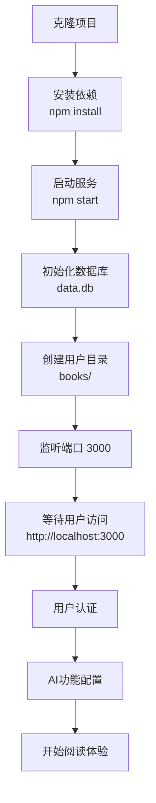
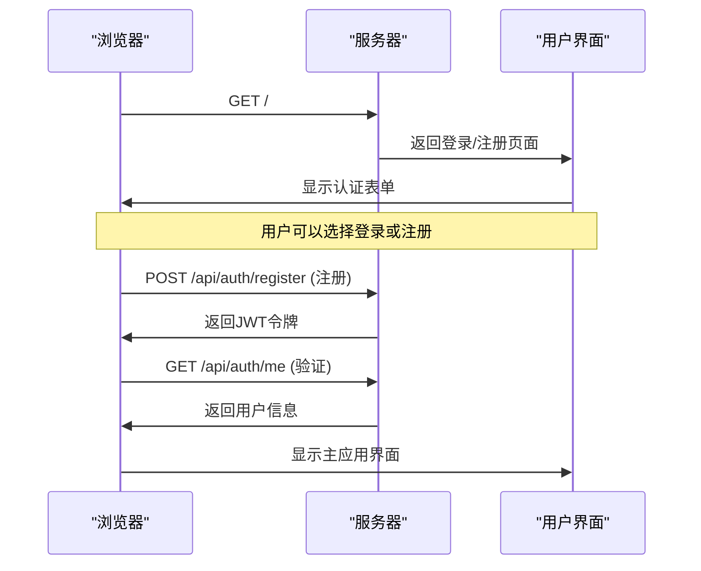
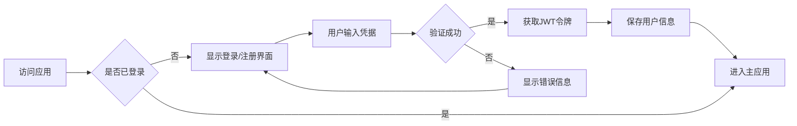

# 快速开始

<cite>
**本文档引用的文件**
- [package.json](file://package.json)
- [README.md](file://README.md)
- [server.js](file://server.js)
- [auth.js](file://auth.js)
- [database.js](file://database.js)
- [public/index.html](file://public/index.html)
- [public/app.js](file://public/app.js)
- [public/styles.css](file://public/styles.css)
- [CLAUDE.md](file://CLAUDE.md)
</cite>

## 目录
1. [简介](#简介)
2. [环境要求](#环境要求)
3. [安装步骤](#安装步骤)
4. [启动流程](#启动流程)
5. [开发模式](#开发模式)
6. [首次访问界面](#首次访问界面)
7. [基本操作指南](#基本操作指南)
8. [常见问题排查](#常见问题排查)
9. [性能优化建议](#性能优化建议)
10. [故障排除指南](#故障排除指南)

## 简介

AI阅读助手是一个现代化的智能阅读应用，集成了多AI服务提供商，帮助用户高效阅读和理解书籍内容。该项目采用前后端分离架构，后端使用Node.js + Express.js，前端使用原生JavaScript，支持在线阅读、AI智能问答、书架管理、自定义AI提供商等功能。

## 环境要求

### 系统要求
- **Node.js**: >= 18.0.0
- **npm**: >= 9.0.0

### 技术栈
- **后端**: Express.js 4.18.2
- **前端**: 原生 JavaScript (ES6+)
- **数据库**: SQLite (sql.js - 纯JS实现，无需C++编译)
- **用户认证**: JWT (jsonwebtoken)
- **密码加密**: bcryptjs
- **文件上传**: Multer
- **编码检测**: jschardet + iconv-lite
- **密钥加密**: crypto (AES-256-CBC)

**章节来源**
- [README.md:71-75](file://README.md#L71-L75)
- [package.json:58-67](file://package.json#L58-L67)

## 安装步骤

### 步骤1：克隆项目
```bash
# 克隆项目到本地
git clone <your-repo-url>
cd trae02airead
```

### 步骤2：安装依赖
```bash
# 安装项目依赖
npm install
```

### 步骤3：启动服务
```bash
# 启动项目（零配置）
npm start
```

### 步骤4：验证安装
```bash
# 打开浏览器访问
http://localhost:3000
```

**章节来源**
- [README.md:76-89](file://README.md#L76-L89)

## 启动流程

### 零配置启动流程



**图表来源**
- [server.js:30-36](file://server.js#L30-L36)
- [database.js:69-80](file://database.js#L69-L80)

### 服务启动过程详解

1. **初始化阶段**
   - 创建Express应用实例
   - 配置CORS和静态文件服务
   - 初始化SQLite数据库
   - 创建用户书籍存储目录

2. **中间件配置**
   - CORS跨域支持
   - JSON请求体解析
   - 静态文件服务（public目录）

3. **路由注册**
   - 用户认证路由
   - API密钥管理路由
   - 书籍管理路由
   - AI问答路由

**章节来源**
- [server.js:15-40](file://server.js#L15-L40)
- [database.js:81-135](file://database.js#L81-L135)

## 开发模式

### 开发模式启动
```bash
# 开发模式启动
npm run dev
```

### 开发模式特点
- **自动重启**: 代码变更时自动重启服务
- **调试支持**: 更详细的错误信息
- **热重载**: 前端资源热更新

**章节来源**
- [README.md:92-96](file://README.md#L92-L96)
- [package.json:6-8](file://package.json#L6-L8)

## 首次访问界面

### 登录/注册界面
当首次访问应用时，会显示用户认证界面：



**图表来源**
- [public/index.html:400-428](file://public/index.html#L400-L428)
- [auth.js:29-77](file://auth.js#L29-L77)

### 主应用界面布局

应用采用三栏布局设计：

1. **左侧侧边栏** - 文章目录和阅读设置
2. **中央内容区** - 书籍阅读区域
3. **右侧AI面板** - AI助手功能

**章节来源**
- [public/index.html:10-359](file://public/index.html#L10-L359)

## 基本操作指南

### 用户认证流程



**图表来源**
- [public/app.js:59-128](file://public/app.js#L59-L128)
- [auth.js:57-77](file://auth.js#L57-L77)

### AI问答功能

1. **文本选择**: 在阅读内容中选择需要解释的文本
2. **工具栏操作**: 点击浮动工具栏进行快捷操作
3. **自定义问题**: 在AI面板中输入自定义问题
4. **流式输出**: 查看AI的SSE流式回答

### 书籍管理

1. **上传书籍**: 支持TXT、PDF、EPUB、MOBI格式
2. **书架浏览**: 查看和管理个人书架
3. **阅读进度**: 自动保存阅读进度
4. **下载删除**: 支持书籍下载和删除

**章节来源**
- [public/app.js:628-796](file://public/app.js#L628-L796)
- [server.js:465-597](file://server.js#L465-L597)

## 常见问题排查

### 启动问题

#### 问题1：端口占用
**症状**: 启动时报端口被占用错误
**解决方案**:
```bash
# 检查端口占用
netstat -ano | findstr :3000

# 修改端口配置
echo "PORT=3001" >> .env
```

#### 问题2：权限不足
**症状**: 访问localhost:3000失败
**解决方案**:
```bash
# 检查防火墙设置
# 确保3000端口未被阻止
```

#### 问题3：依赖安装失败
**症状**: npm install报错
**解决方案**:
```bash
# 清理缓存
npm cache clean --force

# 重新安装
rm -rf node_modules package-lock.json
npm install
```

### 功能问题

#### 问题4：AI问答失败
**症状**: 选中文本后无法获得AI回答
**解决方案**:
1. 检查API密钥配置
2. 验证网络连接
3. 查看浏览器控制台错误

#### 问题5：书籍上传失败
**症状**: 上传文件时出现错误
**解决方案**:
1. 检查文件格式（仅支持TXT、PDF、EPUB、MOBI）
2. 确认文件大小不超过50MB
3. 验证磁盘空间充足

#### 问题6：用户认证失败
**症状**: 登录或注册时出现错误
**解决方案**:
1. 检查用户名和密码格式
2. 确认网络连接正常
3. 清除浏览器缓存

**章节来源**
- [README.md:98-104](file://README.md#L98-L104)
- [server.js:123-132](file://server.js#L123-L132)

## 性能优化建议

### 数据库优化
- **WAL模式**: 使用Write-Ahead Logging提高并发性能
- **索引优化**: 为常用查询字段建立索引
- **内存管理**: 合理使用sql.js的内存映射

### 前端优化
- **懒加载**: 图片和大文件采用懒加载
- **缓存策略**: 利用浏览器缓存减少重复请求
- **CDN加速**: 静态资源使用CDN分发

### 服务器优化
- **连接池**: 配置合适的数据库连接池
- **超时设置**: 合理设置请求超时时间
- **错误处理**: 完善的错误监控和日志记录

## 故障排除指南

### 日志分析
```bash
# 查看应用日志
npm start

# 查看错误日志
tail -f data.db.log
```

### 常用诊断命令
```bash
# 检查Node.js版本
node --version

# 检查npm版本
npm --version

# 检查端口状态
lsof -i :3000

# 检查磁盘空间
df -h

# 检查内存使用
free -h
```

### 环境变量配置
```bash
# 创建.env文件
cat > .env << EOF
# 固定加密密钥（可选）
ENCRYPTION_KEY=your_64_char_hex_key

# AI提供商API Key（可选）
ZHIPU_API_KEY=your_zhipu_key
SILICONFLOW_API_KEY=your_siliconflow_key

# 服务端口（默认3000）
PORT=3000
EOF
```

### 数据库维护
```bash
# 备份数据库
cp data.db data.db.backup

# 清理数据库
# 删除data.db文件重新启动
rm data.db
```

**章节来源**
- [README.md:105-120](file://README.md#L105-L120)
- [database.js:9-14](file://database.js#L9-L14)

## 结论

AI阅读助手项目提供了完整的智能阅读解决方案，具有以下优势：

1. **零配置启动**: 一键安装，无需复杂配置
2. **现代化架构**: 前后端分离，易于维护和扩展
3. **丰富的功能**: 支持多种AI提供商和书籍格式
4. **良好的用户体验**: 流畅的交互和响应式设计

按照本指南的步骤，新用户可以在5分钟内成功运行项目并开始使用AI阅读助手的各项功能。遇到问题时，可以参考故障排除指南或查阅相关源码文件获取更详细的技术信息。