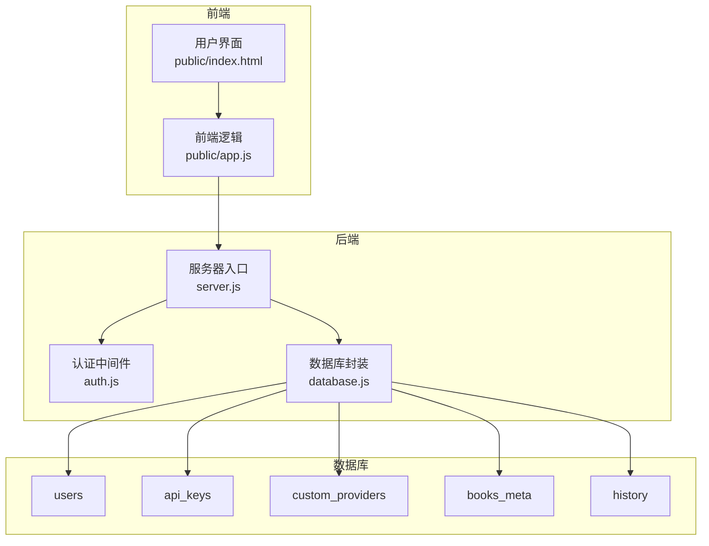
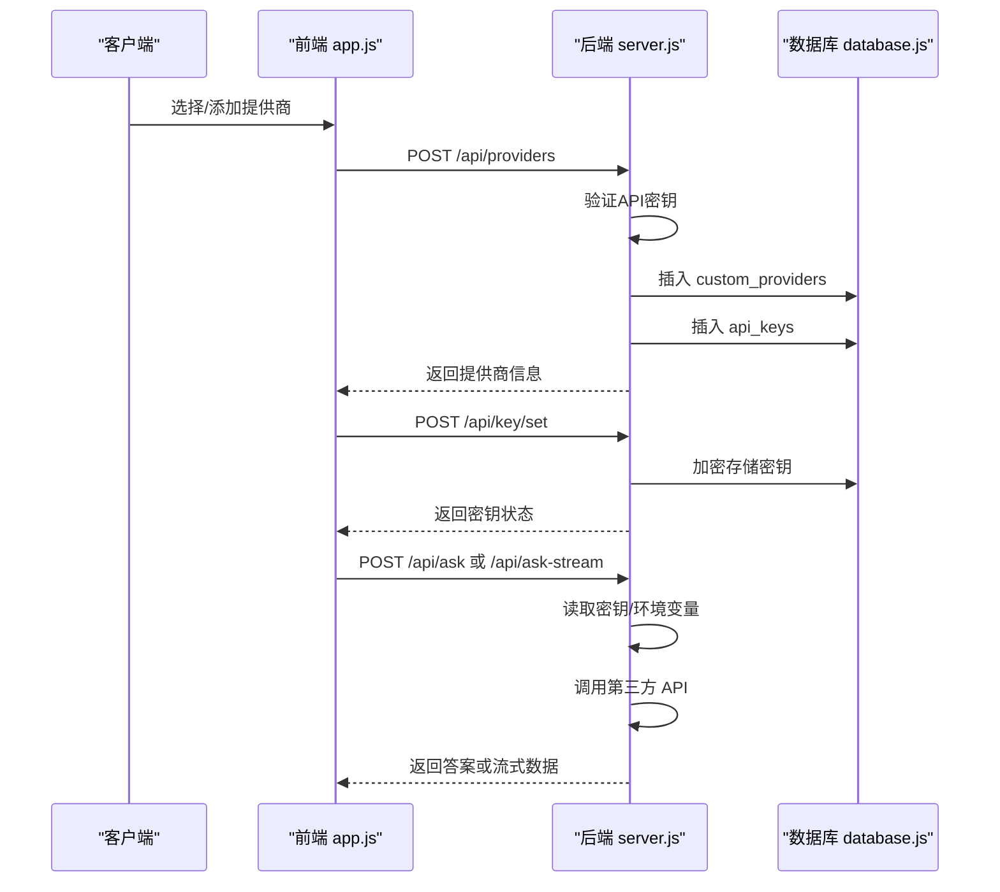
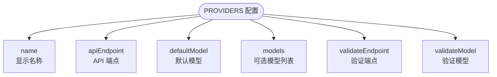
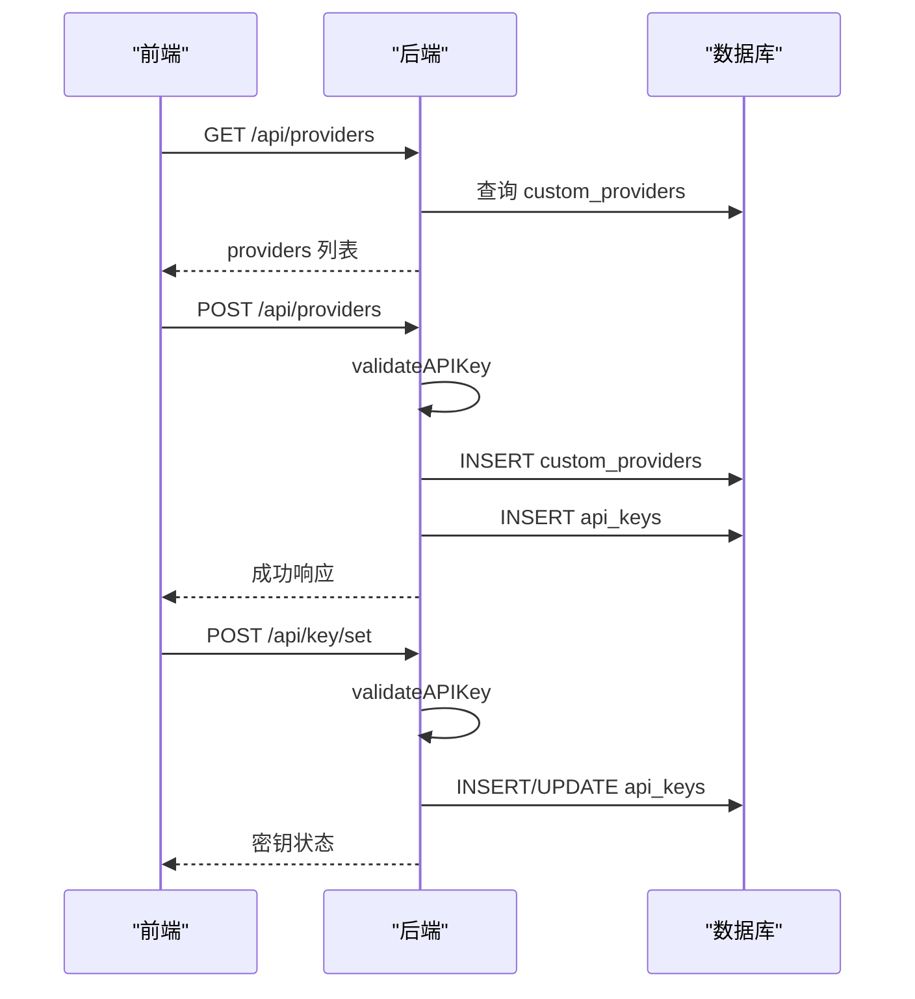
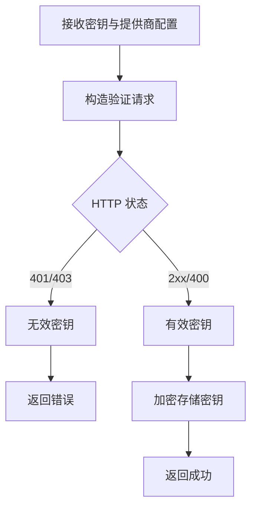
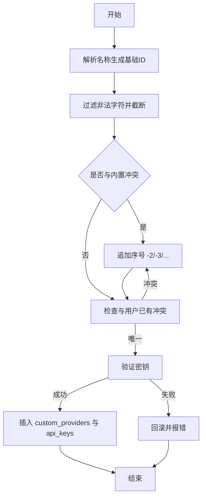
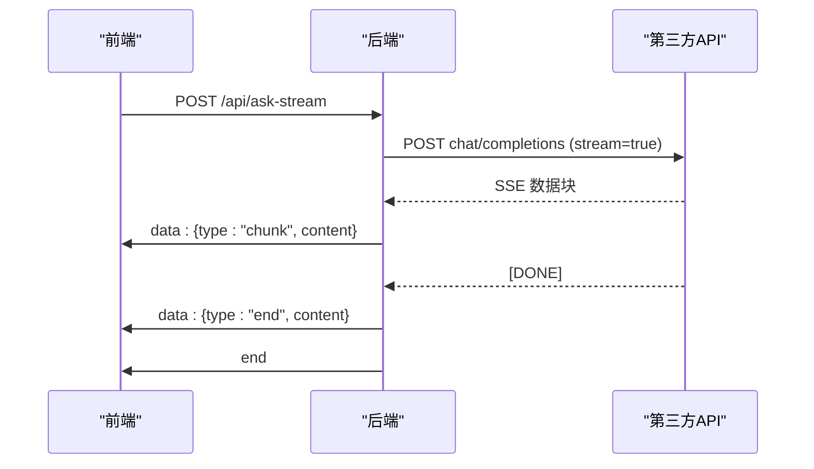
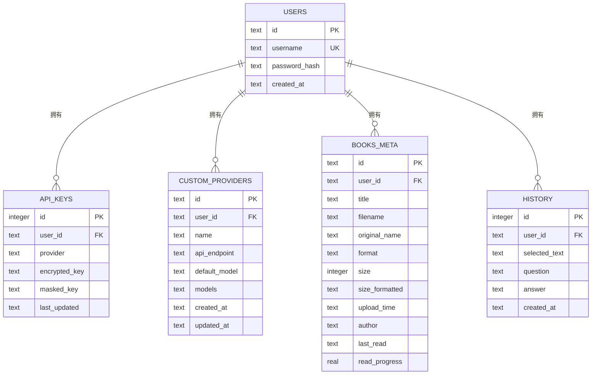
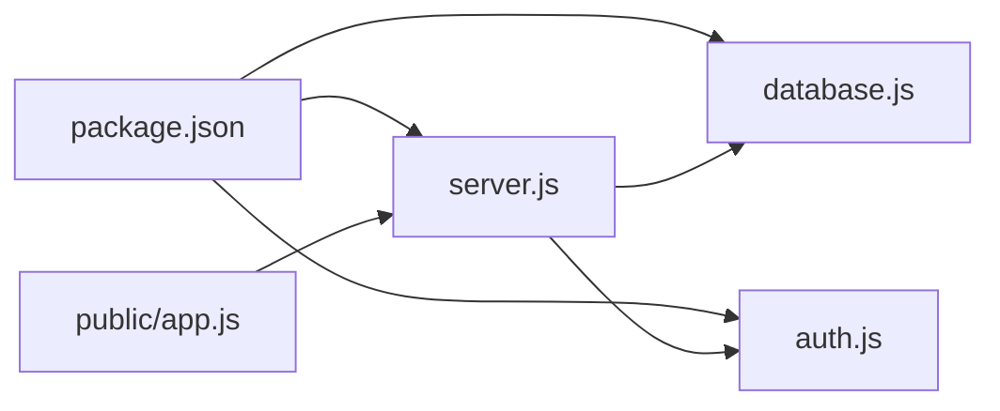

# AI 提供商扩展

<cite>
**本文档引用的文件**
- [README.md](file://README.md)
- [server.js](file://server.js)
- [database.js](file://database.js)
- [auth.js](file://auth.js)
- [package.json](file://package.json)
- [public/index.html](file://public/index.html)
- [public/app.js](file://public/app.js)
</cite>

## 目录
1. [简介](#简介)
2. [项目结构](#项目结构)
3. [核心组件](#核心组件)
4. [架构总览](#架构总览)
5. [详细组件分析](#详细组件分析)
6. [依赖关系分析](#依赖关系分析)
7. [性能考虑](#性能考虑)
8. [故障排除指南](#故障排除指南)
9. [结论](#结论)
10. [附录](#附录)

## 简介
本指南面向希望为 trae02airead 添加新 AI 提供商的开发者，系统讲解 PROVIDERS 配置对象结构、API 端点配置、模型列表定义与密钥验证机制。文档覆盖自定义提供商的创建流程（数据库表 custom_providers 字段、提供商 ID 生成规则与冲突避免）、密钥存储与流式响应处理，以及最佳实践与性能优化建议。

## 项目结构
后端采用 Express.js，数据库使用 sql.js（SQLite 的纯 JavaScript 实现）。前端为原生 JavaScript 应用，通过 REST API 与后端交互。核心扩展点集中在 server.js 的 PROVIDERS 配置、自定义提供商路由与密钥管理。

**图表来源**
- [server.js:30-899](file://server.js#L30-L899)
- [database.js:69-146](file://database.js#L69-L146)

**章节来源**
- [README.md:210-232](file://README.md#L210-L232)
- [package.json:1-23](file://package.json#L1-L23)

## 核心组件
- PROVIDERS 配置对象：内置提供商的名称、API 端点、默认模型、可选模型列表，以及用于密钥验证的端点与模型。
- 自定义提供商管理：提供添加、更新、删除自定义提供商的接口，支持模型列表 JSON 配置与密钥验证。
- 密钥管理：支持设置、验证、删除 API 密钥，密钥使用 AES-256-CBC 加密存储。
- 流式响应处理：基于 SSE 的流式输出，支持打字机效果与错误处理。

**章节来源**
- [server.js:163-188](file://server.js#L163-L188)
- [server.js:334-461](file://server.js#L334-L461)
- [server.js:237-332](file://server.js#L237-L332)
- [server.js:689-827](file://server.js#L689-L827)

## 架构总览
新增 AI 提供商的扩展路径如下：
- 在 PROVIDERS 中定义内置提供商配置
- 通过 /api/providers 接口添加自定义提供商
- 通过 /api/key/* 接口进行密钥设置与验证
- 通过 /api/ask 与 /api/ask-stream 发起问答请求

**图表来源**
- [server.js:366-423](file://server.js#L366-L423)
- [server.js:260-295](file://server.js#L260-L295)
- [server.js:618-688](file://server.js#L618-L688)
- [server.js:690-827](file://server.js#L690-L827)

## 详细组件分析

### PROVIDERS 配置对象结构
PROVIDERS 是内置提供商的配置中心，包含以下字段：
- name：提供商显示名称
- apiEndpoint：聊天补全 API 的完整端点
- defaultModel：默认模型 ID
- models：可选模型列表（数组，元素为 {id, name}）
- validateEndpoint：用于密钥验证的端点
- validateModel：用于密钥验证的模型

**图表来源**
- [server.js:163-188](file://server.js#L163-L188)

**章节来源**
- [server.js:163-188](file://server.js#L163-L188)

### API 端点配置与模型列表定义
- /api/providers：获取可用提供商列表，包含内置与自定义提供商
- /api/providers POST：添加自定义提供商，支持 models JSON 列表
- /api/providers PUT：更新自定义提供商
- /api/providers DELETE：删除自定义提供商
- /api/key/status：查询各提供商密钥状态
- /api/key/set：设置指定提供商的 API 密钥（含验证）
- /api/key/verify：验证 API 密钥
- /api/key DELETE：删除指定提供商或全部密钥

**图表来源**
- [server.js:336-346](file://server.js#L336-L346)
- [server.js:366-423](file://server.js#L366-L423)
- [server.js:239-295](file://server.js#L239-L295)

**章节来源**
- [server.js:336-461](file://server.js#L336-L461)
- [server.js:239-332](file://server.js#L239-L332)

### 密钥验证机制
- validateAPIKey：向提供商的验证端点发送最小负载请求，判断 401/403 或 400 状态作为有效性依据
- 密钥设置：对 API 密钥进行长度校验与验证，通过后使用 AES-256-CBC 加密存储
- 环境变量回退：若未设置用户级密钥，系统会尝试从环境变量读取（如 ZHIPU_API_KEY、SILICONFLOW_API_KEY、AI_API_KEY、CUSTOM_API_KEY）

**图表来源**
- [server.js:212-235](file://server.js#L212-L235)
- [server.js:260-295](file://server.js#L260-L295)

**章节来源**
- [server.js:212-235](file://server.js#L212-L235)
- [server.js:260-295](file://server.js#L260-L295)

### 自定义提供商创建流程
- 字段定义（custom_providers 表）：id、user_id、name、api_endpoint、default_model、models（JSON 文本）、created_at、updated_at
- ID 生成规则：从名称派生基础 ID，过滤非法字符，确保长度限制，避免与内置提供商冲突
- 冲突避免：循环追加 -n 形式，直到唯一为止
- 添加流程：校验必填字段与密钥长度，验证密钥，插入自定义提供商与对应密钥

**图表来源**
- [server.js:348-364](file://server.js#L348-L364)
- [server.js:366-423](file://server.js#L366-L423)
- [database.js:97-107](file://database.js#L97-L107)

**章节来源**
- [server.js:348-423](file://server.js#L348-L423)
- [database.js:97-107](file://database.js#L97-L107)

### 流式响应处理（SSE）
- 启动流式：设置 Content-Type 为 text/event-stream，启用 X-Accel-Buffering 等头部
- 数据读取：使用 Response.body.getReader() 逐行解析，提取 choices.delta.content
- 错误处理：捕获异常并发送 error 事件，最后发送 end 事件

**图表来源**
- [server.js:690-827](file://server.js#L690-L827)

**章节来源**
- [server.js:690-827](file://server.js#L690-L827)

### 数据库表结构（关键表）
- users：用户基本信息
- api_keys：用户级提供商密钥（按 user_id + provider 唯一）
- custom_providers：用户自定义提供商（复合主键 id + user_id）
- books_meta：书籍元数据
- history：问答历史

**图表来源**
- [database.js:81-135](file://database.js#L81-L135)

**章节来源**
- [database.js:81-135](file://database.js#L81-L135)

## 依赖关系分析
- server.js 依赖 database.js 初始化数据库与表结构，依赖 auth.js 进行 JWT 认证
- 前端 app.js 通过 apiFetch 统一封装请求，自动附加 Authorization 头
- package.json 指定核心依赖：Express、sql.js、bcryptjs、jsonwebtoken、multer、uuid、dotenv 等

**图表来源**
- [package.json:1-23](file://package.json#L1-L23)
- [server.js:12-14](file://server.js#L12-L14)
- [auth.js:1-80](file://auth.js#L1-L80)
- [database.js:1-146](file://database.js#L1-L146)

**章节来源**
- [package.json:1-23](file://package.json#L1-L23)

## 性能考虑
- 流式响应：使用 SSE 降低延迟，前端逐块渲染提升用户体验
- 密钥缓存：后端在内存中聚合用户密钥，减少重复查询
- 数据库索引：为 api_keys、custom_providers、books_meta、history 建立索引，提高查询效率
- 超时控制：fetch 请求设置 AbortController 超时，避免长时间阻塞
- 前端模型选择：本地存储当前提供商与模型，减少重复加载

**章节来源**
- [server.js:690-827](file://server.js#L690-L827)
- [server.js:618-688](file://server.js#L618-L688)
- [database.js:131-135](file://database.js#L131-L135)

## 故障排除指南
- 401 未授权：检查密钥是否正确、是否已设置、是否过期
- 密钥验证失败：确认 apiEndpoint 与 defaultModel 正确，网络可达
- 自定义提供商冲突：修改名称或提供的 id，确保唯一性
- 流式响应中断：检查第三方 API 是否支持 stream 参数，网络稳定性
- 环境变量未生效：确认环境变量命名与作用域，重启服务后生效

**章节来源**
- [server.js:212-235](file://server.js#L212-L235)
- [server.js:366-423](file://server.js#L366-L423)
- [server.js:690-827](file://server.js#L690-L827)

## 结论
通过 PROVIDERS 配置与 /api/providers 接口，系统提供了灵活的 AI 提供商扩展能力。配合完善的密钥管理与流式响应机制，开发者可以快速集成新的 OpenAI 兼容 API 提供商，并获得良好的用户体验与安全性保障。

## 附录

### 最佳实践
- 提供商配置
  - 将默认模型与可选模型列表清晰分离，便于用户选择
  - 为验证端点与模型单独配置，确保密钥验证的准确性
- 自定义提供商
  - 使用稳定的 API 端点，避免频繁变更
  - 提供清晰的模型列表 JSON 示例，降低用户配置成本
- 密钥管理
  - 优先使用 UI 设置密钥，避免硬编码
  - 定期轮换密钥，及时清理失效密钥
- 流式响应
  - 前端做好错误恢复与重试策略
  - 合理设置超时与中断逻辑，避免资源泄露

### 性能优化建议
- 合理设置温度与 max_tokens，平衡质量与速度
- 使用合适的模型，避免过大上下文导致延迟
- 前端缓存常用提供商与模型，减少重复请求
- 后端对高频查询建立索引，优化数据库访问