# API 扩展开发

<cite>
**本文引用的文件**
- [README.md](file://README.md)
- [package.json](file://package.json)
- [server.js](file://server.js)
- [auth.js](file://auth.js)
- [database.js](file://database.js)
</cite>

## 目录
1. [简介](#简介)
2. [项目结构](#项目结构)
3. [核心组件](#核心组件)
4. [架构概览](#架构概览)
5. [详细组件分析](#详细组件分析)
6. [依赖关系分析](#依赖关系分析)
7. [性能考虑](#性能考虑)
8. [故障排除指南](#故障排除指南)
9. [结论](#结论)
10. [附录](#附录)

## 简介

trae02airead 是一个现代化的智能阅读应用，集成了多个 AI 服务提供商，帮助用户高效阅读和理解书籍内容。该项目采用 Express.js 作为后端框架，使用 SQLite (sql.js) 作为数据库，实现了完整的用户认证、书籍管理和 AI 问答功能。

本指南专注于如何扩展现有的 RESTful API，包括路由设计、参数验证和响应格式标准化。我们将详细解释中间件的开发模式，包括认证中间件、日志中间件和错误处理中间件。同时提供 API 版本控制策略、向后兼容性和废弃通知机制，以及 API 文档生成、自动化测试和性能监控的实现方法。

## 项目结构

项目采用模块化设计，主要文件结构如下：

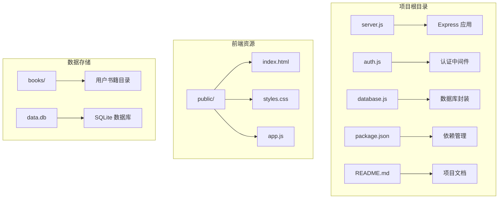

**图表来源**
- [server.js:1-50](file://server.js#L1-L50)
- [package.json:1-23](file://package.json#L1-L23)

**章节来源**
- [README.md:210-232](file://README.md#L210-L232)
- [package.json:1-23](file://package.json#L1-L23)

## 核心组件

### 认证系统

系统实现了基于 JWT 的用户认证机制，提供了完整的注册、登录和用户信息查询功能：

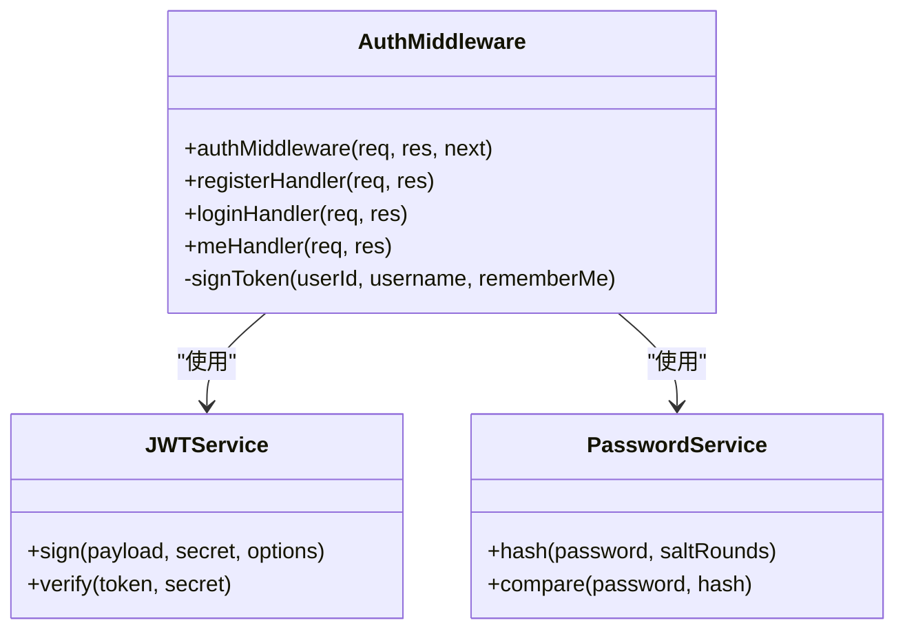

**图表来源**
- [auth.js:14-77](file://auth.js#L14-L77)

### 数据库层

使用 sql.js 实现纯 JavaScript 的 SQLite 数据库操作，支持完整的 CRUD 操作：

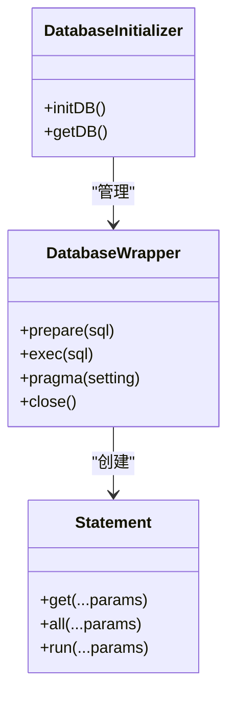

**图表来源**
- [database.js:9-67](file://database.js#L9-L67)
- [database.js:69-138](file://database.js#L69-L138)

### API 路由系统

系统实现了 RESTful API 路由设计，包括用户认证、AI 问答、密钥管理和提供商管理等功能：

**章节来源**
- [auth.js:14-77](file://auth.js#L14-L77)
- [database.js:69-138](file://database.js#L69-L138)

## 架构概览

系统采用分层架构设计，实现了清晰的关注点分离：

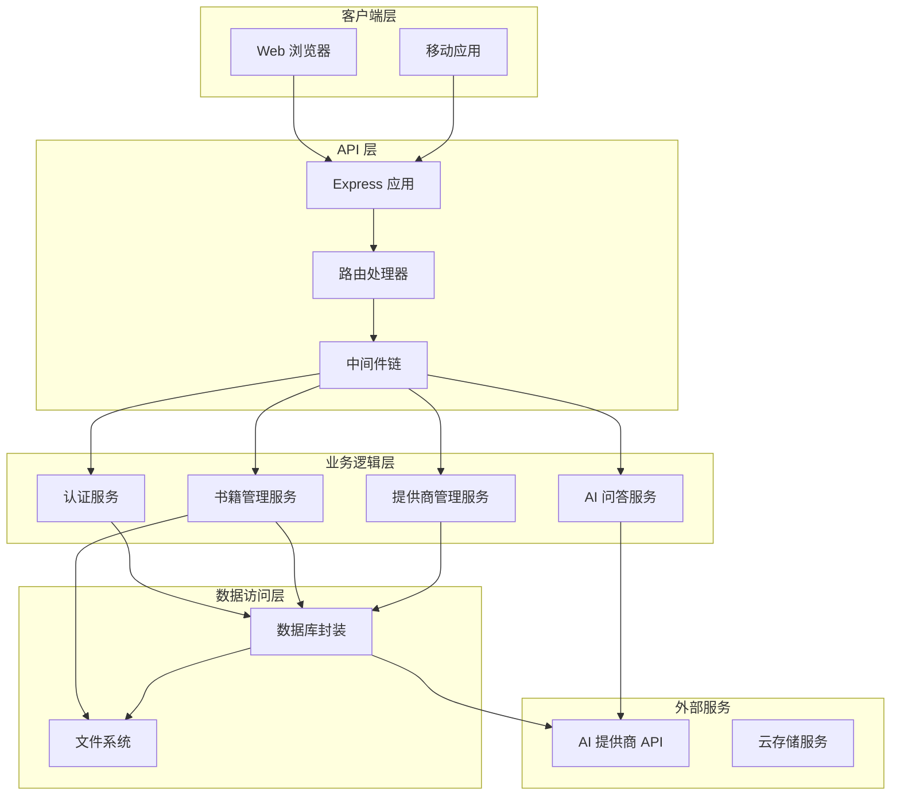

**图表来源**
- [server.js:30-899](file://server.js#L30-L899)

## 详细组件分析

### 认证中间件开发

认证中间件是整个 API 系统的安全基石，实现了基于 JWT 的无状态认证机制：

#### 中间件工作流程

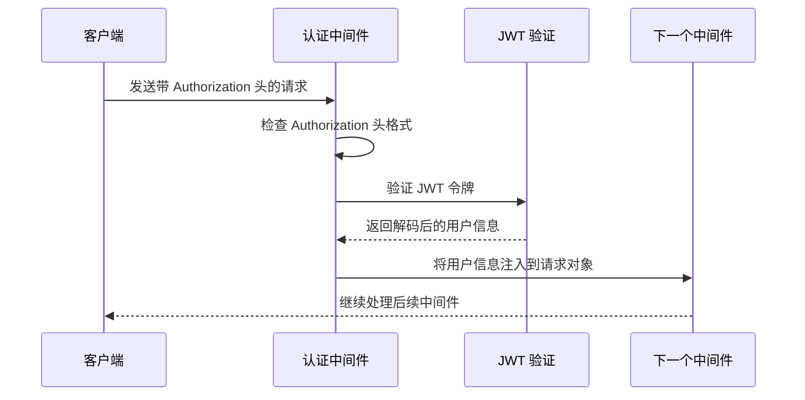

**图表来源**
- [auth.js:14-27](file://auth.js#L14-L27)

#### 参数验证策略

认证相关的参数验证包括：
- 用户名验证：非空、去空白、长度检查
- 密码验证：非空、长度至少 6 位
- JWT 令牌验证：格式检查、签名验证、过期时间检查

**章节来源**
- [auth.js:29-77](file://auth.js#L29-L77)

### API 路由设计模式

系统采用 RESTful 设计原则，实现了清晰的资源导向路由：

#### 资源命名规范

| 资源类型 | 路由前缀 | HTTP 方法 | 功能描述 |
|---------|---------|----------|----------|
| 用户认证 | `/api/auth` | POST | 注册新用户 |
| 用户认证 | `/api/auth` | POST | 用户登录 |
| 用户认证 | `/api/auth` | GET | 获取当前用户信息 |
| 密钥管理 | `/api/key` | GET | 获取密钥状态 |
| 密钥管理 | `/api/key` | POST | 设置 API 密钥 |
| 密钥管理 | `/api/key` | POST | 验证 API 密钥 |
| 密钥管理 | `/api/key` | DELETE | 删除 API 密钥 |
| 提供商管理 | `/api/providers` | GET | 获取提供商列表 |
| 提供商管理 | `/api/providers` | POST | 添加自定义提供商 |
| 提供商管理 | `/api/providers` | PUT | 更新提供商信息 |
| 提供商管理 | `/api/providers` | DELETE | 删除提供商 |
| 书籍管理 | `/api/books` | GET | 获取书籍列表 |
| 书籍管理 | `/api/books` | POST | 上传书籍 |
| 书籍管理 | `/api/books` | GET | 获取书籍详情 |
| 书籍管理 | `/api/books` | GET | 下载书籍 |
| 书籍管理 | `/api/books` | DELETE | 删除书籍 |
| 书籍管理 | `/api/books` | PUT | 保存阅读进度 |

#### 路由参数验证

每个路由都实现了相应的参数验证逻辑：

**章节来源**
- [server.js:37-42](file://server.js#L37-L42)
- [server.js:239-332](file://server.js#L239-L332)
- [server.js:336-461](file://server.js#L336-L461)
- [server.js:465-616](file://server.js#L465-L616)

### 响应格式标准化

系统实现了统一的响应格式，确保 API 的一致性和可预测性：

#### 成功响应格式

```json
{
  "success": true,
  "message": "操作成功",
  "data": {}
}
```

#### 错误响应格式

```json
{
  "success": false,
  "error": "错误消息",
  "code": "错误代码"
}
```

#### 分页响应格式

```json
{
  "success": true,
  "data": {
    "items": [],
    "pagination": {
      "page": 1,
      "limit": 10,
      "total": 100,
      "pages": 10
    }
  }
}
```

**章节来源**
- [server.js:257-258](file://server.js#L257-L258)
- [server.js:345-346](file://server.js#L345-L346)
- [server.js:525-526](file://server.js#L525-L526)

### 中间件开发模式

#### 日志中间件

系统可以扩展实现详细的请求日志记录：

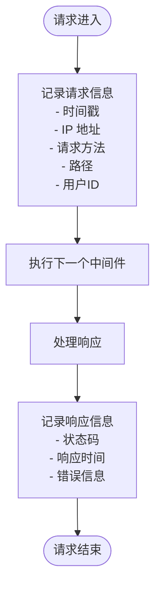

#### 错误处理中间件

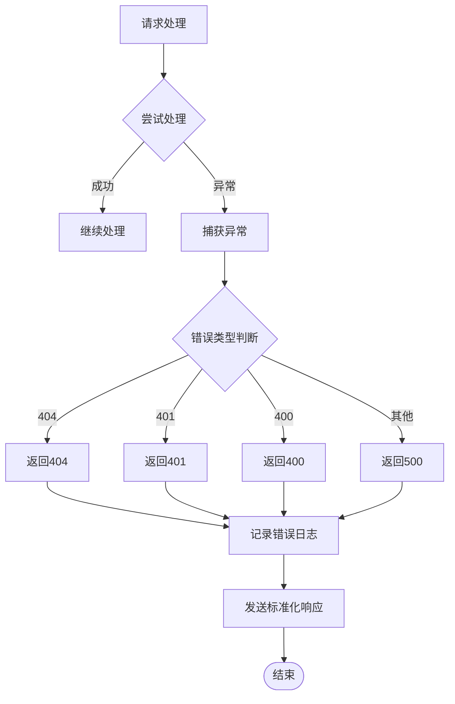

**章节来源**
- [server.js:14-16](file://server.js#L14-L16)
- [auth.js:14-27](file://auth.js#L14-L27)

### API 版本控制策略

#### 版本控制方案

建议采用 URL 路径版本控制方式：

```
/api/v1/auth/login
/api/v2/auth/login
```

#### 向后兼容性保证

1. **字段兼容性**：新增字段时保持向后兼容
2. **响应格式**：保持现有响应格式不变
3. **错误码**：不改变现有的错误码语义
4. **弃用通知**：提前 3-6 个月发出弃用通知

#### 废弃通知机制

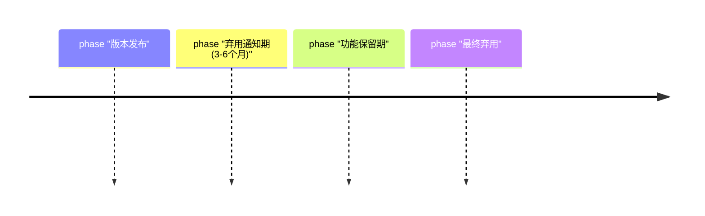

**章节来源**
- [README.md:162-198](file://README.md#L162-L198)

### 安全加固措施

#### 密钥管理

系统实现了多层密钥保护机制：

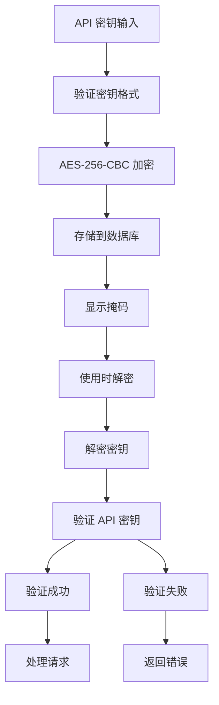

**图表来源**
- [server.js:44-67](file://server.js#L44-L67)
- [server.js:260-295](file://server.js#L260-L295)

#### 速率限制

建议实现基于 IP 和用户 ID 的双重限流：

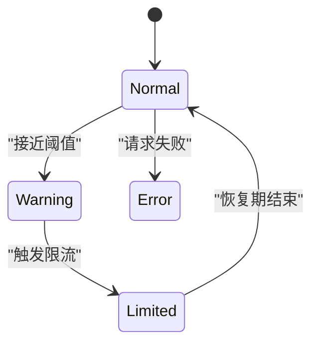

**章节来源**
- [server.js:212-235](file://server.js#L212-L235)
- [server.js:44-67](file://server.js#L44-L67)

## 依赖关系分析

系统的核心依赖关系如下：

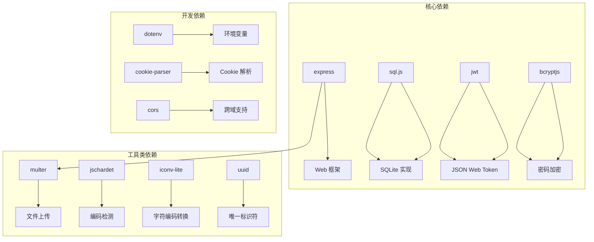

**图表来源**
- [package.json:10-22](file://package.json#L10-L22)

**章节来源**
- [package.json:10-22](file://package.json#L10-L22)

## 性能考虑

### 数据库优化

1. **索引策略**：为常用查询字段建立索引
2. **连接池**：使用 WAL 模式提高并发性能
3. **查询优化**：避免 N+1 查询问题

### 缓存策略

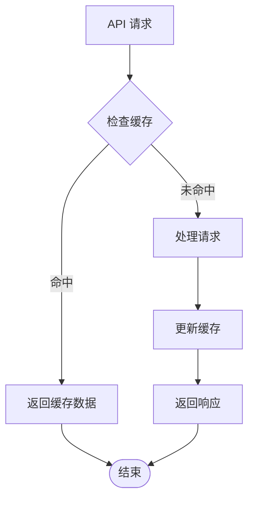

### 文件处理优化

1. **异步处理**：大文件上传使用异步处理
2. **流式传输**：支持大文件的流式下载
3. **内存管理**：及时释放文件句柄和缓冲区

## 故障排除指南

### 常见错误及解决方案

#### 认证相关错误

| 错误代码 | 错误类型 | 可能原因 | 解决方案 |
|---------|---------|---------|---------|
| 401 | 未授权 | JWT 令牌无效或过期 | 重新登录获取新令牌 |
| 403 | 禁止访问 | 用户权限不足 | 检查用户角色和权限 |
| 429 | 请求过多 | 触发速率限制 | 等待冷却时间或升级套餐 |

#### 数据库相关错误

| 错误代码 | 错误类型 | 可能原因 | 解决方案 |
|---------|---------|---------|---------|
| 500 | 数据库错误 | 连接失败或查询超时 | 检查数据库连接和网络 |
| 409 | 冲突 | 唯一约束冲突 | 检查重复数据 |
| 503 | 服务不可用 | 数据库锁定 | 重试请求或优化查询 |

#### 文件上传错误

| 错误代码 | 错误类型 | 可能原因 | 解决方案 |
|---------|---------|---------|---------|
| 413 | 请求实体过大 | 超过文件大小限制 | 减小文件大小或调整配置 |
| 415 | 不支持的媒体类型 | 文件格式不支持 | 使用支持的文件格式 |
| 500 | 服务器内部错误 | 文件系统权限问题 | 检查目录权限 |

**章节来源**
- [auth.js:14-27](file://auth.js#L14-L27)
- [server.js:465-514](file://server.js#L465-L514)

## 结论

trae02airead 项目展示了现代 Web 应用的完整架构实现，包括用户认证、数据管理、文件处理和 AI 集成等多个方面。通过本文档的分析，我们可以看到：

1. **模块化设计**：清晰的职责分离和模块化架构
2. **安全性考虑**：多层安全防护机制
3. **可扩展性**：良好的扩展点和插件机制
4. **性能优化**：针对不同场景的性能优化策略

对于 API 扩展开发，建议遵循本文档中提出的设计原则和最佳实践，确保新功能与现有系统的兼容性和一致性。

## 附录

### API 接口文档模板

#### 用户认证接口

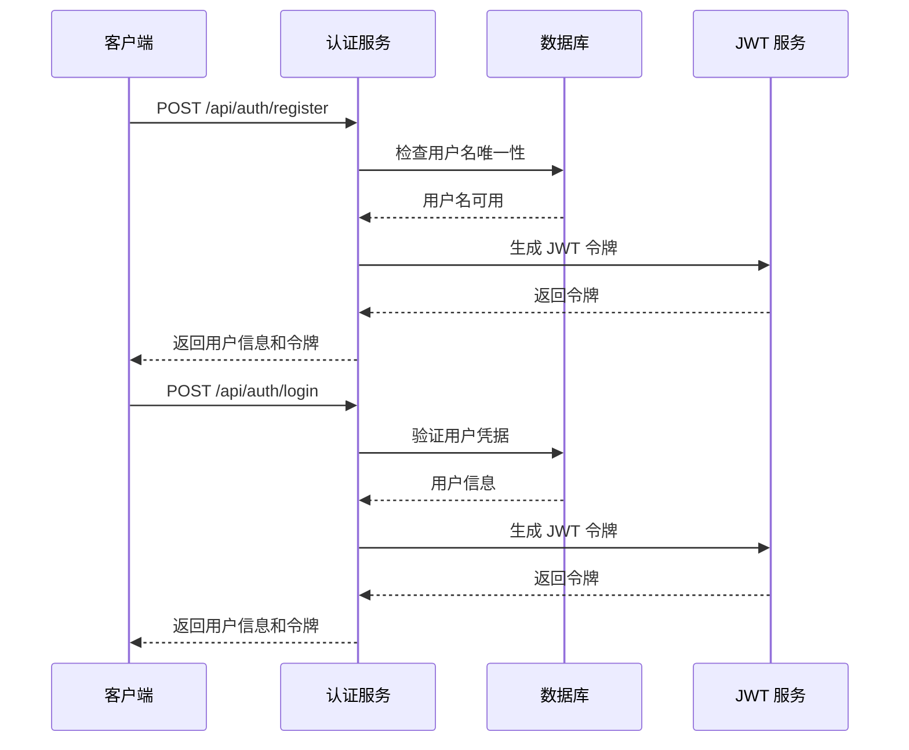

**图表来源**
- [auth.js:29-77](file://auth.js#L29-L77)

### 开发最佳实践清单

1. **代码质量**
   - 遵循 ESLint 规范
   - 编写单元测试
   - 使用 TypeScript 或 JSDoc 注释

2. **安全性**
   - 输入验证和清理
   - SQL 注入防护
   - XSS 防护
   - CSRF 防护

3. **性能**
   - 缓存策略
   - 数据库优化
   - 异步处理
   - 资源池管理

4. **可维护性**
   - 清晰的错误处理
   - 完整的日志记录
   - 模块化设计
   - 版本控制