# 扩展开发

<cite>
**本文档引用的文件**
- [README.md](file://README.md)
- [package.json](file://package.json)
- [server.js](file://server.js)
- [auth.js](file://auth.js)
- [database.js](file://database.js)
- [public/app.js](file://public/app.js)
- [public/index.html](file://public/index.html)
- [public/styles.css](file://public/styles.css)
</cite>

## 目录
1. [简介](#简介)
2. [项目结构](#项目结构)
3. [核心组件](#核心组件)
4. [架构概览](#架构概览)
5. [详细组件分析](#详细组件分析)
6. [依赖关系分析](#依赖关系分析)
7. [性能考虑](#性能考虑)
8. [故障排除指南](#故障排除指南)
9. [结论](#结论)
10. [附录](#附录)

## 简介

triae02airead 是一个现代化的智能阅读应用，集成了多个 AI 服务提供商，帮助用户高效阅读和理解书籍内容。该项目支持在线阅读、AI 智能问答、书架管理、自定义 AI 提供商等功能。本文档旨在为开发者提供全面的扩展开发指南，涵盖添加新的 AI 提供商、扩展现有功能和集成第三方服务的方法。

## 项目结构

项目采用前后端分离的架构设计，主要由以下组件构成：

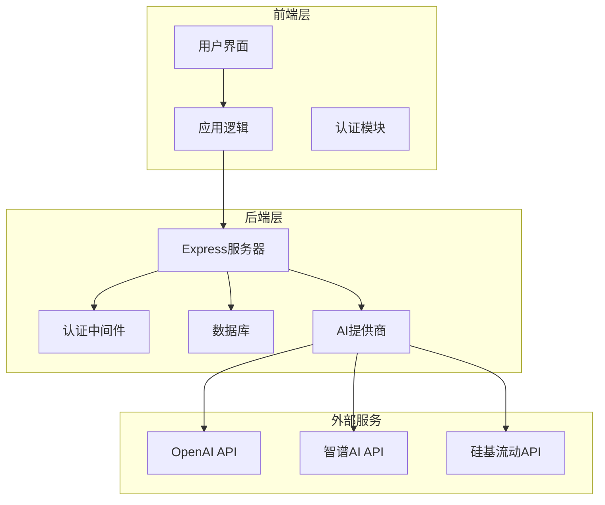

**图表来源**
- [server.js:1-50](file://server.js#L1-L50)
- [auth.js:1-80](file://auth.js#L1-L80)
- [database.js:1-80](file://database.js#L1-L80)

**章节来源**
- [README.md:210-232](file://README.md#L210-L232)

## 核心组件

### 服务器架构

项目采用 Express.js 作为后端框架，提供了完整的 RESTful API 接口。核心组件包括：

- **认证系统**：基于 JWT 的用户认证机制
- **数据库管理**：使用 sql.js 实现的 SQLite 数据库
- **文件处理**：Multer 实现的文件上传和管理
- **AI 集成**：支持多个 AI 提供商的统一接口

### 前端架构

前端采用原生 JavaScript 实现，提供了现代化的用户界面和交互体验：

- **响应式设计**：支持多种设备和屏幕尺寸
- **实时通信**：使用 SSE 实现流式 AI 输出
- **状态管理**：基于本地存储的用户偏好设置

**章节来源**
- [package.json:10-22](file://package.json#L10-L22)
- [server.js:15-40](file://server.js#L15-L40)

## 架构概览

系统采用分层架构设计，确保了良好的可扩展性和维护性：

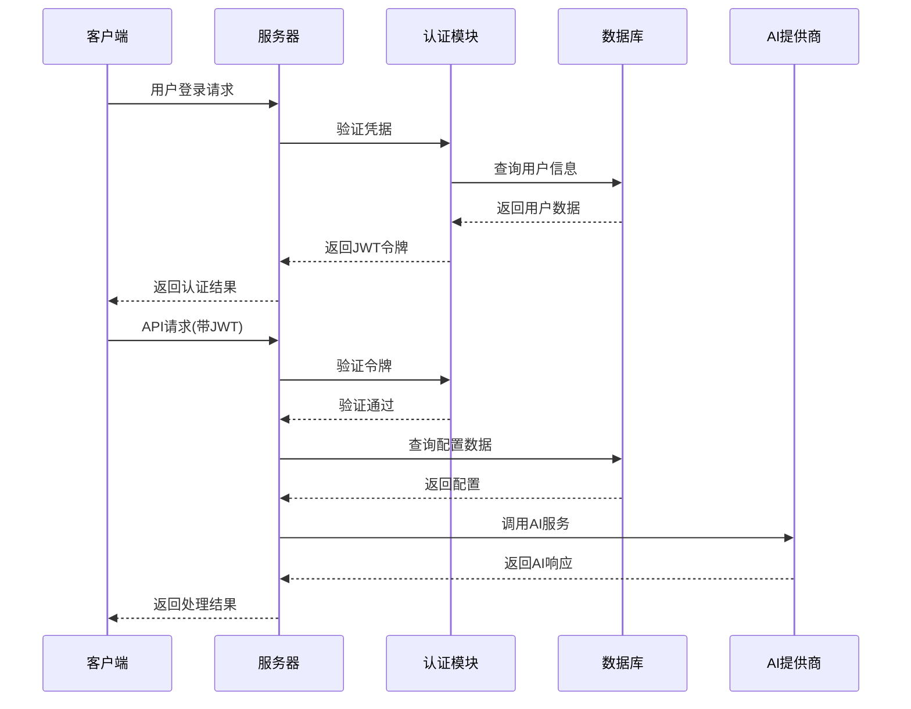

**图表来源**
- [auth.js:14-27](file://auth.js#L14-L27)
- [server.js:239-295](file://server.js#L239-L295)

## 详细组件分析

### AI 提供商管理系统

#### 内置提供商配置

系统预置了两个主要的 AI 提供商：

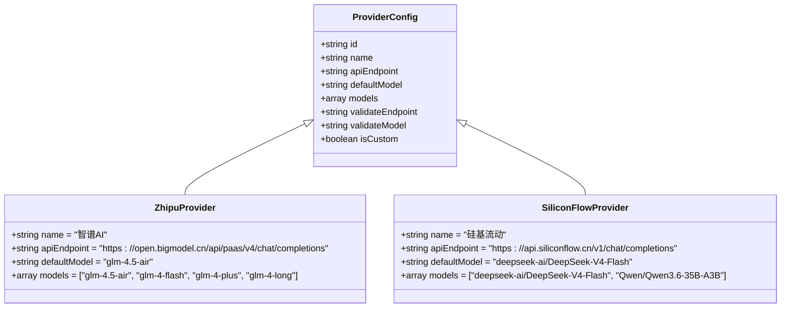

**图表来源**
- [server.js:163-188](file://server.js#L163-L188)

#### 自定义提供商添加流程

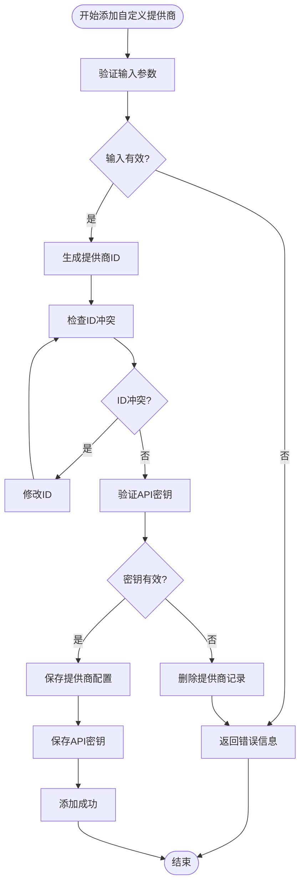

**图表来源**
- [server.js:366-423](file://server.js#L366-L423)

**章节来源**
- [server.js:163-205](file://server.js#L163-L205)
- [server.js:366-423](file://server.js#L366-L423)

### 认证系统

#### JWT 认证流程

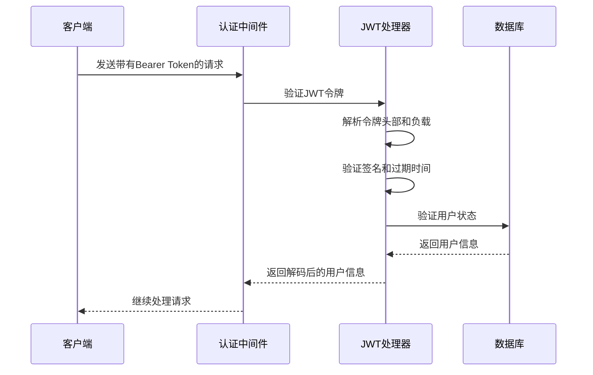

**图表来源**
- [auth.js:14-27](file://auth.js#L14-L27)

#### 用户注册和登录流程

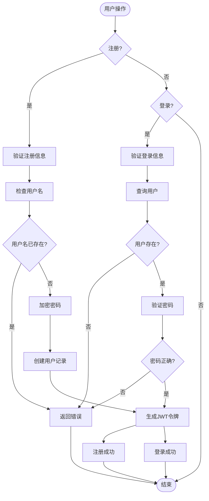

**图表来源**
- [auth.js:29-77](file://auth.js#L29-L77)

**章节来源**
- [auth.js:14-77](file://auth.js#L14-L77)

### 数据库设计

#### 核心数据表结构

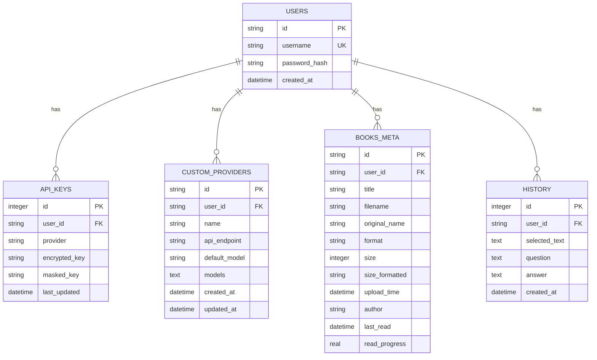

**图表来源**
- [database.js:81-135](file://database.js#L81-L135)

**章节来源**
- [database.js:81-135](file://database.js#L81-L135)

### 文件处理系统

#### 支持的文件格式

系统支持多种电子书格式的处理：

| 格式 | 扩展名 | 处理方式 | 限制 |
|------|--------|----------|------|
| 文本文件 | .txt | 直接读取 | 无 |
| PDF 文件 | .pdf | 下载后处理 | 需要客户端阅读器 |
| EPUB 文件 | .epub | 下载后处理 | 需要客户端阅读器 |
| MOBI 文件 | .mobi | 下载后处理 | 需要客户端阅读器 |

#### 文件上传流程

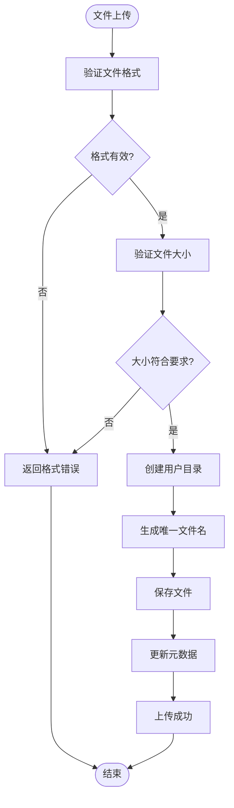

**图表来源**
- [server.js:465-514](file://server.js#L465-L514)

**章节来源**
- [server.js:465-514](file://server.js#L465-L514)

## 依赖关系分析

### 核心依赖关系

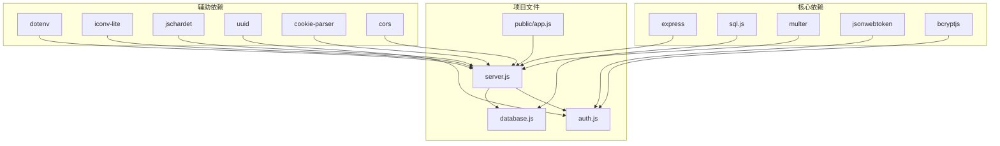

**图表来源**
- [package.json:10-22](file://package.json#L10-L22)

**章节来源**
- [package.json:10-22](file://package.json#L10-L22)

### 扩展点识别

系统提供了多个扩展点，便于开发者进行功能扩展：

1. **AI 提供商扩展点**：通过 PROVIDERS 对象添加新的 AI 服务
2. **文件格式扩展点**：通过 ALLOWED_EXTENSIONS 数组添加新的文件类型
3. **UI 组件扩展点**：通过 HTML 和 CSS 添加新的界面元素
4. **API 接口扩展点**：通过 Express 路由添加新的 RESTful 接口

**章节来源**
- [server.js:21-26](file://server.js#L21-L26)
- [server.js:163-188](file://server.js#L163-L188)

## 性能考虑

### 缓存策略

系统采用了多层次的缓存策略来优化性能：

- **内存缓存**：API 密钥和提供商配置的内存缓存
- **数据库缓存**：SQLite 数据库的 WAL 模式优化
- **文件缓存**：用户上传文件的本地存储

### 并发处理

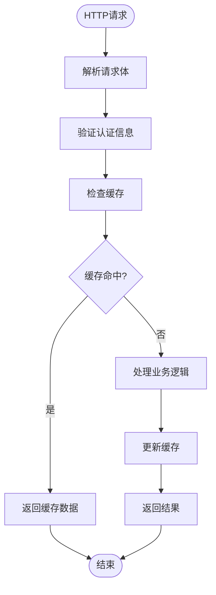

**图表来源**
- [server.js:618-688](file://server.js#L618-L688)

### 错误处理策略

系统实现了完善的错误处理机制：

- **认证错误**：401 状态码和重新登录提示
- **业务错误**：详细的错误信息和建议
- **系统错误**：优雅降级和错误日志记录

## 故障排除指南

### 常见问题诊断

#### API 密钥配置问题

**症状**：AI 功能无法使用，提示需要配置 API 密钥

**解决方案**：
1. 检查 API 密钥是否正确配置
2. 验证 API 密钥的有效性
3. 确认提供商 ID 的正确性

#### 文件上传失败

**症状**：文件上传过程中出现错误

**解决方案**：
1. 检查文件格式是否在支持列表中
2. 验证文件大小是否超过限制
3. 确认用户目录权限

#### 数据库连接问题

**症状**：应用启动时数据库初始化失败

**解决方案**：
1. 检查 data.db 文件权限
2. 验证 SQLite 库的完整性
3. 确认数据库文件路径

**章节来源**
- [server.js:239-332](file://server.js#L239-L332)
- [server.js:465-514](file://server.js#L465-L514)

## 结论

triae02airead 提供了一个功能完整且高度可扩展的 AI 阅读平台。通过本文档的指导，开发者可以：

1. **轻松添加新的 AI 提供商**：通过简单的配置即可集成新的 AI 服务
2. **扩展现有功能**：利用现有的扩展点开发新特性
3. **集成第三方服务**：通过标准化的接口接入各种外部服务
4. **开发新的电子书格式解析器**：支持更多文件格式的处理
5. **实现 API 扩展**：基于现有的 API 框架开发新的功能

项目的模块化设计和清晰的架构为后续的功能扩展奠定了坚实的基础。

## 附录

### 开发环境设置

#### 环境要求
- Node.js >= 18.0.0
- npm >= 9.0.0

#### 安装步骤
```bash
# 克隆项目
git clone <your-repo-url>
cd trae02airead

# 安装依赖
npm install

# 启动开发服务器
npm run dev
```

#### 生产部署
```bash
# 安装生产依赖
npm install --production

# 启动应用
npm start
```

### API 扩展开发指南

#### 新增 API 端点的步骤

1. **定义路由**：在 server.js 中添加新的路由定义
2. **实现处理函数**：编写对应的处理逻辑
3. **添加中间件**：根据需要添加认证和验证中间件
4. **测试 API**：使用 Postman 或 curl 进行测试
5. **更新文档**：在 README.md 中添加 API 文档

#### 最佳实践

- **错误处理**：始终包含适当的错误处理和状态码
- **输入验证**：对所有用户输入进行验证
- **日志记录**：记录重要的操作和错误信息
- **安全性**：实施适当的访问控制和数据保护

### 第三方服务集成方案

#### API 网关设计

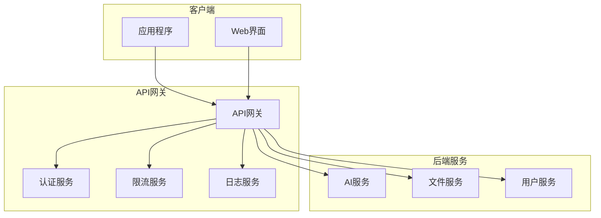

#### 集成步骤

1. **定义服务接口**：确定与第三方服务的交互协议
2. **实现适配器**：创建服务适配器处理 API 调用
3. **错误处理**：实现容错机制和降级策略
4. **监控和日志**：添加性能监控和错误日志
5. **测试和部署**：进行全面测试并部署到生产环境

### 版本兼容性管理

#### 升级策略

1. **向后兼容性**：确保新版本不影响现有功能
2. **数据库迁移**：提供数据库结构变更的迁移脚本
3. **配置文件**：保持配置文件的向后兼容
4. **API 版本控制**：对重要的 API 变更实施版本控制

#### 最佳实践

- **语义化版本控制**：遵循 semver 规范
- **变更日志**：维护详细的变更记录
- **测试覆盖**：确保升级过程的稳定性
- **回滚机制**：提供快速回滚的能力