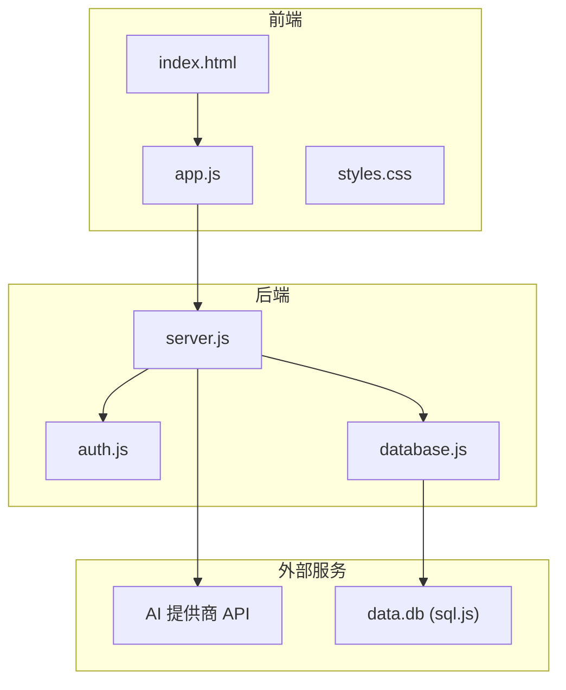
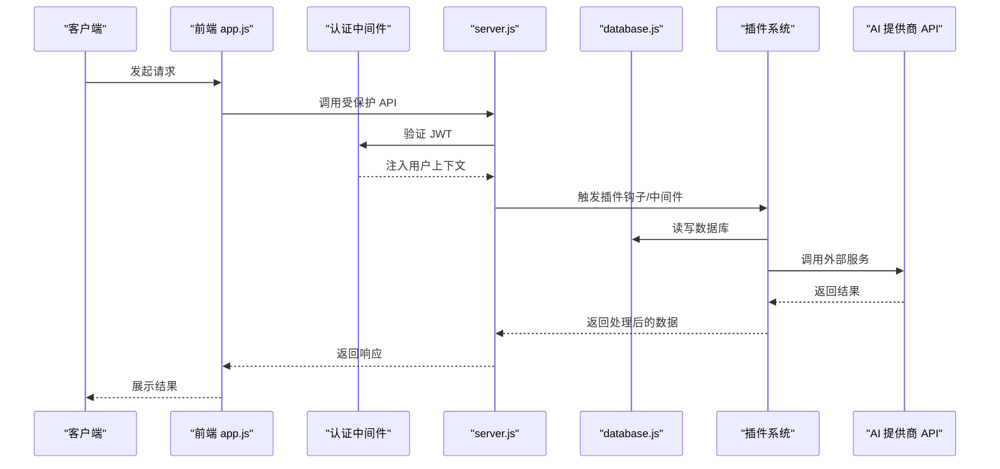
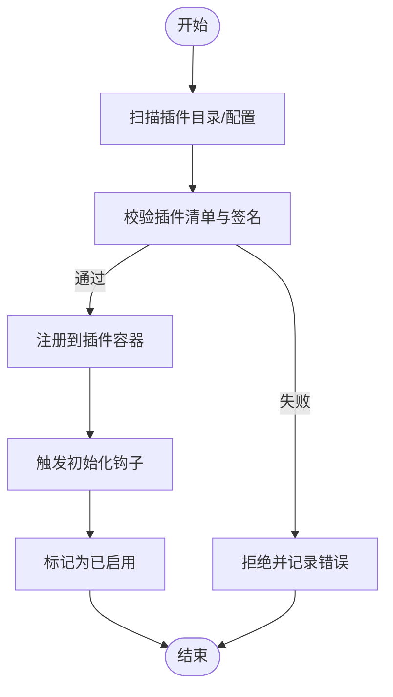
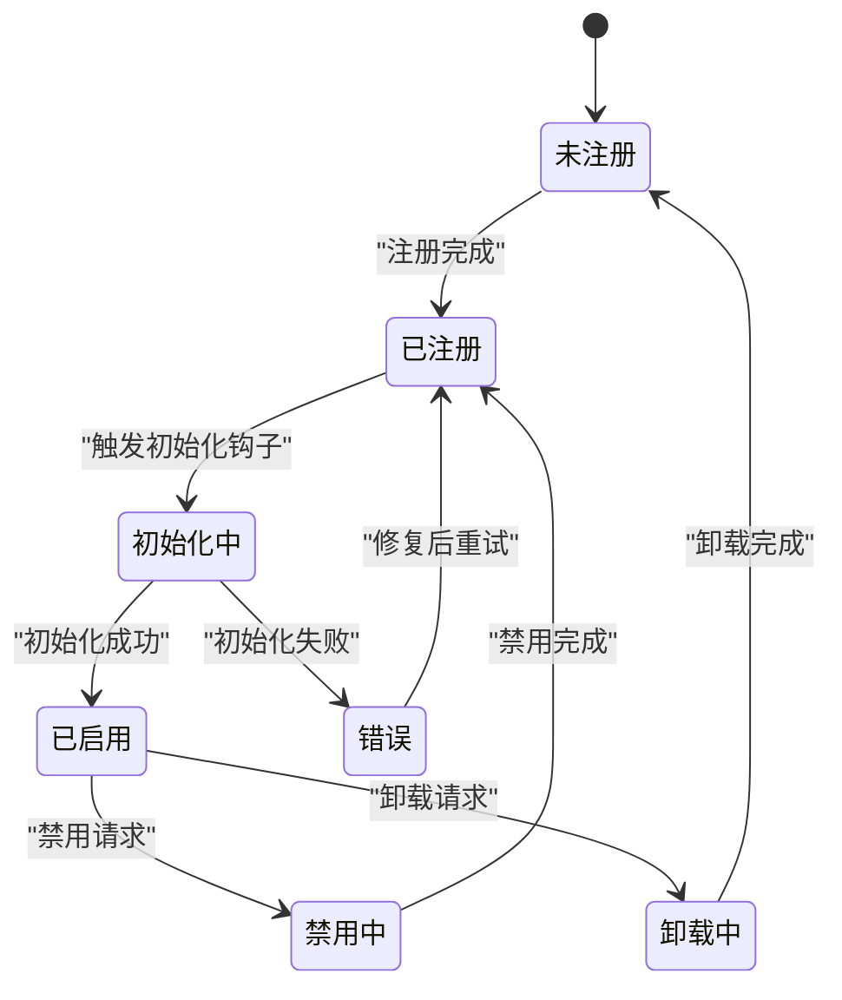
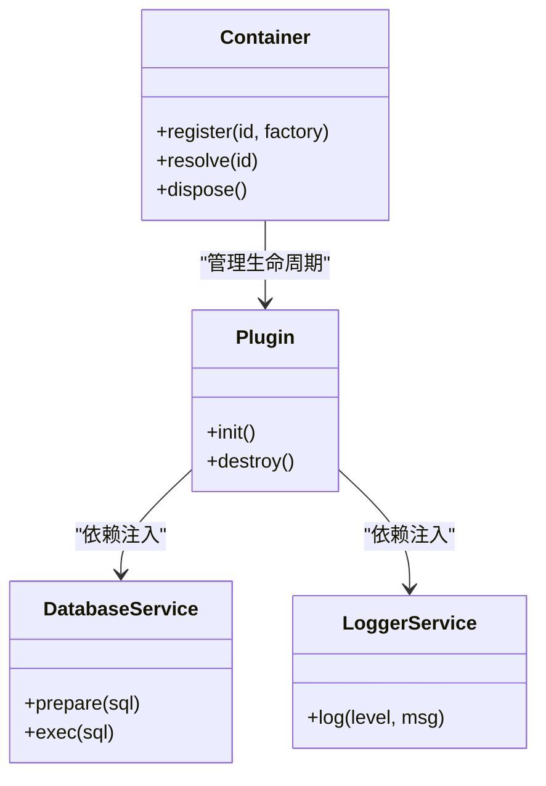
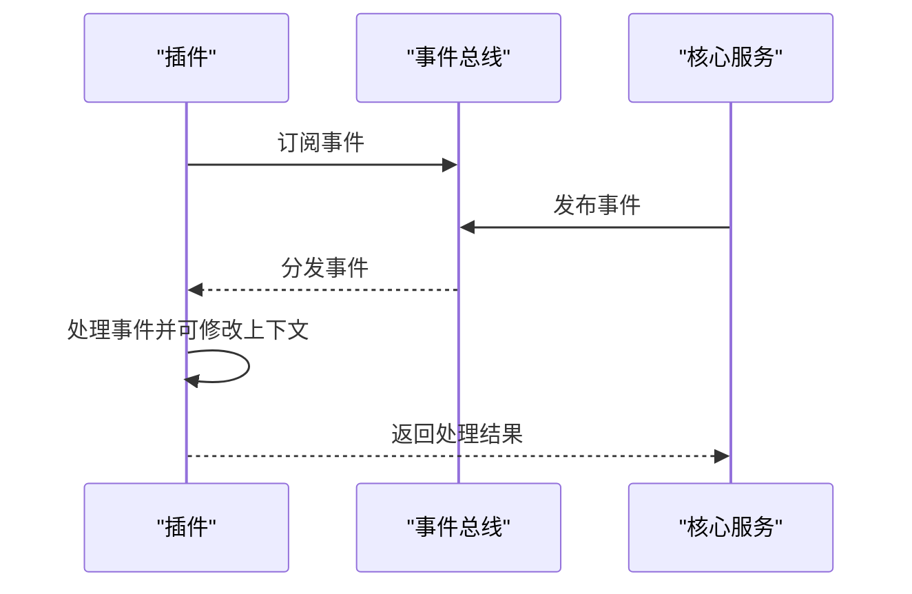
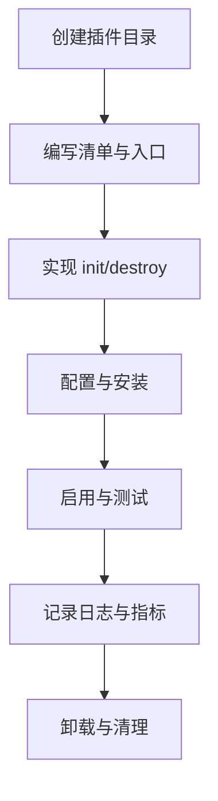
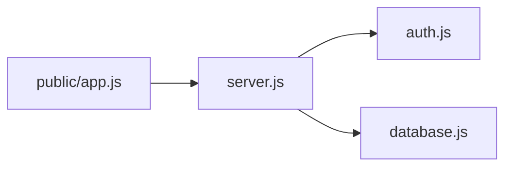

# 插件系统开发

<cite>
**本文档引用的文件**
- [README.md](file://README.md)
- [package.json](file://package.json)
- [server.js](file://server.js)
- [auth.js](file://auth.js)
- [database.js](file://database.js)
- [public/app.js](file://public/app.js)
- [public/index.html](file://public/index.html)
- [public/styles.css](file://public/styles.css)
</cite>

## 目录
1. [简介](#简介)
2. [项目结构](#项目结构)
3. [核心组件](#核心组件)
4. [架构总览](#架构总览)
5. [详细组件分析](#详细组件分析)
6. [依赖关系分析](#依赖关系分析)
7. [性能考量](#性能考量)
8. [故障排查指南](#故障排查指南)
9. [结论](#结论)
10. [附录](#附录)

## 简介
本指南面向为 trae02airead 构建“可扩展插件系统”的开发者，目标是提供一套标准化的插件架构设计与实现方法，涵盖插件注册机制、生命周期管理、依赖注入、事件系统、钩子函数、中间件模式、插件配置与安装卸载、版本管理、安全与沙箱隔离、性能监控，以及插件市场集成与发布流程。  
本项目当前已具备基础的认证、数据库、AI提供商管理与前端交互能力，为插件系统的扩展提供了良好的基础设施。

## 项目结构
项目采用前后端分离架构：
- 后端：Express 应用，提供 REST API、认证中间件、数据库封装与 AI 服务对接
- 前端：原生 JavaScript，负责用户界面、交互与 API 调用
- 数据层：SQLite（sql.js）持久化存储用户、密钥、提供商、书籍元数据与历史记录

图表来源
- [server.js:1-899](file://server.js#L1-L899)
- [auth.js:1-80](file://auth.js#L1-L80)
- [database.js:1-146](file://database.js#L1-L146)
- [public/index.html:1-436](file://public/index.html#L1-L436)
- [public/app.js:1-1659](file://public/app.js#L1-L1659)
- [public/styles.css:1-2162](file://public/styles.css#L1-L2162)

章节来源
- [README.md:210-232](file://README.md#L210-L232)
- [package.json:1-23](file://package.json#L1-L23)

## 核心组件
- Express 服务器与路由：提供认证、AI 问答、提供商管理、书籍管理等 API
- 认证中间件：JWT 验证与用户态注入
- 数据库封装：sql.js 封装，提供 CRUD 与索引管理
- 前端应用：AI 阅读助手 UI、提供商配置、书籍上传与历史记录展示

章节来源
- [server.js:1-899](file://server.js#L1-L899)
- [auth.js:1-80](file://auth.js#L1-L80)
- [database.js:1-146](file://database.js#L1-L146)
- [public/app.js:1-1659](file://public/app.js#L1-L1659)

## 架构总览
插件系统应以“中间件 + 钩子 + 依赖注入”为核心，围绕现有认证与数据库层进行扩展，确保安全与性能。

图表来源
- [server.js:14-42](file://server.js#L14-L42)
- [auth.js:14-27](file://auth.js#L14-L27)
- [database.js:9-67](file://database.js#L9-L67)
- [public/app.js:166-184](file://public/app.js#L166-L184)

## 详细组件分析

### 插件注册机制
- 插件清单：定义插件元数据（名称、版本、入口、依赖、权限）
- 动态加载：基于文件系统扫描或配置中心发现
- 生命周期钩子：初始化、启用、禁用、卸载
- 依赖解析：按 ID/版本约束解析依赖，避免循环依赖

[此图为概念性流程，不直接映射具体源码文件]

### 生命周期管理
- 初始化阶段：加载配置、建立连接、注册中间件/钩子
- 运行阶段：接收请求、执行钩子链、处理业务逻辑
- 关闭阶段：释放资源、清理定时器、持久化状态

[此图为概念性状态图，不直接映射具体源码文件]

### 依赖注入
- 服务容器：集中管理插件实例与共享服务（数据库、日志、缓存）
- 接口契约：定义稳定的接口（如 Provider、Storage、Logger）
- 注入策略：构造函数注入、属性注入、工厂注入

[此图为概念性类图，不直接映射具体源码文件]

### 事件系统与钩子函数
- 事件总线：发布/订阅模式，支持同步/异步事件
- 钩子链：前置钩子 -> 主逻辑 -> 后置钩子，支持中断与修改上下文
- 事件类型：请求进入、请求完成、错误、配置变更、用户行为

[此图为概念性序列图，不直接映射具体源码文件]

### 中间件模式
- 中间件链：鉴权 -> 日志 -> 插件钩子 -> 业务处理 -> 响应处理
- 错误传播：异常捕获与错误中间件统一处理
- 上下文传递：在中间件间传递用户、请求、响应对象

[此图为概念性流程图，不直接映射具体源码文件]

### 插件接口设计原则与标准化规范
- 统一入口：导出 init(container, config) 与 destroy() 方法
- 配置契约：支持环境变量与配置文件合并
- 安全边界：最小权限原则，禁止直接访问核心内部状态
- 版本兼容：语义化版本，声明最低支持版本

章节来源
- [server.js:14-42](file://server.js#L14-L42)
- [auth.js:14-27](file://auth.js#L14-L27)
- [database.js:9-67](file://database.js#L9-L67)

### 插件开发完整示例（步骤化）
- 步骤1：创建插件目录与清单
  - 在 plugins/<plugin-id>/ 目录下放置 package.json、index.js、README.md
- 步骤2：实现插件入口
  - 导出 init(container, config) 与 destroy()
  - 在 init 中注册中间件/钩子/事件监听
- 步骤3：配置与安装
  - 将插件路径加入配置或通过 UI 安装
  - 校验依赖与签名
- 步骤4：启用与测试
  - 观察日志与指标，验证功能
- 步骤5：卸载与清理
  - 调用 destroy()，清理资源与事件

[此图为概念性流程图，不直接映射具体源码文件]

### 插件配置、安装与卸载
- 配置：支持 JSON/YAML，支持环境变量覆盖
- 安装：拷贝至 plugins/ 或通过插件市场下载
- 卸载：停止插件、移除事件监听、清理持久化数据

章节来源
- [server.js:334-461](file://server.js#L334-L461)
- [public/app.js:548-626](file://public/app.js#L548-L626)

### 版本管理
- 语义化版本：主版本/次版本/修订号
- 兼容性矩阵：声明支持的后端版本范围
- 自动升级：通过插件市场推送更新

[本节为通用实践说明，不直接分析具体源码文件]

### 安全考虑、沙箱隔离与性能监控
- 沙箱隔离：Node.js Worker Threads 或 Docker 容器
- 最小权限：仅授予插件所需 API 权限
- 输入验证：对插件传入参数进行严格校验
- 性能监控：指标采集（CPU/内存/延迟）、告警阈值、慢查询追踪

章节来源
- [server.js:44-67](file://server.js#L44-L67)
- [auth.js:14-27](file://auth.js#L14-L27)

### 插件市场集成与发布流程
- 市场协议：插件清单、签名、元数据、版本历史
- 发布流程：提交 -> 审核 -> 上架 -> 推送更新
- 用户侧：搜索、安装、更新、卸载、评分与反馈

[本节为通用实践说明，不直接分析具体源码文件]

## 依赖关系分析
后端依赖关系主要体现在 server.js 对 auth.js 与 database.js 的使用，以及前端对后端 API 的调用。

图表来源
- [server.js:12-13](file://server.js#L12-L13)
- [auth.js:1-6](file://auth.js#L1-L6)
- [database.js:1-6](file://database.js#L1-L6)
- [public/app.js:166-184](file://public/app.js#L166-L184)

章节来源
- [server.js:12-13](file://server.js#L12-L13)
- [auth.js:1-6](file://auth.js#L1-L6)
- [database.js:1-6](file://database.js#L1-L6)
- [public/app.js:166-184](file://public/app.js#L166-L184)

## 性能考量
- 中间件顺序优化：将高频过滤前置，减少后续处理成本
- 数据库访问：批量操作、索引优化、连接池复用
- 缓存策略：热点数据缓存、失效策略、缓存穿透防护
- 异步处理：I/O 密集场景使用异步，CPU 密集场景使用工作线程
- 监控与告警：关键指标（QPS、P95/P99、错误率）持续观测

[本节提供通用指导，不直接分析具体源码文件]

## 故障排查指南
- 认证失败：检查 JWT 密钥、过期时间、请求头 Authorization
- 数据库异常：确认 sql.js 初始化、WAL 模式、索引是否存在
- API 密钥问题：验证密钥格式、提供商端点、超时与限流
- 前端交互异常：检查网络请求、跨域、CORS 配置

章节来源
- [auth.js:14-27](file://auth.js#L14-L27)
- [database.js:69-138](file://database.js#L69-L138)
- [server.js:239-332](file://server.js#L239-L332)
- [public/app.js:166-184](file://public/app.js#L166-L184)

## 结论
通过在现有认证、数据库与前端交互基础上引入插件系统，可以实现高度可扩展的 AI 阅读助手平台。建议以中间件与钩子为核心，结合依赖注入与事件总线，构建安全、可观测、可维护的插件生态。同时，配套完善的版本管理、市场集成与发布流程，将有助于插件生态的长期健康发展。

## 附录
- 技术栈概览：Express、sql.js、JWT、Multer、bcrypt、iconv、jschardet
- API 路由参考：认证、AI 问答、密钥管理、提供商管理、书籍管理

章节来源
- [README.md:54-67](file://README.md#L54-L67)
- [README.md:162-209](file://README.md#L162-L209)