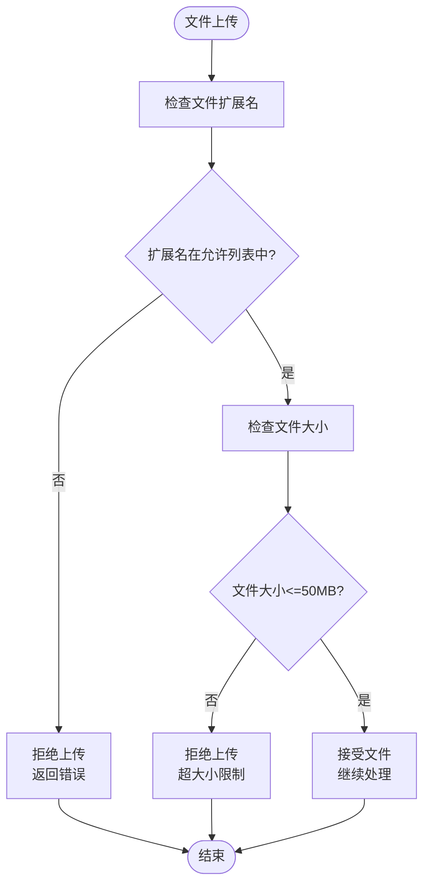
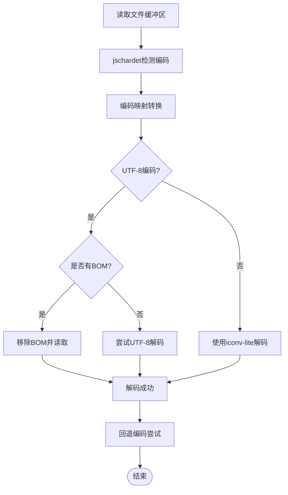
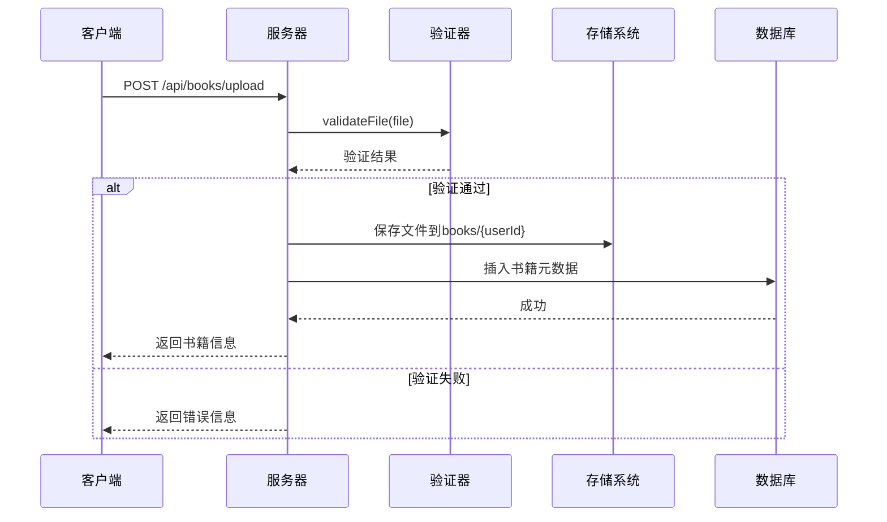
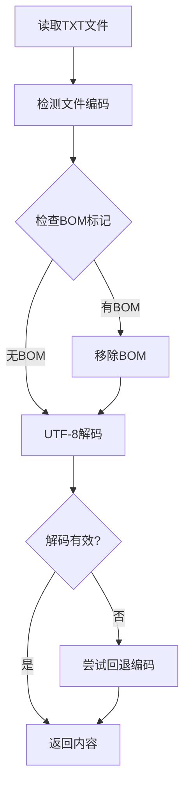
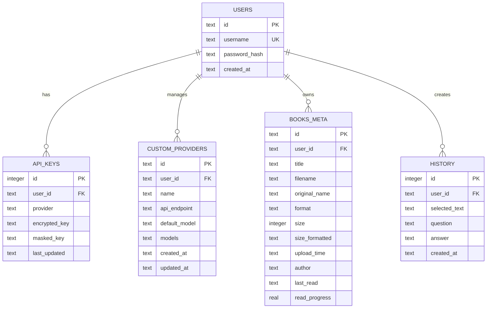
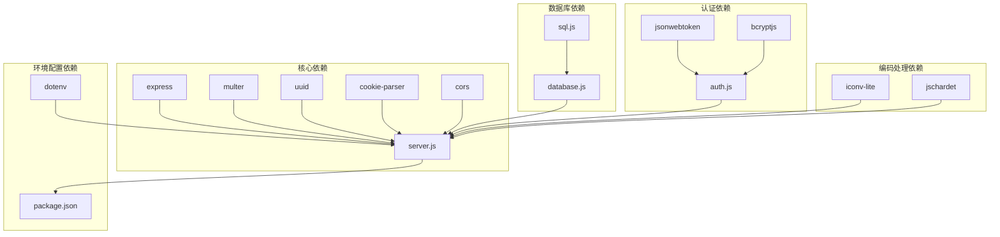

# 文件格式扩展

<cite>
**本文档引用的文件**
- [README.md](file://README.md)
- [package.json](file://package.json)
- [server.js](file://server.js)
- [auth.js](file://auth.js)
- [database.js](file://database.js)
- [public/app.js](file://public/app.js)
- [public/index.html](file://public/index.html)
- [public/styles.css](file://public/styles.css)
</cite>

## 目录
1. [简介](#简介)
2. [项目结构](#项目结构)
3. [核心组件](#核心组件)
4. [架构概览](#架构概览)
5. [详细组件分析](#详细组件分析)
6. [依赖关系分析](#依赖关系分析)
7. [性能考虑](#性能考虑)
8. [故障排除指南](#故障排除指南)
9. [结论](#结论)

## 简介

trae02airead 是一个现代化的智能阅读应用，集成了多AI服务提供商，帮助用户高效阅读和理解书籍内容。该项目支持多种电子书格式，包括TXT、PDF、EPUB和MOBI格式，最大支持50MB的文件大小。

该项目的核心特性包括：
- 智能阅读：TXT文件在线阅读，预置《百年孤独》经典章节作为示例
- 编码自动检测：自动检测文件编码（UTF-8、GBK、GB2312、BIG5等）
- 文章目录：自动生成章节目录，支持快速导航
- AI智能问答：支持流式输出，SSE流式传输
- 书架管理：多格式支持，上传进度显示
- 用户系统：JWT认证，密码安全存储

## 项目结构

项目采用前后端分离的架构设计，主要分为以下几个部分：

```mermaid
graph TB
subgraph "前端层"
FE1[public/index.html<br/>主页面]
FE2[public/app.js<br/>前端逻辑]
FE3[public/styles.css<br/>样式表]
end
subgraph "后端层"
BE1[server.js<br/>Express主服务]
BE2[auth.js<br/>用户认证]
BE3[database.js<br/>SQLite数据库]
end
subgraph "数据存储"
DS1[books/<userId>/]<br/>书籍文件存储
DS2[data.db<br/>SQLite数据库]
end
FE1 --> BE1
FE2 --> BE1
FE3 --> BE1
BE1 --> DS1
BE1 --> DS2
BE2 --> BE1
BE3 --> BE1
```

**图表来源**
- [server.js:1-899](file://server.js#L1-L899)
- [public/index.html:1-436](file://public/index.html#L1-L436)

**章节来源**
- [README.md:210-232](file://README.md#L210-L232)
- [package.json:1-23](file://package.json#L1-L23)

## 核心组件

### 文件格式支持系统

项目目前支持四种文件格式，通过ALLOWED_EXTENSIONS数组进行管理：

```javascript
const ALLOWED_EXTENSIONS = ['.txt', '.pdf', '.epub', '.mobi'];
```

每种格式都有相应的处理逻辑：
- **TXT格式**：支持编码自动检测，包括UTF-8、GBK、GB2312、BIG5等
- **PDF格式**：二进制文件处理，支持直接下载
- **EPUB格式**：电子书格式，支持直接下载
- **MOBI格式**：Mobipocket电子书格式，支持直接下载

### 文件验证系统

文件验证通过validateFile函数实现，包含格式检查和大小限制：



**图表来源**
- [server.js:123-132](file://server.js#L123-L132)

### 编码检测系统

TXT文件的编码检测通过jschardet库实现，支持多种编码格式：



**图表来源**
- [server.js:81-121](file://server.js#L81-L121)

**章节来源**
- [server.js:21-22](file://server.js#L21-L22)
- [server.js:123-132](file://server.js#L123-L132)
- [server.js:81-121](file://server.js#L81-L121)

## 架构概览

系统采用模块化的Express.js架构，主要组件包括：

```mermaid
graph TB
subgraph "API路由层"
R1[/api/auth/*<br/>用户认证]
R2[/api/books/*<br/>书籍管理]
R3[/api/key/*<br/>密钥管理]
R4[/api/providers/*<br/>提供商管理]
R5[/api/ask*<br/>AI问答]
end
subgraph "业务逻辑层"
B1[文件上传处理]
B2[内容提取]
B3[AI服务调用]
B4[数据库操作]
end
subgraph "数据访问层"
D1[SQLite数据库]
D2[文件系统存储]
end
R1 --> B1
R2 --> B2
R3 --> B3
R4 --> B3
R5 --> B3
B1 --> D2
B2 --> D2
B3 --> D1
B4 --> D1
```

**图表来源**
- [server.js:37-461](file://server.js#L37-L461)

**章节来源**
- [server.js:30-899](file://server.js#L30-L899)

## 详细组件分析

### 文件上传处理组件

文件上传处理是系统的核心功能之一，负责接收用户上传的文件并进行验证和存储。

#### 核心处理流程



**图表来源**
- [server.js:465-514](file://server.js#L465-L514)

#### 文件过滤器实现

Multer文件过滤器确保只有允许的文件格式才能上传：

```javascript
const upload = multer({
    storage: storage,
    limits: { fileSize: MAX_FILE_SIZE },
    fileFilter: (req, file, cb) => {
        const ext = getFileExtension(file.originalname);
        if (ALLOWED_EXTENSIONS.includes(ext)) {
            cb(null, true);
        } else {
            cb(new Error(`不支持的文件格式: ${ext}`));
        }
    }
});
```

**章节来源**
- [server.js:150-161](file://server.js#L150-L161)

### 书籍内容提取组件

#### TXT文件内容提取

TXT文件的内容提取通过编码检测和文件读取实现：



**图表来源**
- [server.js:81-121](file://server.js#L81-L121)

#### 其他格式处理

对于PDF、EPUB、MOBI等格式，系统采用直接下载的方式处理：

```javascript
if (row.format.toLowerCase() === 'txt') {
    try {
        const content = readTextFileWithEncoding(filePath);
        res.json({ book, content });
    } catch (error) {
        console.error('读取书籍内容失败:', error);
        res.status(500).json({ error: '读取书籍内容失败' });
    }
} else {
    res.json({ book, downloadUrl: `/api/books/${bookId}/download` });
}
```

**章节来源**
- [server.js:549-559](file://server.js#L549-L559)

### 数据库管理系统

系统使用SQLite数据库存储用户信息、API密钥、自定义提供商和书籍元数据。

#### 数据库表结构



**图表来源**
- [database.js:81-135](file://database.js#L81-L135)

**章节来源**
- [database.js:69-146](file://database.js#L69-L146)

## 依赖关系分析

项目的主要依赖关系如下：



**图表来源**
- [package.json:10-22](file://package.json#L10-L22)
- [server.js:1-10](file://server.js#L1-L10)

**章节来源**
- [package.json:1-23](file://package.json#L1-L23)

## 性能考虑

### 文件处理性能

1. **内存管理**：TXT文件读取采用流式处理，避免大文件占用过多内存
2. **编码检测优化**：使用jschardet进行快速编码检测，减少不必要的解码尝试
3. **缓存策略**：API密钥和提供商信息在内存中缓存，减少数据库查询次数

### 并发处理

系统采用单进程架构，适合中小型应用。对于高并发场景，建议：
- 使用负载均衡器分发请求
- 实现文件上传队列管理
- 考虑使用CDN加速文件下载

### 存储优化

1. **文件命名策略**：使用UUID确保文件名唯一性，避免冲突
2. **目录结构**：按用户ID分目录存储，便于管理和清理
3. **数据库索引**：为常用查询字段建立索引，提高查询性能

## 故障排除指南

### 常见问题及解决方案

#### 文件上传失败

**问题症状**：上传文件时返回"不支持的文件格式"或"文件大小超过限制"

**可能原因**：
1. 文件格式不在ALLOWED_EXTENSIONS列表中
2. 文件大小超过50MB限制
3. 文件路径权限问题

**解决方案**：
1. 检查文件扩展名是否在允许列表中
2. 确认文件大小不超过限制
3. 验证books目录的写入权限

#### 编码检测失败

**问题症状**：TXT文件显示乱码或解码错误

**可能原因**：
1. 文件编码不在支持列表中
2. 文件损坏或格式异常
3. 编码检测库版本问题

**解决方案**：
1. 尝试手动指定文件编码
2. 使用文本编辑器重新保存文件
3. 更新jschardet和iconv-lite库

#### API密钥验证失败

**问题症状**：AI功能无法正常使用，提示API密钥无效

**可能原因**：
1. API密钥格式错误
2. 网络连接问题
3. 服务端点不可达

**解决方案**：
1. 重新生成并复制正确的API密钥
2. 检查网络连接和防火墙设置
3. 验证API服务端点的有效性

**章节来源**
- [server.js:465-514](file://server.js#L465-L514)
- [server.js:123-132](file://server.js#L123-L132)

## 结论

trae02airead项目展示了现代Web应用的最佳实践，包括：

1. **模块化架构**：清晰的前后端分离设计
2. **安全性考虑**：JWT认证、密码加密、API密钥加密存储
3. **用户体验**：流畅的界面交互和响应式设计
4. **可扩展性**：支持多种文件格式和AI服务提供商

对于文件格式扩展开发，项目提供了良好的基础架构，开发者可以按照以下步骤添加新的文件格式支持：

1. 扩展ALLOWED_EXTENSIONS数组
2. 实现相应的文件验证逻辑
3. 添加格式特定的内容提取功能
4. 更新前端界面支持新格式
5. 编写测试用例验证功能

通过遵循这些指导原则，可以安全地扩展系统功能，同时保持代码的可维护性和性能。