# 第三方服务集成

<cite>
**本文档引用的文件**
- [README.md](file://README.md)
- [package.json](file://package.json)
- [server.js](file://server.js)
- [auth.js](file://auth.js)
- [database.js](file://database.js)
- [public/index.html](file://public/index.html)
- [public/app.js](file://public/app.js)
- [public/styles.css](file://public/styles.css)
</cite>

## 目录
1. [简介](#简介)
2. [项目结构](#项目结构)
3. [核心组件](#核心组件)
4. [架构总览](#架构总览)
5. [详细组件分析](#详细组件分析)
6. [依赖关系分析](#依赖关系分析)
7. [性能考虑](#性能考虑)
8. [故障排查指南](#故障排查指南)
9. [结论](#结论)
10. [附录](#附录)

## 简介
本指南面向为 trae02airead 项目集成第三方服务的开发者，涵盖云存储服务（AWS S3、阿里云 OSS）、CDN 服务、监控工具、API 网关设计模式与路由转发机制、OAuth 认证集成、Webhook 处理、异步任务队列、配置管理与密钥轮换、安全审计、集成测试、性能优化与成本控制最佳实践。文档基于现有代码库进行分析，结合实际可落地的建议，帮助在不破坏现有架构的前提下扩展系统能力。

## 项目结构
项目采用前后端分离架构，后端基于 Express.js，前端为原生 JavaScript + HTML/CSS，数据库使用 sql.js 将 SQLite 存储在内存中并在磁盘持久化。核心模块包括：
- 服务器入口与路由：server.js
- 认证中间件与用户接口：auth.js
- 数据库封装与初始化：database.js
- 前端页面与交互逻辑：public/index.html、public/app.js、public/styles.css
- 依赖与脚本：package.json

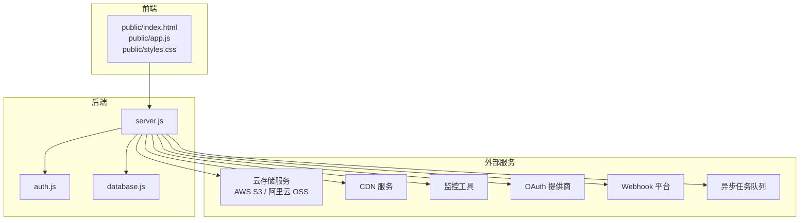

图表来源
- [server.js:1-899](file://server.js#L1-L899)
- [auth.js:1-80](file://auth.js#L1-L80)
- [database.js:1-146](file://database.js#L1-L146)
- [public/index.html:1-436](file://public/index.html#L1-L436)
- [public/app.js:1-800](file://public/app.js#L1-L800)

章节来源
- [README.md:210-232](file://README.md#L210-L232)
- [package.json:1-23](file://package.json#L1-L23)

## 核心组件
- 认证与授权：JWT 中间件负责鉴权，用户注册/登录接口返回令牌，后续 API 调用需携带 Authorization: Bearer <token>。
- 数据层：SQLite（sql.js）封装，提供 CRUD 与索引，支持用户、API 密钥、自定义提供商、书籍元数据、历史记录等表。
- 文件上传与存储：Multer 配置，限制文件类型与大小，按用户目录隔离存储书籍文件。
- AI 问答：支持非流式与流式（SSE）两种模式，调用第三方 AI 提供商 API，支持内置与自定义提供商。
- 前端交互：原生 JS 实现认证、提供商切换、密钥管理、书籍上传与阅读、历史记录展示等。

章节来源
- [auth.js:14-27](file://auth.js#L14-L27)
- [database.js:81-135](file://database.js#L81-L135)
- [server.js:465-597](file://server.js#L465-L597)
- [server.js:618-827](file://server.js#L618-L827)
- [public/app.js:150-162](file://public/app.js#L150-L162)

## 架构总览
系统采用“前端单页应用 + 后端 API 服务”的模式，后端集中处理认证、业务逻辑、第三方服务对接与数据持久化。为满足第三方服务集成需求，建议在现有路由基础上增加网关层与适配器层，实现统一接入与抽象。

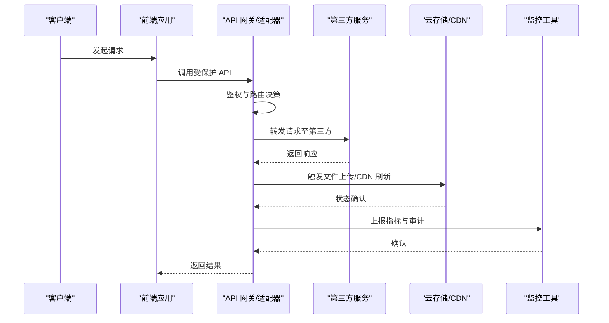

图表来源
- [server.js:37-42](file://server.js#L37-L42)
- [server.js:618-827](file://server.js#L618-L827)
- [auth.js:14-27](file://auth.js#L14-L27)

## 详细组件分析

### API 网关设计模式与路由转发
- 鉴权中间件：所有 /api 路由前执行，校验 JWT，失败返回 401。
- 路由分层：认证路由（/api/auth/*）、密钥管理路由（/api/key/*）、提供商管理（/api/providers/*）、书籍管理（/api/books/*）、AI 问答（/api/ask、/api/ask-stream）。
- 路由转发机制：AI 问答通过 fetch 转发到第三方提供商，支持超时控制与错误处理；文件上传使用 Multer，按用户目录隔离存储。

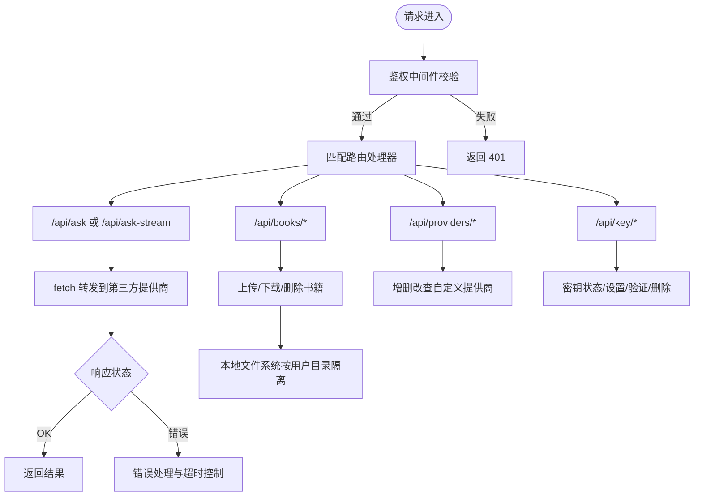

图表来源
- [server.js:37-42](file://server.js#L37-L42)
- [server.js:618-827](file://server.js#L618-L827)
- [server.js:465-597](file://server.js#L465-L597)
- [server.js:336-461](file://server.js#L336-L461)
- [server.js:239-332](file://server.js#L239-L332)

章节来源
- [server.js:37-42](file://server.js#L37-L42)
- [server.js:618-827](file://server.js#L618-L827)
- [server.js:465-597](file://server.js#L465-L597)
- [server.js:336-461](file://server.js#L336-L461)
- [server.js:239-332](file://server.js#L239-L332)

### 负载均衡、故障转移与限流策略
- 负载均衡：在网关层对多个第三方提供商实例进行轮询或权重分配，结合健康检查与熔断策略。
- 故障转移：当主提供商不可用时，自动切换到备用提供商或降级为缓存/默认响应。
- 限流策略：基于令牌桶/漏桶算法，按用户 ID/IP 维度限制请求速率，防止突发流量冲击第三方服务。

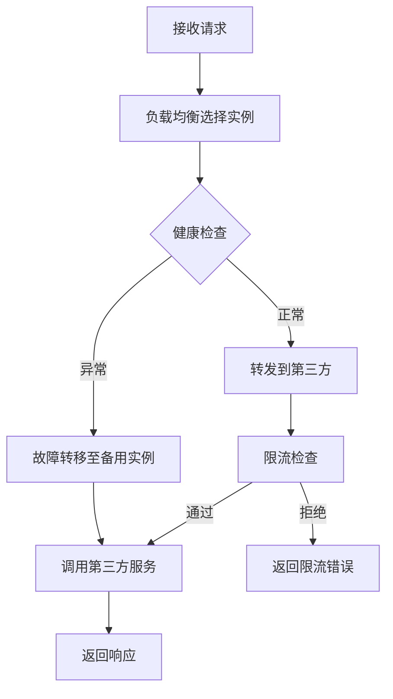

[此图为概念性流程图，不直接映射具体源文件]

### OAuth 认证集成
- 登录流程：前端提交用户名/密码，后端验证后签发 JWT；后续请求携带 Authorization: Bearer <token>。
- 第三方 OAuth：在网关层新增 /oauth/callback 路由，处理第三方回调，交换 access_token，生成内部会话并返回前端。

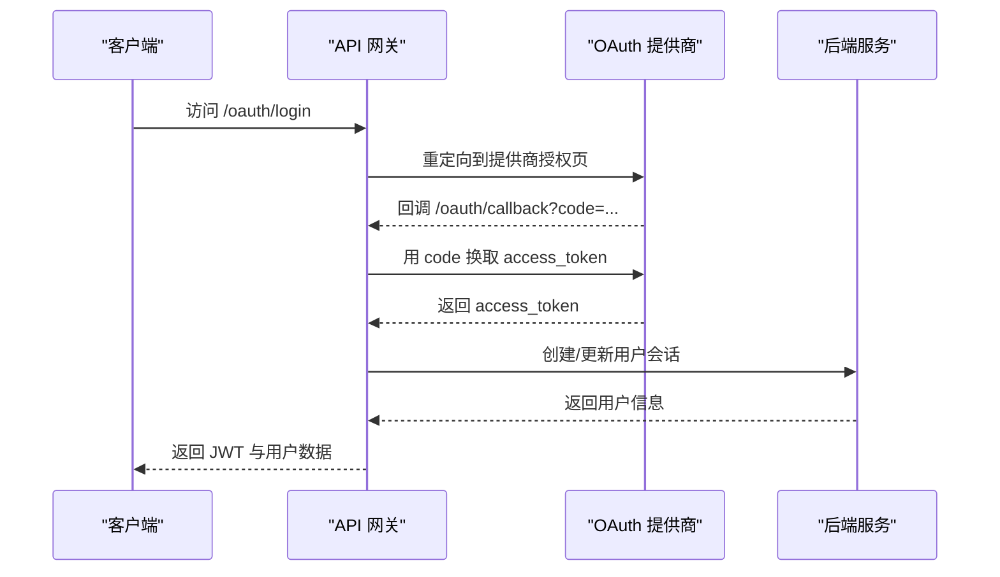

[此图为概念性流程图，不直接映射具体源文件]

### Webhook 处理
- 接收：在网关层新增 /webhook/{service} 路由，解析第三方平台推送的数据。
- 验证：校验签名与来源 IP 白名单，确保消息真实性。
- 处理：异步派发到队列，避免阻塞请求线程；幂等性设计，避免重复处理。

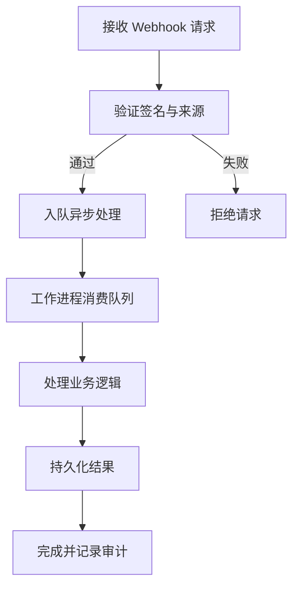

[此图为概念性流程图，不直接映射具体源文件]

### 异步任务队列
- 队列选择：Redis/RabbitMQ/Kafka 等，结合持久化与重试机制。
- 任务类型：文件转码、CDN 刷新、统计上报、通知发送等。
- 监控：队列长度、处理耗时、失败重试次数等指标上报监控系统。

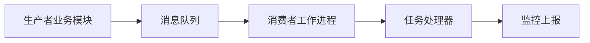

[此图为概念性架构图，不直接映射具体源文件]

### 云存储服务集成（AWS S3 / 阿里云 OSS）
- 对接方式：在网关层封装对象存储 SDK，统一封装上传/下载/删除/列举等操作。
- 安全：使用临时凭证（STS/OSS SecurityToken）或服务端签名直传，避免暴露长期密钥。
- 成本控制：启用生命周期规则、低频存储分层、压缩与去重策略。

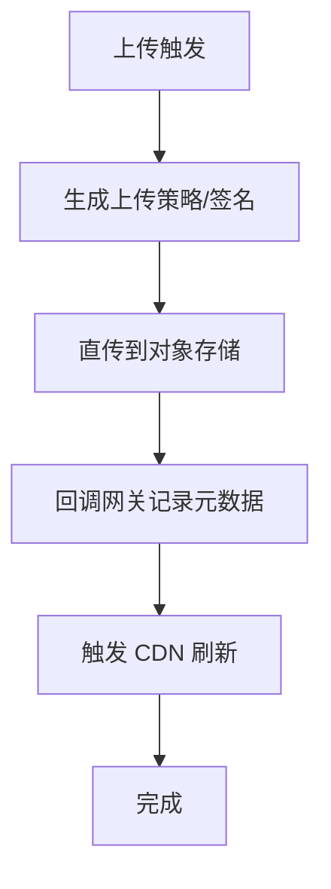

[此图为概念性流程图，不直接映射具体源文件]

### CDN 服务集成
- 边缘加速：将静态资源与热点内容缓存至 CDN 边缘节点。
- 刷新策略：上传完成后主动刷新缓存，或基于 TTL 自动更新。
- 监控：CDN 指标（回源率、命中率、延迟）纳入统一监控。

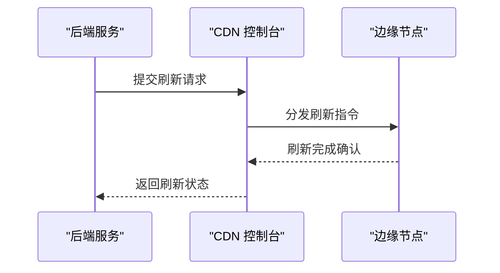

[此图为概念性流程图，不直接映射具体源文件]

### 监控工具集成
- 指标采集：HTTP 请求耗时、错误率、并发数、第三方调用成功率与延迟。
- 日志聚合：结构化日志，区分业务日志与审计日志。
- 告警策略：阈值告警、趋势告警、SLA 达成率监控。

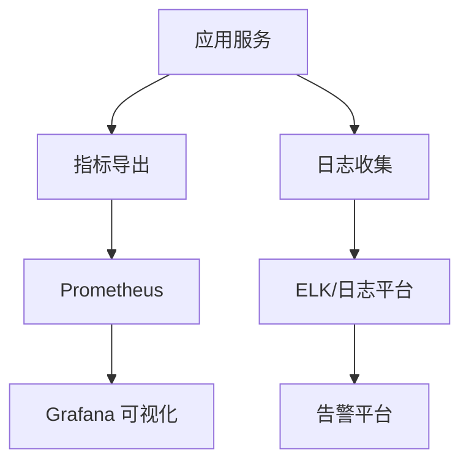

[此图为概念性架构图，不直接映射具体源文件]

### 配置管理、密钥轮换与安全审计
- 配置管理：环境变量 + 密钥管理服务（Vault/KMS），敏感参数集中管理。
- 密钥轮换：定期轮换第三方 API 密钥与内部加密密钥，支持平滑切换。
- 安全审计：记录所有敏感操作（密钥变更、提供商切换、文件删除）与访问日志，支持回溯。

章节来源
- [README.md:234-244](file://README.md#L234-L244)
- [server.js:44-67](file://server.js#L44-L67)
- [server.js:239-332](file://server.js#L239-L332)

### 集成测试与质量保障
- 单元测试：针对路由、鉴权、数据库操作编写测试用例。
- 集成测试：模拟第三方服务响应，覆盖正常与异常路径。
- 性能测试：压力测试与容量规划，评估第三方服务 SLA 与网关瓶颈。

[本节为通用指导，不直接分析具体文件]

## 依赖关系分析
- Express 应用依赖：cors、multer、bcryptjs、jsonwebtoken、uuid、sql.js、dotenv 等。
- 前端依赖：原生 ES6，通过 fetch 与后端交互。
- 数据库：SQLite（sql.js），WAL 模式与外键约束开启。

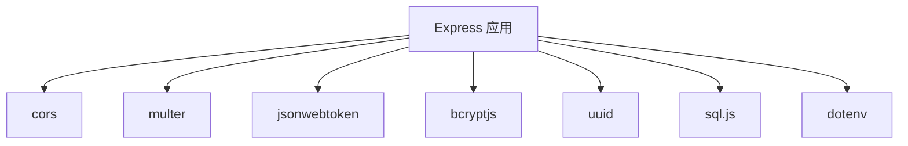

图表来源
- [package.json:10-22](file://package.json#L10-L22)

章节来源
- [package.json:1-23](file://package.json#L1-23)
- [database.js:78-79](file://database.js#L78-L79)

## 性能考虑
- 连接池与超时：第三方调用设置合理超时与重试，避免阻塞线程。
- 缓存策略：热点数据与响应结果缓存，降低第三方调用频率。
- 压缩与分片：静态资源启用 gzip/br，大文件分片上传与断点续传。
- 监控与告警：建立完善的指标体系，及时发现性能瓶颈。

[本节为通用指导，不直接分析具体文件]

## 故障排查指南
- 认证失败：检查 Authorization 头是否正确，JWT 是否过期，JWT_SECRET 是否一致。
- 文件上传失败：检查文件大小/类型限制、磁盘空间、用户目录权限。
- AI 问答错误：检查提供商密钥状态、网络连通性、第三方 API 状态码与错误信息。
- 数据库异常：确认 data.db 文件是否存在、权限是否正确、WAL 模式是否生效。

章节来源
- [auth.js:14-27](file://auth.js#L14-L27)
- [server.js:465-597](file://server.js#L465-L597)
- [server.js:618-827](file://server.js#L618-L827)
- [database.js:69-80](file://database.js#L69-L80)

## 结论
通过在现有 Express 架构上引入网关层与适配器层，trae02airead 可以平滑集成云存储、CDN、监控、OAuth、Webhook 与异步队列等第三方服务。建议优先完善配置管理与密钥轮换机制，强化安全审计与监控告警，确保系统在扩展过程中保持稳定性与可维护性。

## 附录
- 环境变量与密钥：ENCRYPTION_KEY、JWT_SECRET、第三方提供商 API Key（ZHIPU_API_KEY、SILICONFLOW_API_KEY、CUSTOM_API_KEY、AI_API_KEY、AI_MODEL）。
- 前端本地存储：selectedProvider、selectedModel_{provider}、authToken 等。

章节来源
- [README.md:105-120](file://README.md#L105-L120)
- [public/app.js:8-18](file://public/app.js#L8-L18)