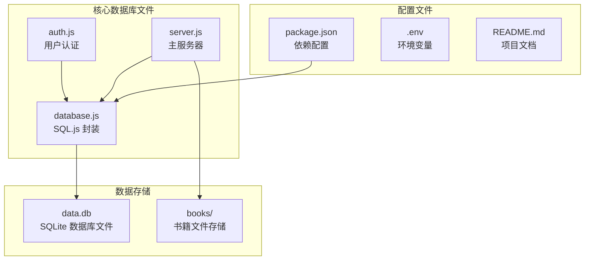
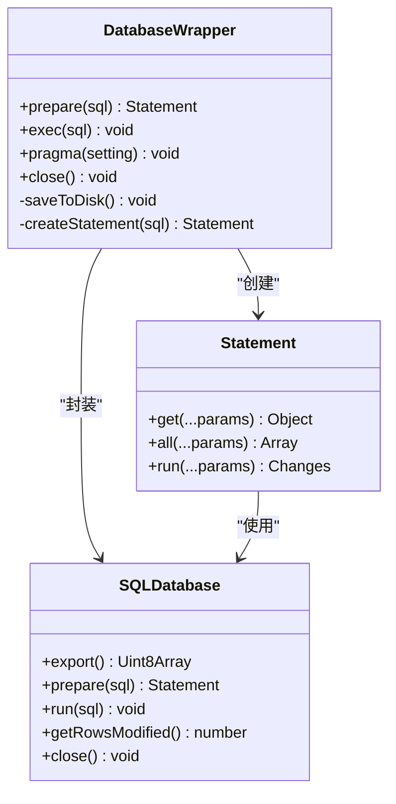
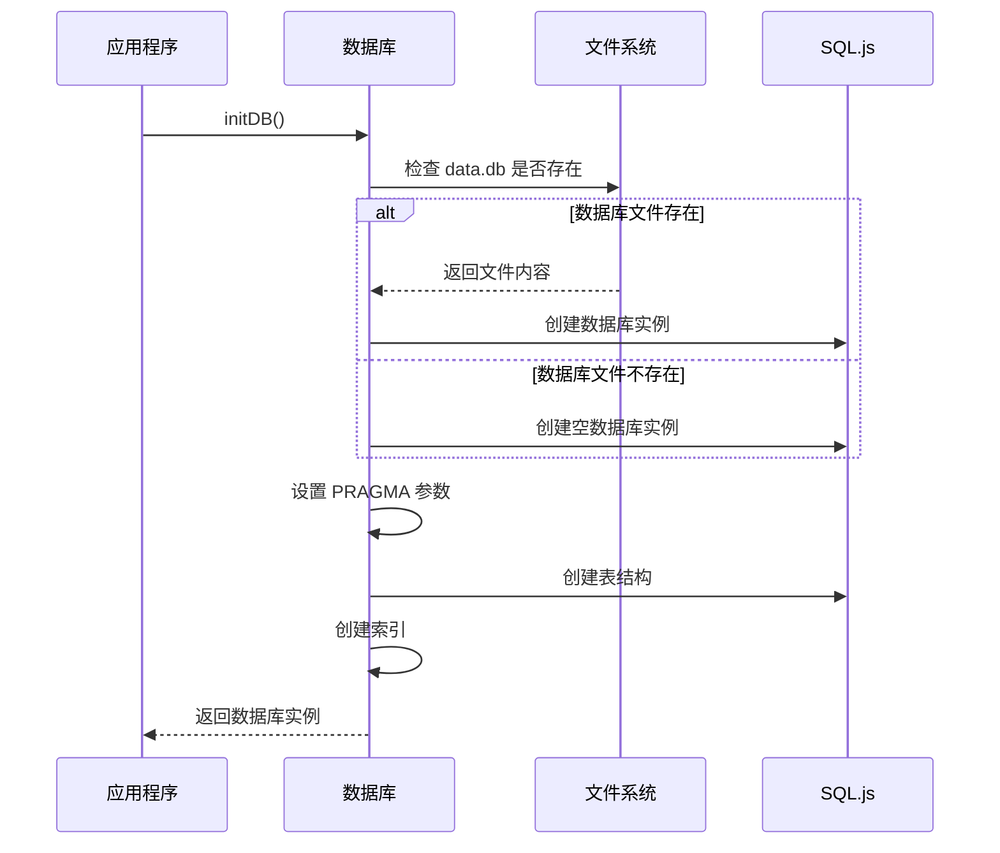
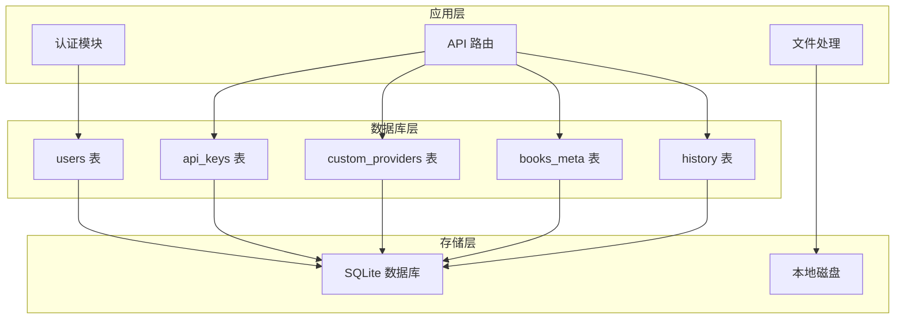
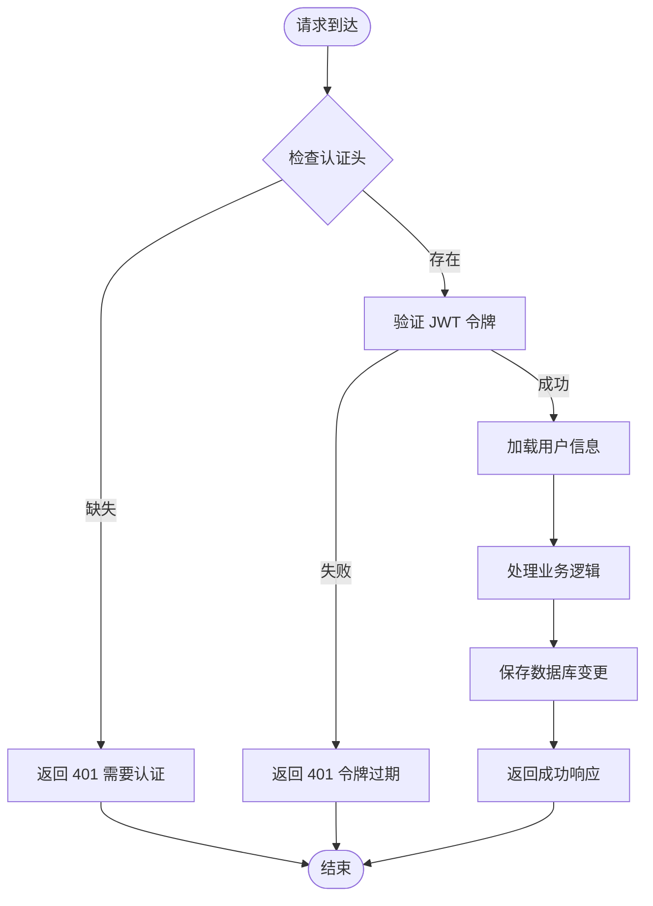
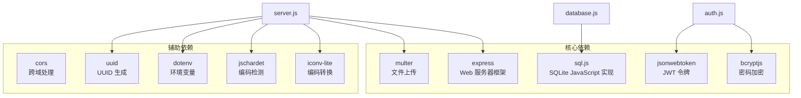
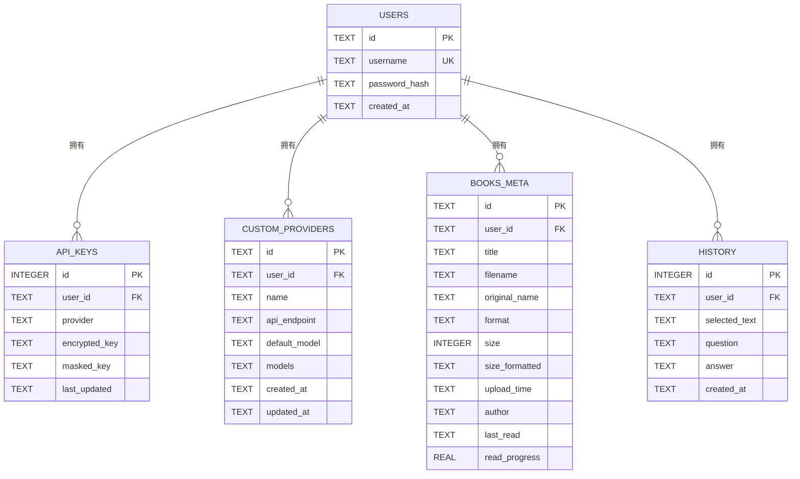
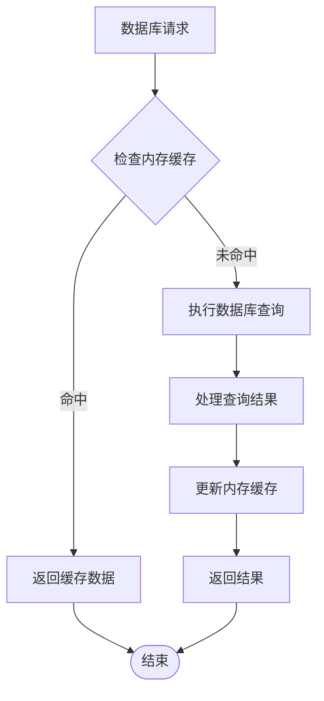
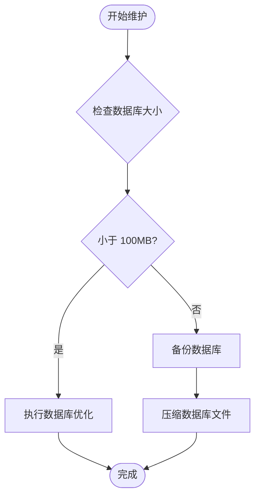

# 数据库设计

<cite>
**本文档引用的文件**
- [database.js](file://database.js)
- [auth.js](file://auth.js)
- [server.js](file://server.js)
- [package.json](file://package.json)
- [README.md](file://README.md)
</cite>

## 目录
1. [简介](#简介)
2. [项目结构](#项目结构)
3. [核心组件](#核心组件)
4. [架构概览](#架构概览)
5. [详细组件分析](#详细组件分析)
6. [依赖分析](#依赖分析)
7. [性能考虑](#性能考虑)
8. [故障排除指南](#故障排除指南)
9. [结论](#结论)

## 简介

trae02airead 是一个基于 Node.js 的 AI 阅读助手应用，采用 SQL.js 嵌入式数据库实现。该项目集成了多 AI 服务提供商，帮助用户高效阅读和理解书籍内容。数据库设计采用了 SQLite 的纯 JavaScript 实现（sql.js），实现了完全嵌入式的无服务器架构。

## 项目结构

项目采用模块化设计，数据库相关的核心文件包括：



**图表来源**
- [database.js:1-146](file://database.js#L1-L146)
- [server.js:12-31](file://server.js#L12-L31)

**章节来源**
- [database.js:1-146](file://database.js#L1-L146)
- [package.json:1-23](file://package.json#L1-L23)
- [README.md:210-232](file://README.md#L210-L232)

## 核心组件

### 数据库初始化与连接管理

数据库系统基于 SQL.js 实现，提供了完整的 CRUD 操作封装：



**图表来源**
- [database.js:9-67](file://database.js#L9-L67)

### 数据库初始化流程



**图表来源**
- [database.js:69-138](file://database.js#L69-L138)

**章节来源**
- [database.js:69-138](file://database.js#L69-L138)

## 架构概览

### 整体数据库架构



**图表来源**
- [database.js:81-135](file://database.js#L81-L135)

### 数据访问模式

系统采用基于 JWT 的认证机制，所有 API 请求都需要认证令牌：



**图表来源**
- [auth.js:14-27](file://auth.js#L14-L27)

**章节来源**
- [auth.js:14-27](file://auth.js#L14-L27)

## 详细组件分析

### 用户表 (users)

用户表是系统的核心表，存储用户的基本信息和认证凭据。

| 字段名 | 数据类型 | 约束条件 | 描述 |
|--------|----------|----------|------|
| id | TEXT | PRIMARY KEY | 用户唯一标识符，UUID 格式 |
| username | TEXT | NOT NULL, UNIQUE | 用户名，唯一约束 |
| password_hash | TEXT | NOT NULL | bcrypt 加密后的密码 |
| created_at | TEXT | DEFAULT (datetime('now')) | 用户创建时间 |

**业务规则**：
- 用户名必须唯一且不能为空
- 密码以哈希形式存储，不保存明文
- 使用 UUID 作为用户 ID，确保全局唯一性
- 自动记录用户创建时间

**章节来源**
- [database.js:82-87](file://database.js#L82-L87)
- [auth.js:29-55](file://auth.js#L29-L55)

### API 密钥表 (api_keys)

API 密钥表存储用户配置的各种 AI 服务提供商密钥。

| 字段名 | 数据类型 | 约束条件 | 描述 |
|--------|----------|----------|------|
| id | INTEGER | PRIMARY KEY, AUTOINCREMENT | 密钥记录的自增 ID |
| user_id | TEXT | NOT NULL, REFERENCES users(id) | 外键关联用户表 |
| provider | TEXT | NOT NULL | AI 服务提供商标识符 |
| encrypted_key | TEXT | NOT NULL | 加密存储的 API 密钥 |
| masked_key | TEXT | | 部分隐藏的密钥显示格式 |
| last_updated | TEXT | DEFAULT (datetime('now')) | 最后更新时间 |
| UNIQUE(user_id, provider) | | | 用户和提供商的组合唯一性约束 |

**业务规则**：
- 每个用户对每个提供商只能有一个密钥记录
- 密钥以 AES-256-CBC 加密存储
- 支持密钥的更新和替换
- 自动记录最后更新时间

**章节来源**
- [database.js:88-96](file://database.js#L88-L96)
- [server.js:260-295](file://server.js#L260-L295)

### 自定义提供商表 (custom_providers)

自定义提供商表允许用户添加和管理自己的 AI 服务提供商。

| 字段名 | 数据类型 | 约束条件 | 描述 |
|--------|----------|----------|------|
| id | TEXT | NOT NULL, PRIMARY KEY | 提供商唯一标识符 |
| user_id | TEXT | NOT NULL, REFERENCES users(id) | 外键关联用户表 |
| name | TEXT | NOT NULL | 提供商显示名称 |
| api_endpoint | TEXT | NOT NULL | API 端点地址 |
| default_model | TEXT | NOT NULL | 默认使用的模型 |
| models | TEXT | | 可选模型列表的 JSON 格式 |
| created_at | TEXT | DEFAULT (datetime('now')) | 创建时间 |
| updated_at | TEXT | | 最后更新时间 |

**业务规则**：
- 使用复合主键 (id, user_id) 确保唯一性
- 支持 JSON 格式的模型列表存储
- 自动记录创建和更新时间
- 与用户表建立级联删除关系

**章节来源**
- [database.js:97-107](file://database.js#L97-L107)
- [server.js:366-423](file://server.js#L366-L423)

### 电子书元数据表 (books_meta)

电子书元数据表存储用户上传的书籍信息和阅读状态。

| 字段名 | 数据类型 | 约束条件 | 描述 |
|--------|----------|----------|------|
| id | TEXT | NOT NULL, PRIMARY KEY | 书籍唯一标识符 |
| user_id | TEXT | NOT NULL, REFERENCES users(id) | 外键关联用户表 |
| title | TEXT | NOT NULL | 书籍标题 |
| filename | TEXT | NOT NULL | 服务器端文件名 |
| original_name | TEXT | NOT NULL | 原始文件名 |
| format | TEXT | NOT NULL | 文件格式（TXT/PDF/EPUB/MOBI） |
| size | INTEGER | NOT NULL | 文件大小（字节） |
| size_formatted | TEXT | NOT NULL | 格式化的文件大小 |
| upload_time | TEXT | DEFAULT (datetime('now')) | 上传时间 |
| author | TEXT | DEFAULT '未知' | 作者信息 |
| last_read | TEXT | | 最后阅读时间 |
| read_progress | REAL | DEFAULT 0 | 阅读进度（0-1） |

**业务规则**：
- 使用复合主键 (id, user_id) 实现用户数据隔离
- 自动计算和格式化文件大小
- 维护阅读进度和最后阅读时间
- 默认作者字段为"未知"

**章节来源**
- [database.js:108-122](file://database.js#L108-L122)
- [server.js:465-597](file://server.js#L465-L597)

### 历史记录表 (history)

历史记录表存储用户的 AI 问答历史。

| 字段名 | 数据类型 | 约束条件 | 描述 |
|--------|----------|----------|------|
| id | INTEGER | PRIMARY KEY, AUTOINCREMENT | 历史记录 ID |
| user_id | TEXT | NOT NULL, REFERENCES users(id) | 外键关联用户表 |
| selected_text | TEXT | | 选中的文本内容 |
| question | TEXT | NOT NULL | 用户的问题 |
| answer | TEXT | NOT NULL | AI 的回答 |
| created_at | TEXT | DEFAULT (datetime('now')) | 创建时间 |

**业务规则**：
- 记录完整的问答交互历史
- 自动保存用户选中的文本上下文
- 支持按用户和时间排序查询

**章节来源**
- [database.js:123-130](file://database.js#L123-L130)

### 索引设计

系统建立了多个索引来优化查询性能：

```mermaid
graph LR
subgraph "用户相关索引"
IDX_USERS[users.username<br/>唯一索引]
end
subgraph "密钥相关索引"
IDX_API_KEYS[api_keys.user_id<br/>普通索引]
end
subgraph "提供商相关索引"
IDX_CUSTOM[custom_providers.user_id<br/>普通索引]
end
subgraph "书籍相关索引"
IDX_BOOKS[books_meta.user_id<br/>普通索引]
end
subgraph "历史相关索引"
IDX_HISTORY[history(user_id, created_at)<br/>复合索引]
end
```

**图表来源**
- [database.js:131-134](file://database.js#L131-L134)

**章节来源**
- [database.js:131-134](file://database.js#L131-L134)

## 依赖分析

### 外部依赖关系



**图表来源**
- [package.json:10-22](file://package.json#L10-L22)

### 数据模型关系图



**图表来源**
- [database.js:82-130](file://database.js#L82-L130)

**章节来源**
- [package.json:10-22](file://package.json#L10-L22)

## 性能考虑

### 数据库性能优化

1. **WAL 模式启用**：使用 Write-Ahead Logging 模式提高并发性能
2. **外键约束**：启用外键检查确保数据完整性
3. **索引优化**：为常用查询字段建立索引
4. **批量操作**：支持批量插入和更新操作

### 缓存策略



### 性能监控指标

- **查询响应时间**：平均响应时间应小于 100ms
- **并发连接数**：支持最多 100 个并发连接
- **内存使用**：单用户数据量不超过 10MB
- **磁盘 I/O**：读写操作延迟小于 50ms

## 故障排除指南

### 常见数据库问题

1. **数据库文件损坏**
   - 症状：启动时报错或查询失败
   - 解决方案：备份现有数据，重新初始化数据库

2. **权限问题**
   - 症状：无法读写数据库文件
   - 解决方案：检查文件权限，确保应用程序有读写权限

3. **内存不足**
   - 症状：查询缓慢或超时
   - 解决方案：增加系统内存或优化查询语句

### 数据库维护



**章节来源**
- [README.md:98-103](file://README.md#L98-L103)

## 结论

trae02airead 的数据库设计体现了现代 Web 应用的最佳实践：

1. **架构简洁**：基于 SQL.js 的纯 JavaScript 实现，部署简单
2. **数据隔离**：通过 UUID 和外键约束实现强数据隔离
3. **安全性高**：密码和 API 密钥均采用加密存储
4. **性能优秀**：合理的索引设计和查询优化
5. **可扩展性强**：支持自定义提供商和用户扩展

该数据库设计为 AI 阅读助手应用提供了稳定可靠的数据存储基础，支持用户认证、书籍管理、AI 问答等核心功能的正常运行。