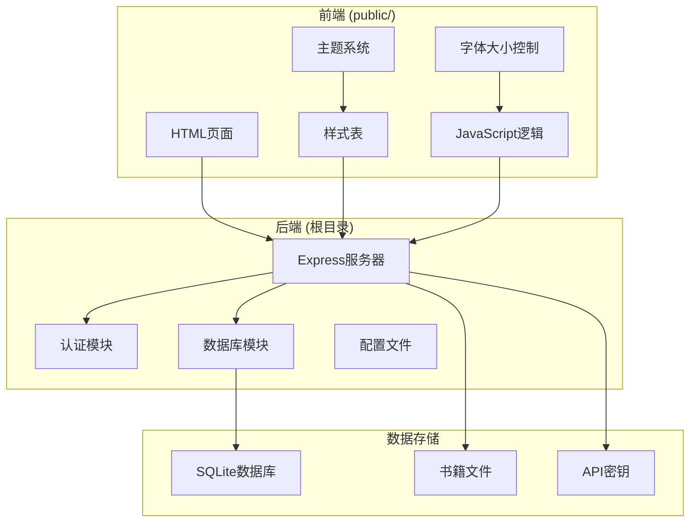
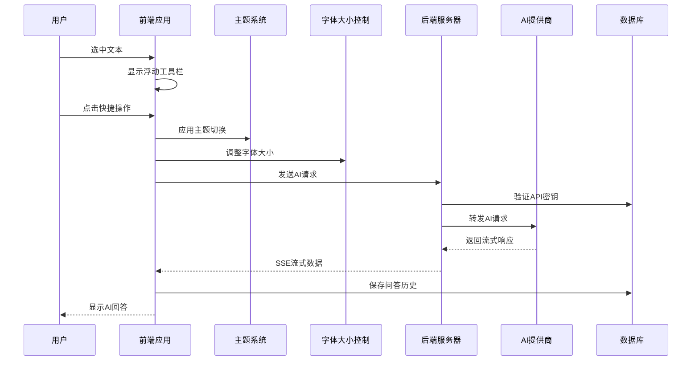
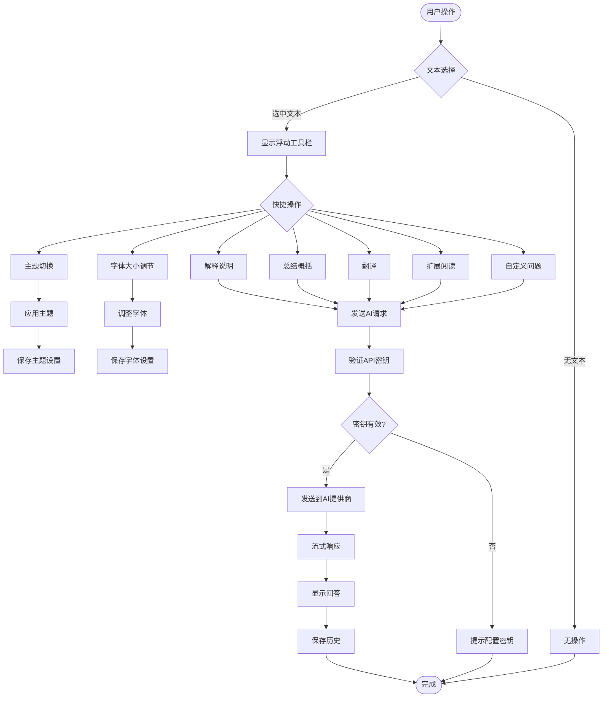
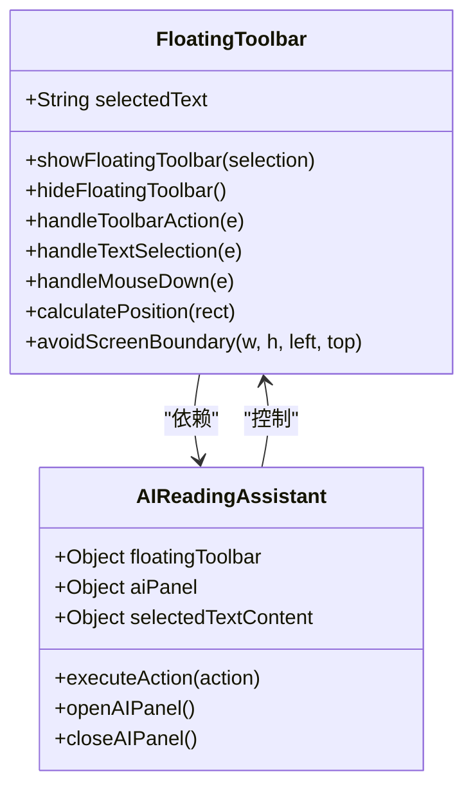
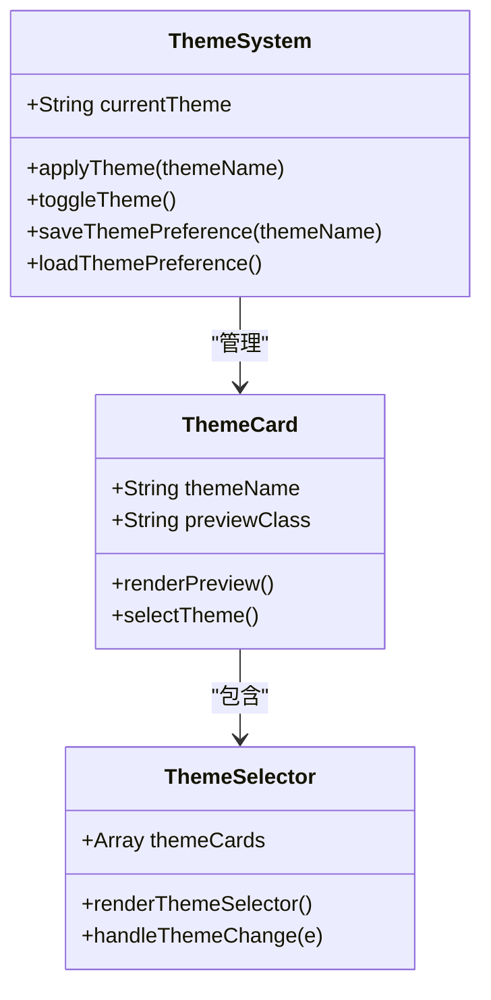
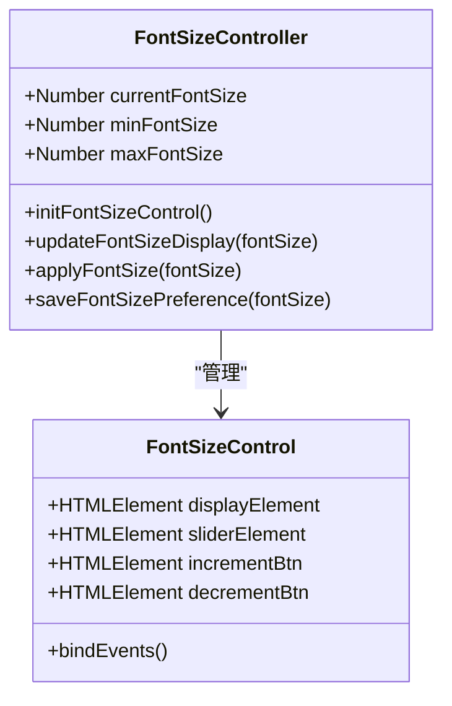
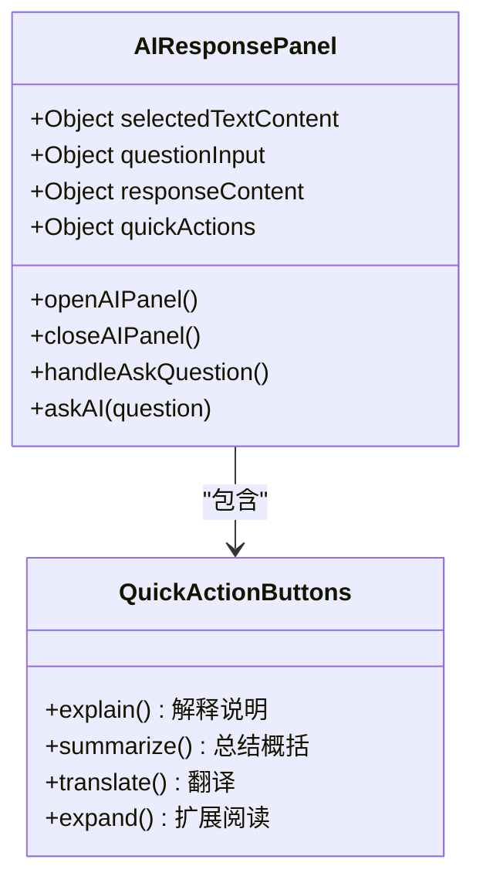
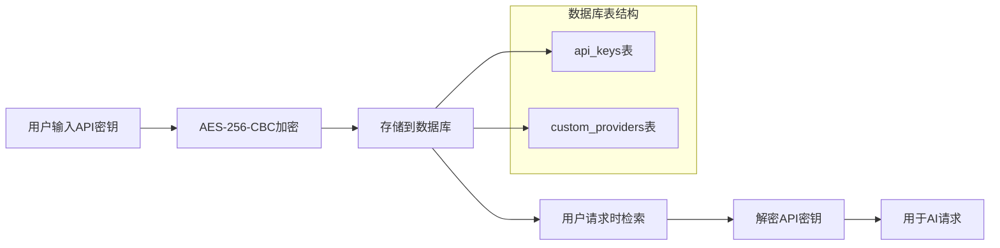
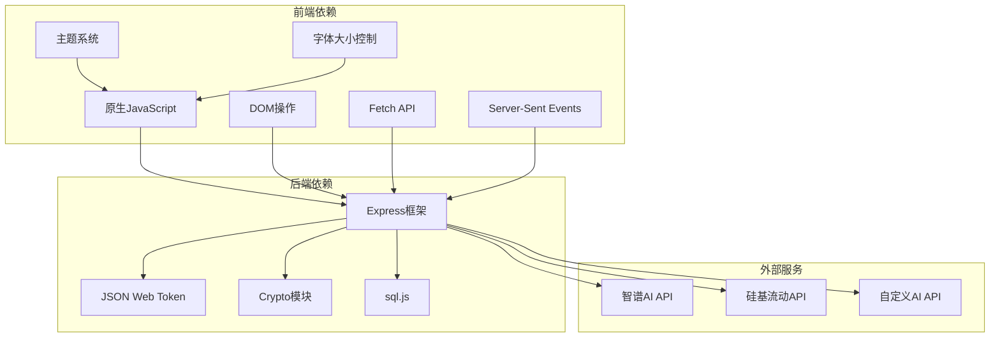
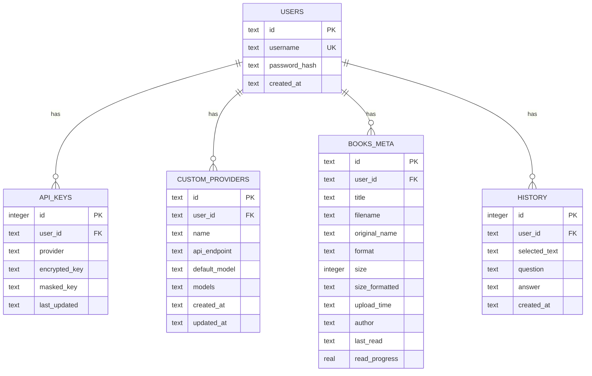

# AI 功能

<cite>
**本文档引用的文件**
- [README.md](file://README.md)
- [package.json](file://package.json)
- [server.js](file://server.js)
- [public/app.js](file://public/app.js)
- [public/index.html](file://public/index.html)
- [public/styles.css](file://public/styles.css)
- [database.js](file://database.js)
- [auth.js](file://auth.js)
</cite>

## 更新摘要
**所做更改**
- 更新浮动工具栏系统章节，反映新的位置自适应和智能显示机制
- 新增主题切换和字体大小控制功能的详细说明
- 完善AI助手面板的交互流程和用户界面改进
- 增强API密钥管理和自定义提供商功能的文档

## 目录
1. [简介](#简介)
2. [项目结构](#项目结构)
3. [核心组件](#核心组件)
4. [架构概览](#架构概览)
5. [详细组件分析](#详细组件分析)
6. [依赖关系分析](#依赖关系分析)
7. [性能考虑](#性能考虑)
8. [故障排除指南](#故障排除指南)
9. [结论](#结论)

## 简介

AI阅读助手是一个现代化的智能阅读应用，集成了多AI服务提供商，帮助用户高效阅读和理解书籍内容。该项目的核心特色包括：

- **智能阅读**：支持TXT文件在线阅读，预置《百年孤独》经典章节作为示例
- **AI智能问答**：选中文本后弹出工具栏，支持解释说明、总结概括、翻译、扩展阅读
- **自定义问题**：输入自定义问题，AI结合书籍上下文提供精准回答
- **流式输出**：SSE流式传输，打字机效果，提升阅读体验
- **书架管理**：支持多格式书籍上传、下载、删除
- **用户系统**：JWT认证，密码安全存储
- **主题切换**：支持浅色、深色、棕褐色主题模式
- **字体大小控制**：可调节阅读字体大小，提升阅读舒适度

## 项目结构

项目采用前后端分离架构，主要分为以下几个部分：

**图表来源**
- [server.js:1-50](file://server.js#L1-L50)
- [public/index.html:1-50](file://public/index.html#L1-L50)
- [public/styles.css:24-40](file://public/styles.css#L24-L40)

**章节来源**
- [README.md:210-232](file://README.md#L210-L232)
- [package.json:1-23](file://package.json#L1-L23)

## 核心组件

### AI助手核心功能

AI助手功能是整个应用的核心，提供了完整的文本选择和AI问答体验：

#### 浮动工具栏
- **智能位置自适应**：根据选中文本位置自动调整工具栏位置，避免超出屏幕边界
- **快捷操作**：提供AI提问、解释说明、总结概括、翻译等快捷按钮
- **智能显示隐藏**：仅在选中有意义文本时显示，点击空白处自动隐藏
- **响应式设计**：支持不同屏幕尺寸的自适应布局

#### AI问答面板
- **选中文本框**：实时显示选中的文本内容
- **快捷操作按钮**：四种预设问题类型
- **自定义问题输入**：支持用户自定义问题
- **流式响应显示**：实时显示AI回答过程

#### 主题切换系统
- **多主题支持**：浅色、深色、棕褐色三种主题模式
- **实时切换**：无需刷新页面即可切换主题
- **主题预览**：提供主题卡片预览功能
- **状态保持**：用户选择的主题会持久化保存

#### 字体大小控制
- **可调节范围**：支持12px到24px的字体大小调节
- **实时预览**：调节时实时显示当前字体大小
- **阅读优化**：针对阅读体验优化的字体大小范围
- **个性化设置**：每个用户的字体大小设置独立保存

#### API密钥管理
- **多提供商支持**：内置智谱AI和硅基流动，支持自定义提供商
- **加密存储**：使用AES-256-CBC加密存储API密钥
- **密钥验证**：支持密钥有效性验证

**章节来源**
- [public/app.js:1323-1413](file://public/app.js#L1323-L1413)
- [public/index.html:139-178](file://public/index.html#L139-L178)
- [public/styles.css:24-40](file://public/styles.css#L24-L40)
- [public/index.html:106-111](file://public/index.html#L106-L111)

## 架构概览

系统采用现代Web应用架构，实现了前后端分离和数据持久化：

**图表来源**
- [server.js:688-800](file://server.js#L688-L800)
- [public/app.js:1423-1515](file://public/app.js#L1423-L1515)
- [public/styles.css:472-505](file://public/styles.css#L472-L505)

### 数据流架构

**图表来源**
- [public/app.js:1388-1421](file://public/app.js#L1388-L1421)
- [server.js:618-688](file://server.js#L618-L688)
- [public/styles.css:472-505](file://public/styles.css#L472-L505)

## 详细组件分析

### 浮动工具栏组件

浮动工具栏是AI助手功能的入口点，提供了直观的用户交互界面：

#### 组件结构

**图表来源**
- [public/app.js:1323-1386](file://public/app.js#L1323-L1386)
- [public/app.js:1404-1413](file://public/app.js#L1404-L1413)

#### 工具栏功能特性
- **智能定位算法**：根据选中文本边界计算最佳显示位置，包含边界检测
- **响应式设计**：自动避免超出屏幕边界，确保工具栏完全可见
- **快捷操作**：四种预设操作类型，支持键盘快捷键
- **无障碍支持**：支持Tab导航和键盘操作
- **自动隐藏机制**：点击空白区域或失去焦点时自动隐藏

**章节来源**
- [public/app.js:1343-1386](file://public/app.js#L1343-L1386)
- [public/index.html:361-378](file://public/index.html#L361-L378)

### 主题切换系统

主题切换系统提供了灵活的视觉定制功能：

#### 主题架构

**图表来源**
- [public/styles.css:24-40](file://public/styles.css#L24-L40)
- [public/styles.css:472-505](file://public/styles.css#L472-L505)

#### 主题功能特性
- **多主题支持**：浅色(light)、深色(dark)、棕褐色(sepia)三种主题模式
- **CSS变量系统**：使用CSS自定义属性实现主题切换
- **实时预览**：点击主题卡片即可预览效果
- **状态保持**：用户选择的主题会持久化到本地存储
- **响应式设计**：每种主题都有专门的颜色方案

**章节来源**
- [public/styles.css:24-40](file://public/styles.css#L24-L40)
- [public/styles.css:472-505](file://public/styles.css#L472-L505)

### 字体大小控制系统

字体大小控制系统提供了个性化的阅读体验：

#### 控制器结构

**图表来源**
- [public/index.html:106-111](file://public/index.html#L106-L111)
- [public/index.html:292-295](file://public/index.html#L292-L295)

#### 字体控制特性
- **调节范围**：12px到24px的线性调节范围
- **实时显示**：滑块移动时实时显示当前字体大小
- **多种控制方式**：滑块、按钮、键盘快捷键
- **阅读优化**：针对长时间阅读优化的字体大小范围
- **个性化保存**：每个用户的字体大小设置独立保存

**章节来源**
- [public/index.html:106-111](file://public/index.html#L106-L111)
- [public/index.html:292-295](file://public/index.html#L292-L295)

### AI问答面板组件

AI问答面板提供了完整的问答交互界面：

#### 面板结构

**图表来源**
- [public/app.js:1404-1421](file://public/app.js#L1404-L1421)
- [public/index.html:153-177](file://public/index.html#L153-L177)

#### 流式响应机制
- **SSE支持**：使用Server-Sent Events实现实时流式传输
- **增量显示**：逐字显示AI回答，模拟打字机效果
- **状态管理**：区分开始、增量、结束三个阶段
- **错误处理**：完善的异常捕获和错误显示

**章节来源**
- [public/app.js:1423-1515](file://public/app.js#L1423-L1515)
- [server.js:690-800](file://server.js#L690-L800)

### API密钥管理系统

API密钥管理系统确保了用户数据的安全性和隐私保护：

#### 加密存储机制

**图表来源**
- [server.js:44-67](file://server.js#L44-L67)
- [database.js:88-107](file://database.js#L88-L107)

#### 密钥验证流程
- **即时验证**：保存前进行API密钥有效性验证
- **环境变量支持**：支持通过环境变量配置密钥
- **多提供商支持**：支持多个AI提供商的密钥管理
- **密钥轮换**：支持密钥的更新和删除

**章节来源**
- [server.js:260-332](file://server.js#L260-L332)
- [public/app.js:1194-1271](file://public/app.js#L1194-L1271)

### 自定义提供商功能

系统支持用户添加自定义AI提供商，增加了灵活性和扩展性：

#### 提供商配置
- **显示名称**：用户友好的提供商名称
- **API地址**：完整的聊天补全API地址
- **默认模型**：提供商的默认AI模型
- **可选模型**：用户可选择的模型列表
- **API密钥**：提供商的访问密钥

#### 模型管理
- **内置模型**：提供商提供的标准模型
- **自定义模型**：用户添加的特殊模型
- **模型切换**：动态切换不同AI模型
- **模型验证**：验证模型的有效性

**章节来源**
- [server.js:366-423](file://server.js#L366-L423)
- [public/app.js:548-599](file://public/app.js#L548-L599)

## 依赖关系分析

系统依赖关系清晰，模块职责明确：

**图表来源**
- [package.json:10-22](file://package.json#L10-L22)
- [server.js:1-10](file://server.js#L1-L10)

### 数据库设计

系统使用SQLite作为数据存储，支持所有核心功能的数据持久化：

**图表来源**
- [database.js:81-135](file://database.js#L81-L135)

**章节来源**
- [database.js:69-138](file://database.js#L69-L138)
- [auth.js:29-77](file://auth.js#L29-L77)

## 性能考虑

### 流式响应优化
- **SSE实现**：使用Server-Sent Events减少内存占用
- **增量渲染**：逐字显示回答，避免大文本一次性渲染
- **超时控制**：60秒超时防止长时间连接占用
- **缓冲管理**：合理管理流式数据缓冲区

### 数据库性能
- **索引优化**：为常用查询字段建立索引
- **WAL模式**：使用Write-Ahead Logging提高并发性能
- **事务管理**：合理使用事务保证数据一致性
- **数据清理**：自动清理过期的历史记录

### 前端性能
- **事件委托**：使用事件委托减少事件处理器数量
- **虚拟滚动**：对大量历史记录使用虚拟滚动
- **懒加载**：图片和大文件按需加载
- **缓存策略**：合理使用localStorage缓存用户偏好
- **主题切换优化**：CSS变量切换比DOM操作更高效

### 主题和字体控制性能
- **CSS变量切换**：主题切换使用CSS自定义属性，性能优异
- **局部更新**：字体大小调整只影响相关元素
- **防抖处理**：频繁的字体调节使用防抖优化
- **硬件加速**：使用transform属性实现平滑动画

## 故障排除指南

### 常见问题及解决方案

#### API密钥相关问题
1. **密钥无效**
   - 检查API密钥格式是否正确
   - 验证提供商是否支持该密钥
   - 确认密钥未过期

2. **密钥存储失败**
   - 检查数据库连接权限
   - 确认磁盘空间充足
   - 验证加密密钥配置

#### 流式响应问题
1. **连接中断**
   - 检查网络连接稳定性
   - 确认AI提供商服务正常
   - 验证防火墙设置

2. **显示异常**
   - 刷新页面重试
   - 清除浏览器缓存
   - 检查浏览器兼容性

#### 用户认证问题
1. **登录失败**
   - 检查用户名密码
   - 确认账户状态
   - 验证JWT密钥配置

2. **会话过期**
   - 重新登录
   - 检查"记住我"选项
   - 验证服务器时间同步

#### 主题切换问题
1. **主题不生效**
   - 检查CSS变量是否正确应用
   - 确认主题类名是否正确
   - 验证浏览器兼容性

2. **主题切换卡顿**
   - 检查CSS动画性能
   - 确认没有其他样式冲突
   - 验证硬件加速支持

#### 字体大小控制问题
1. **字体调节无效**
   - 检查滑块事件绑定
   - 确认CSS样式应用
   - 验证数值范围限制

2. **字体大小不持久**
   - 检查localStorage支持
   - 确认保存函数调用
   - 验证数据序列化

**章节来源**
- [server.js:212-235](file://server.js#L212-L235)
- [public/app.js:1225-1248](file://public/app.js#L1225-L1248)
- [public/styles.css:24-40](file://public/styles.css#L24-L40)

### 调试技巧

#### 前端调试
- 使用浏览器开发者工具监控网络请求
- 检查控制台错误信息
- 监控SSE连接状态
- 分析内存使用情况
- 检查CSS变量应用情况

#### 后端调试
- 查看服务器日志输出
- 监控数据库查询性能
- 检查API响应时间
- 验证加密解密过程

#### 数据库调试
- 使用SQLite命令行工具
- 检查表结构完整性
- 验证索引使用情况
- 监控数据增长趋势

## 结论

AI阅读助手项目展现了现代Web应用开发的最佳实践，通过以下关键特性实现了优秀的用户体验：

### 技术优势
- **架构清晰**：前后端分离，职责明确
- **安全性强**：JWT认证、API密钥加密存储
- **扩展性好**：支持自定义AI提供商
- **用户体验佳**：流式响应、智能工具栏、主题切换、字体控制
- **可访问性强**：支持键盘导航和无障碍操作

### 功能亮点
- **智能文本选择**：浮动工具栏提供便捷操作入口，支持智能定位和自动隐藏
- **多样化问答**：支持多种预设和自定义问题类型
- **实时反馈**：SSE流式传输提供即时响应
- **个性化定制**：支持主题切换和字体大小调节
- **历史管理**：完整的问答历史记录和管理

### 最佳实践建议
1. **API密钥管理**：定期轮换密钥，及时清理过期密钥
2. **性能优化**：合理配置模型参数，避免过度消耗
3. **数据备份**：定期备份数据库，防止数据丢失
4. **安全防护**：启用HTTPS，定期更新依赖包
5. **用户体验**：根据用户反馈持续优化主题和字体控制功能
6. **可访问性**：确保所有功能都支持键盘操作和屏幕阅读器

该项目为AI辅助阅读场景提供了完整的解决方案，具有良好的可维护性和扩展性，适合进一步的功能增强和定制开发。新的浮动工具栏系统、主题切换和字体大小控制功能显著提升了用户体验，为用户提供了更加个性化和舒适的阅读环境。