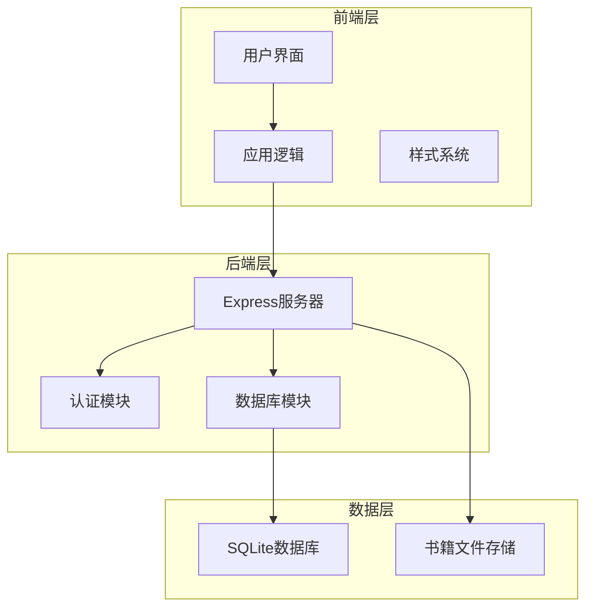
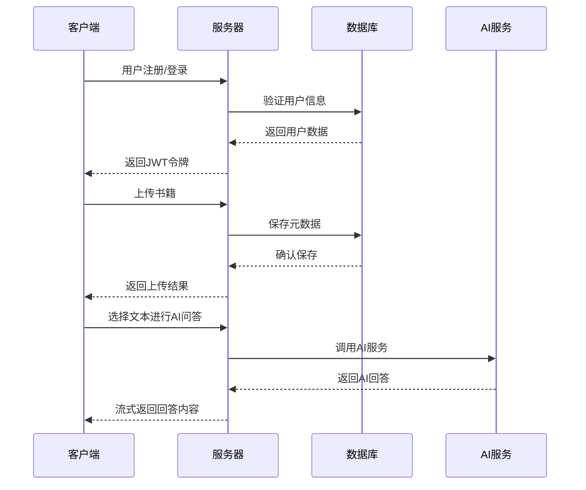
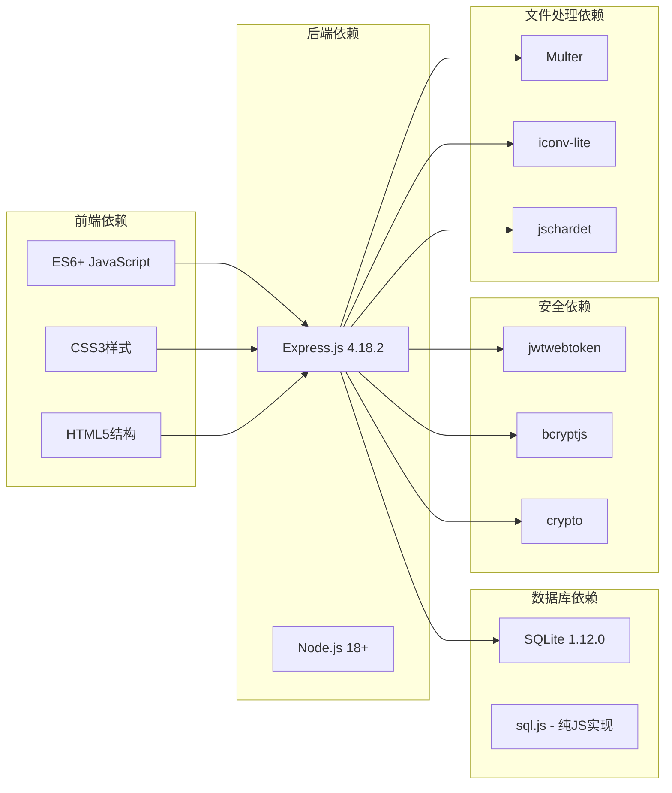
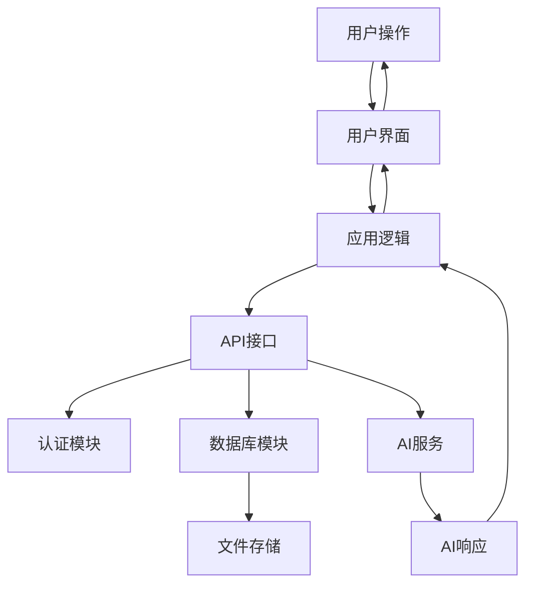

# 用户指南

<cite>
**本文档引用的文件**
- [README.md](file://README.md)
- [package.json](file://package.json)
- [server.js](file://server.js)
- [auth.js](file://auth.js)
- [database.js](file://database.js)
- [public/index.html](file://public/index.html)
- [public/app.js](file://public/app.js)
- [public/styles.css](file://public/styles.css)
</cite>

## 目录
1. [简介](#简介)
2. [项目结构](#项目结构)
3. [核心功能](#核心功能)
4. [架构概览](#架构概览)
5. [详细功能使用指南](#详细功能使用指南)
6. [依赖关系分析](#依赖关系分析)
7. [性能考虑](#性能考虑)
8. [故障排除指南](#故障排除指南)
9. [结论](#结论)

## 简介

AI阅读助手是一个现代化的智能阅读应用，集成了多AI服务提供商，帮助用户高效阅读和理解书籍内容。该应用支持在线阅读、AI智能问答、书架管理、自定义AI提供商等功能，为用户提供全方位的智能阅读体验。

## 项目结构

该项目采用前后端分离的架构设计，主要由以下组件构成：

**图表来源**
- [server.js:1-50](file://server.js#L1-L50)
- [database.js:1-80](file://database.js#L1-L80)

**章节来源**
- [README.md:210-232](file://README.md#L210-L232)
- [package.json:1-23](file://package.json#L1-L23)

## 核心功能

### 智能阅读功能
- **在线阅读**：支持TXT文件在线阅读，预置《百年孤独》经典章节作为示例
- **编码自动检测**：自动检测文件编码（UTF-8、GBK、GB2312、BIG5等），解决中文乱码问题
- **文章目录**：自动生成章节目录，支持快速导航

### AI智能问答
- **快捷操作**：选中文本后弹出工具栏，支持解释说明、总结概括、翻译、扩展阅读
- **自定义问题**：输入自定义问题，AI结合书籍上下文提供精准回答
- **流式输出**：SSE流式传输，打字机效果，提升阅读体验
- **模型显示**：回答中实时显示当前使用的AI提供商和模型信息

### 书架管理
- **多格式支持**：TXT、PDF、EPUB、MOBI（最大 50MB）
- **上传进度**：实时显示上传进度条
- **书籍操作**：在线阅读（TXT）、下载、删除

### 用户系统
- **注册登录**：支持用户名+密码注册登录，用户名支持中文
- **JWT认证**：登录后自动保持登录状态（7天），支持"记住我"（30天）

## 架构概览

应用采用现代Web技术栈构建，实现了完整的前后端分离架构：

**图表来源**
- [server.js:37-42](file://server.js#L37-L42)
- [auth.js:29-77](file://auth.js#L29-L77)

**章节来源**
- [server.js:1-899](file://server.js#L1-L899)
- [auth.js:1-80](file://auth.js#L1-L80)

## 详细功能使用指南

### 多视图导航系统

#### 底部导航栏
应用采用全新的多视图导航系统，底部导航栏包含四个主要视图：

- **书架视图（Bookshelf）**：默认激活，显示用户的所有电子书
- **历史视图（History）**：显示用户的阅读历史记录
- **设置视图（Settings）**：提供应用配置和个性化设置
- **阅读视图（Reading）**：显示当前正在阅读的书籍内容

#### 视图切换操作
1. 在底部导航栏点击相应的导航按钮
2. 视图会平滑切换，当前激活的视图按钮会高亮显示
3. 每个视图都有独立的功能和界面布局

**章节来源**
- [public/index.html:356-378](file://public/index.html#L356-L378)

### 用户注册登录流程

#### 注册流程
1. 打开应用，进入登录/注册界面
2. 点击"注册"标签页
3. 输入用户名（支持中文）
4. 输入密码（至少6位）
5. 点击"注册"按钮
6. 系统自动跳转到主界面

#### 登录流程
1. 打开应用，进入登录界面
2. 输入用户名和密码
3. 可选择"记住我"选项（30天自动登录）
4. 点击"登录"按钮
5. 成功登录后进入主界面

**章节来源**
- [public/index.html:400-428](file://public/index.html#L400-L428)
- [public/app.js:59-109](file://public/app.js#L59-L109)

### 电子书上传和管理

#### 上传电子书
1. 进入"书架"页面
2. 在上传区域点击"选择文件"或拖拽文件到上传区域
3. 支持的格式：TXT、PDF、EPUB、MOBI
4. 最大文件大小：50MB
5. 上传完成后，书籍会显示在书架中

#### 书籍管理
1. **在线阅读**：点击书籍卡片上的"阅读"按钮
2. **下载书籍**：点击下载按钮，书籍将保存到本地
3. **删除书籍**：点击删除按钮，确认后书籍将被永久删除

#### 上传进度显示
- 上传过程中会显示进度条和百分比
- 进度条实时更新，让用户了解上传状态

**章节来源**
- [public/app.js:729-796](file://public/app.js#L729-L796)
- [public/app.js:853-941](file://public/app.js#L853-L941)

### 在线阅读体验

#### 文本选择工具栏
当用户选中文本时，会出现浮动工具栏，提供以下快捷操作：
- **AI提问**：打开AI问答面板
- **解释说明**：要求AI解释选中文本的含义
- **总结概括**：要求AI总结选中文本的要点
- **翻译**：要求AI将选中文本翻译成英文

#### 阅读设置
- **字体大小调节**：支持12px到28px的字体大小调整
- **主题模式**：提供明亮、暗黑、护眼三种主题
- **文章目录**：自动生成章节目录，支持快速跳转

#### 流式输出体验
- **打字机效果**：AI回答以流式方式逐字显示
- **实时模型信息**：显示当前使用的AI提供商和模型
- **平滑滚动**：内容自动滚动到最新位置

**章节来源**
- [public/index.html:361-378](file://public/index.html#L361-L378)
- [public/app.js:1323-1413](file://public/app.js#L1323-L1413)

### AI智能问答功能

#### 快捷操作使用
1. 在阅读界面选中需要提问的文本
2. 点击浮动工具栏中的快捷按钮
3. 选择操作类型：
   - 解释说明：要求AI解释文本含义
   - 总结概括：要求AI总结文本要点
   - 翻译：要求AI翻译成英文
   - 扩展阅读：要求AI提供相关扩展知识

#### 自定义问题
1. 在AI面板中输入自定义问题
2. 点击"提问"按钮或按Ctrl+Enter
3. 查看AI的流式回答

#### AI提供商管理
1. 进入设置页面
2. 选择AI提供商（内置：智谱AI、硅基流动）
3. 配置API密钥
4. 选择使用的模型
5. 可添加自定义AI提供商

**章节来源**
- [public/app.js:1388-1421](file://public/app.js#L1388-L1421)
- [public/app.js:1423-1515](file://public/app.js#L1423-L1515)

### 个性化设置选项

#### 字体大小设置
- 通过侧边栏的字体大小控件调整
- 支持A-和A+按钮进行微调
- 数值范围：12px到28px

#### 主题模式切换
- **明亮模式**：适合白天阅读
- **暗黑模式**：适合夜间阅读，保护眼睛
- **护眼模式**：特殊的暖色调，减少眼部疲劳

#### 选中文本工具栏
- 自动出现在选中文本上方
- 提供快速操作按钮
- 支持多种快捷功能

**章节来源**
- [public/index.html:48-63](file://public/index.html#L48-L63)
- [public/app.js:1540-1552](file://public/app.js#L1540-L1552)

### 书架管理功能

#### 多格式支持
- **TXT格式**：支持在线阅读
- **PDF格式**：支持下载和本地阅读
- **EPUB格式**：支持下载和本地阅读
- **MOBI格式**：支持下载和本地阅读

#### 上传进度监控
- 实时显示上传进度条
- 显示上传百分比
- 显示剩余时间估计

#### 书籍操作
- **阅读**：在线阅读TXT格式书籍
- **下载**：下载书籍到本地设备
- **删除**：从服务器删除书籍

**章节来源**
- [public/app.js:815-851](file://public/app.js#L815-L851)
- [public/app.js:904-941](file://public/app.js#L904-L941)

### 实际使用场景和最佳实践

#### 场景一：学术研究
1. 上传学术论文或研究资料
2. 使用AI解释说明功能理解复杂概念
3. 利用总结概括功能提取关键信息
4. 通过扩展阅读功能获取相关研究

#### 场景二：语言学习
1. 上传外文原版书籍
2. 使用翻译功能获取英文翻译
3. 通过AI解释说明理解语法结构
4. 利用扩展阅读功能学习相关词汇

#### 场景三：工作文档分析
1. 上传重要工作文档
2. 使用总结概括功能快速了解文档要点
3. 通过AI提问功能获取特定信息
4. 利用流式输出功能实时查看分析过程

**章节来源**
- [README.md:174-209](file://README.md#L174-L209)

## 依赖关系分析

### 技术栈依赖

**图表来源**
- [package.json:10-22](file://package.json#L10-L22)

### 数据流关系

**图表来源**
- [server.js:33-42](file://server.js#L33-L42)
- [database.js:69-138](file://database.js#L69-L138)

**章节来源**
- [package.json:1-23](file://package.json#L1-L23)

## 性能考虑

### 前端性能优化
- **懒加载**：图片和非关键资源按需加载
- **虚拟滚动**：大量历史记录使用虚拟滚动优化
- **缓存策略**：本地存储用户偏好设置
- **事件委托**：减少事件监听器数量

### 后端性能优化
- **连接池**：数据库连接复用
- **文件上传优化**：支持断点续传
- **内存管理**：及时释放临时文件句柄
- **并发控制**：限制同时进行的AI请求

### 数据库性能
- **索引优化**：为常用查询字段建立索引
- **事务处理**：批量操作使用事务确保一致性
- **数据压缩**：存储时进行必要的数据压缩

## 故障排除指南

### 常见问题及解决方案

#### 登录问题
- **问题**：登录后立即失效
- **原因**：JWT过期或密钥不匹配
- **解决**：重新登录，检查系统时间是否正确

#### 上传失败
- **问题**：文件上传失败
- **原因**：文件格式不支持或文件过大
- **解决**：检查文件格式是否为TXT/PDF/EPUB/MOBI，文件大小不超过50MB

#### AI问答异常
- **问题**：AI回答显示API密钥错误
- **原因**：API密钥未配置或已过期
- **解决**：在设置页面配置正确的API密钥

#### 浏览器兼容性
- **问题**：某些功能在旧版浏览器中不可用
- **原因**：缺少现代JavaScript特性支持
- **解决**：使用最新版本的Chrome、Firefox或Safari浏览器

**章节来源**
- [server.js:618-688](file://server.js#L618-L688)
- [public/app.js:1118-1166](file://public/app.js#L1118-L1166)

## 结论

AI阅读助手提供了完整的智能阅读解决方案，集成了现代化的用户界面和强大的AI功能。通过合理的架构设计和丰富的功能特性，该应用能够满足用户在各种阅读场景下的需求。

主要优势包括：
- **易用性**：简洁直观的用户界面
- **智能化**：强大的AI问答功能
- **安全性**：完善的用户认证和数据保护
- **可扩展性**：支持自定义AI提供商
- **跨平台**：支持多种电子书格式

建议用户根据个人需求合理配置AI提供商和阅读偏好，充分利用应用的各项功能来提升阅读体验。