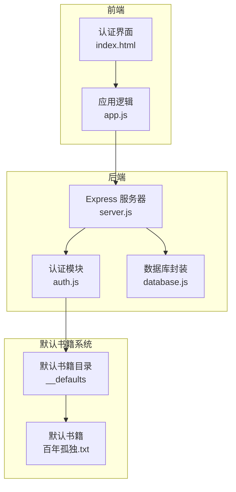
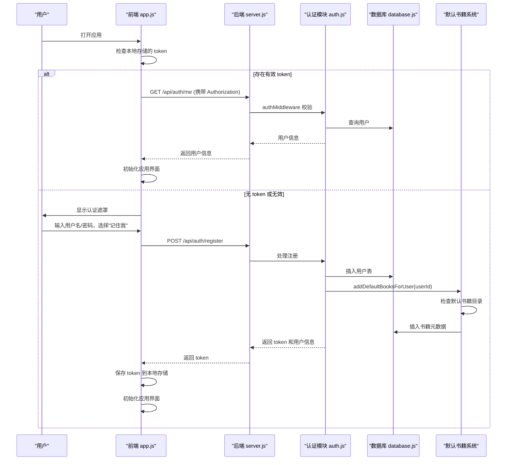
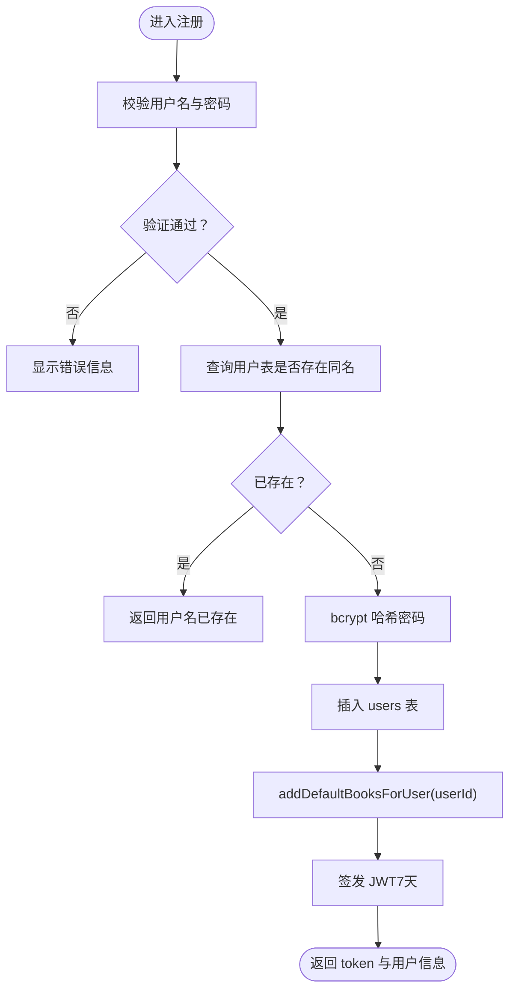
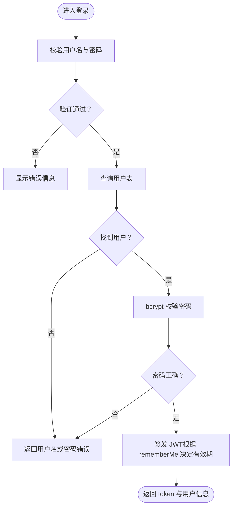
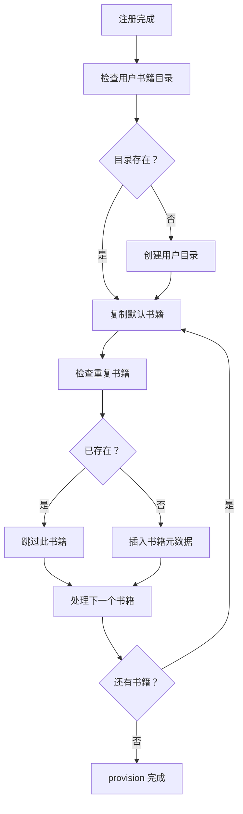
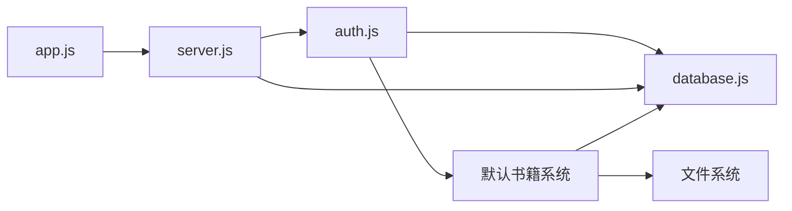

# 用户认证

<cite>
**本文档引用的文件**
- [auth.js](file://auth.js)
- [server.js](file://server.js)
- [database.js](file://database.js)
- [public/index.html](file://public/index.html)
- [public/app.js](file://public/app.js)
- [books/__defaults/百年孤独.txt](file://books/__defaults/百年孤独.txt)
- [package.json](file://package.json)
- [README.md](file://README.md)
</cite>

## 更新摘要
**变更内容**
- 新增自动默认书籍 provision 功能说明
- 更新注册流程以包含默认书籍创建
- 新增书籍目录结构和默认书籍管理说明
- 更新认证系统架构图以反映默认书籍处理

## 目录
1. [简介](#简介)
2. [项目结构](#项目结构)
3. [核心组件](#核心组件)
4. [架构总览](#架构总览)
5. [详细组件分析](#详细组件分析)
6. [默认书籍 provision 功能](#默认书籍-provision-功能)
7. [依赖关系分析](#依赖关系分析)
8. [性能考虑](#性能考虑)
9. [故障排除指南](#故障排除指南)
10. [结论](#结论)

## 简介
本指南面向 trae02airead 的用户认证功能，提供从注册到登录、从自动登录到用户信息展示与退出的完整使用说明。文档覆盖用户名与密码要求、表单验证规则、认证界面切换与错误提示、记住我功能、用户信息显示与退出登录操作，以及新增的自动默认书籍 provision 功能。用户注册时将自动获得默认书籍目录，为新用户提供即用型体验。

## 项目结构
该项目采用前后端分离架构：
- 后端：Express 服务器，提供认证接口与业务 API
- 前端：纯 HTML/CSS/JavaScript，负责认证界面与交互
- 数据层：SQLite（sql.js）本地数据库，存储用户、API 密钥、书籍元数据等
- 默认书籍：系统自带的经典文学作品，自动 provision 给新用户

**图表来源**
- [server.js:30-42](file://server.js#L30-L42)
- [auth.js:14-27](file://auth.js#L14-L27)
- [database.js:69-138](file://database.js#L69-L138)
- [auth.js:11-15](file://auth.js#L11-L15)

**章节来源**
- [README.md:210-232](file://README.md#L210-L232)
- [package.json:10-22](file://package.json#L10-L22)

## 核心组件
- 认证中间件：拦截受保护路由，校验 JWT 并注入用户信息
- 注册处理器：校验用户名与密码，检查重复，生成用户 ID，哈希密码并创建用户，**新增：自动 provision 默认书籍**
- 登录处理器：校验用户名与密码，支持"记住我"延长有效期
- 用户信息处理器：返回当前登录用户信息
- 默认书籍 provision：新用户注册时自动创建默认书籍目录
- 前端认证逻辑：切换登录/注册标签、表单验证、提交处理、自动登录、错误提示、退出登录

**章节来源**
- [auth.js:14-77](file://auth.js#L14-L77)
- [auth.js:17-49](file://auth.js#L17-L49)
- [public/app.js:30-162](file://public/app.js#L30-L162)

## 架构总览
认证流程由前端触发，后端通过中间件保护受保护路由，JWT 令牌用于后续请求的身份验证。**新增：默认书籍 provision 流程集成到注册流程中**。

**图表来源**
- [public/app.js:111-128](file://public/app.js#L111-L128)
- [public/app.js:59-109](file://public/app.js#L59-L109)
- [auth.js:14-77](file://auth.js#L14-L77)
- [auth.js:17-49](file://auth.js#L17-L49)
- [database.js:81-87](file://database.js#L81-L87)

## 详细组件分析

### 认证中间件与路由
- 中间件职责：从请求头提取 Bearer 令牌，验证 JWT，失败时返回需要认证的错误
- 受保护路由：在注册/登录路由之后挂载中间件，确保后续 API 调用携带有效令牌

**章节来源**
- [auth.js:14-27](file://auth.js#L14-L27)
- [server.js:37-42](file://server.js#L37-L42)

### 注册流程
- 表单验证：用户名非空且去除空白后长度大于 0；密码非空且长度至少 6
- 去重检查：查询用户表，若存在同名用户则返回错误
- 创建用户：生成 UUID 作为用户 ID，使用 bcrypt 哈希密码，插入用户表
- **新增：默认书籍 provision**：调用 addDefaultBooksForUser(userId) 为新用户创建默认书籍
- 发放令牌：签发 JWT，有效期根据"记住我"参数决定（默认 7 天）

**图表来源**
- [auth.js:29-55](file://auth.js#L29-L55)
- [auth.js:95-96](file://auth.js#L95-L96)
- [auth.js:17-49](file://auth.js#L17-L49)
- [database.js:81-87](file://database.js#L81-L87)

**章节来源**
- [auth.js:29-55](file://auth.js#L29-L55)
- [auth.js:95-96](file://auth.js#L95-L96)

### 登录流程
- 表单验证：用户名与密码均需提供
- 凭据校验：按用户名查询用户，使用 bcrypt 校验密码
- 发放令牌：签发 JWT，若勾选"记住我"，有效期延长至 30 天

**图表来源**
- [auth.js:57-73](file://auth.js#L57-L73)

**章节来源**
- [auth.js:57-73](file://auth.js#L57-L73)

### 用户信息与退出登录
- 获取用户信息：GET /api/auth/me，需要携带 Authorization 头
- 退出登录：清除本地 token，隐藏用户信息，显示认证遮罩

**章节来源**
- [auth.js:75-77](file://auth.js#L75-L77)
- [public/app.js:138-148](file://public/app.js#L138-L148)

### 前端认证界面与交互
- 登录/注册标签切换：切换时动态显示"记住我"区域与按钮文案
- 表单验证：用户名至少 1 位，密码至少 6 位
- 自动登录：应用启动时尝试验证本地 token，成功则直接初始化应用
- 错误提示：统一显示在认证遮罩内的错误区域
- 退出登录：清除本地存储并重置表单

**章节来源**
- [public/index.html:400-428](file://public/index.html#L400-L428)
- [public/app.js:30-57](file://public/app.js#L30-L57)
- [public/app.js:111-128](file://public/app.js#L111-L128)
- [public/app.js:138-148](file://public/app.js#L138-L148)

## 默认书籍 provision 功能

### 功能概述
trae02airead 提供智能的默认书籍 provision 功能，确保新用户注册后立即拥有经典文学作品，无需手动添加即可开始阅读体验。

### 默认书籍配置
- **默认书籍目录**：`books/__defaults/`
- **默认书籍列表**：当前包含《百年孤独》
- **书籍信息**：标题、原始文件名、作者信息

### provision 流程
1. **用户注册完成**：注册成功后自动触发
2. **目录检查**：验证用户专属书籍目录是否存在
3. **文件复制**：将默认书籍复制到用户目录
4. **元数据创建**：在数据库中记录书籍元数据
5. **重复防护**：检查用户是否已拥有同名书籍

**图表来源**
- [auth.js:17-49](file://auth.js#L17-L49)

### 数据库集成
默认书籍 provision 与现有数据库架构无缝集成：
- **书籍元数据表**：`books_meta` 表存储书籍信息
- **文件关联**：通过 UUID 关联文件路径
- **用户关联**：通过 `user_id` 关联用户账户

**章节来源**
- [auth.js:17-49](file://auth.js#L17-L49)
- [database.js:108-122](file://database.js#L108-L122)

## 依赖关系分析
- 认证模块依赖数据库封装进行用户查询与插入
- **新增：认证模块依赖默认书籍系统进行书籍 provision**
- 服务器挂载认证中间件以保护受保护路由
- 前端通过 fetch API 调用认证接口，使用 localStorage 存储 token

**图表来源**
- [server.js:12-13](file://server.js#L12-L13)
- [auth.js:5](file://auth.js#L5)
- [database.js:1](file://database.js#L1)

**章节来源**
- [server.js:12-13](file://server.js#L12-L13)
- [auth.js:5](file://auth.js#L5)
- [database.js:1](file://database.js#L1)

## 性能考虑
- JWT 验证为内存计算，开销极低
- bcrypt 哈希在注册/登录时执行，建议避免在高频场景下重复调用
- 前端 token 存储在 localStorage，注意跨站脚本攻击风险
- **新增：默认书籍 provision 的文件 I/O 操作**：首次注册时可能影响响应时间，建议优化文件复制策略

## 故障排除指南
- 登录失败
  - 检查用户名与密码是否为空
  - 确认用户名/密码是否正确
  - 若勾选"记住我"，确认令牌有效期是否被延长
- 注册失败
  - 确认用户名非空且唯一
  - 确认密码至少 6 位
  - **新增：检查默认书籍目录权限**：确保 `books/__defaults/` 目录可读
- 自动登录异常
  - 清除浏览器 localStorage 中的 authToken 后重试
  - 确认服务器返回的 token 未过期
- **新增：默认书籍 provision 失败**
  - 检查 `books/__defaults/` 目录是否存在且可读
  - 确认数据库连接正常
  - 验证用户目录权限（`books/{userId}/`）
- 401 未授权
  - 重新登录获取新 token
  - 检查请求头 Authorization 是否正确携带
- 退出登录后仍显示用户信息
  - 确认本地存储已被清除
  - 强制刷新页面

**章节来源**
- [public/app.js:176-184](file://public/app.js#L176-L184)
- [auth.js:14-27](file://auth.js#L14-L27)

## 结论
trae02airead 的用户认证体系简洁可靠：前端负责表单验证与交互，后端通过 JWT 保障 API 安全，数据库存储用户凭据。**新增的默认书籍 provision 功能进一步提升了用户体验**，新用户注册后即可获得经典文学作品，无需手动添加。记住我功能可延长会话有效期，配合前端自动登录机制，为用户提供顺畅的使用体验。遵循本文档的使用指南与最佳实践，可有效避免常见问题并提升安全性。