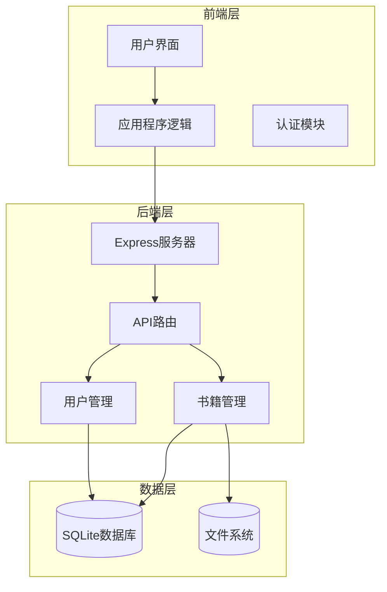
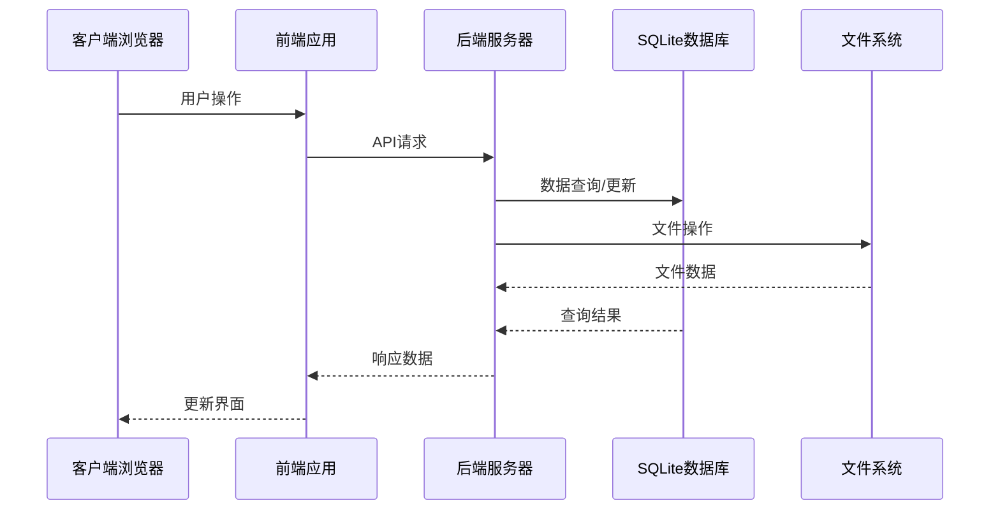
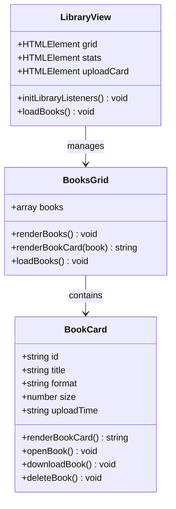
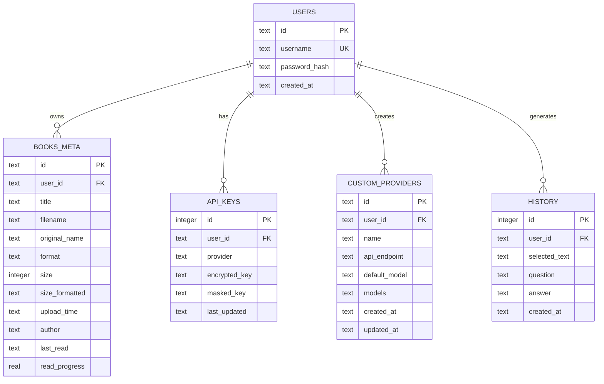
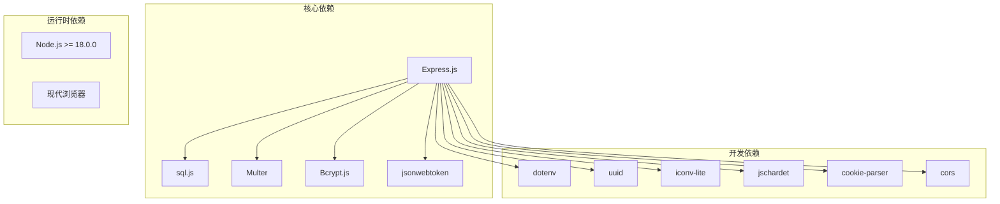

# 电子书管理

<cite>
**本文档引用的文件**
- [README.md](file://README.md)
- [package.json](file://package.json)
- [server.js](file://server.js)
- [public/index.html](file://public/index.html)
- [public/app.js](file://public/app.js)
- [database.js](file://database.js)
- [auth.js](file://auth.js)
</cite>

## 目录
1. [简介](#简介)
2. [项目结构](#项目结构)
3. [核心组件](#核心组件)
4. [架构概览](#架构概览)
5. [详细组件分析](#详细组件分析)
6. [依赖关系分析](#依赖关系分析)
7. [性能考虑](#性能考虑)
8. [故障排除指南](#故障排除指南)
9. [结论](#结论)

## 简介

trae02airead 是一个现代化的智能阅读应用，专为电子书管理而设计。该系统提供了完整的书架管理功能，支持多种电子书格式的上传、存储和管理。用户可以通过直观的界面轻松管理个人电子书收藏，享受智能阅读体验。

主要特性包括：
- 多格式电子书支持（TXT、PDF、EPUB、MOBI）
- 实时上传进度显示
- 书籍信息展示和管理
- 在线阅读和下载功能
- 用户数据隔离和安全性保障

## 项目结构

该项目采用前后端分离的架构设计，主要由以下组件构成：



**图表来源**
- [server.js:1-50](file://server.js#L1-L50)
- [public/index.html:1-50](file://public/index.html#L1-L50)

**章节来源**
- [README.md:210-232](file://README.md#L210-L232)
- [package.json:1-23](file://package.json#L1-L23)

## 核心组件

### 电子书管理核心功能

系统的核心功能围绕电子书管理展开，主要包括：

1. **多格式支持**：TXT、PDF、EPUB、MOBI四种格式
2. **上传管理**：文件大小限制（50MB）、格式验证
3. **书籍展示**：网格视图和列表视图切换
4. **操作功能**：在线阅读、下载、删除
5. **进度跟踪**：阅读进度保存和管理

### 技术架构

系统采用现代Web技术栈构建：

- **前端**：原生JavaScript ES6+，无框架依赖
- **后端**：Express.js 4.18.2
- **数据库**：SQLite (sql.js - 纯JS实现)
- **文件存储**：Multer文件上传中间件
- **安全**：JWT认证、bcrypt密码加密

**章节来源**
- [README.md:54-67](file://README.md#L54-L67)
- [package.json:10-22](file://package.json#L10-L22)

## 架构概览

系统采用分层架构设计，确保功能模块的清晰分离和良好的可维护性：



**图表来源**
- [server.js:463-597](file://server.js#L463-L597)
- [public/app.js:718-796](file://public/app.js#L718-L796)

### 数据流分析

系统的数据流遵循严格的验证和处理流程：

1. **用户认证**：JWT令牌验证
2. **文件上传**：Multer中间件处理
3. **格式验证**：扩展名和大小检查
4. **数据存储**：SQLite数据库记录
5. **文件保存**：用户特定目录存储

**章节来源**
- [server.js:123-161](file://server.js#L123-L161)
- [auth.js:14-27](file://auth.js#L14-L27)

## 详细组件分析

### 电子书上传组件

电子书上传功能是系统的核心组件之一，提供了完整的文件处理流程：

#### 上传流程

```mermaid
flowchart TD
Start([开始上传]) --> ValidateFormat["验证文件格式<br/>.txt/.pdf/.epub/.mobi]
ValidateFormat --> FormatValid{"格式有效?"}
FormatValid --> |否| ShowError1["显示格式错误"]
FormatValid --> |是| ValidateSize["检查文件大小<br/>≤ 50MB"]
ValidateSize --> SizeValid{"大小有效?"}
SizeValid --> |否| ShowError2["显示大小错误"]
SizeValid --> |是| CreateDir["创建用户目录"]
CreateDir --> SaveFile["保存文件到服务器"]
SaveFile --> UpdateDB["更新数据库记录"]
UpdateDB --> Success["上传成功"]
ShowError1 --> End([结束])
ShowError2 --> End
Success --> End
```

**图表来源**
- [server.js:465-514](file://server.js#L465-L514)
- [public/app.js:729-796](file://public/app.js#L729-L796)

#### 前端上传实现

前端实现了完整的上传进度显示和错误处理机制：

- **拖拽上传**：支持拖拽文件到上传区域
- **进度条**：实时显示上传进度百分比
- **错误处理**：格式不支持、大小超限等错误提示
- **文件预览**：上传成功后的书籍信息展示

**章节来源**
- [public/app.js:729-796](file://public/app.js#L729-L796)
- [server.js:465-514](file://server.js#L465-L514)

### 书籍管理组件

#### 书籍展示视图

系统提供了两种书籍展示方式：

1. **网格视图**：卡片式布局，适合快速浏览
2. **列表视图**：详细信息展示，适合管理操作



**图表来源**
- [public/app.js:798-851](file://public/app.js#L798-L851)
- [public/app.js:853-941](file://public/app.js#L853-L941)

#### 书籍操作功能

每本电子书都支持以下操作：

- **阅读**：在线阅读TXT格式内容
- **下载**：下载原始电子书文件
- **删除**：永久删除书籍及其元数据

**章节来源**
- [public/app.js:853-941](file://public/app.js#L853-L941)
- [server.js:528-576](file://server.js#L528-L576)

### 数据存储组件

#### 数据库设计

系统使用SQLite数据库存储所有用户数据：



**图表来源**
- [database.js:81-135](file://database.js#L81-L135)

#### 文件存储策略

- **用户隔离**：每个用户拥有独立的存储目录
- **文件命名**：使用UUID确保文件名唯一性
- **元数据管理**：数据库记录文件元信息
- **目录结构**：books/{userId}/{bookId}.{ext}

**章节来源**
- [server.js:134-161](file://server.js#L134-L161)
- [database.js:108-122](file://database.js#L108-L122)

## 依赖关系分析

### 技术栈依赖

系统的技术栈具有清晰的层次结构：



**图表来源**
- [package.json:10-22](file://package.json#L10-L22)

### 关键依赖说明

1. **Express.js**：Web应用框架，提供HTTP服务器功能
2. **sql.js**：纯JavaScript实现的SQLite引擎
3. **Multer**：文件上传中间件，支持多文件处理
4. **bcryptjs**：密码哈希加密，确保用户密码安全
5. **jsonwebtoken**：JWT令牌生成和验证

**章节来源**
- [package.json:1-23](file://package.json#L1-L23)

## 性能考虑

### 文件处理优化

系统在文件处理方面采用了多项优化措施：

- **异步处理**：所有文件操作都是异步执行
- **内存管理**：使用Buffer处理文件内容，避免内存泄漏
- **编码检测**：自动检测TXT文件编码，支持多种格式
- **进度监控**：实时上传进度反馈

### 数据库性能

- **索引优化**：为常用查询字段建立索引
- **事务处理**：批量操作使用事务确保数据一致性
- **WAL模式**：使用Write-Ahead Logging提高并发性能
- **连接池**：sql.js提供连接复用机制

### 前端性能

- **懒加载**：按需加载功能模块
- **事件委托**：减少DOM事件监听器数量
- **缓存策略**：本地存储用户偏好设置
- **虚拟滚动**：大量书籍时的性能优化

## 故障排除指南

### 常见问题及解决方案

#### 上传失败问题

**问题现象**：文件上传过程中断或失败

**可能原因**：
1. 文件格式不支持
2. 文件大小超过限制
3. 网络连接不稳定
4. 服务器磁盘空间不足

**解决方案**：
1. 检查文件扩展名是否为.txt、.pdf、.epub或.mobi
2. 确认文件大小不超过50MB
3. 检查网络连接稳定性
4. 清理服务器磁盘空间

#### 书籍无法阅读

**问题现象**：点击"阅读"按钮无响应

**可能原因**：
1. 书籍格式不支持在线阅读
2. 书籍内容读取失败
3. 浏览器兼容性问题

**解决方案**：
1. 确认书籍格式为TXT
2. 检查书籍文件完整性
3. 尝试使用其他浏览器

#### 登录认证问题

**问题现象**：登录后立即被登出

**可能原因**：
1. JWT令牌过期
2. 服务器时间不同步
3. 浏览器Cookie问题

**解决方案**：
1. 检查系统时间设置
2. 清除浏览器Cookie
3. 重新登录系统

### 调试技巧

#### 前端调试

1. **开发者工具**：使用浏览器开发者工具查看网络请求
2. **控制台日志**：检查JavaScript错误信息
3. **状态检查**：验证用户认证状态

#### 后端调试

1. **日志查看**：检查服务器错误日志
2. **数据库查询**：验证数据存储状态
3. **文件权限**：确认文件系统权限设置

**章节来源**
- [server.js:123-132](file://server.js#L123-L132)
- [auth.js:14-27](file://auth.js#L14-L27)

## 结论

trae02airead 提供了一个功能完整、易于使用的电子书管理系统。通过合理的架构设计和技术选型，系统实现了以下目标：

### 主要优势

1. **用户体验友好**：直观的界面设计和流畅的操作体验
2. **功能完整性**：支持多种电子书格式和完整的管理功能
3. **安全性保障**：JWT认证、密码加密、数据隔离等多重安全措施
4. **性能优化**：异步处理、缓存策略、数据库优化等性能优化

### 技术特点

1. **现代技术栈**：使用最新的Web技术和最佳实践
2. **可扩展性**：模块化设计便于功能扩展和维护
3. **跨平台兼容**：支持多种操作系统和浏览器
4. **数据持久化**：SQLite数据库确保数据可靠存储

### 发展建议

1. **功能扩展**：可考虑添加书籍分类、标签管理等功能
2. **性能优化**：针对大量书籍场景进行进一步优化
3. **移动端支持**：开发移动端应用提升用户体验
4. **云存储集成**：可考虑集成云存储服务提供备份功能

该系统为个人电子书管理提供了一个优秀的解决方案，既满足了基本需求，又具备良好的扩展性和维护性。