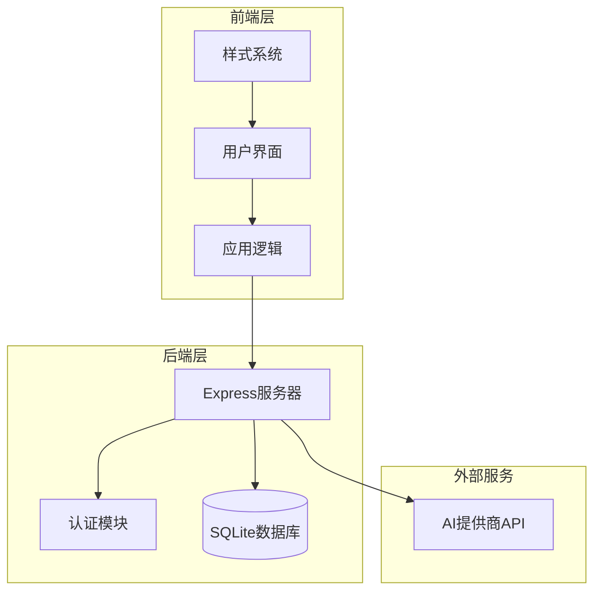
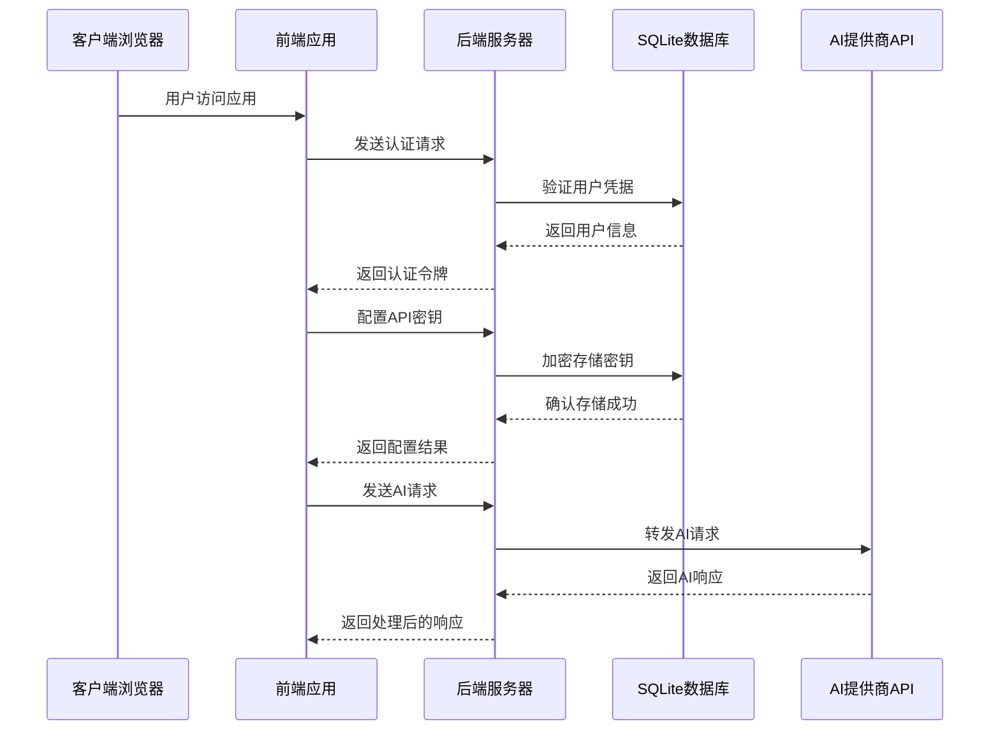
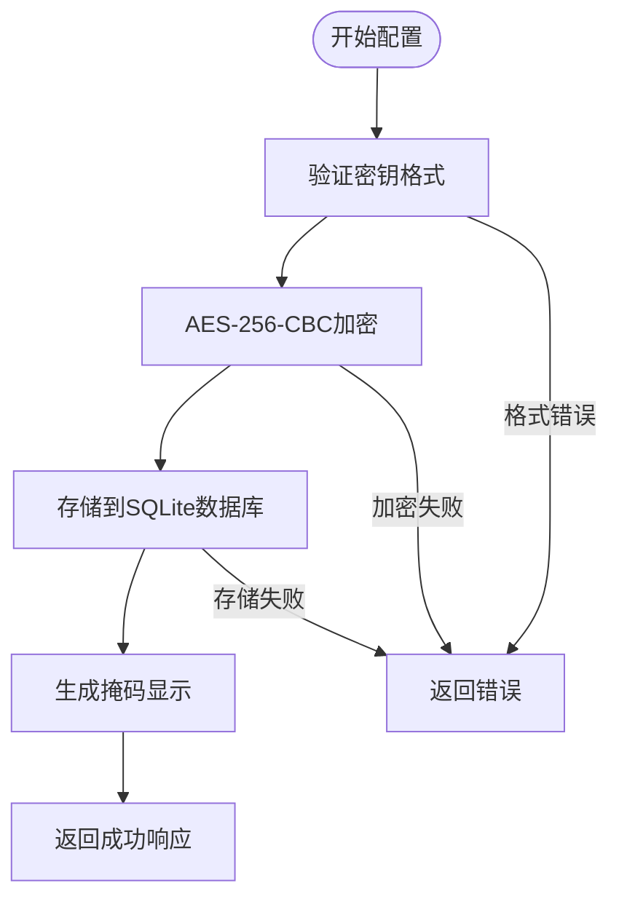
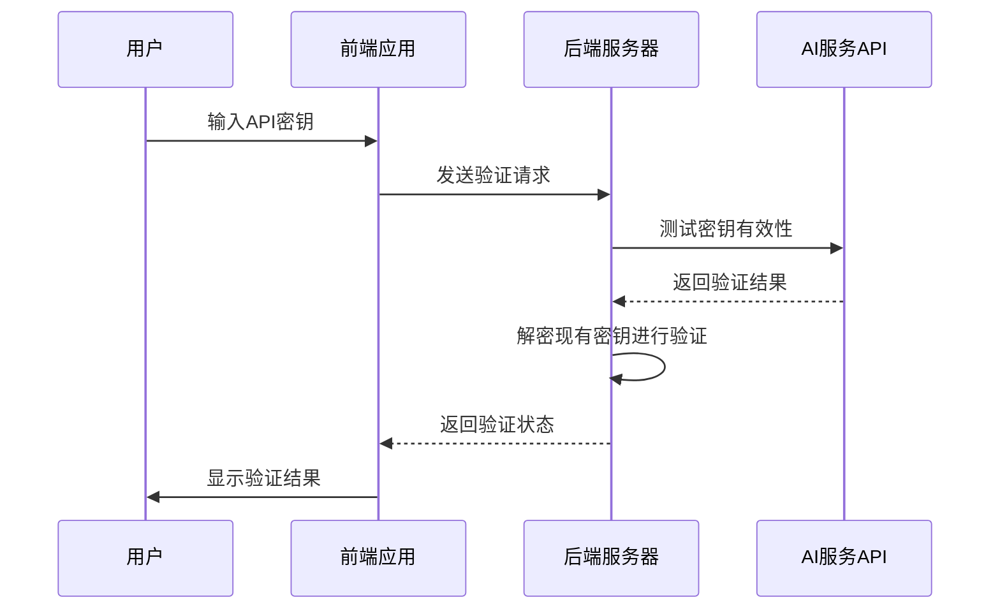
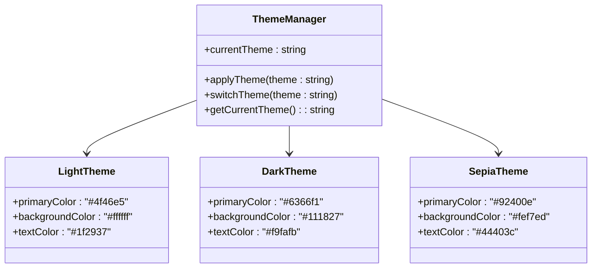
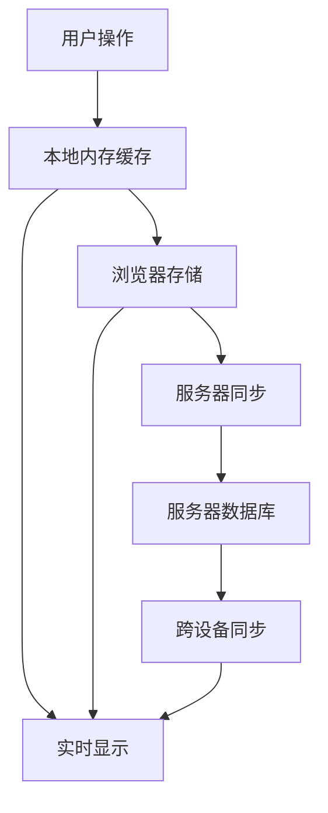
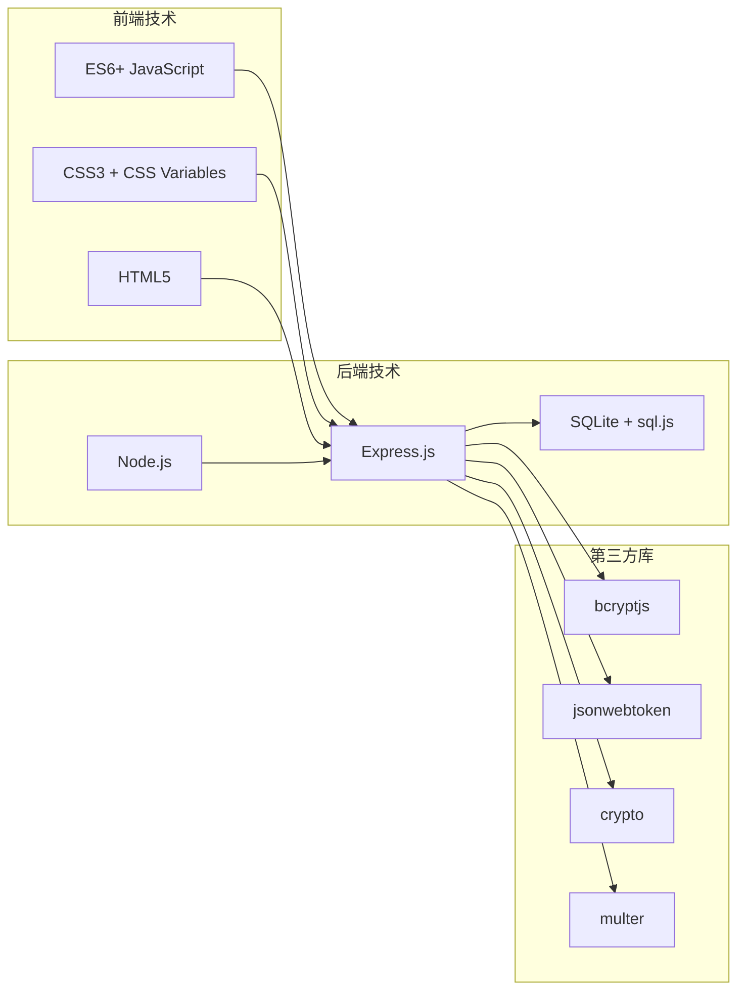
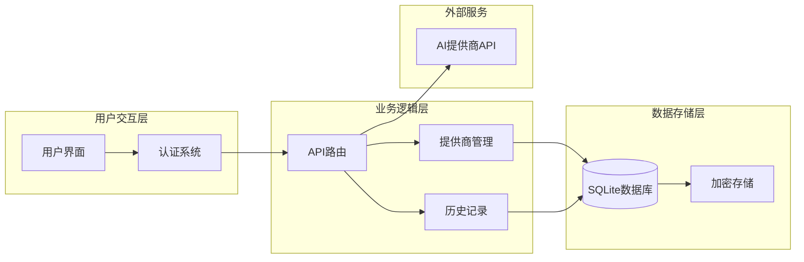

# 设置与个性化

<cite>
**本文档引用的文件**
- [README.md](file://README.md)
- [package.json](file://package.json)
- [server.js](file://server.js)
- [auth.js](file://auth.js)
- [database.js](file://database.js)
- [public/index.html](file://public/index.html)
- [public/app.js](file://public/app.js)
- [public/styles.css](file://public/styles.css)
</cite>

## 目录
1. [简介](#简介)
2. [项目结构](#项目结构)
3. [核心组件](#核心组件)
4. [架构概览](#架构概览)
5. [详细组件分析](#详细组件分析)
6. [依赖关系分析](#依赖关系分析)
7. [性能考虑](#性能考虑)
8. [故障排除指南](#故障排除指南)
9. [结论](#结论)

## 简介

AI阅读助手是一个现代化的智能阅读应用，集成了多AI服务提供商，帮助用户高效阅读和理解书籍内容。该应用支持在线阅读、AI智能问答、书架管理、自定义AI提供商等功能。本文档专注于应用的设置与个性化功能，包括API密钥管理、用户界面个性化设置、历史记录管理、设置同步和隐私保护选项。

## 项目结构

该项目采用前后端分离的架构设计，主要由以下组件构成：

**图表来源**
- [server.js:1-50](file://server.js#L1-L50)
- [public/index.html:1-50](file://public/index.html#L1-L50)

**章节来源**
- [README.md:210-232](file://README.md#L210-L232)
- [package.json:1-23](file://package.json#L1-L23)

## 核心组件

### API密钥管理系统

系统提供了完善的API密钥管理功能，支持多种AI提供商的密钥配置和验证：

- **内置提供商支持**：智谱AI、硅基流动
- **自定义提供商**：支持添加任意OpenAI兼容API
- **密钥验证**：实时验证API密钥的有效性
- **加密存储**：使用AES-256-CBC加密存储密钥
- **环境变量支持**：可通过环境变量配置密钥

### 用户界面个性化系统

应用提供了丰富的个性化设置选项：

- **主题切换**：明亮、暗黑、护眼三种主题模式
- **字体调整**：12px-28px的字体大小调节
- **布局偏好**：响应式设计适配不同屏幕尺寸
- **选中文本工具栏**：浮动工具栏提供快捷操作

### 历史记录管理系统

系统实现了完整的问答历史记录功能：

- **本地历史**：浏览器本地存储最近50条问答记录
- **服务器同步**：AI问答历史存储在服务器端，跨设备同步
- **历史清理**：支持清空所有历史记录
- **数据隔离**：每个用户的问答历史完全独立

**章节来源**
- [server.js:163-188](file://server.js#L163-L188)
- [public/app.js:1540-1552](file://public/app.js#L1540-L1552)
- [public/styles.css:22-48](file://public/styles.css#L22-L48)

## 架构概览

应用采用现代Web技术栈构建，实现了前后端分离的设计模式：

**图表来源**
- [server.js:239-332](file://server.js#L239-L332)
- [auth.js:14-27](file://auth.js#L14-L27)
- [database.js:88-135](file://database.js#L88-L135)

## 详细组件分析

### API密钥管理组件

#### 密钥存储机制

系统使用AES-256-CBC对称加密算法存储API密钥：

**图表来源**
- [server.js:44-67](file://server.js#L44-L67)
- [server.js:278-289](file://server.js#L278-L289)

#### 密钥验证流程

系统提供双重验证机制确保密钥有效性：

**图表来源**
- [server.js:212-235](file://server.js#L212-L235)
- [server.js:297-316](file://server.js#L297-L316)

#### 自定义提供商配置

用户可以通过以下步骤添加自定义AI提供商：

1. **基本信息配置**：显示名称、API地址、默认模型
2. **可选模型列表**：支持JSON格式的模型配置
3. **密钥验证**：自动验证提供的API密钥
4. **存储管理**：加密存储提供商配置

**章节来源**
- [server.js:366-423](file://server.js#L366-L423)
- [server.js:449-461](file://server.js#L449-L461)

### 用户界面个性化组件

#### 主题系统架构

应用实现了灵活的主题切换机制：

**图表来源**
- [public/styles.css:22-48](file://public/styles.css#L22-L48)
- [public/app.js:1546-1552](file://public/app.js#L1546-L1552)

#### 字体大小控制系统

系统提供了精确的字体大小调节功能：

- **范围限制**：12px-28px的合理调节范围
- **实时预览**：调整即时反映在阅读区域
- **状态保存**：用户偏好的字体大小会持久化

#### 响应式布局设计

应用采用移动优先的设计理念：

- **断点设计**：针对不同屏幕尺寸优化布局
- **弹性网格**：内容区域自适应屏幕宽度
- **触摸友好**：按钮和控件适合触摸操作

**章节来源**
- [public/styles.css:1-800](file://public/styles.css#L1-L800)
- [public/app.js:1540-1552](file://public/app.js#L1540-L1552)

### 历史记录管理组件

#### 本地历史存储

系统实现了双层历史记录存储机制：

**图表来源**
- [public/app.js:1567-1588](file://public/app.js#L1567-L1588)
- [database.js:123-135](file://database.js#L123-L135)

#### 历史记录同步机制

系统确保用户在不同设备上的一致体验：

- **服务器端存储**：所有问答历史保存在服务器
- **增量同步**：新历史记录自动同步到服务器
- **数据隔离**：每个用户的记录完全独立
- **容量限制**：最多保存50条历史记录

**章节来源**
- [public/app.js:1590-1605](file://public/app.js#L1590-L1605)
- [server.js:123-135](file://server.js#L123-L135)

## 依赖关系分析

### 技术栈依赖

应用使用了现代化的Web技术栈：

**图表来源**
- [package.json:10-22](file://package.json#L10-L22)
- [server.js:1-15](file://server.js#L1-L15)

### 数据流依赖

应用的数据流遵循清晰的依赖关系：

**图表来源**
- [server.js:336-461](file://server.js#L336-L461)
- [database.js:88-135](file://database.js#L88-L135)

**章节来源**
- [package.json:1-23](file://package.json#L1-L23)
- [server.js:1-30](file://server.js#L1-L30)

## 性能考虑

### 加密性能优化

系统在安全性与性能之间取得了平衡：

- **加密算法选择**：AES-256-CBC提供强加密同时保持良好性能
- **密钥长度**：32字节密钥长度确保安全性
- **随机IV生成**：每次加密使用随机初始化向量
- **内存管理**：及时释放加密过程中的临时数据

### 前端性能优化

应用采用了多项前端性能优化策略：

- **懒加载**：非关键资源延迟加载
- **事件委托**：减少事件监听器数量
- **虚拟滚动**：大量历史记录的高效渲染
- **缓存策略**：合理使用浏览器缓存

### 数据库性能优化

SQLite数据库的性能优化措施：

- **索引优化**：为常用查询字段建立索引
- **事务处理**：批量操作使用事务提高效率
- **WAL模式**：使用写前日志模式提升并发性能
- **外键约束**：启用外键约束保证数据完整性

## 故障排除指南

### API密钥配置问题

#### 常见问题及解决方案

**问题1：API密钥验证失败**
- 检查密钥格式是否正确（通常以sk-开头）
- 确认提供商API地址是否正确
- 验证网络连接是否正常
- 查看提供商账户状态是否正常

**问题2：密钥存储失败**
- 检查数据库权限是否正确
- 确认磁盘空间是否充足
- 验证加密密钥是否有效

**问题3：自定义提供商添加失败**
- 确认API端点格式正确
- 检查可选模型列表JSON格式
- 验证默认模型是否存在

#### 调试步骤

1. **检查网络连接**：确认能够访问AI提供商API
2. **验证密钥格式**：确保密钥长度和格式符合要求
3. **查看服务器日志**：检查后端错误信息
4. **测试API端点**：使用curl命令测试API可用性

**章节来源**
- [server.js:212-235](file://server.js#L212-L235)
- [server.js:297-316](file://server.js#L297-L316)

### 用户界面问题

#### 主题切换问题

**问题：主题切换不生效**
- 刷新浏览器页面
- 清除浏览器缓存
- 检查CSS文件是否正确加载
- 确认浏览器支持CSS变量

#### 字体调整问题

**问题：字体大小调节无效**
- 检查浏览器是否阻止了JavaScript执行
- 确认CSS变量是否正确应用
- 验证localStorage是否正常工作

#### 历史记录问题

**问题：历史记录不显示**
- 检查浏览器JavaScript是否启用
- 确认网络连接正常
- 验证服务器端历史记录接口
- 查看浏览器开发者工具控制台

### 性能问题

#### 页面加载缓慢

**可能原因**：
- 大文件上传导致阻塞
- 网络连接不稳定
- 浏览器缓存问题
- 服务器负载过高

**解决方案**：
- 优化图片和文件大小
- 使用CDN加速静态资源
- 实施合理的缓存策略
- 监控服务器性能指标

#### 功能响应慢

**可能原因**：
- AI提供商API响应慢
- 数据库查询性能问题
- 前端JavaScript执行效率低
- 浏览器性能不足

**解决方案**：
- 优化数据库查询语句
- 实施前端性能监控
- 减少不必要的DOM操作
- 使用Web Workers处理复杂计算

**章节来源**
- [public/app.js:1636-1640](file://public/app.js#L1636-L1640)
- [server.js:886-892](file://server.js#L886-L892)

## 结论

AI阅读助手的设置与个性化功能为用户提供了完整的配置体验。通过精心设计的API密钥管理系统、灵活的用户界面个性化选项、可靠的服务器端历史记录同步机制，以及完善的隐私保护措施，应用实现了良好的用户体验和数据安全。

### 主要优势

1. **安全性**：采用AES-256-CBC加密存储API密钥，确保用户数据安全
2. **灵活性**：支持多种AI提供商，用户可根据需求自由选择
3. **易用性**：直观的界面设计和简化的配置流程
4. **可靠性**：完善的错误处理和故障恢复机制
5. **性能**：优化的前端和后端实现，提供流畅的用户体验

### 最佳实践建议

1. **密钥管理**：定期轮换API密钥，避免长期使用同一密钥
2. **备份策略**：定期备份data.db数据库文件
3. **性能监控**：关注应用性能指标，及时发现和解决问题
4. **安全更新**：定期更新依赖包，修复已知的安全漏洞
5. **用户教育**：向用户提供清晰的配置指导和使用说明

通过遵循这些最佳实践和充分利用应用提供的各种功能，用户可以获得更加个性化和高效的阅读体验。