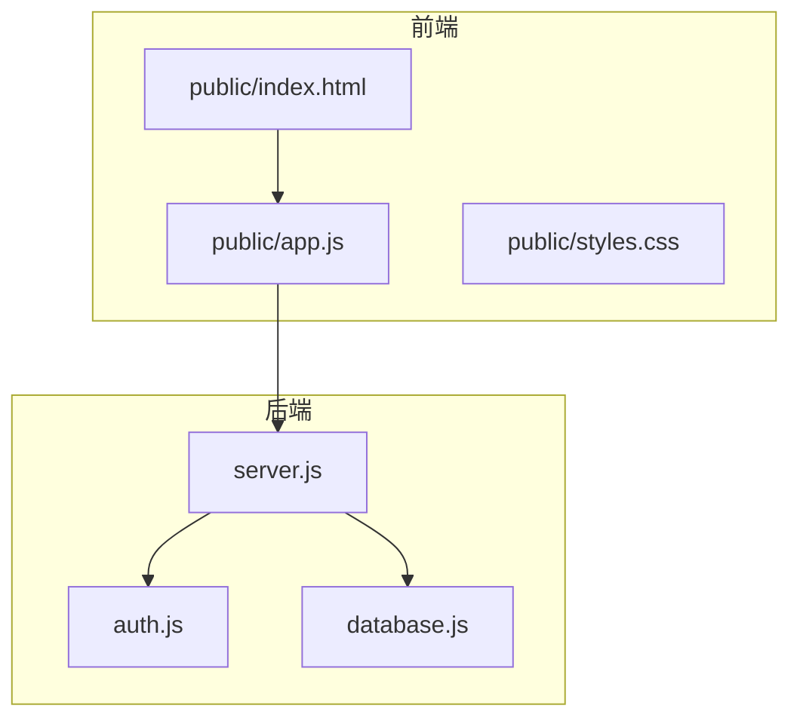
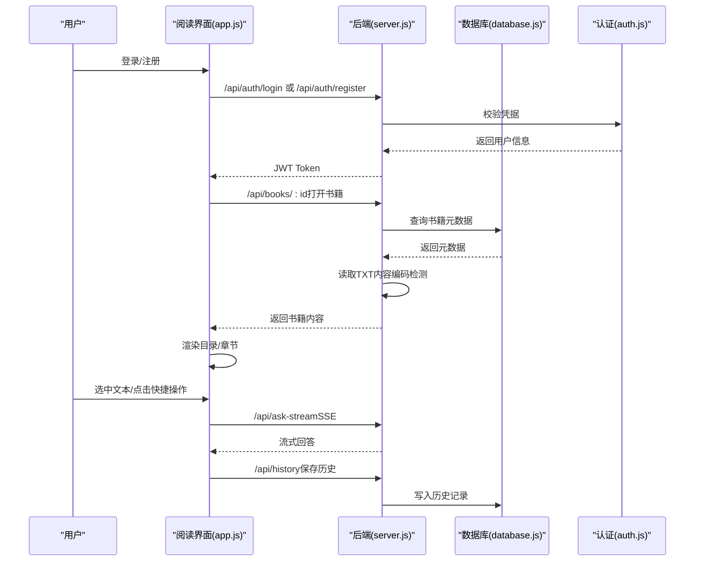
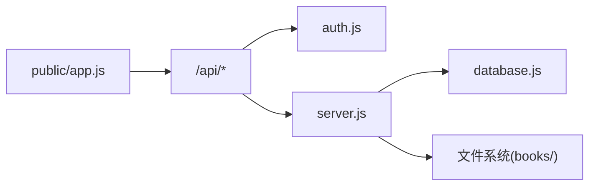

# 阅读体验

<cite>
**本文引用的文件**
- [README.md](file://README.md)
- [package.json](file://package.json)
- [public/index.html](file://public/index.html)
- [public/app.js](file://public/app.js)
- [public/styles.css](file://public/styles.css)
- [server.js](file://server.js)
- [database.js](file://database.js)
- [auth.js](file://auth.js)
</cite>

## 目录
1. [简介](#简介)
2. [项目结构](#项目结构)
3. [核心组件](#核心组件)
4. [架构总览](#架构总览)
5. [详细组件分析](#详细组件分析)
6. [依赖关系分析](#依赖关系分析)
7. [性能考虑](#性能考虑)
8. [故障排除指南](#故障排除指南)
9. [结论](#结论)
10. [附录](#附录)

## 简介
本指南面向 trae02airead 的“阅读模式”，帮助你在不同设备上获得舒适的阅读体验。内容涵盖：
- 文章目录导航与章节切换
- 阅读进度跟踪
- 个性化阅读设置（字体大小、主题模式）
- 阅读舒适度优化
- 侧边栏功能、阅读历史记录、书签管理
- 多设备阅读体验优化建议与使用技巧

## 项目结构
前端采用原生 JavaScript + HTML + CSS 构建，后端基于 Express.js，数据库使用 sql.js（纯前端 SQLite 实现）。核心文件如下：
- 前端入口与界面：public/index.html、public/app.js、public/styles.css
- 后端服务：server.js
- 数据库初始化与表结构：database.js
- 用户认证与 JWT：auth.js
- 项目依赖与脚本：package.json
- 项目说明与特性：README.md

图表来源
- [public/index.html](file://public/index.html)
- [public/app.js](file://public/app.js)
- [public/styles.css](file://public/styles.css)
- [server.js](file://server.js)
- [auth.js](file://auth.js)
- [database.js](file://database.js)

章节来源
- [package.json](file://package.json)
- [README.md](file://README.md)

## 核心组件
- 阅读视图（Reader View）
  - 文章容器与内容渲染
  - 目录侧边栏（TOC）
  - 阅读设置（字体大小、主题模式）
- AI 助手面板（AI Panel）
  - 选中文本浮动工具栏
  - 快捷操作（解释、总结、翻译、扩展阅读）
  - 自定义问题与流式回答
- 历史记录（History View）
  - 问答历史展示与清空
- 书架（Library View）
  - 书籍上传、下载、删除
  - 阅读进度跟踪（预留接口）

章节来源
- [public/index.html](file://public/index.html)
- [public/app.js](file://public/app.js)
- [public/styles.css](file://public/styles.css)
- [server.js](file://server.js)

## 架构总览
阅读模式由前端单页应用驱动，通过 API 与后端交互，实现：
- 用户认证与权限控制
- 书籍上传与内容解析
- AI 问答（流式 SSE）
- 历史记录与设置持久化

图表来源
- [public/app.js](file://public/app.js)
- [server.js](file://server.js)
- [database.js](file://database.js)
- [auth.js](file://auth.js)

## 详细组件分析

### 阅读视图（Reader View）
- 文章容器与内容渲染
  - 支持 TXT 文件上传与在线阅读
  - 自动检测编码（UTF-8、GBK、GB2312、BIG5、UTF-16 等）
  - 将文本按章节（标题）拆分为 section，生成目录
- 目录导航
  - 侧边栏列出章节标题，点击平滑滚动至对应章节
  - 当前章节高亮
- 阅读设置
  - 字体大小：12px–28px，支持 + / - 按钮调整
  - 主题模式：明亮、暗黑、护眼（通过 data-theme 切换）
- 侧边栏功能
  - 文章目录
  - 阅读设置（字体大小、主题）
  - API 状态与密钥配置入口

章节来源
- [public/index.html](file://public/index.html)
- [public/app.js](file://public/app.js)
- [public/styles.css](file://public/styles.css)
- [server.js](file://server.js)

### 个性化阅读设置
- 字体大小调节
  - 通过“A-”“A+”按钮调整，实时生效
  - 数值显示在中间按钮旁
- 主题模式切换
  - 明亮、暗黑、护眼三种主题
  - 通过 data-theme 属性应用 CSS 变量
- 选中文本浮动工具栏
  - 选中文本后自动显示，提供快捷操作按钮
  - 工具栏位置随选区动态定位

章节来源
- [public/index.html](file://public/index.html)
- [public/app.js](file://public/app.js)
- [public/styles.css](file://public/styles.css)

### 阅读舒适度优化
- 行高与排版
  - 统一行距与段间距，提高可读性
- 阅读宽度
  - 文章容器最大宽度约束，避免过宽导致阅读疲劳
- 滚动条与高亮
  - 自定义滚动条样式
  - 选中文本高亮颜色与对比度优化

章节来源
- [public/styles.css](file://public/styles.css)

### 目录导航与章节切换
- 自动生成目录
  - 基于标题行识别章节，若无标题则按段落生成小节
- 章节跳转
  - 点击目录项平滑滚动至对应章节
  - 目录项高亮跟随当前章节

图表来源
- [public/app.js](file://public/app.js)
- [public/index.html](file://public/index.html)

章节来源
- [public/app.js](file://public/app.js)
- [public/index.html](file://public/index.html)

### 阅读进度跟踪
- 进度接口
  - 提供 PUT /api/books/:id/progress 接口用于保存阅读进度
- 前端预留
  - 前端已定义进度保存逻辑（注释），可结合滚动事件或定时器触发
- 历史记录
  - 服务器端保存问答历史，前端可加载与清空

章节来源
- [server.js](file://server.js)
- [public/app.js](file://public/app.js)

### 侧边栏功能
- 文章目录
  - 展示章节标题，支持点击跳转
- 阅读设置
  - 字体大小与主题切换
- API 状态
  - 显示当前提供商密钥状态与模型信息
  - “配置API密钥”按钮跳转设置页

章节来源
- [public/index.html](file://public/index.html)
- [public/app.js](file://public/app.js)

### 阅读历史记录
- 历史展示
  - 最多保留 50 条问答记录
  - 展示选中文本、问题、答案与时间
- 清空历史
  - 确认后清空前端与服务器端历史

章节来源
- [public/app.js](file://public/app.js)
- [server.js](file://server.js)
- [database.js](file://database.js)

### 书签管理
- 当前实现
  - 未提供专门的书签功能
- 建议方案
  - 可在前端维护本地书签列表（localStorage），与目录项关联
  - 服务器端可扩展表结构存储书签（位置、备注等）

章节来源
- [public/app.js](file://public/app.js)
- [database.js](file://database.js)

### 多设备阅读体验优化
- 字体与主题
  - 根据环境光线选择护眼或暗黑模式
  - 使用 16–20px 字号提升移动端可读性
- 触控与手势
  - 移动端建议使用双指缩放调整字号
  - 长按选中文本触发工具栏
- 网络与缓存
  - 首次加载后可缓存常用书籍内容
  - 离线阅读建议导出 PDF/EPUB（当前 TXT 在线阅读）

章节来源
- [public/styles.css](file://public/styles.css)
- [public/app.js](file://public/app.js)

## 依赖关系分析
- 前端依赖
  - 原生 JavaScript（ES6+）
  - fetch API（AJAX）
  - SSE（Server-Sent Events）
- 后端依赖
  - Express.js、Multer（文件上传）、jschardet/iconv-lite（编码检测）
  - sql.js（SQLite 内存数据库）
  - bcryptjs、jsonwebtoken（认证与加密）
- 关系图

图表来源
- [public/app.js](file://public/app.js)
- [server.js](file://server.js)
- [database.js](file://database.js)
- [auth.js](file://auth.js)

章节来源
- [package.json](file://package.json)
- [server.js](file://server.js)

## 性能考虑
- 前端
  - 文本渲染：按章节拆分，避免一次性渲染超大 DOM
  - 滚动优化：使用 smooth scroll，减少重排
  - 事件节流：目录点击与滚动事件可增加节流
- 后端
  - 编码检测：优先尝试 UTF-8/BOM，再降级到其他编码
  - 文件上传：限制大小与类型，避免内存溢出
  - SSE：合理设置超时与断开重连策略

章节来源
- [public/app.js](file://public/app.js)
- [server.js](file://server.js)

## 故障排除指南
- 无法打开书籍
  - 确认文件格式为 TXT，且小于 50MB
  - 检查服务器日志与文件是否存在
- 编码乱码
  - 系统自动检测编码，若仍乱码，尝试转换为 UTF-8
- API 密钥问题
  - 在设置页验证密钥有效性
  - 确保提供商与模型配置正确
- 问答无响应
  - 检查网络与浏览器对 SSE 的支持
  - 查看控制台错误与后端日志

章节来源
- [server.js](file://server.js)
- [public/app.js](file://public/app.js)

## 结论
trae02airead 的阅读模式提供了简洁高效的在线阅读体验，配合 AI 助手与历史记录，满足日常阅读与学习需求。通过合理的个性化设置与设备优化，可进一步提升阅读舒适度与效率。

## 附录
- 快速上手
  - 安装依赖并启动：npm install && npm start
  - 打开 http://localhost:3000
- 常用快捷键
  - Ctrl+Enter：在 AI 面板中提交问题
  - Esc：关闭 AI 面板、浮动工具栏、模态框

章节来源
- [README.md](file://README.md)