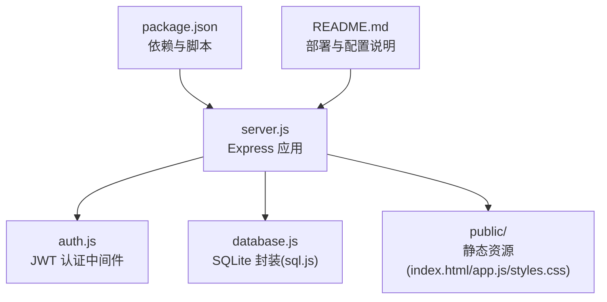
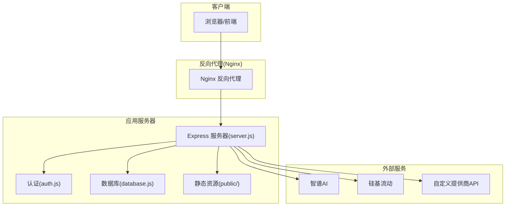
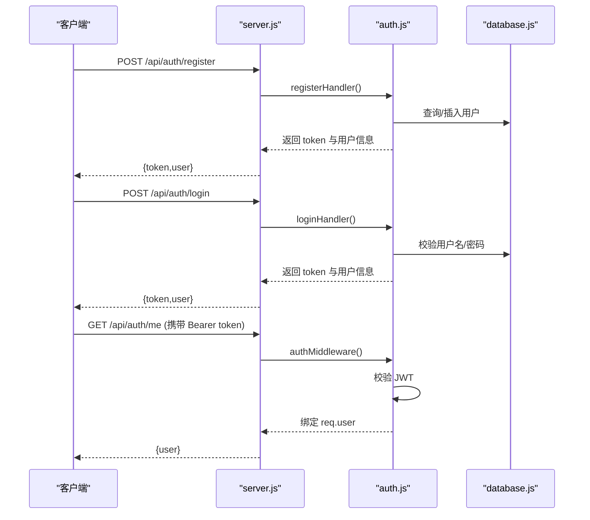
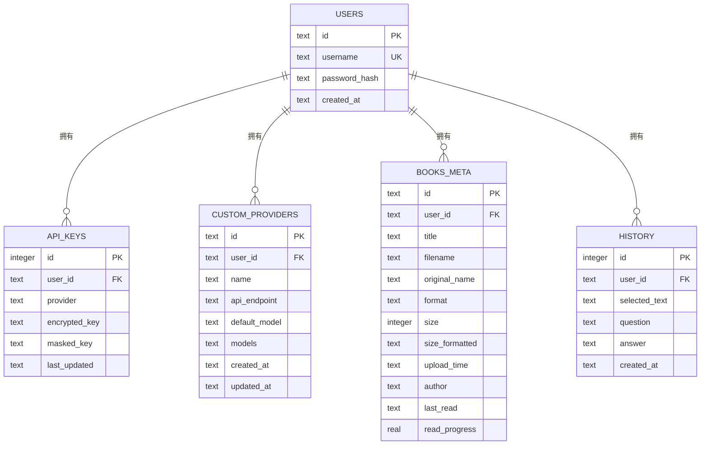
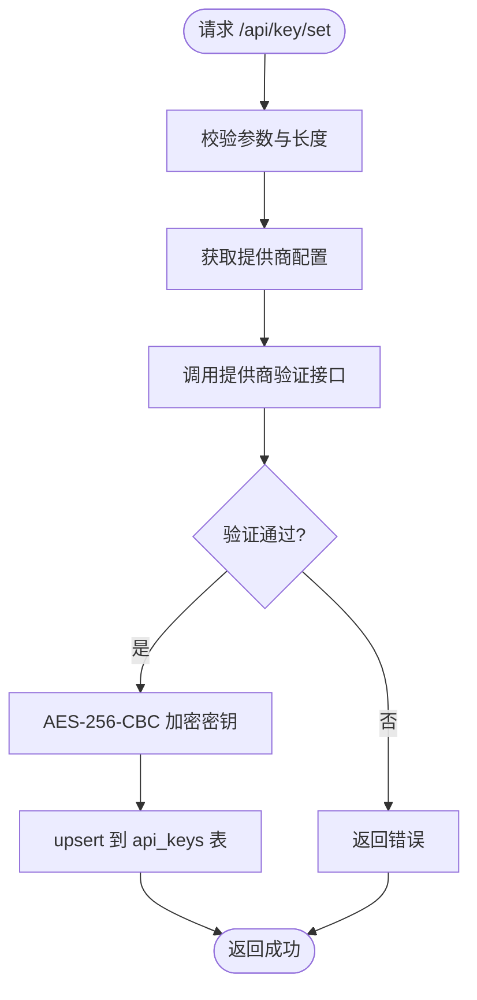
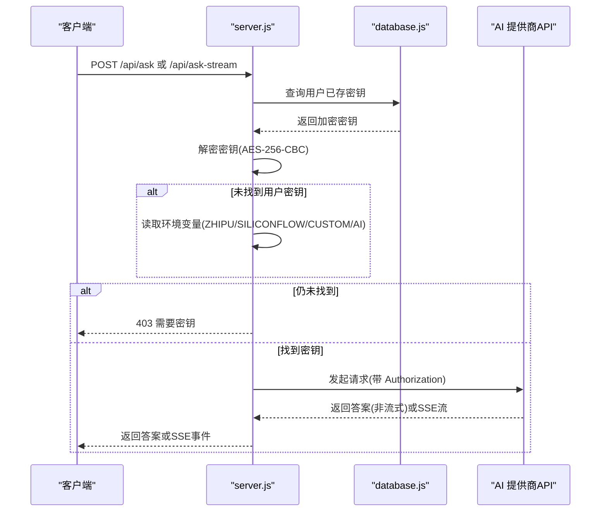
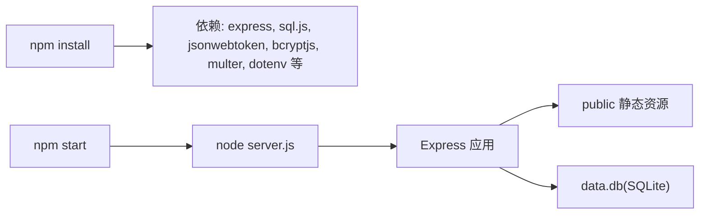

# 部署指南

<cite>
**本文引用的文件**
- [package.json](file://package.json)
- [server.js](file://server.js)
- [auth.js](file://auth.js)
- [database.js](file://database.js)
- [README.md](file://README.md)
- [public/index.html](file://public/index.html)
- [public/app.js](file://public/app.js)
- [public/styles.css](file://public/styles.css)
</cite>

## 目录
1. [简介](#简介)
2. [项目结构](#项目结构)
3. [核心组件](#核心组件)
4. [架构总览](#架构总览)
5. [详细组件分析](#详细组件分析)
6. [依赖关系分析](#依赖关系分析)
7. [性能考虑](#性能考虑)
8. [故障排除指南](#故障排除指南)
9. [结论](#结论)
10. [附录](#附录)

## 简介
本指南面向生产环境部署 trae02airead（AI 阅读助手），涵盖环境准备、配置项、容器化与传统服务器部署、Nginx 反向代理与 SSL、负载均衡策略、性能优化、监控与日志、故障排除以及数据备份与灾难恢复。项目基于 Node.js + Express + sql.js（纯 JS SQLite 实现），前端为静态资源，后端提供用户认证、API 密钥管理、自定义 AI 提供商、书籍上传与阅读、AI 问答（含流式）等能力。

## 项目结构
- 后端入口：server.js
- 认证模块：auth.js
- 数据库封装：database.js（基于 sql.js 的 SQLite）
- 前端静态资源：public/（index.html、app.js、styles.css）
- 依赖与脚本：package.json
- 文档与环境变量说明：README.md

图表来源
- [server.js:1-16](file://server.js#L1-L16)
- [auth.js:1-80](file://auth.js#L1-L80)
- [database.js:1-146](file://database.js#L1-L146)
- [package.json:1-23](file://package.json#L1-L23)
- [README.md:210-232](file://README.md#L210-L232)

章节来源
- [README.md:210-232](file://README.md#L210-L232)

## 核心组件
- Express 服务器：提供 REST API 与静态资源服务，监听端口（默认 3000）。
- 认证系统：JWT 令牌签发与校验，支持“记住我”（30 天）与短期会话（7 天）。
- 数据层：基于 sql.js 的 SQLite 数据库存储用户、API 密钥、自定义提供商、书籍元数据、历史记录。
- 文件系统：书籍文件按用户目录存放，支持 TXT/PDF/EPUB/MOBI，最大 50MB。
- AI 问答：支持非流式与 SSE 流式两种模式，内置多家 AI 提供商，支持自定义提供商。
- 环境变量：ENCRYPTION_KEY、JWT_SECRET、API 密钥、端口等。

章节来源
- [server.js:15-16](file://server.js#L15-L16)
- [auth.js:7](file://auth.js#L7)
- [database.js:69-138](file://database.js#L69-L138)
- [README.md:105-120](file://README.md#L105-L120)

## 架构总览
后端采用单进程 Express，静态资源由 Express 提供；数据库为本地 SQLite 文件（data.db）。AI 问答通过 HTTP 调用外部提供商 API，支持流式返回。

图表来源
- [server.js:15-16](file://server.js#L15-L16)
- [auth.js:14-27](file://auth.js#L14-L27)
- [database.js:69-138](file://database.js#L69-L138)
- [README.md:122-143](file://README.md#L122-L143)

## 详细组件分析

### 环境变量与配置
- ENCRYPTION_KEY：用于对 API 密钥进行 AES-256-CBC 加密存储。若不设置，每次启动会生成随机密钥，重启后旧密钥无法解密。
- JWT_SECRET：JWT 签发与校验密钥。若不设置，会自动生成。
- ZHIPU_API_KEY / SILICONFLOW_API_KEY / CUSTOM_API_KEY：分别对应内置提供商与自定义提供商的 API 钥。也可通过 UI 设置，UI 会加密保存。
- AI_API_KEY：通用备用密钥，当特定提供商未设置时可回退使用。
- AI_MODEL：默认模型，用于问答请求。
- PORT：服务端口，默认 3000。
- NODE_ENV：生产环境建议设为 production。

章节来源
- [README.md:105-120](file://README.md#L105-L120)
- [auth.js:7](file://auth.js#L7)
- [server.js:18](file://server.js#L18)
- [server.js:646-656](file://server.js#L646-L656)

### 认证与会话
- 注册/登录：用户名 + 密码，密码经 bcrypt 存储；登录返回 JWT，支持短期与长期会话。
- 中间件：Authorization: Bearer <token>，校验失败返回 401。
- 登录状态：短期 7 天，勾选“记住我”为 30 天。

图表来源
- [auth.js:29-77](file://auth.js#L29-L77)
- [server.js:37-42](file://server.js#L37-L42)
- [database.js:81-135](file://database.js#L81-L135)

章节来源
- [auth.js:14-27](file://auth.js#L14-L27)
- [auth.js:29-77](file://auth.js#L29-L77)

### 数据库与密钥存储
- 数据库：SQLite（sql.js），本地文件 data.db，WAL 模式与外键开启。
- 表结构：users、api_keys（加密存储）、custom_providers、books_meta、history。
- API 密钥：按用户与提供商维度存储，加密字段，支持批量查询与更新。

图表来源
- [database.js:81-135](file://database.js#L81-L135)

章节来源
- [database.js:69-138](file://database.js#L69-L138)

### API 密钥管理与提供商
- 密钥状态查询：GET /api/key/status
- 设置密钥：POST /api/key/set（支持 UI 或环境变量回退）
- 验证密钥：POST /api/key/verify
- 删除密钥：DELETE /api/key
- 提供商列表：GET /api/providers
- 自定义提供商：POST/PUT/DELETE /api/providers/:id
- 密钥来源优先级：数据库加密存储 > 环境变量（ZHIPU/SILICONFLOW/CUSTOM/AI）

图表来源
- [server.js:260-295](file://server.js#L260-L295)
- [server.js:212-235](file://server.js#L212-L235)

章节来源
- [server.js:239-332](file://server.js#L239-L332)
- [server.js:336-461](file://server.js#L336-L461)

### 书籍上传与阅读
- 上传：POST /api/books/upload（支持 TXT/PDF/EPUB/MOBI，最大 50MB）
- 列表：GET /api/books
- 获取内容：GET /api/books/:id（TXT 直接返回内容，其他格式返回下载链接）
- 下载：GET /api/books/:id/download
- 删除：DELETE /api/books/:id
- 进度：PUT /api/books/:id/progress

章节来源
- [server.js:465-597](file://server.js#L465-L597)

### AI 问答（非流式与流式）
- 非流式：POST /api/ask
- 流式：POST /api/ask-stream（SSE）
- 模型与提供商：支持默认模型与客户端指定模型，内置多家提供商，支持自定义。
- 超时控制：60 秒超时，AbortController 控制。

图表来源
- [server.js:618-688](file://server.js#L618-L688)
- [server.js:690-827](file://server.js#L690-L827)
- [server.js:829-880](file://server.js#L829-L880)

章节来源
- [server.js:618-827](file://server.js#L618-L827)

## 依赖关系分析
- 依赖安装：npm install
- 启动方式：npm start（node server.js）
- 生产建议：使用 PM2 或 systemd 管理进程，结合 Nginx 反代与 SSL

图表来源
- [package.json:10-22](file://package.json#L10-L22)
- [package.json:6-8](file://package.json#L6-L8)

章节来源
- [package.json:1-23](file://package.json#L1-23)

## 性能考虑
- 并发与连接：单进程 Node.js，建议通过反向代理与负载均衡横向扩展多个实例。
- 数据库：WAL 模式与索引已启用，避免高并发写入阻塞；建议使用 SSD 与合适 IO。
- 文件上传：50MB 限制，建议在 Nginx 层面也设置相应限制。
- 流式输出：SSE 使用 keep-alive，注意上游代理的缓冲与超时配置。
- 缓存：静态资源可由 Nginx 缓存，减少磁盘 IO。
- 日志：建议集中化日志（如 ELK/Fluentd），避免 stdout 满屏。

## 故障排除指南
- 启动失败：检查端口占用、权限、依赖安装。
- API 密钥错误：确认密钥长度、提供商验证接口可达、网络超时。
- 401 未授权：检查 Authorization 头、JWT_SECRET 是否一致、令牌是否过期。
- 书籍上传失败：检查磁盘空间、权限、文件格式与大小限制。
- 流式输出中断：检查上游代理超时、网络稳定性、SSE 缓冲设置。
- 数据库损坏：备份 data.db，必要时重建表结构。

章节来源
- [server.js:886-899](file://server.js#L886-L899)
- [server.js:212-235](file://server.js#L212-L235)
- [auth.js:14-27](file://auth.js#L14-L27)
- [README.md:98-104](file://README.md#L98-L104)

## 结论
本项目适合中小型部署场景，具备零配置启动能力与完善的密钥管理机制。生产部署建议配合 Nginx 反向代理、SSL、负载均衡与进程守护，同时制定数据备份与灾难恢复策略，确保稳定与安全。

## 附录

### 生产环境部署步骤
- 准备环境：Linux/Windows/macOS，Node.js >= 18，npm >= 9。
- 安装依赖：npm install
- 配置环境变量：ENCRYPTION_KEY、JWT_SECRET、API 密钥、端口等。
- 启动服务：npm start
- 配置 Nginx 反代与 SSL，暴露域名访问。
- 部署方式：传统服务器或 Docker 容器化均可。

章节来源
- [README.md:71-96](file://README.md#L71-L96)
- [README.md:105-120](file://README.md#L105-L120)

### 环境变量配置清单
- ENCRYPTION_KEY：64 字符十六进制，用于密钥加密存储。
- JWT_SECRET：JWT 签发与校验密钥。
- ZHIPU_API_KEY / SILICONFLOW_API_KEY / CUSTOM_API_KEY / AI_API_KEY：对应提供商密钥。
- AI_MODEL：默认模型。
- PORT：服务端口，默认 3000。
- NODE_ENV：production。

章节来源
- [README.md:105-120](file://README.md#L105-L120)
- [auth.js:7](file://auth.js#L7)
- [server.js:18](file://server.js#L18)

### Docker 容器化部署方案
- 基础镜像：node:18-alpine
- 工作目录：/app
- 复制 package*.json，执行 npm ci --only=production
- 复制源码与 public 静态资源
- 暴露端口：3000
- 命令：npm start
- 挂载卷：/app/data.db（建议持久化）、/app/books（书籍目录）
- 环境变量：ENCRYPTION_KEY、JWT_SECRET、API 密钥、端口等

章节来源
- [package.json:10-22](file://package.json#L10-L22)
- [README.md:105-120](file://README.md#L105-L120)

### 传统服务器部署步骤
- 安装 Node.js 与 npm
- 克隆仓库并安装依赖
- 配置 .env 或系统环境变量
- 启动服务（pm2/systemd 管理）
- 配置 Nginx 反向代理与 SSL
- 配置防火墙与安全组

章节来源
- [README.md:71-96](file://README.md#L71-L96)

### Nginx 反向代理与 SSL
- 反向代理：将 /api/* 与静态资源交由后端处理，静态资源可缓存。
- SSL：使用 Let’s Encrypt 或商业证书，强制 HTTPS。
- 超时与缓冲：合理设置 proxy_read_timeout、proxy_send_timeout、client_max_body_size。
- 负载均衡：多实例部署，健康检查，会话粘性可选。

章节来源
- [server.js:33-35](file://server.js#L33-L35)
- [README.md:105-120](file://README.md#L105-L120)

### 负载均衡策略
- 无状态：后端为无状态应用，可水平扩展。
- 数据持久化：确保 data.db 与 books 目录共享存储（NFS/云盘）或使用只读副本。
- 健康检查：HTTP GET /api/auth/me（需有效 token）。
- 会话：使用 JWT，无需粘性会话。

章节来源
- [auth.js:14-27](file://auth.js#L14-L27)
- [database.js:69-138](file://database.js#L69-L138)

### 监控指标与日志
- 指标：CPU/内存/磁盘/网络、请求量/错误率、响应时间、活跃用户数。
- 日志：分离访问日志与应用日志，集中化收集与告警。
- 健康检查：/api/auth/me（需有效 token）。

章节来源
- [auth.js:75-77](file://auth.js#L75-L77)

### 数据备份与灾难恢复
- 备份对象：data.db、books/ 目录。
- 备份策略：定时快照（每日/每周），异地存储。
- 恢复流程：停止服务 -> 恢复 data.db 与 books -> 启动服务 -> 验证功能。

章节来源
- [README.md:102-104](file://README.md#L102-L104)
- [database.js:10-14](file://database.js#L10-L14)