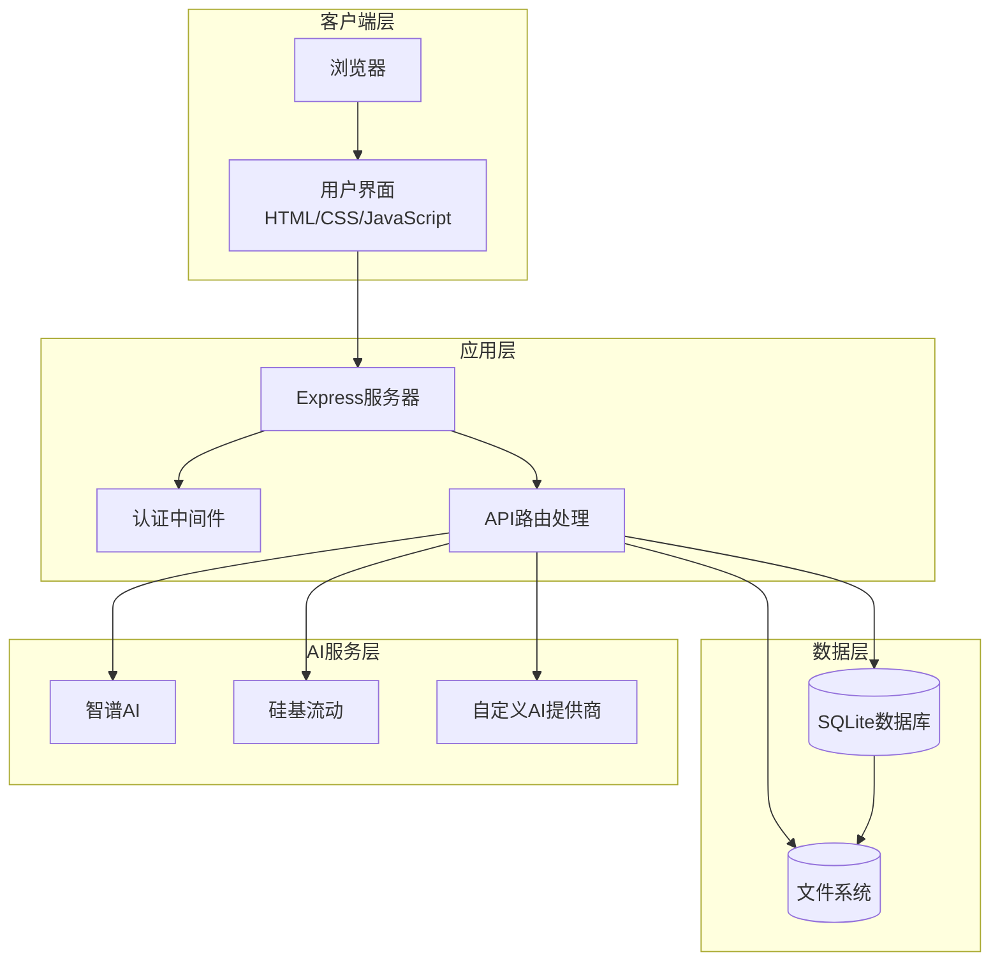
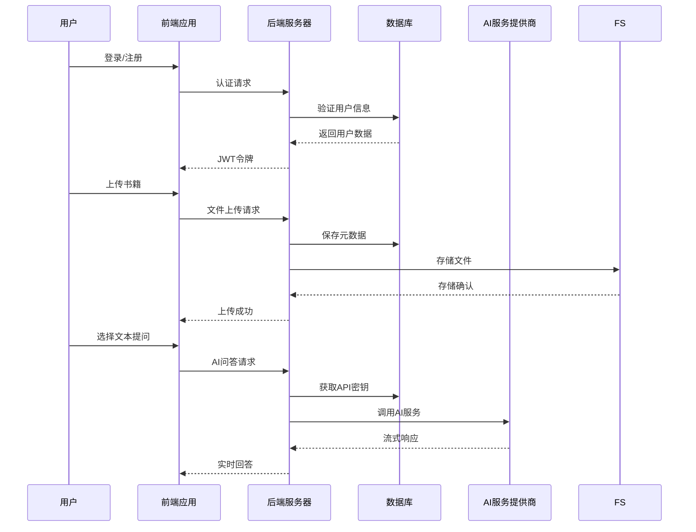
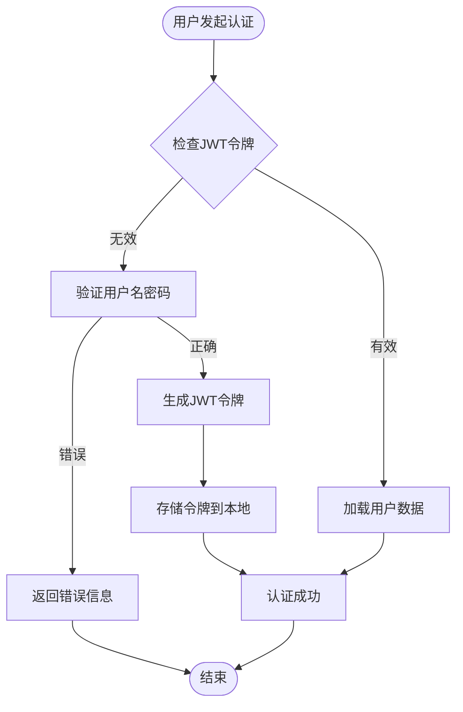
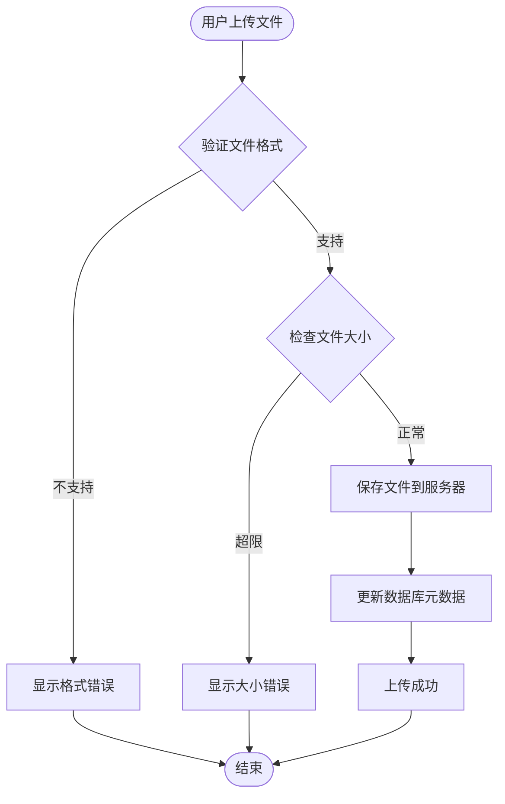
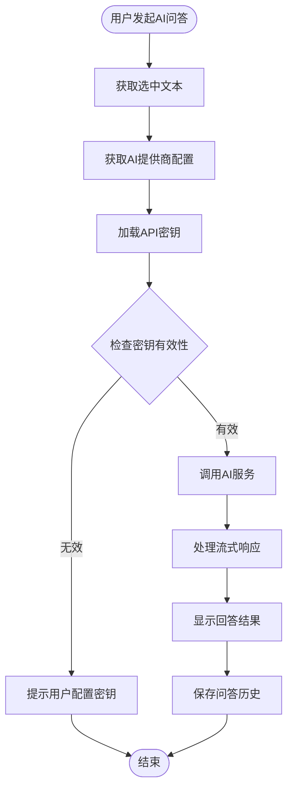

# 项目概述

<cite>
**本文档引用的文件**
- [README.md](file://README.md)
- [package.json](file://package.json)
- [server.js](file://server.js)
- [auth.js](file://auth.js)
- [database.js](file://database.js)
- [public/index.html](file://public/index.html)
- [public/app.js](file://public/app.js)
- [public/styles.css](file://public/styles.css)
- [CLAUDE.md](file://CLAUDE.md)
</cite>

## 目录
1. [项目简介](#项目简介)
2. [核心特性](#核心特性)
3. [技术架构](#技术架构)
4. [系统架构](#系统架构)
5. [核心组件分析](#核心组件分析)
6. [数据流分析](#数据流分析)
7. [性能与安全性](#性能与安全性)
8. [部署与配置](#部署与配置)
9. [未来发展](#未来发展)
10. [总结](#总结)

## 项目简介

AI阅读助手是一个现代化的智能阅读应用，集成了多AI服务提供商，帮助用户高效阅读和理解书籍内容。该项目采用零配置启动理念，支持在线阅读、AI智能问答、书架管理、自定义AI提供商等功能，为用户提供全方位的智能阅读体验。

### 项目定位
- **智能阅读平台**：专注于提升用户阅读体验的AI驱动应用
- **多格式支持**：支持TXT、PDF、EPUB、MOBI等多种电子书格式
- **AI集成服务**：无缝集成多个主流AI服务提供商
- **个人化阅读**：提供个性化的阅读设置和体验

### 应用场景
- 学生学习辅助：智能解释难懂概念，提供学习建议
- 专业读者：深度分析复杂文本，提供专业见解
- 语言学习：翻译和解释功能辅助语言学习
- 研究工作：快速理解和分析大量文献资料

## 核心特性

### 📖 智能阅读
- **在线阅读**：支持TXT文件在线阅读，预置《百年孤独》经典章节作为示例
- **编码自动检测**：自动检测文件编码（UTF-8、GBK、GB2312、BIG5等），解决中文乱码问题
- **文章目录**：自动生成章节目录，支持快速导航
- **个性化设置**：字体大小调节（12px-28px）、三种主题模式、选中文本浮动工具栏

### 🤖 AI智能问答
- **快捷操作**：选中文本后弹出工具栏，支持解释说明、总结概括、翻译、扩展阅读
- **自定义问题**：输入自定义问题，AI结合书籍上下文提供精准回答
- **流式输出**：SSE流式传输，打字机效果，提升阅读体验
- **模型显示**：回答中实时显示当前使用的AI提供商和模型信息
- **对话历史**：自动保存最近50条问答记录，随时回顾

### 📚 书架管理
- **多格式支持**：TXT、PDF、EPUB、MOBI（最大50MB）
- **上传进度**：实时显示上传进度条
- **书籍操作**：在线阅读（TXT）、下载、删除
- **数据隔离**：每个用户的书籍、书架、阅读进度完全独立

### 👤 用户系统
- **注册登录**：支持用户名+密码注册登录，用户名支持中文
- **JWT认证**：登录后自动保持登录状态（7天），支持"记住我"（30天）
- **密码安全**：bcrypt加密存储，不保存明文密码
- **数据隔离**：每个用户的API密钥、自定义提供商、书架、问答历史完全独立
- **历史同步**：AI问答历史存储在服务器端，换设备也能查看

### 🔧 自定义AI提供商
- **灵活添加**：支持添加任意OpenAI兼容API
- **模型管理**：可配置默认模型和可选模型列表
- **一键切换**：在已添加的提供商之间快速切换
- **独立存储**：每个提供商的API密钥独立加密存储

### 🎨 现代化UI设计
- **卡片式布局**：圆角卡片、渐变背景、阴影层次
- **流畅动画**：按钮悬浮效果、面板滑入、淡入淡出
- **统一滚动条**：自定义美化滚动条样式
- **响应式设计**：适配不同屏幕尺寸

## 技术架构

### 技术栈概览
| 类别 | 技术 |
|------|------|
| 后端 | Express.js 4.18.2 |
| 前端 | 原生JavaScript (ES6+) |
| 数据库 | SQLite (sql.js - 纯JS实现，无需C++编译) |
| 用户认证 | JWT (jsonwebtoken) |
| 密码加密 | bcryptjs |
| 文件上传 | Multer |
| 编码检测 | jschardet + iconv-lite |
| 密钥加密 | crypto (AES-256-CBC) |
| 环境变量 | dotenv |
| AI接口 | OpenAI兼容API (SSE流式) |

### 架构特点
- **零配置启动**：所有配置都有默认值，无需手动配置即可启动
- **纯前端应用**：采用原生JavaScript实现，无框架依赖
- **模块化设计**：前后端分离，职责清晰
- **数据持久化**：使用SQLite数据库进行数据存储
- **安全设计**：多重加密机制保护用户数据

## 系统架构



**图表来源**
- [server.js:30-40](file://server.js#L30-L40)
- [auth.js:14-27](file://auth.js#L14-L27)
- [database.js:69-138](file://database.js#L69-L138)

### 核心流程



**图表来源**
- [server.js:618-688](file://server.js#L618-L688)
- [auth.js:29-77](file://auth.js#L29-L77)
- [database.js:81-135](file://database.js#L81-L135)

## 核心组件分析

### 后端服务组件

#### 服务器初始化
服务器采用Express框架，提供RESTful API接口和静态文件服务。支持CORS跨域，使用dotenv加载环境变量，实现了零配置启动。

#### 认证系统
基于JWT的用户认证系统，支持7天自动登录和30天"记住我"功能。密码使用bcrypt加密存储，确保用户信息安全。

#### 数据库管理
使用sql.js实现纯JavaScript的SQLite数据库，支持WAL模式和外键约束。数据库结构包含用户表、API密钥表、自定义提供商表、书籍元数据表和历史记录表。

#### 文件处理
支持多种电子书格式的上传和处理，包括TXT、PDF、EPUB、MOBI格式。TXT文件支持自动编码检测和转换。

#### AI集成
集成了多个AI服务提供商，包括智谱AI和硅基流动，支持自定义AI提供商添加。所有API密钥使用AES-256-CBC加密存储。

### 前端应用组件

#### 用户界面
采用现代化的设计风格，支持三种主题模式（明亮、暗黑、护眼）。提供响应式布局，适配不同屏幕尺寸。

#### 功能模块
- **阅读器**：支持在线阅读、目录导航、个性化设置
- **AI助手**：浮动工具栏，支持快捷操作和自定义提问
- **书架管理**：书籍上传、下载、删除功能
- **设置中心**：API密钥配置、提供商管理

#### 交互设计
采用原生JavaScript实现，无框架依赖。支持拖拽上传、实时进度显示、流式AI回答等现代Web功能。

## 数据流分析

### 用户认证数据流



**图表来源**
- [auth.js:14-27](file://auth.js#L14-L27)
- [auth.js:29-77](file://auth.js#L29-L77)

### 书籍上传数据流



**图表来源**
- [server.js:465-514](file://server.js#L465-L514)
- [server.js:123-132](file://server.js#L123-L132)

### AI问答数据流



**图表来源**
- [server.js:618-688](file://server.js#L618-L688)
- [server.js:690-800](file://server.js#L690-L800)

## 性能与安全性

### 性能优化
- **零配置启动**：减少部署复杂度，提高启动速度
- **流式传输**：SSE实现流式AI回答，提升用户体验
- **缓存策略**：本地存储用户偏好设置，减少重复请求
- **异步处理**：文件上传采用异步处理，避免阻塞主线程

### 安全措施
- **数据加密**：API密钥使用AES-256-CBC加密存储
- **访问控制**：JWT令牌验证所有API请求
- **输入验证**：严格的文件格式和大小验证
- **数据隔离**：基于UUID的用户数据隔离机制
- **敏感信息保护**：密钥存储在.gitignore文件中，防止泄露

### 安全说明
1. **密钥加密**：所有API密钥使用AES-256-CBC加密存储
2. **密钥保护**：ENCRYPTION_KEY改变后无法解密旧密钥
3. **数据隔离**：用户数据基于UUID隔离
4. **数据库存储**：用户数据、API密钥、书籍元数据等均存储在SQLite数据库中
5. **敏感文件**：.env、data.db、books/已加入.gitignore

## 部署与配置

### 环境要求
- Node.js >= 18.0.0
- npm >= 9.0.0

### 零配置启动
```bash
# 1. 克隆项目
git clone <your-repo-url>
cd trae02airead

# 2. 安装依赖并启动
npm install
npm start
```

然后打开 http://localhost:3000 即可使用！

### 环境变量配置（可选）
如需配置，可在.env文件中设置：
- ENCRYPTION_KEY=your_64_char_hex_key（固定加密密钥）
- ZHIPU_API_KEY=your_zhipu_key（智谱AI API密钥）
- SILICONFLOW_API_KEY=your_siliconflow_key（硅基流动API密钥）
- CUSTOM_API_KEY=your_custom_key（自定义提供商API密钥）
- PORT=3000（服务端口）

### 项目结构
```
trae02airead/
├── server.js              # Express后端主服务
├── database.js            # SQLite数据库封装 (sql.js)
├── auth.js                # 用户认证中间件
├── package.json           # 项目依赖配置
├── .env                   # 环境变量配置
├── .gitignore             # Git忽略配置
├── README.md              # 项目文档
│
├── public/                # 前端静态资源
│   ├── index.html         # 主页面
│   ├── styles.css         # 样式表
│   └── app.js             # 前端逻辑
│
├── books/                 # 书籍文件存储（运行时）
│   └── {userId}/
├── data.db                # SQLite数据库文件（运行时生成）
└── node_modules/          # 依赖包
```

## 未来发展

### 技术演进
- **AI能力增强**：支持更多AI模型和更丰富的对话能力
- **多语言支持**：扩展国际化支持，支持更多语言界面
- **云端同步**：实现用户数据的云端同步和备份
- **移动端适配**：开发移动应用版本，提供更好的移动端体验

### 功能扩展
- **阅读统计**：提供阅读时长、进度等统计数据
- **社交分享**：支持读书笔记分享和社区互动
- **个性化推荐**：基于阅读历史的书籍推荐系统
- **离线阅读**：支持离线下载和阅读功能

### 生态建设
- **插件系统**：支持第三方插件扩展功能
- **API开放**：提供开发者API，支持二次开发
- **社区贡献**：建立开源社区，鼓励用户贡献代码
- **文档完善**：持续完善技术文档和用户指南

## 总结

AI阅读助手项目展现了现代Web应用的最佳实践，通过精心设计的技术架构和用户体验，为用户提供了智能化的阅读解决方案。项目的主要优势包括：

### 技术优势
- **零配置启动**：极大降低了部署门槛
- **多格式支持**：覆盖主流电子书格式
- **AI集成**：无缝集成多个AI服务提供商
- **安全设计**：多重加密机制保护用户数据
- **响应式设计**：适配各种设备和屏幕尺寸

### 用户价值
- **提升阅读效率**：AI助手帮助用户更好地理解和分析文本
- **个性化体验**：支持字体、主题等个性化设置
- **便捷管理**：统一的书架管理和历史记录
- **跨设备同步**：用户数据可在不同设备间同步

### 发展潜力
项目具有良好的扩展性和发展基础，通过持续的功能迭代和技术升级，有望成为智能阅读领域的领先解决方案。其开源的特性也为社区贡献和生态建设奠定了坚实基础。